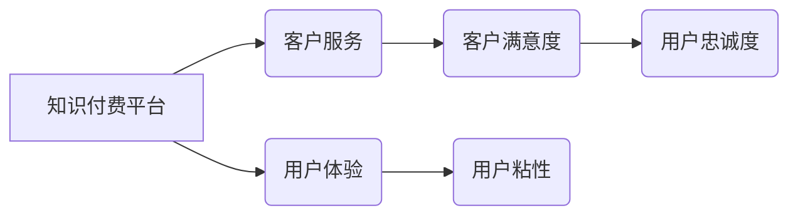

                 

## 程序员知识付费的客户服务与用户体验

> 关键词：知识付费、程序员、客户服务、用户体验、在线教育、社区建设、内容运营、技术博客

## 1. 背景介绍

近年来，随着互联网技术的发展和普及，知识付费行业蓬勃发展，其中程序员知识付费市场尤为火爆。程序员作为科技领域的重要力量，对技术学习和技能提升的需求日益增长。传统的线下培训模式逐渐被线上知识付费平台所取代，为程序员提供了更加便捷、高效的学习途径。

然而，程序员知识付费市场竞争激烈，平台之间差异化竞争日益突出。仅仅提供优质的课程内容已经不足以满足用户的需求，如何提升客户服务和用户体验，打造良好的用户粘性，成为平台发展的重要课题。

## 2. 核心概念与联系

**2.1  知识付费平台**

知识付费平台是指以知识、技能、经验等为核心内容，通过线上平台向用户提供付费学习服务的商业模式。

**2.2  客户服务**

客户服务是指企业为客户提供售前、售中、售后等全方位服务的体系，旨在提升客户满意度和忠诚度。

**2.3  用户体验**

用户体验是指用户在使用产品或服务过程中所感受到的整体感受，包括易用性、可用性、美观度、效率等方面。

**2.4  关系图**



**2.5  核心概念联系**

知识付费平台的核心在于提供优质的知识内容，而客户服务和用户体验则是提升用户满意度和忠诚度的关键因素。良好的客户服务可以解决用户在学习过程中遇到的问题，提供及时有效的帮助，提升用户对平台的信任和好感。良好的用户体验则可以使用户在学习过程中更加便捷、高效、愉悦，从而提高用户学习的积极性和持续性。

## 3. 核心算法原理 & 具体操作步骤

**3.1  算法原理概述**

在程序员知识付费平台中，算法可以应用于用户画像、内容推荐、学习进度分析等多个环节，提升用户体验和学习效率。

**3.2  算法步骤详解**

* **用户画像算法:**

    1. 收集用户数据：包括用户基本信息、学习记录、行为偏好等。
    2. 数据清洗和预处理：去除无效数据，对数据进行标准化处理。
    3. 特征提取：提取用户画像的关键特征，例如学习领域、学习风格、知识水平等。
    4. 模型训练：使用机器学习算法，例如K-Means聚类算法，对用户进行分组，构建用户画像。
    5. 用户画像分析：分析不同用户群体的特征，为个性化推荐和内容定制提供依据。

* **内容推荐算法:**

    1. 收集用户行为数据：包括用户浏览记录、收藏记录、评论记录等。
    2. 内容特征提取：提取内容的主题、标签、难度等级等特征。
    3. 协同过滤算法：根据用户的行为数据和内容特征，推荐与用户兴趣相符的内容。
    4. 内容相似度算法：根据内容的主题和标签，推荐与用户已学习内容相似的课程。
    5. 内容推荐结果展示：将推荐结果以列表、卡片等形式展示给用户。

* **学习进度分析算法:**

    1. 收集用户学习数据：包括学习时间、学习进度、学习完成情况等。
    2. 学习路径分析：分析用户的学习路径，识别学习瓶颈和知识盲点。
    3. 学习效率评估：评估用户的学习效率，提供学习建议和个性化辅导。
    4. 学习进度可视化：将学习进度以图表、进度条等形式展示给用户，帮助用户了解自己的学习情况。

**3.3  算法优缺点**

* **优点:**

    * 能够根据用户需求和学习情况提供个性化服务。
    * 提高用户学习效率和学习兴趣。
    * 提升用户体验和平台粘性。

* **缺点:**

    * 需要大量的数据进行训练和测试。
    * 算法模型需要不断更新和优化。
    * 算法的准确性和有效性需要不断验证。

**3.4  算法应用领域**

* **用户画像:** 帮助平台了解用户的学习需求和偏好，进行精准营销和内容定制。
* **内容推荐:** 为用户推荐与兴趣相符的课程和学习资源，提高用户学习兴趣和参与度。
* **学习进度分析:** 帮助用户了解自己的学习情况，及时发现学习瓶颈，并提供个性化学习建议。
* **智能客服:** 使用自然语言处理技术，为用户提供智能化的客服服务，解决用户在学习过程中遇到的问题。

## 4. 数学模型和公式 & 详细讲解 & 举例说明

**4.1  数学模型构建**

用户画像算法可以采用K-Means聚类算法构建数学模型，将用户分为不同的类别。

**4.2  公式推导过程**

K-Means算法的核心思想是将数据点划分为K个簇，每个簇的中心点称为聚类中心。算法迭代执行以下步骤：

1. **随机初始化K个聚类中心:**

$$
\mu_1, \mu_2, ..., \mu_K
$$

2. **计算每个数据点到每个聚类中心的距离:**

$$
d(x_i, \mu_j) = ||x_i - \mu_j||
$$

3. **将每个数据点分配到距离最近的聚类中心:**

$$
c_i = argmin_j d(x_i, \mu_j)
$$

4. **更新每个聚类中心的坐标:**

$$
\mu_j = \frac{1}{|C_j|} \sum_{x_i \in C_j} x_i
$$

5. **重复步骤2-4，直到聚类中心不再变化或达到最大迭代次数:**

**4.3  案例分析与讲解**

假设我们有100个用户数据，需要将其分为3个用户类别。我们可以使用K-Means算法进行聚类，并根据用户的学习记录、行为偏好等特征，分析每个类别用户的特点。例如，一个类别可能是“初学者”，另一个类别可能是“进阶用户”，最后一个类别可能是“专家用户”。

## 5. 项目实践：代码实例和详细解释说明

**5.1  开发环境搭建**

* Python 3.x
* Jupyter Notebook
* scikit-learn

**5.2  源代码详细实现**

```python
from sklearn.cluster import KMeans
import pandas as pd

# 加载用户数据
data = pd.read_csv('user_data.csv')

# 选择特征变量
features = ['学习时间', '学习进度', '学习完成情况']
X = data[features]

# 使用K-Means算法进行聚类
kmeans = KMeans(n_clusters=3, random_state=0)
kmeans.fit(X)

# 获取聚类结果
labels = kmeans.labels_
data['cluster'] = labels

# 分析每个聚类用户的特点
for i in range(3):
    cluster_data = data[data['cluster'] == i]
    print(f'聚类{i}用户的特点:')
    print(cluster_data.describe())
```

**5.3  代码解读与分析**

* 首先，我们加载用户数据并选择需要进行聚类的特征变量。
* 然后，我们使用K-Means算法进行聚类，指定聚类数量为3。
* 接下来，我们获取聚类结果并将其存储在`labels`变量中。
* 最后，我们分析每个聚类用户的特点，例如学习时间、学习进度、学习完成情况等。

**5.4  运行结果展示**

运行代码后，我们可以得到每个聚类用户的统计信息，例如平均学习时间、平均学习进度、平均学习完成情况等。通过分析这些信息，我们可以了解不同用户群体的特点，并为他们提供个性化的学习服务。

## 6. 实际应用场景

**6.1  用户画像分析**

* 根据用户的学习记录和行为偏好，构建用户画像，了解用户的学习需求和兴趣。
* 为用户推荐与兴趣相符的课程和学习资源，提高用户学习兴趣和参与度。
* 进行精准营销，推送与用户需求相匹配的广告和促销活动。

**6.2  内容推荐系统**

* 根据用户的学习历史和行为数据，推荐与用户兴趣相符的课程和学习资源。
* 提高用户学习效率和学习兴趣，增强用户粘性。
* 为平台内容运营提供数据支持，帮助平台更好地规划和制作内容。

**6.3  个性化学习路径**

* 根据用户的学习进度和知识水平，构建个性化的学习路径。
* 帮助用户更有效地掌握知识，提高学习效率。
* 为用户提供个性化的学习建议和辅导，提升用户学习体验。

**6.4  未来应用展望**

* **人工智能驱动的个性化学习:** 利用人工智能技术，更加精准地分析用户的学习需求和行为模式，提供更加个性化的学习体验。
* **沉浸式学习体验:** 利用虚拟现实和增强现实技术，打造更加沉浸式的学习体验，提高用户学习兴趣和参与度。
* **跨平台学习生态:** 打造一个跨平台的学习生态，让用户能够在不同的平台和设备上无缝衔接学习。

## 7. 工具和资源推荐

**7.1  学习资源推荐**

* **书籍:**

    * 《Python机器学习》
    * 《数据挖掘与数据分析》
    * 《算法导论》

* **在线课程:**

    * Coursera
    * edX
    * Udemy

* **博客和论坛:**

    * Towards Data Science
    * Kaggle
    * Stack Overflow

**7.2  开发工具推荐**

* **Python:**

    * Jupyter Notebook
    * PyCharm

* **机器学习库:**

    * scikit-learn
    * TensorFlow
    * PyTorch

* **数据可视化工具:**

    * Matplotlib
    * Seaborn

**7.3  相关论文推荐**

* K-Means Clustering Algorithm
* Content-Based Recommendation Systems
* Collaborative Filtering Algorithms

## 8. 总结：未来发展趋势与挑战

**8.1  研究成果总结**

程序员知识付费平台的客户服务和用户体验研究取得了显著成果，例如用户画像算法、内容推荐算法、学习进度分析算法等，为提升用户学习体验和平台粘性提供了有效手段。

**8.2  未来发展趋势**

* **人工智能驱动的个性化学习:** 利用人工智能技术，更加精准地分析用户的学习需求和行为模式，提供更加个性化的学习体验。
* **沉浸式学习体验:** 利用虚拟现实和增强现实技术，打造更加沉浸式的学习体验，提高用户学习兴趣和参与度。
* **跨平台学习生态:** 打造一个跨平台的学习生态，让用户能够在不同的平台和设备上无缝衔接学习。

**8.3  面临的挑战**

* **数据隐私保护:** 知识付费平台需要收集大量用户数据，如何保护用户隐私安全是一个重要的挑战。
* **算法公平性:** 算法模型可能会存在偏见，导致不同用户群体获得不公平的待遇，需要不断改进算法模型，确保算法公平性。
* **内容质量控制:** 平台需要保证内容质量，避免出现低质量或虚假内容，需要建立完善的内容审核机制。

**8.4  研究展望**

未来，程序员知识付费平台的研究将更加注重用户体验和个性化学习，利用人工智能技术和新兴技术，打造更加智能、便捷、高效的学习体验。


## 9. 附录：常见问题与解答

**9.1  常见问题:**

* 如何提高用户学习兴趣？
* 如何提升用户学习效率？
* 如何解决用户在学习过程中遇到的问题？
* 如何打造良好的用户粘性？

**9.2  解答:**

* **提高用户学习兴趣:**

    * 提供个性化的学习推荐，根据用户的兴趣和学习目标推荐与之相关的课程和学习资源。
    * 设计互动性强的学习内容，例如案例分析、项目实践、在线讨论等，提高用户的参与度和学习兴趣。
    * 定期举办线上线下活动，例如学习分享会、技术交流会等，增强用户的学习动力和归属感。

* **提升用户学习效率:**

    * 提供个性化的学习路径，根据用户的学习进度和知识水平，制定合理的学习计划。
    * 利用人工智能技术，分析用户的学习行为，提供个性化的学习建议和辅导。
    * 提供高效的学习工具，例如在线笔记、知识地图、学习进度跟踪等，帮助用户更好地掌握知识。

* **解决用户在学习过程中遇到的问题:**

    * 建立完善的客服体系，提供及时有效的帮助，解决用户的疑问和技术问题。
    * 建立用户社区，让用户能够互相交流学习经验，共同解决问题。
    * 提供在线学习支持，例如在线答疑、视频教程等，帮助用户更好地理解学习内容。

* **打造良好的用户粘性:**

    * 提供优质的学习内容，满足用户的学习需求和兴趣。
    * 建立良好的用户体验，让用户在学习过程中感到舒适和便捷。
    * 增强用户的归属感，例如通过用户社区、线上线下活动等，让用户感受到平台的温暖和支持。


作者：禅与计算机程序设计艺术 / Zen and the Art of Computer Programming 
<end_of_turn>

