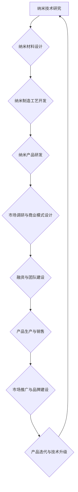

                 

## 纳米技术创业：微观世界的宏观应用

> 关键词：纳米技术、创业、应用、材料科学、生物技术、医疗保健、能源、环境、未来趋势

### 1. 背景介绍

纳米技术，以其对物质在纳米尺度（1-100纳米）上的操控和研究，正在深刻地改变着我们生活的方方面面。从高性能材料到精准医疗，从高效能源到环境修复，纳米技术的应用潜力无穷。然而，纳米技术的发展也面临着诸多挑战，例如成本高昂、安全性问题等。

在这个背景下，纳米技术创业成为一个充满机遇和挑战的领域。创业者们正积极探索纳米技术的商业化应用，将微观世界的创新成果转化为宏观世界的价值。本文将深入探讨纳米技术创业的现状、机遇、挑战以及未来发展趋势，为创业者们提供一些思考和启发。

### 2. 核心概念与联系

纳米技术的核心概念在于对物质在纳米尺度上的操控和研究。在这个尺度上，物质的性质会发生显著的变化，例如机械强度、化学活性、光学特性等。纳米技术利用这些特性，开发出具有独特功能的新材料、新设备和新工艺。

#### 2.1 纳米材料

纳米材料是指尺寸在1-100纳米范围内的材料，其尺寸与原子或分子尺度相当。纳米材料具有独特的物理、化学和生物学特性，使其在各个领域拥有广泛的应用前景。

#### 2.2 纳米制造

纳米制造是指利用纳米尺度的工具和技术，制造出具有特定功能的纳米结构和纳米器件。纳米制造技术包括自组装、模板法、化学气相沉积等多种方法。

#### 2.3 纳米应用

纳米技术应用领域广泛，包括：

* **材料科学:** 开发高强度、轻质、耐腐蚀的纳米材料，用于航空航天、汽车、建筑等领域。
* **生物技术:** 利用纳米材料作为药物载体、生物传感器、基因治疗工具等，推动生物医药领域的进步。
* **医疗保健:** 开发纳米诊断工具、纳米治疗方法，提高疾病诊断和治疗的效率。
* **能源:** 开发高效太阳能电池、燃料电池、储能材料等，推动清洁能源的应用。
* **环境:** 利用纳米材料进行水处理、空气净化、土壤修复等，改善环境质量。

**纳米技术创业的流程图**



### 3. 核心算法原理 & 具体操作步骤

纳米技术创业中，许多核心算法原理和操作步骤是基于物理、化学、材料科学等学科的知识。以下将以纳米材料合成为例，介绍其核心算法原理和具体操作步骤。

#### 3.1 算法原理概述

纳米材料合成的核心算法原理是通过控制物质在纳米尺度上的生长和聚集，形成具有特定尺寸、形状和结构的纳米结构。常见的纳米材料合成方法包括自组装、模板法、化学气相沉积等。

#### 3.2 算法步骤详解

以化学气相沉积法为例，其具体操作步骤如下：

1. **选择合适的反应气体:** 根据目标纳米材料的性质，选择合适的反应气体，例如金、银、铜等金属蒸汽。
2. **控制反应温度和压力:** 反应温度和压力会影响纳米材料的尺寸、形状和结构。
3. **选择合适的催化剂:** 催化剂可以促进反应速率，提高纳米材料的合成效率。
4. **控制沉积时间:** 沉积时间会影响纳米材料的厚度和覆盖范围。
5. **清洗和处理:** 合成的纳米材料需要进行清洗和处理，去除杂质和多余的物质。

#### 3.3 算法优缺点

**优点:**

* 可以制备出尺寸、形状和结构可控的纳米材料。
* 反应条件相对温和，可以制备出一些易受高温影响的纳米材料。

**缺点:**

* 需要专业的设备和技术支持。
* 成本相对较高。

#### 3.4 算法应用领域

化学气相沉积法广泛应用于纳米材料的合成，例如：

* **电子器件:** 制备纳米线、纳米管等用于电子器件的材料。
* **光学器件:** 制备纳米颗粒用于光学器件的增强和调控。
* **催化剂:** 制备纳米催化剂用于化学反应的加速。

### 4. 数学模型和公式 & 详细讲解 & 举例说明

纳米技术创业中，数学模型和公式在描述纳米材料的性质、预测纳米材料的性能、优化纳米材料的合成工艺等方面发挥着重要作用。

#### 4.1 数学模型构建

纳米材料的数学模型可以基于物理、化学、材料科学等学科的理论，描述纳米材料的结构、性质和行为。例如，可以建立描述纳米材料的尺寸分布、形状、表面积、体积等物理量的数学模型。

#### 4.2 公式推导过程

纳米材料的数学模型可以推导出各种公式，用于计算纳米材料的特性和性能。例如，可以推导出描述纳米材料的热力学稳定性、机械强度、光学吸收等公式。

#### 4.3 案例分析与讲解

以纳米材料的尺寸分布为例，其数学模型可以描述为：

$$
f(d) = \frac{1}{\sigma \sqrt{2\pi}} e^{-\frac{(d-\mu)^2}{2\sigma^2}}
$$

其中：

* $f(d)$ 是尺寸分布函数，描述了不同尺寸纳米材料的比例。
* $d$ 是纳米材料的尺寸。
* $\mu$ 是尺寸分布的平均值。
* $\sigma$ 是尺寸分布的标准差。

这个公式可以用来计算不同尺寸纳米材料的比例，并分析纳米材料的尺寸分布特性。

### 5. 项目实践：代码实例和详细解释说明

以下将以Python语言为例，展示如何使用代码实现纳米材料的尺寸分布计算。

#### 5.1 开发环境搭建

需要安装Python语言和相关库，例如NumPy、Matplotlib等。

#### 5.2 源代码详细实现

```python
import numpy as np
import matplotlib.pyplot as plt

# 设置尺寸分布参数
mu = 10  # 平均尺寸
sigma = 2  # 标准差

# 生成尺寸分布数据
d = np.linspace(mu - 3*sigma, mu + 3*sigma, 100)
f = 1/(sigma * np.sqrt(2 * np.pi)) * np.exp(-( (d - mu)**2 ) / (2 * sigma**2))

# 绘制尺寸分布曲线
plt.plot(d, f)
plt.xlabel('尺寸 (纳米)')
plt.ylabel('尺寸分布')
plt.title('纳米材料尺寸分布')
plt.show()
```

#### 5.3 代码解读与分析

这段代码首先定义了纳米材料的尺寸分布参数，例如平均尺寸和标准差。然后，使用NumPy库生成不同尺寸的纳米材料数据。接着，使用公式计算每个尺寸对应的尺寸分布概率。最后，使用Matplotlib库绘制尺寸分布曲线，直观地展示纳米材料的尺寸分布特性。

#### 5.4 运行结果展示

运行这段代码后，会生成一个展示纳米材料尺寸分布曲线的图形。曲线形状反映了纳米材料的尺寸分布特性，例如是否集中在某个尺寸范围，尺寸分布的宽度等。

### 6. 实际应用场景

纳米技术创业的应用场景非常广泛，以下列举一些具体的例子：

#### 6.1 高性能材料

纳米碳管、纳米复合材料等纳米材料具有高强度、轻质、耐腐蚀等特性，可应用于航空航天、汽车、建筑等领域，提高材料性能和降低成本。

#### 6.2 精准医疗

纳米药物载体、纳米诊断工具等纳米技术应用于医疗领域，可以实现精准药物递送、提高治疗效果，并降低副作用。

#### 6.3 环境修复

纳米材料可以用于水处理、空气净化、土壤修复等环境治理领域，提高环境修复效率和降低成本。

#### 6.4 未来应用展望

纳米技术的发展前景广阔，未来将有更多新的应用场景出现，例如：

* **纳米机器人:** 用于医疗诊断、治疗、环境修复等领域。
* **纳米电子器件:** 用于下一代电子设备，例如量子计算机、纳米传感器等。
* **纳米能源:** 用于开发高效太阳能电池、燃料电池等清洁能源技术。

### 7. 工具和资源推荐

#### 7.1 学习资源推荐

* **书籍:** 《纳米材料与纳米技术》、《纳米技术基础》
* **在线课程:** Coursera、edX等平台提供纳米技术相关的在线课程。
* **学术期刊:** 《纳米材料》、《纳米技术》等学术期刊发表最新的纳米技术研究成果。

#### 7.2 开发工具推荐

* **分子动力学模拟软件:** LAMMPS、GROMACS等软件用于模拟纳米材料的结构和动力学行为。
* **纳米材料设计软件:** Materials Studio、COMSOL等软件用于设计和优化纳米材料的结构和性能。
* **纳米制造设备:** 沉积机、刻蚀机、扫描电子显微镜等设备用于制造和表征纳米材料。

#### 7.3 相关论文推荐

* **纳米材料的合成和表征:** 《纳米材料的合成方法》
* **纳米材料的应用:** 《纳米材料在生物医学领域的应用》
* **纳米技术的未来发展:** 《纳米技术的发展趋势和挑战》

### 8. 总结：未来发展趋势与挑战

纳米技术创业是一个充满机遇和挑战的领域。未来，纳米技术将继续朝着以下方向发展：

#### 8.1 研究成果总结

* **纳米材料的性能将进一步提升:** 通过控制纳米材料的结构和组成，可以开发出具有更高性能的纳米材料。
* **纳米技术的应用领域将更加广泛:** 纳米技术将应用于更多新的领域，例如能源、环境、信息技术等。
* **纳米技术的商业化程度将进一步提高:** 越来越多的纳米技术产品将走向市场，为人们的生活带来更多便利。

#### 8.2 未来发展趋势

* **纳米机器人:** 纳米机器人将用于医疗诊断、治疗、环境修复等领域。
* **纳米电子器件:** 纳米电子器件将用于下一代电子设备，例如量子计算机、纳米传感器等。
* **纳米能源:** 纳米材料将用于开发高效太阳能电池、燃料电池等清洁能源技术。

#### 8.3 面临的挑战

* **纳米材料的安全性:** 需要进一步研究纳米材料的潜在毒性和环境影响。
* **纳米技术的成本:** 纳米技术的生产成本仍然较高，需要进一步降低成本。
* **纳米技术的伦理问题:** 需要探讨纳米技术的伦理问题，例如纳米技术的应用是否会带来新的社会问题。

#### 8.4 研究展望

未来，纳米技术的研究将更加注重以下方面：

* **纳米材料的精准合成:** 开发出更加精确的纳米材料合成方法，可以控制纳米材料的尺寸、形状、结构等特性。
* **纳米材料的性能调控:** 通过改变纳米材料的组成、结构等，可以调控纳米材料的性能，使其更加适用于特定的应用场景。
* **纳米技术的应用拓展:** 将纳米技术应用于更多新的领域，例如生物医学、能源、环境等。


### 9. 附录：常见问题与解答

#### 9.1 纳米技术与微技术有什么区别？

纳米技术和微技术都是微观尺度的技术，但两者在尺度上有所区别。微技术通常指的是微米尺度（1-1000微米）的加工和制造，而纳米技术则指的是纳米尺度（1-100纳米）的操控和研究。

#### 9.2 纳米技术有哪些应用前景？

纳米技术应用前景广阔，包括：

* **材料科学:** 开发高性能材料，例如纳米碳管、纳米复合材料等。
* **生物技术:** 用于药物递送、基因治疗、疾病诊断等。
* **医疗保健:** 开发纳米诊断工具、纳米治疗方法等。
* **能源:** 开发高效太阳能电池、燃料电池等清洁能源技术。
* **环境:** 用于水处理、空气净化、土壤修复等环境治理领域。

#### 9.3 纳米技术有哪些风险？

纳米技术也存在一些风险，例如：

* **纳米材料的安全性:** 需要进一步研究纳米材料的潜在毒性和环境影响。
* **纳米技术的伦理问题:** 需要探讨纳米技术的伦理问题，例如纳米技术的应用是否会带来新的社会问题。

#### 9.4 如何学习纳米技术？

可以学习以下资源：

* **书籍:** 《纳米材料与纳米技术》、《纳米技术基础》
* **在线课程:** Coursera、edX等平台提供纳米技术相关的在线课程。
* **学术期刊:** 《纳米材料》、《纳米技术》等学术期刊发表最新的纳米技术研究成果。


作者：禅与计算机程序设计艺术 / Zen and the Art of Computer Programming 
<end_of_turn>

