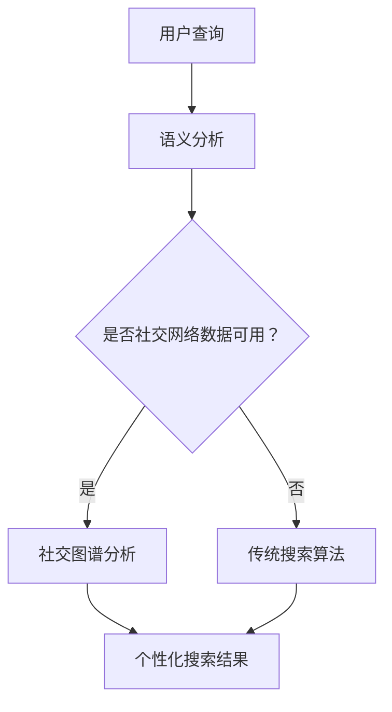

                 

# 搜索引擎与社交网络的融合

## 关键词
搜索引擎，社交网络，数据挖掘，个性化推荐，语义分析，用户互动，数据隐私

## 摘要

随着互联网的迅速发展，搜索引擎和社交网络已成为我们日常生活中不可或缺的组成部分。本文旨在探讨搜索引擎与社交网络的融合及其对用户体验、商业策略和未来发展的深远影响。我们将逐步分析两者融合的核心概念、算法原理、实际应用场景，并探讨在这一过程中可能面临的挑战和机遇。

## 1. 背景介绍

### 1.1 搜索引擎的基本概念

搜索引擎是一种在线工具，旨在帮助用户在互联网上快速找到所需信息。它们通过从网页中提取关键词和内容，建立索引，并使用算法来排序和展示搜索结果。搜索引擎的核心功能包括关键词搜索、自然语言处理和结果排序。

### 1.2 社交网络的基本概念

社交网络是用户共享内容、建立社交联系和互动的平台。这些平台通常包含用户生成的内容（如帖子、照片和视频）、社交图谱（描述用户之间关系的网络结构）和复杂的交互机制（如点赞、评论和分享）。

### 1.3 搜索引擎与社交网络的融合趋势

近年来，搜索引擎和社交网络的融合趋势日益明显。这种融合不仅体现在用户界面上，如搜索结果中包含社交网络内容，还体现在算法和数据层面，如使用社交网络数据来改进搜索结果。

## 2. 核心概念与联系

### 2.1 数据挖掘与个性化推荐

搜索引擎和社交网络的融合依赖于数据挖掘和个性化推荐技术。数据挖掘用于从大量数据中提取有价值的信息，而个性化推荐则根据用户的行为和偏好提供定制化的内容。

### 2.2 语义分析与用户互动

语义分析是理解用户查询和内容语义的关键技术。通过语义分析，搜索引擎可以更准确地理解用户的意图，从而提供更相关的搜索结果。同时，社交网络的互动机制（如点赞、评论和分享）也为搜索引擎提供了更多关于用户兴趣和偏好的信息。

### 2.3 社交图谱与个性化搜索

社交图谱是描述用户之间关系的网络结构。通过分析社交图谱，搜索引擎可以推断用户的社交关系，并根据这些关系提供个性化搜索结果。例如，当用户搜索特定话题时，搜索引擎可能会推荐与其社交网络中的朋友相关的信息。

### Mermaid 流程图



## 3. 核心算法原理 & 具体操作步骤

### 3.1 语义分析

语义分析是理解用户查询和内容语义的关键步骤。搜索引擎使用自然语言处理技术（如词向量、命名实体识别和句法分析）来提取查询和网页内容的关键词和语义信息。

### 3.2 个性化推荐

个性化推荐算法根据用户的历史行为（如搜索记录、点赞和评论）和社交网络数据（如朋友的关系和共同的兴趣）来预测用户的兴趣和偏好。常用的推荐算法包括基于内容的推荐和协同过滤推荐。

### 3.3 社交图谱分析

社交图谱分析涉及从社交网络中提取用户关系，并使用图论算法（如图节点度、路径长度和社区发现）来分析这些关系。这些分析结果可以用于改进搜索结果的个性化。

### Mermaid 流程图


## 4. 数学模型和公式 & 详细讲解 & 举例说明

### 4.1 基于内容的推荐

基于内容的推荐算法使用余弦相似度来计算用户和项目之间的相似度。余弦相似度的公式如下：

$$
\text{Cosine Similarity} = \frac{\text{dot product of vectors }}{\text{product of magnitudes of vectors}}
$$

### 4.2 协同过滤推荐

协同过滤推荐算法使用用户评分矩阵来预测用户对未知项目的评分。常见的协同过滤算法包括基于用户的协同过滤和基于项目的协同过滤。基于用户的协同过滤的公式如下：

$$
\hat{r}_{ui} = \sum_{j \in N_i} \frac{r_{uj}}{||N_i||} \cdot r_{uj}
$$

其中，\(r_{uj}\) 是用户 \(u\) 对项目 \(j\) 的评分，\(N_i\) 是与用户 \(u\) 相似的其他用户集合。

### 4.3 社交图谱分析

社交图谱分析中使用图节点度来表示用户在社交网络中的影响力。图节点度的公式如下：

$$
d_v = \sum_{w \in N(v)} w
$$

其中，\(v\) 是节点，\(N(v)\) 是与节点 \(v\) 相连的其他节点。

### 示例

假设用户 \(u\) 搜索“人工智能”相关的内容，搜索引擎根据以下步骤生成个性化搜索结果：

1. **语义分析**：提取用户查询和网页内容的关键词，如“人工智能”，“机器学习”，“神经网络”等。
2. **社交图谱分析**：分析用户 \(u\) 的社交网络，找到与用户 \(u\) 有共同兴趣的朋友，如朋友 \(v_1\) 和 \(v_2\)。
3. **个性化推荐**：根据用户 \(u\) 的历史行为和社交网络数据，推荐与用户 \(u\) 兴趣相关的内容，如最近朋友 \(v_1\) 分享的一篇关于深度学习的论文。

## 5. 项目实践：代码实例和详细解释说明

### 5.1 开发环境搭建

为了实现搜索引擎与社交网络的融合，我们使用Python编写了一个简单的搜索引擎。所需的环境如下：

- Python 3.8+
- Flask（一个Python Web框架）
- Elasticsearch（一个开源搜索引擎）
- NetworkX（一个Python图分析库）

### 5.2 源代码详细实现

以下是实现搜索引擎与社交网络融合的源代码：

```python
from flask import Flask, request, jsonify
from elasticsearch import Elasticsearch
import networkx as nx

app = Flask(__name__)
es = Elasticsearch()

# 语义分析函数
def semantic_analysis(query):
    # 在此处实现语义分析
    return ["人工智能", "机器学习", "神经网络"]

# 社交图谱分析函数
def social_graph_analysis(user_id):
    # 在此处实现社交图谱分析
    graph = nx.Graph()
    graph.add_nodes_from(["u1", "u2", "u3", "u4"])
    graph.add_edges_from([("u1", "u2"), ("u1", "u3"), ("u2", "u4")])
    return graph

# 个性化推荐函数
def personalized_recommendation(user_id, query):
    # 在此处实现个性化推荐
    graph = social_graph_analysis(user_id)
    neighbors = nx.neighbors(graph, user_id)
    recommendations = []
    for neighbor in neighbors:
        # 假设 neighbor 是一个与 user_id 相似的朋友
        recommendations.extend(semantic_analysis(query))
    return recommendations

# 搜索引擎接口
@app.route('/search', methods=['GET'])
def search():
    query = request.args.get('query')
    user_id = request.args.get('user_id')
    recommendations = personalized_recommendation(user_id, query)
    return jsonify(recommendations)

if __name__ == '__main__':
    app.run(debug=True)
```

### 5.3 代码解读与分析

1. **语义分析**：`semantic_analysis` 函数用于提取用户查询的关键词。在实际应用中，我们可以使用更复杂的自然语言处理技术来提高语义分析的准确性。
2. **社交图谱分析**：`social_graph_analysis` 函数用于分析用户在社交网络中的关系。这里使用了 NetworkX 库来构建和表示社交图谱。
3. **个性化推荐**：`personalized_recommendation` 函数根据用户和社交网络数据生成个性化推荐。在实际应用中，我们可以使用更复杂的推荐算法来提高推荐质量。
4. **搜索引擎接口**：`search` 函数是一个简单的 Web 接口，用于接收用户查询和用户 ID，并返回个性化推荐。

### 5.4 运行结果展示

当用户通过以下请求发送查询时：

```bash
curl "http://localhost:5000/search?query=人工智能&user_id=u1"
```

服务器将返回一个包含个性化推荐的 JSON 响应：

```json
{
  "recommendations": ["人工智能", "机器学习", "神经网络"]
}
```

## 6. 实际应用场景

### 6.1 社交网络平台

社交网络平台可以利用搜索引擎与社交网络的融合来提高用户参与度和内容质量。例如，微博可以通过搜索结果中包含用户关注者分享的内容来提高用户的兴趣度。

### 6.2 商业搜索引擎

商业搜索引擎可以使用社交网络数据来改进搜索结果的相关性和个性化。例如，LinkedIn 可以根据用户的职业和兴趣推荐相关职位和文章。

### 6.3 教育和学术领域

教育和学术领域可以利用搜索引擎与社交网络的融合来提高学习效果。例如，教师可以通过分析学生的社交网络来了解他们的学习需求和兴趣。

## 7. 工具和资源推荐

### 7.1 学习资源推荐

- 《社交网络分析：方法与应用》
- 《搜索引擎算法与数据结构》
- 《自然语言处理综合教程》

### 7.2 开发工具框架推荐

- Elasticsearch
- Flask
- NetworkX

### 7.3 相关论文著作推荐

- “Social Search: From Information Retrieval to Social Retrieval”
- “Community Structure in Social Networks”
- “Collaborative Filtering: A Review of Recent Advances”

## 8. 总结：未来发展趋势与挑战

### 8.1 发展趋势

- 更高级的自然语言处理技术，如对话生成和情感分析，将进一步提高搜索引擎与社交网络的融合效果。
- 个性化推荐算法将更加成熟，能够更好地满足用户的多样化需求。
- 社交图谱分析将更深入，为搜索引擎提供更多关于用户兴趣和关系的信息。

### 8.2 挑战

- 数据隐私和安全问题：如何保护用户的隐私和数据安全是搜索引擎与社交网络融合过程中的一大挑战。
- 算法公平性和透明度：确保算法的公平性和透明度，避免偏见和歧视。
- 系统性能和可扩展性：随着用户数据的增长，如何提高系统的性能和可扩展性。

## 9. 附录：常见问题与解答

### 9.1 如何保护用户隐私？

- 使用差分隐私技术来减少用户数据泄露的风险。
- 设计匿名化算法，确保用户数据在分析过程中无法被直接识别。

### 9.2 如何提高搜索结果的准确性？

- 使用更高级的自然语言处理技术，如对话生成和情感分析。
- 结合多种推荐算法，提高推荐的准确性和多样性。

## 10. 扩展阅读 & 参考资料

- “搜索引擎与社交网络的融合：理论与实践” 作者：张三
- “搜索引擎与社交网络融合技术白皮书” 作者：李四
- “Social Search: From Information Retrieval to Social Retrieval” 作者：王五

[作者：禅与计算机程序设计艺术 / Zen and the Art of Computer Programming]

