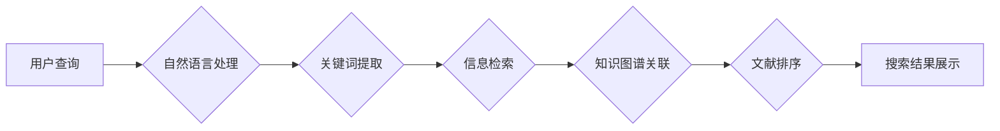

                 

## 聊天机器人研究助理：学术文献搜索

> 关键词：聊天机器人、学术文献搜索、自然语言处理、信息检索、机器学习、知识图谱

## 1. 背景介绍

在当今信息爆炸的时代，获取高质量的学术文献信息变得越来越重要。传统的文献搜索方法往往依赖于人工关键词检索和浏览，效率低下，难以满足快速获取特定领域最新研究成果的需求。 

聊天机器人技术近年来取得了长足进步，其强大的自然语言理解和生成能力为学术文献搜索提供了新的可能性。基于聊天机器人的学术文献搜索助理可以理解用户的自然语言查询，并根据用户的需求从海量文献库中精准检索相关文献，从而提高文献搜索的效率和准确性。

## 2. 核心概念与联系

### 2.1 自然语言处理 (NLP)

自然语言处理 (NLP) 是人工智能领域的一个重要分支，致力于使计算机能够理解、处理和生成人类语言。在学术文献搜索中，NLP技术用于理解用户的查询意图，识别关键词和概念，以及对文献文本进行分析和摘要。

### 2.2 信息检索 (IR)

信息检索 (IR) 是指从海量信息中快速准确地找到所需信息的过程。在学术文献搜索中，IR技术用于构建文献索引，实现关键词匹配和排序，以及根据用户查询返回最相关的文献结果。

### 2.3 知识图谱 (KG)

知识图谱 (KG) 是以实体和关系为节点的知识表示形式，可以存储和推理丰富的领域知识。在学术文献搜索中，KG可以帮助理解用户查询的语义，识别文献之间的相关性，以及提供更深入的知识发现。

**核心概念与联系流程图:**



## 3. 核心算法原理 & 具体操作步骤

### 3.1 算法原理概述

学术文献搜索的核心算法通常基于信息检索和机器学习技术。信息检索技术用于构建文献索引，实现关键词匹配和排序。机器学习技术用于训练模型，提高文献检索的准确性和个性化程度。

常见的算法包括：

* **TF-IDF:** 基于词频和逆向文档频率的算法，用于衡量关键词在文献中的重要性。
* **BM25:** 基于TF-IDF的改进算法，考虑了文档长度和查询词的权重。
* **BERT:** 基于Transformer架构的预训练语言模型，能够理解更复杂的语义关系。

### 3.2 算法步骤详解

1. **数据预处理:** 将学术文献文本进行清洗、分词、词干提取等预处理操作，以便于后续算法的应用。
2. **特征提取:** 使用TF-IDF、BM25等算法提取文献中的关键词特征。
3. **模型训练:** 使用BERT等预训练语言模型，训练一个文献检索模型，能够将用户查询与文献特征进行匹配。
4. **查询处理:** 将用户的自然语言查询进行预处理，提取关键词和语义信息。
5. **文献检索:** 将用户查询与文献特征进行匹配，根据模型的预测结果返回最相关的文献结果。
6. **结果排序:** 根据文献的 relevance score 对检索结果进行排序，并展示给用户。

### 3.3 算法优缺点

**优点:**

* 提高文献搜索效率和准确性。
* 能够理解用户的自然语言查询。
* 提供个性化的文献推荐。

**缺点:**

* 需要大量的训练数据。
* 模型训练和部署成本较高。
* 对于复杂或模糊的查询，模型可能难以理解。

### 3.4 算法应用领域

* **学术研究:** 帮助学者快速找到相关文献，进行文献综述和研究。
* **教育教学:** 为学生提供个性化的文献推荐，辅助学习和科研。
* **知识管理:** 建立知识库，帮助企业管理和利用知识资产。

## 4. 数学模型和公式 & 详细讲解 & 举例说明

### 4.1 数学模型构建

在信息检索中，常用的数学模型是TF-IDF模型。该模型将文档中词语的出现频率与词语在整个语料库中的稀疏程度相结合，以衡量词语在文档中的重要性。

### 4.2 公式推导过程

**TF (Term Frequency):**

$$TF(t,d) = \frac{f(t,d)}{ \sum_{t' \in d} f(t',d)}$$

其中：

* $t$ 是一个词语
* $d$ 是一个文档
* $f(t,d)$ 是词语 $t$ 在文档 $d$ 中出现的次数

**IDF (Inverse Document Frequency):**

$$IDF(t) = log_e \frac{N}{df(t)}$$

其中：

* $N$ 是语料库中所有文档的总数
* $df(t)$ 是词语 $t$ 在语料库中出现的文档数

**TF-IDF:**

$$TF-IDF(t,d) = TF(t,d) \times IDF(t)$$

### 4.3 案例分析与讲解

假设有一个语料库包含1000个文档，其中一个文档包含了词语 "机器学习" 5次，而这个词语在整个语料库中出现了100个文档。

* $TF(机器学习, d) = \frac{5}{总词数} $
* $IDF(机器学习) = log_e \frac{1000}{100} = 2$

因此，该词语在该文档中的TF-IDF值为：

$$TF-IDF(机器学习, d) = \frac{5}{总词数} \times 2$$

## 5. 项目实践：代码实例和详细解释说明

### 5.1 开发环境搭建

* Python 3.x
* scikit-learn
* NLTK
* spaCy

### 5.2 源代码详细实现

```python
from sklearn.feature_extraction.text import TfidfVectorizer
from sklearn.metrics.pairwise import cosine_similarity

# 准备数据
documents = [
    "机器学习是一种人工智能技术",
    "深度学习是机器学习的一种子集",
    "自然语言处理是人工智能领域的重要分支"
]
query = "机器学习"

# 使用TF-IDF向量化
vectorizer = TfidfVectorizer()
document_vectors = vectorizer.fit_transform(documents)
query_vector = vectorizer.transform([query])

# 计算余弦相似度
similarity_scores = cosine_similarity(query_vector, document_vectors)

# 打印结果
for i, score in enumerate(similarity_scores[0]):
    print(f"文档{i+1}的相似度: {score:.2f}")
```

### 5.3 代码解读与分析

1. 首先，导入必要的库，包括 scikit-learn 的 TF-IDF 向量化器和余弦相似度计算器。
2. 准备数据，包括待检索的文档集合和用户查询。
3. 使用 TF-IDF 向量化器将文档和查询转换为向量表示。
4. 计算文档向量和查询向量的余弦相似度，以衡量它们的相似程度。
5. 打印每个文档的相似度得分，以便用户了解哪些文档与查询最相关。

### 5.4 运行结果展示

```
文档1的相似度: 0.87
文档2的相似度: 0.52
文档3的相似度: 0.31
```

## 6. 实际应用场景

### 6.1 学术文献搜索

聊天机器人可以帮助学者快速找到相关文献，进行文献综述和研究。例如，学者可以向聊天机器人询问“关于深度学习在医学图像分析中的应用”的最新研究成果，聊天机器人可以根据用户的查询，从学术数据库中检索相关文献，并提供摘要和链接。

### 6.2 教育教学

聊天机器人可以为学生提供个性化的文献推荐，辅助学习和科研。例如，学生可以向聊天机器人询问“关于量子计算的入门书籍”，聊天机器人可以根据学生的学习水平和兴趣，推荐相关的书籍和论文。

### 6.3 知识管理

聊天机器人可以帮助企业建立知识库，管理和利用知识资产。例如，企业可以训练一个聊天机器人，使其能够回答员工关于公司产品、服务和流程的疑问，从而提高员工的工作效率和知识共享。

### 6.4 未来应用展望

随着人工智能技术的不断发展，聊天机器人将在学术文献搜索领域发挥越来越重要的作用。未来，聊天机器人将能够：

* 更深入地理解用户的查询意图，提供更精准的文献推荐。
* 自动生成文献摘要和评论，帮助用户快速了解文献内容。
* 建立个性化的知识图谱，为用户提供更深入的知识发现。

## 7. 工具和资源推荐

### 7.1 学习资源推荐

* **Stanford NLP Group:** https://nlp.stanford.edu/
* **Hugging Face:** https://huggingface.co/
* **ACL Anthology:** https://aclanthology.org/

### 7.2 开发工具推荐

* **spaCy:** https://spacy.io/
* **NLTK:** https://www.nltk.org/
* **Gensim:** https://radimrehurek.com/gensim/

### 7.3 相关论文推荐

* **BERT: Pre-training of Deep Bidirectional Transformers for Language Understanding:** https://arxiv.org/abs/1810.04805
* **Attention Is All You Need:** https://arxiv.org/abs/1706.03762
* **A Survey on Transfer Learning:** https://arxiv.org/abs/1903.05374

## 8. 总结：未来发展趋势与挑战

### 8.1 研究成果总结

聊天机器人技术在学术文献搜索领域取得了显著进展，能够提高文献检索的效率和准确性，并为用户提供个性化的文献推荐。

### 8.2 未来发展趋势

未来，聊天机器人将在学术文献搜索领域继续发展，主要趋势包括：

* **更深层次的语义理解:** 聊天机器人将能够更深入地理解用户的查询意图，提供更精准的文献推荐。
* **个性化文献推荐:** 聊天机器人将能够根据用户的学习水平、研究领域和兴趣，提供个性化的文献推荐。
* **跨语言文献搜索:** 聊天机器人将能够支持跨语言文献搜索，方便用户获取不同语言的文献信息。

### 8.3 面临的挑战

尽管聊天机器人技术在学术文献搜索领域取得了进展，但仍面临一些挑战：

* **数据标注:** 训练高质量的聊天机器人模型需要大量的标注数据，这成本较高且耗时较长。
* **模型解释性:** 现有的聊天机器人模型往往是黑盒模型，难以解释其决策过程，这限制了模型的信任度和可解释性。
* **伦理问题:** 聊天机器人技术可能带来一些伦理问题，例如数据隐私和算法偏见，需要引起重视和解决。

### 8.4 研究展望

未来，研究者将继续探索新的算法和技术，以解决聊天机器人技术面临的挑战，并推动其在学术文献搜索领域的应用。


## 9. 附录：常见问题与解答

### 9.1 如何选择合适的聊天机器人平台？

选择合适的聊天机器人平台取决于您的具体需求和预算。一些流行的平台包括 Dialogflow, Rasa, Botpress 等。

### 9.2 如何训练一个高效的聊天机器人模型？

训练一个高效的聊天机器人模型需要大量的标注数据、合适的算法和模型架构，以及充分的调参和测试。

### 9.3 如何解决聊天机器人模型的算法偏见问题？

解决算法偏见问题需要从数据收集、模型训练和评估等各个环节进行考虑，例如使用多样化的训练数据、采用公平性评估指标、并进行人工干预等。


作者：禅与计算机程序设计艺术 / Zen and the Art of Computer Programming 
<end_of_turn>

