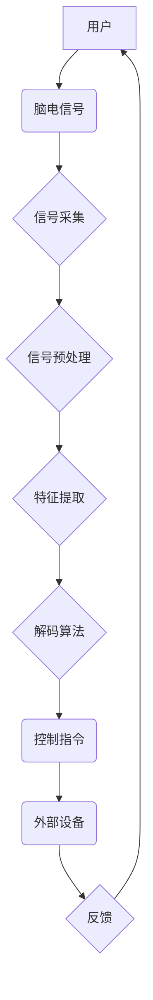

                 

## 脑机接口技术的发展：直接用思维控制设备

> 关键词：脑机接口、神经信号、机器学习、深度学习、生物电磁信号、脑电图、功能磁共振、应用场景、未来趋势

### 1. 背景介绍

脑机接口 (Brain-Computer Interface, BCI) 技术，顾名思义，是一种介于大脑和外部设备之间的接口，它能够直接解码大脑神经信号，并将其转化为控制外部设备的指令。 

想象一下，你只需通过意念就能控制轮椅、机械臂、甚至虚拟现实环境，这不再是科幻电影的幻想，而是脑机接口技术正在逐步实现的现实。

BCI 技术的出现，为残疾人提供了一种全新的希望，让他们能够通过意念控制prosthesis（义肢）、恢复部分肢体功能，甚至参与社交互动。 

此外，BCI 技术也具有广泛的应用前景，例如：

* **医疗领域:** 用于治疗脑损伤、帕金森病、失语症等疾病，以及进行神经疾病诊断和监测。
* **教育领域:** 辅助学习和记忆，提高学习效率。
* **娱乐领域:** 增强游戏体验，创造沉浸式互动。
* **军事领域:** 用于控制无人机、机器人等武器装备，提高作战效率。

### 2. 核心概念与联系

BCI 技术的核心是将大脑的电信号转化为计算机可理解的指令。 

**2.1 核心概念**

* **神经信号:** 大脑神经元之间通过电化学信号进行通信，这些信号是BCI技术的基础。
* **生物电磁信号:** 神经信号会产生微弱的电磁波，可以通过传感器检测到。
* **解码算法:** 用于分析和识别神经信号，将其转化为控制指令的算法。
* **反馈机制:** 用于将控制指令的结果反馈给用户，帮助用户学习和控制BCI系统。

**2.2 架构图**



### 3. 核心算法原理 & 具体操作步骤

**3.1 算法原理概述**

BCI 算法的核心是识别和解码大脑神经信号。常用的算法包括：

* **特征提取:** 从脑电信号中提取有用的特征，例如频率、幅度、相位等。
* **分类算法:** 将提取的特征分类，识别不同的意图或动作。常用的分类算法包括支持向量机 (SVM)、决策树、神经网络等。

**3.2 算法步骤详解**

1. **信号采集:** 使用脑电图 (EEG) 或其他生物传感器采集脑电信号。
2. **信号预处理:** 对采集到的脑电信号进行滤波、去噪等处理，去除无关信息，提高信号质量。
3. **特征提取:** 从预处理后的脑电信号中提取特征，例如功率谱、互信息、小波变换等。
4. **分类训练:** 使用训练数据训练分类算法，例如 SVM、决策树、神经网络等。
5. **解码预测:** 将新的脑电信号输入训练好的分类模型，预测用户的意图或动作。
6. **控制指令:** 将预测的结果转化为控制外部设备的指令。

**3.3 算法优缺点**

* **优点:** 
    * 算法原理相对简单，易于理解和实现。
    * 训练数据量相对较少，可以进行快速迭代。
* **缺点:** 
    * 识别精度相对较低，容易受到噪声和干扰的影响。
    * 无法识别复杂的意图或动作。

**3.4 算法应用领域**

* **控制简单的外部设备:** 例如，控制鼠标、键盘、轮椅等。
* **辅助残疾人进行沟通:** 例如，通过意念控制语音合成器进行交流。
* **进行简单的游戏控制:** 例如，通过意念控制游戏角色的移动。

### 4. 数学模型和公式 & 详细讲解 & 举例说明

**4.1 数学模型构建**

BCI 算法的数学模型通常基于统计学习理论，其核心是建立一个映射关系，将脑电信号特征映射到控制指令。

假设我们有 $N$ 个脑电信号样本，每个样本包含 $M$ 个特征，我们用 $X_i = (x_{i1}, x_{i2}, ..., x_{iM})$ 表示第 $i$ 个样本的特征向量，$Y_i$ 表示对应的控制指令。

我们可以使用以下数学模型来表示这个映射关系：

$$f(X_i) = Y_i$$

其中，$f$ 是一个函数，它将特征向量 $X_i$ 映射到控制指令 $Y_i$。

**4.2 公式推导过程**

具体的函数 $f$ 的形式取决于选择的算法。例如，如果使用支持向量机 (SVM) 算法，则 $f$ 可以表示为：

$$f(X_i) = sign(w^T X_i + b)$$

其中，$w$ 是权重向量，$b$ 是偏置项，$sign$ 是符号函数。

**4.3 案例分析与讲解**

假设我们想要训练一个 BCI 系统，用于控制鼠标的移动方向。我们可以收集一些脑电信号数据，并将其与鼠标移动方向进行标注。

然后，我们可以使用 SVM 算法训练一个模型，将脑电信号特征映射到鼠标移动方向。

当用户想要移动鼠标时，我们可以采集用户的脑电信号，将其输入训练好的模型，模型会预测用户的意图，并输出相应的控制指令，从而控制鼠标的移动方向。

### 5. 项目实践：代码实例和详细解释说明

**5.1 开发环境搭建**

* **操作系统:** Linux 或 Windows
* **编程语言:** Python
* **库:** NumPy, Scikit-learn, Matplotlib

**5.2 源代码详细实现**

```python
import numpy as np
from sklearn.svm import SVC

# 训练数据
X_train = np.array([[1, 2], [3, 4], [5, 6], [7, 8]])
y_train = np.array([0, 1, 0, 1])

# 测试数据
X_test = np.array([[2, 3], [6, 7]])

# 创建 SVM 模型
clf = SVC()

# 训练模型
clf.fit(X_train, y_train)

# 预测测试数据
y_pred = clf.predict(X_test)

# 打印预测结果
print(y_pred)
```

**5.3 代码解读与分析**

* 首先，我们导入必要的库，例如 NumPy 用于数值计算，Scikit-learn 用于机器学习，Matplotlib 用于数据可视化。
* 然后，我们定义训练数据和测试数据，其中 X 代表特征向量，y 代表对应的控制指令。
* 接着，我们创建 SVM 模型，并使用训练数据进行训练。
* 最后，我们使用训练好的模型预测测试数据的控制指令，并打印结果。

**5.4 运行结果展示**

运行上述代码，会输出测试数据的预测结果，例如：

```
[0 1]
```

这表示测试数据对应的控制指令分别为 0 和 1。

### 6. 实际应用场景

**6.1 医疗领域**

* **瘫痪患者:** BCI 技术可以帮助瘫痪患者控制轮椅、机械臂等设备，恢复部分肢体功能，提高生活质量。
* **脑损伤患者:** BCI 技术可以帮助脑损伤患者进行沟通、控制环境，辅助康复治疗。
* **失语症患者:** BCI 技术可以帮助失语症患者通过意念控制语音合成器进行交流。

**6.2 教育领域**

* **辅助学习:** BCI 技术可以帮助学生集中注意力、提高学习效率。
* **个性化教育:** BCI 技术可以根据学生的学习情况，提供个性化的学习内容和方法。

**6.3 娱乐领域**

* **增强游戏体验:** BCI 技术可以使游戏更加沉浸式，玩家可以通过意念控制游戏角色，体验更真实的互动。
* **创造新的互动方式:** BCI 技术可以用于开发新的互动娱乐方式，例如脑电音乐、脑电绘画等。

**6.4 未来应用展望**

* **更精准的控制:** 未来 BCI 技术将更加精准，能够识别更复杂的意图和动作，控制更复杂的设备。
* **更广泛的应用场景:** BCI 技术将应用于更多领域，例如工业控制、军事指挥、人机协作等。
* **更便捷的交互方式:** BCI 技术将成为一种更便捷、更自然的交互方式，改变人类与机器的互动方式。

### 7. 工具和资源推荐

**7.1 学习资源推荐**

* **书籍:**
    * 《Brain-Computer Interfaces: Principles and Applications》 by Niels Birbaumer
    * 《Brain-Computer Interfaces: A Primer》 by José del R Millán
* **在线课程:**
    * Coursera: Machine Learning
    * edX: Introduction to Brain-Computer Interfaces

**7.2 开发工具推荐**

* **OpenBCI:** 开源脑机接口平台，提供硬件和软件开发工具。
* **Muse:** 脑电波头戴式设备，提供 API 接口，方便开发 BCI 应用。
* **BrainFlow:** 脑电信号处理库，提供多种算法和工具。

**7.3 相关论文推荐**

* **A Survey of Brain-Computer Interfaces》 by Niels Birbaumer et al. (2010)**
* **Brain-Computer Interfaces: A Review》 by José del R Millán et al. (2010)**

### 8. 总结：未来发展趋势与挑战

**8.1 研究成果总结**

近年来，BCI 技术取得了显著进展，从最初的简单控制到复杂的意图识别，已经实现了跨越式发展。

**8.2 未来发展趋势**

* **提高识别精度:** 通过改进算法、增加数据量、开发更先进的传感器，提高 BCI 系统的识别精度。
* **降低成本:** 开发更经济实惠的 BCI 系统，使其更易于普及。
* **增强用户体验:** 开发更舒适、更便捷的 BCI 设备，提高用户体验。

**8.3 面临的挑战**

* **生物信号的复杂性:** 脑电信号非常复杂，受多种因素影响，识别和解码仍然是一个挑战。
* **数据安全和隐私:** BCI 系统收集用户的脑电信号，需要确保数据安全和隐私。
* **伦理问题:** BCI 技术的应用可能引发一些伦理问题，例如意识上传、人机融合等，需要进行深入探讨和规范。

**8.4 研究展望**

BCI 技术的发展前景广阔，未来将对人类生活产生深远影响。

我们需要继续加强基础研究，提高 BCI 系统的性能和可靠性。

同时，也要关注 BCI 技术的伦理问题，确保其安全、可控、可持续发展。

### 9. 附录：常见问题与解答

* **BCI 技术是否安全？**

目前 BCI 技术已经相对成熟，安全性得到保证。

* **BCI 技术是否会让人上瘾？**

BCI 技术不会让人上瘾，它是一种辅助工具，可以帮助人们更好地控制外部设备。

* **BCI 技术是否会取代人类？**

BCI 技术不会取代人类，它只是帮助人类更好地与机器交互，提高效率和生活质量。

作者：禅与计算机程序设计艺术 / Zen and the Art of Computer Programming


<end_of_turn>

