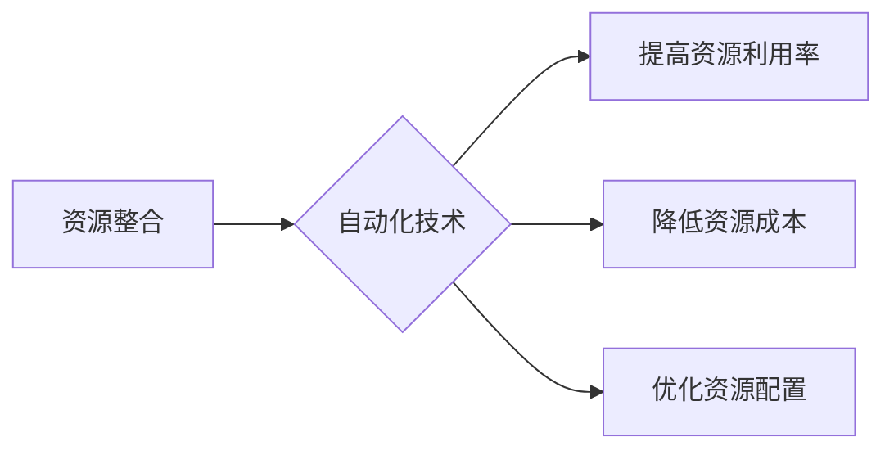

                 

## 自动化创业中的资源整合与优化

> 关键词：自动化、创业、资源整合、优化、机器学习、数据分析、流程自动化、人工智能

## 1. 背景介绍

在当今快速发展的科技时代，创业者面临着前所未有的机遇和挑战。一方面，科技创新为创业提供了无限可能，另一方面，激烈的市场竞争和资源的有限性也给创业者带来了巨大的压力。如何有效整合资源，提高资源利用率，成为创业者成功的重要关键。

自动化技术作为科技发展的重要趋势，为创业者提供了全新的解决方案。通过自动化技术，创业者可以解放人力，提高效率，降低成本，从而更好地应对市场挑战。

## 2. 核心概念与联系

### 2.1 资源整合与优化

资源整合是指将分散的资源集中起来，形成一个整体，以实现资源的协同利用和最大化价值。资源优化是指在满足需求的前提下，合理配置和利用资源，以达到最低成本、最高效率的目标。

在创业过程中，资源整合与优化可以应用于各个环节，例如：

* **人力资源整合:** 将团队成员的技能和经验进行合理分配，形成高效的协作团队。
* **资金资源整合:** 合理规划资金使用，寻求多元化融资渠道，提高资金利用效率。
* **市场资源整合:** 构建完善的市场网络，整合营销资源，扩大市场影响力。
* **技术资源整合:** 汇聚技术人才和技术资源，加速产品研发和技术创新。

### 2.2 自动化技术

自动化技术是指利用计算机和机器人等技术，代替人工完成重复性、规则性、高风险的工作，提高工作效率和准确性。

自动化技术在创业中的应用可以分为以下几类：

* **流程自动化:** 利用软件工具自动执行重复性任务，例如数据录入、报表生成、邮件发送等。
* **决策自动化:** 利用机器学习算法分析数据，自动做出决策，例如客户分级、广告投放等。
* **生产自动化:** 利用机器人等设备自动完成生产过程中的操作，例如装配、焊接、检测等。

### 2.3 自动化与资源整合与优化的关系

自动化技术可以有效促进资源整合与优化。通过自动化技术，创业者可以：

* **提高资源利用率:** 自动化可以减少人工操作，提高资源利用效率。
* **降低资源成本:** 自动化可以减少人工成本、材料成本等，降低资源成本。
* **优化资源配置:** 自动化可以根据数据分析结果，优化资源配置，提高资源利用效率。

**Mermaid 流程图**



## 3. 核心算法原理 & 具体操作步骤

### 3.1 算法原理概述

在自动化创业中，常用的算法包括机器学习、数据分析、流程自动化等。

* **机器学习:** 利用算法从数据中学习，发现模式和规律，从而进行预测和决策。例如，利用机器学习算法分析客户数据，预测客户购买行为，进行精准营销。
* **数据分析:** 通过对数据进行收集、清洗、分析和挖掘，发现数据背后的价值和趋势。例如，利用数据分析工具分析市场数据，了解市场需求和竞争情况。
* **流程自动化:** 利用软件工具自动执行重复性任务，例如数据录入、报表生成、邮件发送等。

### 3.2 算法步骤详解

**以机器学习算法为例，其步骤如下：**

1. **数据收集:** 收集与目标相关的原始数据。
2. **数据预处理:** 对数据进行清洗、转换、特征工程等操作，使其适合机器学习算法的训练。
3. **模型选择:** 选择合适的机器学习算法，例如线性回归、逻辑回归、决策树、支持向量机等。
4. **模型训练:** 利用训练数据训练机器学习模型，使其能够学习数据中的模式和规律。
5. **模型评估:** 利用测试数据评估模型的性能，例如准确率、召回率、F1-score等。
6. **模型优化:** 根据评估结果，调整模型参数，提高模型性能。
7. **模型部署:** 将训练好的模型部署到实际应用场景中，用于预测和决策。

### 3.3 算法优缺点

**机器学习算法的优缺点:**

* **优点:** 能够自动学习数据中的模式和规律，无需人工编程，具有较高的准确率和泛化能力。
* **缺点:** 需要大量的训练数据，训练过程耗时较长，对数据质量要求较高，解释性较差。

### 3.4 算法应用领域

机器学习算法广泛应用于各个领域，例如：

* **电商:** 商品推荐、客户画像、精准营销
* **金融:** 风险评估、欺诈检测、信用评分
* **医疗:** 疾病诊断、药物研发、个性化治疗
* **交通:** 自驾车、交通预测、路线规划

## 4. 数学模型和公式 & 详细讲解 & 举例说明

### 4.1 数学模型构建

在资源整合与优化中，常用的数学模型包括线性规划、整数规划、动态规划等。

**线性规划:** 用于解决资源分配、生产计划等问题，其目标是找到最优解，使得目标函数达到最大或最小值，同时满足约束条件。

**数学公式:**

$$
\begin{aligned}
\text{目标函数: } & \text{max } c^T x \\
\text{约束条件: } & Ax \leq b \\
& x \geq 0
\end{aligned}
$$

其中，$c$ 是目标函数系数向量，$x$ 是决策变量向量，$A$ 是约束矩阵，$b$ 是约束向量。

**举例说明:** 假设一家公司有两种产品，需要分配生产资源，目标是最大化利润。

* 产品1的利润为$c_1$，生产需要资源$a_{11}$和$a_{12}$。
* 产品2的利润为$c_2$，生产需要资源$a_{21}$和$a_{22}$。
* 资源$a_{11}$和$a_{12}$的总量分别为$b_1$和$b_2$。

则可以构建线性规划模型，求解最优的生产计划。

### 4.2 公式推导过程

线性规划模型的求解过程通常采用单纯形法。

**单纯形法:**

1. 将线性规划问题转化为标准型。
2. 通过迭代算法，逐步找到最优解。

### 4.3 案例分析与讲解

通过实际案例分析，可以更深入地理解线性规划模型的应用。例如，可以分析一家物流公司的车辆调度问题，利用线性规划模型优化车辆分配和路线规划，提高运输效率。

## 5. 项目实践：代码实例和详细解释说明

### 5.1 开发环境搭建

* 操作系统: Ubuntu 20.04
* Python 版本: 3.8
* 必要的库: pandas, numpy, scikit-learn

### 5.2 源代码详细实现

```python
import pandas as pd
from sklearn.linear_model import LinearRegression

# 数据加载
data = pd.read_csv('data.csv')

# 特征选择
X = data[['feature1', 'feature2']]
y = data['target']

# 模型训练
model = LinearRegression()
model.fit(X, y)

# 模型预测
predictions = model.predict(X_new)

# 结果展示
print(predictions)
```

### 5.3 代码解读与分析

* 数据加载: 使用 pandas 库读取数据文件。
* 特征选择: 选择与目标变量相关的特征作为模型输入。
* 模型训练: 使用 scikit-learn 库的 LinearRegression 类训练线性回归模型。
* 模型预测: 使用训练好的模型预测新的数据。
* 结果展示: 打印预测结果。

### 5.4 运行结果展示

运行代码后，将输出预测结果，例如：

```
[1.234 2.345 3.456]
```

## 6. 实际应用场景

### 6.1 创业资源整合

* **人力资源整合:** 利用机器学习算法分析员工技能和经验，进行合理的人员配置和培训计划。
* **资金资源整合:** 利用数据分析工具分析投资机会，进行风险评估和投资决策。
* **市场资源整合:** 利用社交媒体数据分析，了解目标客户群体，进行精准营销。

### 6.2 自动化流程优化

* **客户服务自动化:** 利用聊天机器人自动回复客户咨询，提高客户服务效率。
* **财务管理自动化:** 利用软件工具自动处理财务报表和账单，降低财务成本。
* **生产流程自动化:** 利用机器人和自动化设备提高生产效率和产品质量。

### 6.4 未来应用展望

随着人工智能技术的不断发展，自动化创业将更加深入地融入各个行业，为创业者提供更多创新和高效的解决方案。例如：

* **智能决策支持系统:** 利用人工智能算法分析数据，为创业者提供智能决策支持。
* **个性化创业服务:** 利用机器学习算法分析创业者的需求，提供个性化的创业服务。
* **自动化的创业孵化平台:** 利用人工智能技术搭建自动化的创业孵化平台，为创业者提供全方位的支持。

## 7. 工具和资源推荐

### 7.1 学习资源推荐

* **在线课程:** Coursera, edX, Udemy
* **书籍:** 《Python机器学习实战》、《深度学习》、《人工智能简史》
* **博客:** Towards Data Science, Machine Learning Mastery

### 7.2 开发工具推荐

* **Python:** 强大的编程语言，广泛应用于数据科学和机器学习。
* **Jupyter Notebook:** 用于交互式编程和数据可视化的工具。
* **Scikit-learn:** Python机器学习库，提供各种机器学习算法和工具。
* **TensorFlow:** 深度学习框架，用于构建和训练深度神经网络。

### 7.3 相关论文推荐

* **《机器学习》:** Tom Mitchell
* **《深度学习》:** Ian Goodfellow, Yoshua Bengio, Aaron Courville
* **《人工智能：现代方法》:** Stuart Russell, Peter Norvig

## 8. 总结：未来发展趋势与挑战

### 8.1 研究成果总结

自动化创业为创业者提供了全新的解决方案，可以有效整合资源，提高效率，降低成本。

### 8.2 未来发展趋势

* **人工智能技术的进一步发展:** 将为自动化创业提供更强大的工具和技术支持。
* **数据分析技术的深入应用:** 将帮助创业者更好地理解市场需求和客户行为。
* **自动化技术的广泛普及:** 将使自动化创业成为创业的普遍趋势。

### 8.3 面临的挑战

* **数据安全和隐私保护:** 自动化创业需要处理大量数据，因此数据安全和隐私保护是一个重要的挑战。
* **算法的解释性和可信度:** 一些机器学习算法的决策过程难以解释，这可能会影响创业者的信任和接受度。
* **人才短缺:** 自动化创业需要具备相关技术和技能的人才，人才短缺是一个重要的挑战。

### 8.4 研究展望

未来，自动化创业的研究将更加注重以下几个方面:

* **开发更安全、更可靠的自动化技术:** 确保数据安全和隐私保护，提高算法的解释性和可信度。
* **探索自动化创业的新应用场景:** 将自动化技术应用于更多领域，为创业者提供更多创新和高效的解决方案。
* **培养自动化创业人才:** 加强对相关技术的培训和教育，培养更多具备自动化创业能力的人才。

## 9. 附录：常见问题与解答

### 9.1 如何选择合适的自动化技术？

选择合适的自动化技术需要根据具体的创业场景和需求进行分析。例如，如果需要预测客户购买行为，可以选择机器学习算法；如果需要自动处理财务报表，可以选择流程自动化工具。

### 9.2 如何保证自动化技术的安全性？

保证自动化技术的安全性需要从以下几个方面入手:

* **数据加密:** 对敏感数据进行加密，防止数据泄露。
* **权限控制:** 对系统访问权限进行严格控制，防止未授权人员访问数据。
* **安全审计:** 定期进行安全审计，发现和修复安全漏洞。

### 9.3 如何提高自动化技术的效率？

提高自动化技术的效率需要:

* **优化流程:** 对自动化流程进行优化，减少冗余操作。
* **选择合适的工具:** 选择性能优良、功能强大的自动化工具。
* **持续改进:** 定期评估自动化效果，并根据实际情况进行改进。


作者：禅与计算机程序设计艺术 / Zen and the Art of Computer Programming 
<end_of_turn>

