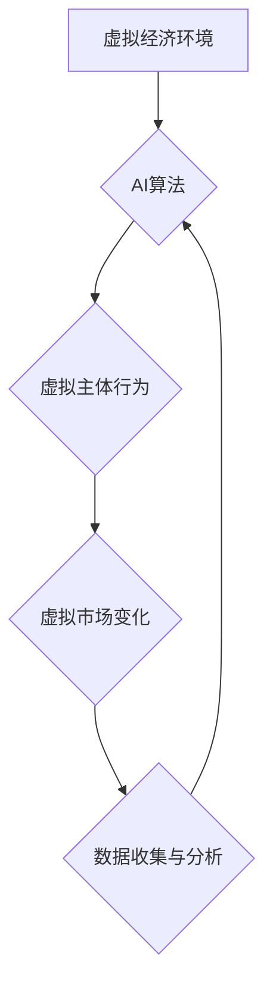

                 

## 虚拟经济模拟器：AI驱动的新型价值交换实验

> 关键词：虚拟经济、人工智能、价值交换、模拟器、算法、数学模型、区块链、去中心化

## 1. 背景介绍

随着人工智能技术的飞速发展，我们正处于一个前所未有的时代。AI正在深刻地改变着我们生活的方方面面，从医疗保健到金融，从交通运输到娱乐。而虚拟经济，作为一种模拟现实经济运行的数字环境，也正迎来新的发展机遇。

传统的虚拟经济模拟器主要依赖于预设的规则和算法，缺乏对复杂经济行为的模拟能力。而AI技术的引入，为虚拟经济模拟器注入了新的活力。AI算法能够学习和适应不断变化的经济环境，模拟更真实、更复杂的经济行为。

本篇文章将探讨基于AI驱动的虚拟经济模拟器的构建，重点介绍其核心概念、算法原理、数学模型以及实际应用场景。

## 2. 核心概念与联系

**2.1 虚拟经济**

虚拟经济是指在计算机网络环境中模拟现实经济活动的一种系统。它通常包含以下几个关键要素：

* **虚拟货币：** 用于在虚拟经济中进行交易的虚拟货币，例如比特币、以太坊等。
* **虚拟资产：** 在虚拟经济中具有价值的虚拟物品，例如虚拟土地、虚拟商品等。
* **虚拟市场：** 用于买卖虚拟货币和虚拟资产的平台。
* **虚拟主体：** 在虚拟经济中参与交易和活动的虚拟角色，例如玩家、企业等。

**2.2 人工智能**

人工智能是指使机器能够像人类一样思考、学习和解决问题的能力。常见的AI技术包括：

* **机器学习：** 允许机器从数据中学习并改进其性能。
* **深度学习：** 一种更高级的机器学习技术，使用多层神经网络模拟人类大脑的结构和功能。
* **自然语言处理：** 允许机器理解和生成人类语言。

**2.3 价值交换**

价值交换是经济活动的基础，是指不同主体之间通过交易来获得彼此需要的物品或服务。在虚拟经济中，价值交换也遵循类似的原则，只不过交易对象是虚拟货币和虚拟资产。

**2.4 虚拟经济模拟器**

虚拟经济模拟器是一种软件系统，用于模拟现实经济的运行过程。它可以用来研究经济现象、预测经济趋势、测试经济政策等。

**2.5 AI驱动的虚拟经济模拟器**

AI驱动的虚拟经济模拟器将人工智能技术应用于虚拟经济模拟器中，使模拟更加真实、更加复杂。AI算法可以模拟虚拟主体的行为，预测虚拟市场的变化，甚至可以自动进行交易。

**2.6 架构图**



## 3. 核心算法原理 & 具体操作步骤

**3.1 算法原理概述**

AI驱动的虚拟经济模拟器通常使用以下几种算法：

* **强化学习：** 允许虚拟主体通过与环境交互学习，并根据奖励机制优化其行为。
* **博弈论：** 研究多个智能体之间的相互作用，预测其在不同策略下的行为。
* **预测模型：** 使用历史数据预测虚拟市场未来的变化趋势。

**3.2 算法步骤详解**

1. **环境建模：** 建立虚拟经济环境，包括虚拟货币、虚拟资产、虚拟市场等。
2. **虚拟主体设计：** 设计虚拟主体，赋予其不同的目标、行为策略和资源。
3. **算法训练：** 使用强化学习、博弈论或预测模型等算法训练虚拟主体，使其能够在虚拟经济环境中做出合理的决策。
4. **模拟运行：** 在虚拟经济环境中运行模拟，观察虚拟主体的行为和虚拟市场的变化。
5. **数据分析：** 收集模拟运行的数据，分析虚拟主体的行为模式、市场趋势等。
6. **模型优化：** 根据数据分析结果，优化算法参数和虚拟主体设计，提高模拟器的精度和真实性。

**3.3 算法优缺点**

* **优点：**

    * 模拟更加真实、更加复杂。
    * 可以预测经济趋势、测试经济政策等。
    * 可以研究人工智能在经济领域的应用。

* **缺点：**

    * 算法训练需要大量数据和计算资源。
    * 模拟结果可能受到算法和虚拟主体设计的限制。

**3.4 算法应用领域**

* **经济学研究：** 研究经济现象、预测经济趋势、测试经济政策等。
* **金融市场分析：** 预测股票价格、识别市场风险等。
* **商业决策支持：** 帮助企业制定更有效的商业策略。
* **教育培训：** 提供虚拟经济环境，让学生体验经济活动。

## 4. 数学模型和公式 & 详细讲解 & 举例说明

**4.1 数学模型构建**

虚拟经济模拟器通常使用以下数学模型来描述虚拟经济的运行过程：

* **供求模型：** 描述虚拟货币和虚拟资产的供求关系。
* **价格模型：** 描述虚拟货币和虚拟资产的价格变化规律。
* **行为模型：** 描述虚拟主体的行为模式，例如交易策略、投资决策等。

**4.2 公式推导过程**

* **供求模型：**

    $$Q_d = a - bP$$

    $$Q_s = c + dP$$

    其中：

    * $Q_d$：需求量
    * $P$：价格
    * $a$，$b$，$c$，$d$：常数

    当 $Q_d = Q_s$ 时，达到市场均衡。

* **价格模型：**

    $$P = f(Q_d, Q_s)$$

    其中：

    * $P$：价格
    * $Q_d$：需求量
    * $Q_s$：供给量

    价格模型可以根据不同的经济条件设定不同的函数形式。

* **行为模型：**

    $$A_t = g(S_t, P_t, \theta)$$

    其中：

    * $A_t$：虚拟主体在时间 $t$ 的行为
    * $S_t$：虚拟主体在时间 $t$ 的状态
    * $P_t$：虚拟市场在时间 $t$ 的价格
    * $\theta$：虚拟主体的参数

    行为模型可以根据不同的AI算法设定不同的函数形式。

**4.3 案例分析与讲解**

假设我们构建了一个虚拟经济模拟器，其中虚拟货币为“虚拟币”，虚拟资产为“虚拟土地”。我们可以使用上述数学模型来描述虚拟经济的运行过程：

* **供求模型：** 虚拟币的供求关系可以由以下公式描述：

    $$Q_d = 1000 - 2P$$

    $$Q_s = 500 + P$$

    其中，$Q_d$ 表示虚拟币的需求量，$Q_s$ 表示虚拟币的供给量，$P$ 表示虚拟币的价格。

* **价格模型：** 虚拟币的价格可以根据供求关系确定：

    $$P = f(Q_d, Q_s)$$

    当 $Q_d = Q_s$ 时，达到市场均衡，此时虚拟币的价格为 $P = 250$。

* **行为模型：** 虚拟主体可以根据以下规则进行交易：

    * 如果虚拟币价格低于 $200$，则购买虚拟币。
    * 如果虚拟币价格高于 $300$，则出售虚拟币。

    通过模拟运行，我们可以观察虚拟币价格的变化趋势，以及虚拟主体交易行为的模式。

## 5. 项目实践：代码实例和详细解释说明

**5.1 开发环境搭建**

* **操作系统：** Linux 或 macOS
* **编程语言：** Python
* **开发工具：** Jupyter Notebook、VS Code 等

**5.2 源代码详细实现**

```python
import numpy as np

# 定义供求模型
def demand(price):
    return 1000 - 2 * price

def supply(price):
    return 500 + price

# 定义价格模型
def price_equilibrium(demand, supply):
    return (demand + supply) / 2

# 定义虚拟主体行为模型
def agent_behavior(price, threshold):
    if price < threshold:
        return "buy"
    elif price > threshold:
        return "sell"
    else:
        return "hold"

# 模拟运行
num_agents = 100
initial_price = 250
threshold = 250

for i in range(100):
    # 计算市场供求
    demand_quantity = demand(initial_price)
    supply_quantity = supply(initial_price)

    # 计算市场均衡价格
    equilibrium_price = price_equilibrium(demand_quantity, supply_quantity)

    # 虚拟主体行为
    actions = [agent_behavior(equilibrium_price, threshold) for _ in range(num_agents)]

    # 更新市场价格
    initial_price = equilibrium_price

    # 打印结果
    print(f"Iteration {i+1}: Price = {initial_price}, Actions = {actions}")
```

**5.3 代码解读与分析**

* 代码首先定义了供求模型、价格模型和虚拟主体行为模型。
* 然后，代码模拟了虚拟经济的运行过程，包括计算市场供求、确定市场均衡价格、虚拟主体行为以及更新市场价格。
* 最后，代码打印了模拟运行的结果，包括每次迭代的市场价格和虚拟主体行为。

**5.4 运行结果展示**

运行代码后，会输出虚拟经济模拟器的运行结果，包括每次迭代的市场价格和虚拟主体行为。

## 6. 实际应用场景

**6.1 金融市场分析**

AI驱动的虚拟经济模拟器可以用于模拟金融市场，预测股票价格、识别市场风险等。例如，可以模拟不同投资者行为模式，预测市场对特定事件的反应。

**6.2 商业决策支持**

AI驱动的虚拟经济模拟器可以帮助企业制定更有效的商业策略。例如，可以模拟不同营销策略的效果，预测产品销售量等。

**6.3 教育培训**

AI驱动的虚拟经济模拟器可以提供虚拟经济环境，让学生体验经济活动，学习经济学原理。

**6.4 未来应用展望**

随着人工智能技术的不断发展，AI驱动的虚拟经济模拟器将有更广泛的应用场景，例如：

* **数字货币研究：** 模拟不同类型的数字货币，研究其价值机制和市场运行规律。
* **去中心化金融（DeFi）发展：** 模拟DeFi平台的运行过程，研究其安全性、效率和可持续性。
* **元宇宙经济：** 模拟元宇宙中的虚拟经济活动，研究虚拟资产的价值和交易模式。

## 7. 工具和资源推荐

**7.1 学习资源推荐**

* **书籍：**

    * 《人工智能：一种现代方法》
    * 《机器学习》
    * 《深度学习》

* **在线课程：**

    * Coursera
    * edX
    * Udacity

**7.2 开发工具推荐**

* **Python：** 广泛应用于人工智能开发，拥有丰富的库和工具。
* **Jupyter Notebook：** 用于编写和运行Python代码，方便进行数据分析和可视化。
* **TensorFlow：** 开源深度学习框架，用于构建和训练神经网络模型。
* **PyTorch：** 开源深度学习框架，灵活易用，适合研究和开发。

**7.3 相关论文推荐**

* **《强化学习：原理、算法和应用》**
* **《深度学习在金融市场中的应用》**
* **《基于区块链的虚拟经济模型》**

## 8. 总结：未来发展趋势与挑战

**8.1 研究成果总结**

AI驱动的虚拟经济模拟器是一个新兴的研究领域，取得了一些重要成果：

* 建立了更真实、更复杂的虚拟经济模型。
* 开发了更有效的AI算法，模拟虚拟主体的行为模式。
* 探索了AI在经济领域的应用潜力。

**8.2 未来发展趋势**

* **模型复杂度提升：** 将更复杂的经济因素纳入虚拟经济模型，模拟更真实的经济现象。
* **算法智能化增强：** 开发更智能的AI算法，使虚拟主体能够做出更复杂的决策。
* **应用场景拓展：** 将AI驱动的虚拟经济模拟器应用于更多领域，例如金融、商业、教育等。

**8.3 面临的挑战**

* **数据获取和处理：** 训练AI算法需要大量真实数据，获取和处理这些数据是一个挑战。
* **模型解释性：** AI算法的决策过程往往难以解释，这限制了虚拟经济模拟器的应用。
* **伦理问题：** AI驱动的虚拟经济模拟器可能引发伦理问题，例如虚拟货币的价值波动、虚拟主体的行为控制等。

**8.4 研究展望**

未来，AI驱动的虚拟经济模拟器将继续发展，成为研究经济现象、预测经济趋势、测试经济政策的重要工具。


## 9. 附录：常见问题与解答

**9.1 如何选择合适的AI算法？**

选择合适的AI算法取决于虚拟经济模拟器的具体需求。例如，如果需要模拟虚拟主体的学习行为，可以使用强化学习算法。如果需要预测虚拟市场的价格变化趋势，可以使用预测模型。

**9.2 如何获取虚拟经济模拟器的训练数据？**

虚拟经济模拟器的训练数据可以从以下几个方面获取：

* **公开数据：** 许多机构和网站提供公开的经济数据，例如股票价格、汇率、商品价格等。
* **模拟数据：** 可以使用现有的经济模型生成模拟数据，例如使用宏观经济模型模拟经济增长趋势。
* **用户数据：** 如果虚拟经济模拟器是一个在线平台，可以收集用户的交易行为数据、投资决策数据等。

**9.3 如何评估虚拟经济模拟器的精度？**

虚拟经济模拟器的精度可以通过以下几个指标评估：

* **预测精度：** 评估虚拟经济模拟器预测虚拟市场价格、虚拟资产价值等指标的准确性。
* **行为一致性：** 评估虚拟主体行为是否符合现实经济主体的行为模式。
* **市场稳定性：** 评估虚拟经济模拟器模拟的虚拟市场是否稳定，是否存在过度波动等问题。


作者：禅与计算机程序设计艺术 / Zen and the Art of Computer Programming<end_of_turn>

