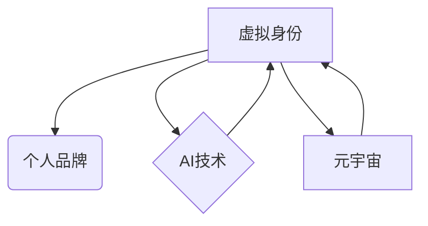

                 

## 虚拟身份市场动态：AI时代的个人品牌经济

> 关键词：虚拟身份、个人品牌、AI、元宇宙、去中心化、NFT、数据隐私、数字经济

### 1. 背景介绍

互联网的蓬勃发展催生了社交媒体、电商平台等数字化生态系统，人们开始在虚拟空间构建自己的身份和形象。随着人工智能（AI）技术的飞速发展，虚拟身份的概念正在经历一场深刻的变革。

传统的虚拟身份通常由平台提供，用户只能在特定平台内使用，且身份信息受平台控制。而AI时代，虚拟身份将更加个性化、可定制化和可交易化。

元宇宙的兴起为虚拟身份提供了更广阔的舞台。元宇宙是一个沉浸式、互联的虚拟世界，用户可以在其中创建虚拟角色、拥有虚拟财产，并与他人进行互动。

在元宇宙中，虚拟身份将不再局限于单一平台，而是可以跨平台流动，并拥有更高的可信度和价值。

### 2. 核心概念与联系

**2.1 虚拟身份**

虚拟身份是指在虚拟空间中用户所拥有的数字化身份，包括用户头像、昵称、个人资料、虚拟财产等。

**2.2 个人品牌**

个人品牌是指个人在特定领域或群体中的声誉和形象，是个人通过自身价值和行为塑造出来的独特标识。

**2.3 AI与虚拟身份**

AI技术可以赋予虚拟身份更丰富的交互能力和个性化定制。例如：

* **个性化头像生成:** AI可以根据用户的喜好和特征生成独一无二的虚拟头像。
* **智能对话系统:** AI可以为虚拟身份创建智能对话系统，使虚拟身份能够与用户进行更自然、更人性化的交流。
* **行为分析和个性化推荐:** AI可以分析用户的行为数据，并根据用户的兴趣和偏好提供个性化的内容和服务。

**2.4 元宇宙与虚拟身份**

元宇宙为虚拟身份提供了更广阔的舞台和应用场景。

* **沉浸式体验:** 元宇宙的沉浸式体验可以使虚拟身份更加真实和生动。
* **虚拟经济:** 元宇宙中的虚拟经济为虚拟身份提供了新的价值创造和获取途径。
* **社交互动:** 元宇宙中的社交互动可以使虚拟身份更加丰富和多元。

**2.5 核心概念关系图**



### 3. 核心算法原理 & 具体操作步骤

**3.1 算法原理概述**

虚拟身份市场动态的构建需要多种算法协同工作，包括：

* **身份认证算法:** 用于验证用户身份，确保虚拟身份的唯一性和安全性。
* **个性化推荐算法:** 用于根据用户的兴趣和行为数据推荐相关的虚拟身份和服务。
* **虚拟资产交易算法:** 用于实现虚拟身份和虚拟资产的交易和转让。
* **社区治理算法:** 用于维护虚拟身份市场的秩序和公平性。

**3.2 算法步骤详解**

1. **用户注册:** 用户通过身份认证系统注册虚拟身份，并设置个人资料和虚拟头像。
2. **个性化推荐:** 系统根据用户的兴趣和行为数据，推荐相关的虚拟身份和服务。
3. **虚拟身份定制:** 用户可以根据自己的喜好定制虚拟身份的外观、属性和技能。
4. **虚拟资产交易:** 用户可以购买、出售或交易虚拟身份和虚拟资产。
5. **社区互动:** 用户可以与其他用户进行互动，分享经验和建立关系。
6. **身份升级:** 用户可以通过完成任务、参与活动或积累虚拟资产来升级虚拟身份，获得更高的权限和价值。

**3.3 算法优缺点**

* **优点:**

    * 提高用户体验: 个性化推荐和虚拟身份定制可以提升用户的参与度和粘性。
    * 创造新的价值: 虚拟身份和虚拟资产的交易可以创造新的经济价值。
    * 促进社区建设: 社区互动和身份升级机制可以促进虚拟身份市场的活跃度和社区建设。

* **缺点:**

    * 安全风险: 虚拟身份的安全性需要得到保障，防止身份盗窃和数据泄露。
    * 价值波动: 虚拟身份和虚拟资产的价值可能会波动，存在投资风险。
    * 监管挑战: 虚拟身份市场的监管需要进一步完善，防止虚假交易和非法活动。

**3.4 算法应用领域**

* **游戏:** 虚拟身份可以为游戏玩家提供更丰富的游戏体验，并创造新的游戏经济。
* **社交:** 虚拟身份可以为社交平台用户提供更个性化的社交体验，并促进用户之间的互动。
* **教育:** 虚拟身份可以为教育平台用户提供更沉浸式的学习体验，并促进学生之间的合作学习。
* **医疗:** 虚拟身份可以为医疗平台用户提供更便捷的医疗服务，并促进患者之间的信息交流。

### 4. 数学模型和公式 & 详细讲解 & 举例说明

**4.1 数学模型构建**

虚拟身份市场的动态可以抽象为一个复杂网络模型，其中节点代表虚拟身份，边代表虚拟身份之间的关系。

* **节点属性:** 每个节点可以拥有多个属性，例如用户等级、虚拟资产持有量、社交关系等。
* **边权重:** 边的权重可以代表虚拟身份之间的关系强度，例如好友关系、交易关系等。

**4.2 公式推导过程**

* **PageRank算法:** 可以用于计算虚拟身份的社会影响力，即虚拟身份在网络中的重要性。

$$PR(i) = (1-d) + d \sum_{j \in M(i)} \frac{PR(j)}{C(j)}$$

其中：

* $PR(i)$ 是虚拟身份 $i$ 的 PageRank 值。
* $d$ 是阻尼因子，通常取值为 0.85。
* $M(i)$ 是指向虚拟身份 $i$ 的所有链接的集合。
* $C(j)$ 是虚拟身份 $j$ 的出度。

* **Katz centrality算法:** 可以用于计算虚拟身份之间的关系强度，即虚拟身份之间的连接程度。

$$K(i,j) = \alpha \sum_{k \in N(i)} \frac{K(k,j)}{C(k)} + \beta$$

其中：

* $K(i,j)$ 是虚拟身份 $i$ 和 $j$ 之间的 Katz centrality 值。
* $\alpha$ 是衰减因子，通常取值为 0.5。
* $N(i)$ 是虚拟身份 $i$ 的邻居节点的集合。
* $C(k)$ 是节点 $k$ 的出度。

**4.3 案例分析与讲解**

在元宇宙游戏中，玩家可以通过完成任务、参与活动等方式获得虚拟资产和升级虚拟身份。

* **PageRank算法:** 可以用于计算玩家在游戏中的影响力，例如玩家的等级、拥有的虚拟资产数量、参与的活动次数等。
* **Katz centrality算法:** 可以用于计算玩家之间的关系强度，例如玩家之间的好友关系、交易关系、公会关系等。

通过分析玩家的 PageRank 值和 Katz centrality 值，游戏开发者可以更好地了解玩家的行为模式，并提供更个性化的游戏体验。

### 5. 项目实践：代码实例和详细解释说明

**5.1 开发环境搭建**

* **编程语言:** Python
* **框架:** Flask 或 Django
* **数据库:** MongoDB 或 PostgreSQL
* **区块链平台:** Ethereum 或 Polygon

**5.2 源代码详细实现**

```python
# Flask示例代码

from flask import Flask, request, jsonify

app = Flask(__name__)

# 用户数据存储
users = {}

@app.route('/register', methods=['POST'])
def register():
    data = request.get_json()
    username = data['username']
    password = data['password']
    # ... 用户注册逻辑 ...
    users[username] = {'password': password, 'level': 1, 'assets': []}
    return jsonify({'message': '注册成功'})

@app.route('/login', methods=['POST'])
def login():
    data = request.get_json()
    username = data['username']
    password = data['password']
    # ... 用户登录逻辑 ...
    if username in users and users[username]['password'] == password:
        return jsonify({'message': '登录成功'})
    else:
        return jsonify({'message': '用户名或密码错误'})

if __name__ == '__main__':
    app.run(debug=True)
```

**5.3 代码解读与分析**

* 该代码示例展示了虚拟身份市场的基本功能，包括用户注册和登录。
* 用户数据存储在内存中，实际应用中需要使用数据库进行持久化存储。
* 用户等级和虚拟资产等属性可以根据业务需求进行扩展。

**5.4 运行结果展示**

* 运行该代码后，可以访问 http://127.0.0.1:5000/ 注册和登录虚拟身份。

### 6. 实际应用场景

**6.1 游戏**

* **虚拟角色定制:** 玩家可以自定义虚拟角色的外观、属性和技能，打造独一无二的游戏体验。
* **游戏经济:** 虚拟身份可以拥有虚拟资产，例如游戏道具、虚拟货币等，并进行交易和转让。
* **社交互动:** 玩家可以通过虚拟身份与其他玩家进行互动，组建公会、参与活动等。

**6.2 社交媒体**

* **个性化头像和昵称:** 用户可以自定义虚拟头像和昵称，打造更个性化的社交形象。
* **兴趣标签和社交圈:** 用户可以设置兴趣标签，并加入与自己兴趣相符的社交圈。
* **虚拟礼物和赞赏:** 用户可以赠送虚拟礼物和赞赏，表达对其他用户的认可和支持。

**6.3 教育**

* **虚拟课堂和学习角色:** 学生可以创建虚拟角色，参与虚拟课堂，并与老师和同学进行互动。
* **个性化学习路径:** 系统可以根据学生的学习进度和兴趣，推荐个性化的学习内容和资源。
* **虚拟实验室和模拟实验:** 学生可以利用虚拟实验室进行实验操作，并模拟真实场景。

**6.4 未来应用展望**

* **元宇宙:** 虚拟身份将成为元宇宙中不可或缺的一部分，为用户提供更沉浸式、更个性化的体验。
* **数字身份:** 虚拟身份可以作为数字身份的载体，用于身份认证、数据管理和隐私保护。
* **Web3:** 虚拟身份可以与区块链技术结合，实现去中心化、可信的虚拟身份管理。

### 7. 工具和资源推荐

**7.1 学习资源推荐**

* **书籍:**

    * 《虚拟身份：数字时代的人类关系》
    * 《元宇宙：未来世界的构建》

* **在线课程:**

    * Coursera: 人工智能与虚拟现实
    * edX: 元宇宙与数字经济

**7.2 开发工具推荐**

* **编程语言:** Python, JavaScript
* **框架:** Flask, Django, React
* **数据库:** MongoDB, PostgreSQL
* **区块链平台:** Ethereum, Polygon

**7.3 相关论文推荐**

* **《虚拟身份的社会影响》**
* **《元宇宙的经济模型》**
* **《去中心化身份管理》**

### 8. 总结：未来发展趋势与挑战

**8.1 研究成果总结**

虚拟身份市场动态的研究取得了显著进展，为构建更丰富、更个性化的虚拟世界提供了技术支持。

* **AI技术:** AI技术赋予虚拟身份更丰富的交互能力和个性化定制。
* **元宇宙:** 元宇宙为虚拟身份提供了更广阔的舞台和应用场景。
* **去中心化:** 去中心化技术可以保障虚拟身份的安全性、可信性和隐私性。

**8.2 未来发展趋势**

* **更沉浸式的体验:** 虚拟身份将更加逼真、更加个性化，并与现实世界更加紧密地融合。
* **更丰富的应用场景:** 虚拟身份将应用于更多领域，例如教育、医疗、金融等。
* **更完善的生态系统:** 虚拟身份市场的生态系统将更加完善，包括更丰富的虚拟资产、更便捷的交易平台、更完善的监管机制等。

**8.3 面临的挑战**

* **安全风险:** 虚拟身份的安全性需要得到保障，防止身份盗窃和数据泄露。
* **价值波动:** 虚拟身份和虚拟资产的价值可能会波动，存在投资风险。
* **监管挑战:** 虚拟身份市场的监管需要进一步完善，防止虚假交易和非法活动。

**8.4 研究展望**

未来研究将重点关注以下几个方面：

* **虚拟身份的隐私保护:** 如何保障虚拟身份用户的隐私安全，防止数据泄露和滥用。
* **虚拟身份的价值评估:** 如何客观地评估虚拟身份的价值，并建立合理的交易机制。
* **虚拟身份的社会影响:** 如何引导虚拟身份的健康发展，避免其对社会造成负面影响。

### 9. 附录：常见问题与解答

**9.1 如何创建虚拟身份？**

用户可以通过注册平台，设置虚拟头像、昵称、个人资料等信息来创建虚拟身份。

**9.2 如何保护虚拟身份的安全性？**

用户需要设置强密码，并开启双重身份验证等安全措施来保护虚拟身份的安全性。

**9.3 如何交易虚拟资产？**

用户可以通过虚拟身份市场平台进行虚拟资产的交易和转让。

**9.4 虚拟身份的价值如何评估？**

虚拟身份的价值取决于其属性、稀缺性、市场需求等因素。

**9.5 虚拟身份市场存在哪些风险？**

虚拟身份市场存在安全风险、价值波动风险和监管风险等。

**作者：禅与计算机程序设计艺术 / Zen and the Art of Computer Programming**


<end_of_turn>

