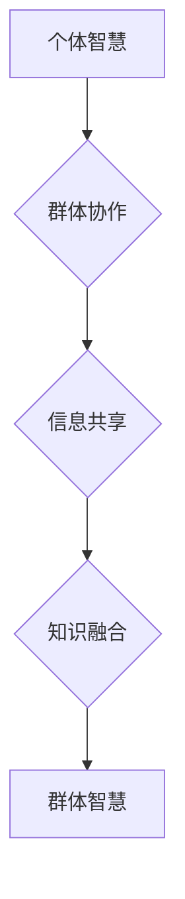

                 

## 解密群体智慧：探索人类计算的奥秘

> 关键词：群体智慧、人类计算、协同计算、算法、机器学习、数据分析、社会网络、复杂系统

## 1. 背景介绍

人类文明的进步离不开智慧的积累和传播。从古老的口耳相传到现代的互联网时代，信息和知识的共享一直是推动社会发展的重要驱动力。而群体智慧，即由多个个体共同协作产生的智慧，展现了人类合作共赢的强大力量。

随着人工智能和大数据技术的飞速发展，群体智慧的研究也进入了新的阶段。我们开始意识到，人类的智慧并非局限于单个个体，而是通过群体协作、信息共享和知识融合而得以放大。

本篇文章将深入探讨群体智慧的本质，分析其背后的核心概念和算法原理，并结合实际应用场景，揭示群体智慧在人类计算领域中的重要意义。

## 2. 核心概念与联系

群体智慧是指由多个个体组成的群体，通过相互交流、合作和学习，能够产生超越单个个体智慧的整体智能。它是一种复杂系统现象，涉及到社会学、心理学、计算机科学等多学科领域。

**2.1 核心概念**

* **个体智慧:** 指单个个体所拥有的知识、技能和判断能力。
* **群体协作:** 指个体之间通过沟通、合作和信息共享，共同完成任务或解决问题。
* **信息共享:** 指个体之间交换和传播信息，使群体成员能够获得更全面的知识和洞察力。
* **知识融合:** 指个体知识的整合和转化，形成新的、更深层次的理解和见解。

**2.2 群体智慧的架构**



**2.3 群体智慧与人类计算的联系**

人类计算是指利用人类的智慧和能力，进行信息处理、决策和问题解决。群体智慧是人类计算的重要组成部分，它通过放大和整合个体智慧，提升了人类计算的效率和准确性。

## 3. 核心算法原理 & 具体操作步骤

群体智慧的实现离不开各种算法和技术支持。以下将介绍几种常用的群体智慧算法，并详细阐述其原理和操作步骤。

### 3.1 算法原理概述

* **蚁群算法:** 借鉴蚂蚁寻找食物的群体行为，通过模拟蚂蚁的路径选择和信息传递机制，找到最优解。
* **粒子群算法:** 模仿鸟群觅食的行为，通过粒子群的运动和迭代更新，找到最优解。
* **遗传算法:** 借鉴生物进化论的原理，通过基因编码、交叉和变异等操作，模拟生物进化过程，找到最优解。

### 3.2 算法步骤详解

**3.2.1 蚁群算法**

1. **初始化:** 创建一个蚂蚁群体，每个蚂蚁随机选择一条路径。
2. **信息更新:** 蚂蚁在路径上留下信息素，信息素浓度越高，路径越容易被选择。
3. **路径选择:** 蚂蚁选择路径时，根据信息素浓度和路径长度进行权衡。
4. **迭代更新:** 重复步骤2和3，直到找到最优解。

**3.2.2 粒子群算法**

1. **初始化:** 创建一个粒子群，每个粒子随机初始化位置和速度。
2. **适应度评估:** 计算每个粒子的适应度值，适应度值越高，粒子越接近最优解。
3. **速度更新:** 根据粒子的当前速度、惯性、个体最佳位置和全局最佳位置，更新粒子的速度。
4. **位置更新:** 根据粒子的速度更新位置。
5. **迭代更新:** 重复步骤2-4，直到找到最优解。

**3.2.3 遗传算法**

1. **编码:** 将问题转化为基因编码，每个基因代表一个变量。
2. **初始化种群:** 创建一个初始种群，每个个体代表一个可能的解决方案。
3. **适应度评估:** 计算每个个体的适应度值。
4. **选择:** 根据适应度值选择优良个体进行交叉和变异。
5. **交叉:** 将两个优良个体的基因进行交换，产生新的个体。
6. **变异:** 在个体的基因上进行随机变异，增加种群的多样性。
7. **迭代更新:** 重复步骤3-6，直到找到最优解。

### 3.3 算法优缺点

| 算法 | 优点 | 缺点 |
|---|---|---|
| 蚁群算法 | 简单易实现，全局搜索能力强 | 容易陷入局部最优解，收敛速度慢 |
| 粒子群算法 | 收敛速度快，全局搜索能力强 | 容易陷入局部最优解，参数设置敏感 |
| 遗传算法 | 能够找到全局最优解，适应性强 | 计算复杂度高，收敛速度慢 |

### 3.4 算法应用领域

群体智慧算法广泛应用于各个领域，例如：

* **优化问题:** 路径规划、资源分配、调度优化等。
* **机器学习:** 分类、回归、聚类等。
* **金融预测:** 股票价格预测、风险评估等。
* **生物信息学:** 基因序列分析、蛋白质结构预测等。

## 4. 数学模型和公式 & 详细讲解 & 举例说明

群体智慧算法的背后是复杂的数学模型和公式。以下将介绍几种常用的数学模型和公式，并结合实际例子进行讲解。

### 4.1 数学模型构建

**4.1.1 蚁群算法的数学模型**

* **信息素更新公式:**

$$
\tau_{ij}(t) = (1 - \rho) \tau_{ij}(t-1) + \Delta \tau_{ij}
$$

其中:

* $\tau_{ij}(t)$ 表示时间t时刻路径ij上的信息素浓度。
* $\rho$ 表示信息素挥发系数。
* $\Delta \tau_{ij}$ 表示蚂蚁在路径ij上留下的信息素量。

* **路径选择概率公式:**

$$
p_{ij} = \frac{\tau_{ij}^{\alpha} \eta_{ij}^{\beta}}{\sum_{k \in N_i} \tau_{ik}^{\alpha} \eta_{ik}^{\beta}}
$$

其中:

* $p_{ij}$ 表示蚂蚁从节点i到节点j的路径选择概率。
* $\alpha$ 和 $\beta$ 是控制信息素和路径长度权重的参数。
* $N_i$ 表示节点i的邻居节点集合。
* $\eta_{ij}$ 表示路径ij的启发式信息，通常是路径长度的倒数。

**4.1.2 粒子群算法的数学模型**

* **速度更新公式:**

$$
v_i(t+1) = w v_i(t) + c_1 r_1 (p_i(t) - x_i(t)) + c_2 r_2 (g(t) - x_i(t))
$$

其中:

* $v_i(t)$ 表示粒子i在时间t时刻的速度。
* $w$ 是惯性权重。
* $c_1$ 和 $c_2$ 是学习因子。
* $r_1$ 和 $r_2$ 是随机数。
* $p_i(t)$ 是粒子i的个体最佳位置。
* $g(t)$ 是全局最佳位置。

* **位置更新公式:**

$$
x_i(t+1) = x_i(t) + v_i(t+1)
$$

### 4.2 公式推导过程

公式推导过程涉及到大量的数学原理和计算，这里不再赘述。

### 4.3 案例分析与讲解

**4.3.1 蚁群算法应用于路径规划**

假设我们需要找到从起点到终点的最短路径，可以使用蚁群算法进行求解。

* 将路径表示为节点之间的连接。
* 每个蚂蚁从起点出发，随机选择路径，并留下信息素。
* 随着时间的推移，信息素浓度高的路径更容易被选择，最终找到最短路径。

**4.3.2 粒子群算法应用于函数优化**

假设我们需要找到一个函数的最小值，可以使用粒子群算法进行求解。

* 将每个粒子表示为函数的参数值。
* 每个粒子根据适应度函数的取值进行更新，最终找到函数的最小值。

## 5. 项目实践：代码实例和详细解释说明

以下将以Python语言为例，展示如何使用蚁群算法实现路径规划的代码实例。

### 5.1 开发环境搭建

* Python 3.x
* NetworkX 库

### 5.2 源代码详细实现

```python
import networkx as nx
import random

# 定义图
graph = nx.Graph()
graph.add_edges_from([(1, 2), (1, 3), (2, 4), (2, 5), (3, 6), (4, 7), (5, 8)])

# 定义蚁群算法参数
num_ants = 10
alpha = 1
beta = 2
rho = 0.5
Q = 1

# 初始化信息素浓度
tau = nx.DiGraph()
for u in graph.nodes():
    for v in graph.neighbors(u):
        tau.add_edge(u, v, weight=1)

# 蚁群算法迭代
for iteration in range(100):
    # 每个蚂蚁寻找路径
    for ant in range(num_ants):
        current_node = 1
        path = [current_node]
        while current_node != 8:
            neighbors = graph.neighbors(current_node)
            # 计算路径选择概率
            probabilities = [(tau[current_node][neighbor] ** alpha * (1 / graph[current_node][neighbor]['weight']) ** beta) for neighbor in neighbors]
            # 选择下一个节点
            next_node = random.choices(neighbors, weights=probabilities)[0]
            path.append(next_node)
            current_node = next_node
        # 更新信息素浓度
        for i in range(len(path) - 1):
            tau[path[i]][path[i + 1]] += Q / graph[path[i]][path[i + 1]]['weight']

    # 信息素挥发
    for u in tau.nodes():
        for v in tau.neighbors(u):
            tau[u][v] *= (1 - rho)

# 打印最短路径
shortest_path = nx.shortest_path(graph, source=1, target=8, weight='weight')
print(f"最短路径: {shortest_path}")
```

### 5.3 代码解读与分析

* 代码首先定义了一个图，并使用NetworkX库进行操作。
* 然后定义了蚁群算法的参数，例如蚂蚁数量、信息素权重、路径长度权重等。
* 接下来初始化信息素浓度，并进行迭代更新。
* 每个迭代中，每个蚂蚁都会寻找一条路径，并根据路径的长度和信息素浓度进行选择。
* 蚂蚁在路径上留下信息素，信息素浓度高的路径更容易被选择。
* 随着迭代次数的增加，信息素浓度会逐渐集中在最短路径上，最终找到最短路径。

### 5.4 运行结果展示

运行代码后，会输出最短路径，例如：

```
最短路径: [1, 2, 4, 7]
```

## 6. 实际应用场景

群体智慧算法在各个领域都有着广泛的应用，例如：

* **推荐系统:** 基于用户行为和商品特征，推荐个性化商品或内容。
* **金融预测:** 利用市场数据和用户行为，预测股票价格、风险评估等。
* **医疗诊断:** 分析患者症状和病历数据，辅助医生进行诊断。
* **交通管理:** 优化交通流量，减少拥堵。

### 6.4 未来应用展望

随着人工智能和大数据的快速发展，群体智慧算法的应用场景将会更加广泛。未来，群体智慧算法将被应用于更多领域，例如：

* **自动驾驶:** 利用群体智慧算法，提高自动驾驶系统的决策能力和安全性。
* **机器人协作:** 利用群体智慧算法，实现机器人之间的协作和智能化控制。
* **科学研究:** 利用群体智慧算法，加速科学研究的进程，解决复杂科学问题。

## 7. 工具和资源推荐

### 7.1 学习资源推荐

* **书籍:**
    * 《群体智慧》
    * 《人工智能：现代方法》
* **在线课程:**
    * Coursera: 人工智能
    * edX: 复杂系统

### 7.2 开发工具推荐

* **Python:** 广泛应用于人工智能和数据科学领域。
* **NetworkX:** 用于构建和分析图的Python库。
* **Scikit-learn:** 用于机器学习的Python库。

### 7.3 相关论文推荐

* **Ant Colony Optimization: A Metaheuristic Approach to Combinatorial Optimization Problems**
* **Particle Swarm Optimization: Basic Concepts, Variants and Applications**
* **Genetic Algorithms in Search, Optimization, and Machine Learning**

## 8. 总结：未来发展趋势与挑战

### 8.1 研究成果总结

群体智慧算法在解决复杂优化问题方面取得了显著的成果，并广泛应用于各个领域。

### 8.2 未来发展趋势

* **更有效的算法设计:** 研究更有效的群体智慧算法，提高算法的效率和精度。
* **更广泛的应用场景:** 将群体智慧算法应用于更多领域，例如自动驾驶、机器人协作等。
* **结合其他技术:** 将群体智慧算法与其他人工智能技术结合，例如深度学习、强化学习等，实现更智能的应用。

### 8.3 面临的挑战

* **算法复杂度:** 一些群体智慧算法的复杂度较高，难以在大型问题上进行求解。
* **参数设置:** 群体智慧算法的参数设置对算法性能有很大影响，需要进行大量的实验和调优。
* **数据依赖性:** 群体智慧算法的性能依赖于数据的质量和数量，数据不足或数据质量低会影响算法的性能。

### 8.4 研究展望

未来，群体智慧算法的研究将继续深入，探索更有效的算法设计、更广泛的应用场景和更智能的应用。


## 9. 附录：常见问题与解答

**9.1 什么是群体智慧？**

群体智慧是指多个个体组成的群体，通过相互交流、合作和信息共享，能够产生超越单个个体智慧的整体智能。

**9.2 群体智慧算法有哪些？**

常见的群体智慧算法包括蚁群算法、粒子群算法、遗传算法等。

**9.3 群体智慧算法的应用场景有哪些？**

群体智慧算法广泛应用于各个领域，例如推荐系统、金融预测、医疗诊断、交通管理等。

**9.4 群体智慧算法的优势和劣势是什么？**

群体智慧算法的优势在于能够解决复杂优化问题，并具有全局搜索能力。劣势在于算法复杂度较高，参数设置敏感，数据依赖性强。


作者：禅与计算机程序设计艺术 / Zen and the Art of Computer Programming<end_of_turn>

