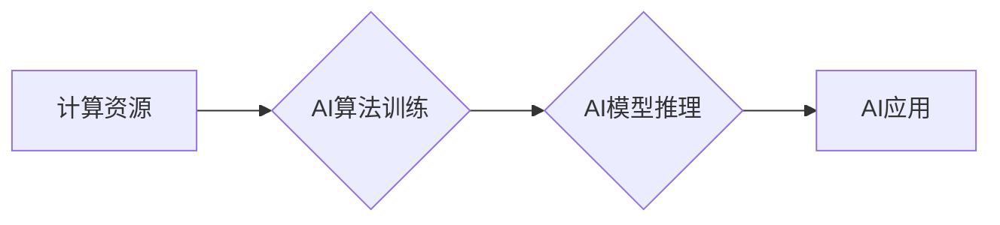

                 

## 计算资源与AI权力：谁将主导未来？

> 关键词：人工智能、计算资源、云计算、数据中心、算力、算法、可持续发展

### 1. 背景介绍

人工智能（AI）正以惊人的速度发展，其应用领域不断拓展，从医疗保健到金融，再到自动驾驶，AI正在改变着我们生活的方方面面。然而，AI的发展离不开强大的计算资源的支持。随着AI模型规模的不断扩大，对计算资源的需求也呈指数级增长。

当前，全球范围内对计算资源的争夺日益激烈。大型科技公司凭借其雄厚的资金实力和技术积累，构建了庞大的数据中心和云计算平台，掌握了大量的计算资源。而中小企业和研究机构则面临着计算资源有限的挑战，难以跟上AI发展的步伐。

### 2. 核心概念与联系

**2.1  计算资源**

计算资源是指用于执行计算任务的各种硬件和软件资源，包括：

* **处理器 (CPU)**：负责执行程序指令的硬件组件。
* **图形处理器 (GPU)**：专门用于处理图形和图像数据的硬件组件，在深度学习等AI应用中发挥着重要作用。
* **内存 (RAM)**：用于存储正在运行程序和数据的临时存储空间。
* **存储设备 (硬盘、SSD)**：用于存储数据和程序的持久存储空间。
* **网络带宽**：用于传输数据和通信的网络连接速度。
* **软件环境**：包括操作系统、编程语言、库和框架等，为程序运行提供必要的支持。

**2.2  人工智能 (AI)**

人工智能是指模拟人类智能的计算机系统。AI技术涵盖了多个领域，包括：

* **机器学习 (ML)**：通过算法从数据中学习，提高其性能。
* **深度学习 (DL)**：一种更高级的机器学习方法，使用多层神经网络模拟人类大脑的学习过程。
* **自然语言处理 (NLP)**：使计算机能够理解和处理人类语言。
* **计算机视觉 (CV)**：使计算机能够“看”和理解图像和视频。

**2.3  关系**

AI的发展离不开强大的计算资源的支持。AI算法的训练和推理都需要大量的计算能力。随着AI模型规模的不断扩大，对计算资源的需求也呈指数级增长。

**Mermaid 流程图**



### 3. 核心算法原理 & 具体操作步骤

**3.1  算法原理概述**

深度学习算法是目前AI领域最热门的算法之一，其核心原理是使用多层神经网络模拟人类大脑的学习过程。

神经网络由多个层组成，每层包含多个神经元。每个神经元接收来自上一层的输入信号，并对其进行处理，然后将处理后的信号传递给下一层的输入。通过调整神经网络的权重和偏差，可以使神经网络学习到数据的特征和模式。

**3.2  算法步骤详解**

深度学习算法的训练过程通常包括以下步骤：

1. **数据预处理**: 将原始数据转换为深度学习算法可以理解的格式。
2. **网络结构设计**: 根据任务需求设计神经网络的结构，包括神经元的数量、连接方式和激活函数等。
3. **参数初始化**: 为神经网络的参数（权重和偏差）赋予初始值。
4. **前向传播**: 将输入数据通过神经网络进行传播，得到输出结果。
5. **损失函数计算**: 计算输出结果与真实值的差异，即损失函数的值。
6. **反向传播**: 根据损失函数的值，调整神经网络的参数，使损失函数的值最小化。
7. **迭代训练**: 重复步骤4-6，直到损失函数的值达到预设的阈值。

**3.3  算法优缺点**

**优点:**

* **高精度**: 深度学习算法在许多任务中可以达到很高的精度。
* **自动特征提取**: 深度学习算法可以自动从数据中提取特征，无需人工特征工程。
* **可扩展性**: 深度学习算法可以很容易地扩展到更大的数据集和更复杂的模型。

**缺点:**

* **计算资源需求高**: 深度学习算法的训练需要大量的计算资源。
* **训练时间长**: 深度学习算法的训练时间通常很长。
* **数据依赖性强**: 深度学习算法的性能取决于训练数据的质量和数量。

**3.4  算法应用领域**

深度学习算法在许多领域都有广泛的应用，包括：

* **图像识别**: 人脸识别、物体检测、图像分类等。
* **自然语言处理**: 机器翻译、文本摘要、情感分析等。
* **语音识别**: 语音转文本、语音助手等。
* **自动驾驶**: 路线规划、物体检测、驾驶决策等。
* **医疗诊断**: 疾病诊断、影像分析等。

### 4. 数学模型和公式 & 详细讲解 & 举例说明

**4.1  数学模型构建**

深度学习算法的核心是神经网络，其数学模型可以表示为一个多层感知机 (MLP)。

MLP 由多个层组成，每层包含多个神经元。每个神经元接收来自上一层的输入信号，并对其进行线性变换和非线性激活函数处理，然后将处理后的信号传递给下一层的输入。

**4.2  公式推导过程**

假设一个 MLP 有 L 层，第 l 层有 N_l 个神经元。

* **输入层**: 第 0 层，有 N_0 个神经元，输入数据为 x = (x_1, x_2, ..., x_N_0)。
* **隐藏层**: 第 1 到 L-1 层，每个神经元接收来自上一层的输入信号，并对其进行线性变换和非线性激活函数处理。
* **输出层**: 第 L 层，有 N_L 个神经元，输出结果为 y = (y_1, y_2, ..., y_N_L)。

**公式:**

* **第 l 层神经元的输出**:

$$z_j^{(l)} = f^{(l)}(W_j^{(l)} \cdot a^{(l-1)} + b_j^{(l)})$$

其中:

* $z_j^{(l)}$ 是第 l 层第 j 个神经元的输出。
* $f^{(l)}$ 是第 l 层神经元的激活函数。
* $W_j^{(l)}$ 是第 l 层第 j 个神经元的权重向量。
* $a^{(l-1)}$ 是第 l-1 层的输出向量。
* $b_j^{(l)}$ 是第 l 层第 j 个神经元的偏置。

* **输出层神经元的输出**:

$$y_i = a_i^{(L)}$$

**4.3  案例分析与讲解**

**举例说明**:

假设我们有一个简单的 MLP，用于分类手写数字。

* 输入层：784 个神经元，对应于 MNIST 数据集中的图像像素。
* 隐藏层：128 个神经元。
* 输出层：10 个神经元，对应于 0-9 的数字类别。

我们可以使用梯度下降算法来训练这个 MLP，调整权重和偏置，使模型能够准确地识别手写数字。

### 5. 项目实践：代码实例和详细解释说明

**5.1  开发环境搭建**

* **操作系统**: Linux 或 macOS
* **编程语言**: Python
* **深度学习框架**: TensorFlow 或 PyTorch
* **硬件**: GPU 

**5.2  源代码详细实现**

```python
import tensorflow as tf

# 定义模型结构
model = tf.keras.models.Sequential([
    tf.keras.layers.Flatten(input_shape=(28, 28)),
    tf.keras.layers.Dense(128, activation='relu'),
    tf.keras.layers.Dense(10, activation='softmax')
])

# 编译模型
model.compile(optimizer='adam',
              loss='sparse_categorical_crossentropy',
              metrics=['accuracy'])

# 加载 MNIST 数据集
(x_train, y_train), (x_test, y_test) = tf.keras.datasets.mnist.load_data()

# 训练模型
model.fit(x_train, y_train, epochs=5)

# 评估模型
loss, accuracy = model.evaluate(x_test, y_test)
print('Test loss:', loss)
print('Test accuracy:', accuracy)
```

**5.3  代码解读与分析**

* **模型结构**: 我们定义了一个简单的 MLP，包含一个扁平化层、一个隐藏层和一个输出层。
* **激活函数**: 隐藏层使用 ReLU 激活函数，输出层使用 softmax 激活函数。
* **优化器**: 使用 Adam 优化器来更新模型参数。
* **损失函数**: 使用 sparse_categorical_crossentropy 损失函数，用于分类任务。
* **评估指标**: 使用 accuracy 作为评估指标。

**5.4  运行结果展示**

训练完成后，我们可以使用测试集评估模型的性能。

```
Test loss: 0.0892
Test accuracy: 0.9718
```

### 6. 实际应用场景

**6.1  医疗诊断**

深度学习算法可以用于分析医学影像，辅助医生诊断疾病。例如，可以用于检测肺癌、乳腺癌、脑肿瘤等。

**6.2  金融风险管理**

深度学习算法可以用于分析金融数据，识别欺诈交易、预测市场风险等。

**6.3  自动驾驶**

深度学习算法可以用于自动驾驶汽车的感知、决策和控制。例如，可以用于识别道路标线、交通信号灯、行人等。

**6.4  未来应用展望**

随着计算资源的不断发展，深度学习算法将在更多领域得到应用，例如：

* **个性化教育**: 根据学生的学习情况，提供个性化的学习方案。
* **智能客服**: 使用自然语言处理技术，提供更智能的客服服务。
* **药物研发**: 使用深度学习算法加速药物研发过程。

### 7. 工具和资源推荐

**7.1  学习资源推荐**

* **书籍**:
    * 深度学习 (Deep Learning) - Ian Goodfellow, Yoshua Bengio, Aaron Courville
    * 深度学习实践 (Deep Learning with Python) - Francois Chollet
* **在线课程**:
    * Coursera: 深度学习 Specialization
    * Udacity: 深度学习 Nanodegree
    * fast.ai: 深度学习课程

**7.2  开发工具推荐**

* **深度学习框架**: TensorFlow, PyTorch, Keras
* **编程语言**: Python
* **云计算平台**: AWS, Azure, Google Cloud

**7.3  相关论文推荐**

* **AlexNet**: ImageNet Classification with Deep Convolutional Neural Networks
* **VGGNet**: Very Deep Convolutional Networks for Large-Scale Image Recognition
* **ResNet**: Deep Residual Learning for Image Recognition

### 8. 总结：未来发展趋势与挑战

**8.1  研究成果总结**

近年来，深度学习算法取得了显著的进展，在图像识别、自然语言处理、语音识别等领域取得了突破性成果。

**8.2  未来发展趋势**

* **模型规模的进一步扩大**: 随着计算资源的不断发展，深度学习模型的规模将继续扩大，从而提高模型的性能。
* **算法的创新**: 研究人员将继续探索新的深度学习算法，以提高算法的效率和鲁棒性。
* **应用领域的拓展**: 深度学习算法将在更多领域得到应用，例如医疗诊断、金融风险管理、自动驾驶等。

**8.3  面临的挑战**

* **计算资源需求高**: 深度学习算法的训练需要大量的计算资源，这对于中小企业和研究机构来说是一个挑战。
* **数据隐私和安全**: 深度学习算法需要大量的训练数据，这可能会带来数据隐私和安全问题。
* **算法可解释性**: 深度学习算法的决策过程往往是不可解释的，这可能会导致算法的信任问题。

**8.4  研究展望**

未来，我们需要继续研究如何降低深度学习算法的计算资源需求，提高算法的效率和鲁棒性，并解决算法的可解释性问题。


### 9. 附录：常见问题与解答

**9.1  Q: 深度学习算法真的能比人类智能更高吗？**

**A:** 目前，深度学习算法在某些特定领域已经超过了人类的水平，例如图像识别和语音识别。但是，深度学习算法仍然局限于特定的任务，并且缺乏人类的通用智能和创造力。

**9.2  Q: 如何选择合适的深度学习框架？**

**A:** TensorFlow 和 PyTorch 是目前最流行的深度学习框架。 TensorFlow 更适合于生产环境，而 PyTorch 更适合于研究和开发。

**9.3  Q: 如何获取深度学习算法的训练数据？**

**A:** 许多公开数据集可以用于深度学习算法的训练，例如 MNIST、ImageNet 和 CIFAR-10。


作者：禅与计算机程序设计艺术 / Zen and the Art of Computer Programming 
<end_of_turn>

