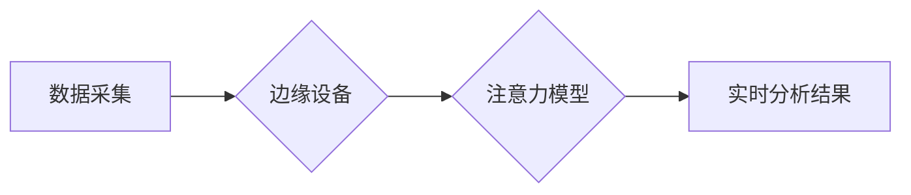

                 

## 关键词：边缘AI、注意力机制、实时分析、数据处理、低延迟、隐私保护

## 1. 背景介绍

在当今数据爆炸的时代，实时分析已经成为许多领域的关键技术。从金融交易的风险控制到智能交通的流量优化，从医疗诊断的辅助决策到工业生产的异常检测，实时分析的能力能够帮助我们更快地洞察数据，做出更明智的决策。然而，传统的云端实时分析架构存在着数据传输延迟、网络带宽压力和隐私安全风险等问题。

边缘计算的出现为实时分析提供了新的解决方案。边缘计算将数据处理和分析能力部署到靠近数据源的边缘节点，例如传感器、设备或小型服务器，从而能够实现低延迟、高效率和隐私保护的实时分析。

注意力机制作为一种强大的深度学习技术，能够学习数据中的重要特征，并对这些特征进行加权处理，从而提高模型的准确性和效率。将注意力机制与边缘计算相结合，可以进一步提升实时分析的性能和智能化水平。

## 2. 核心概念与联系

### 2.1 边缘AI

边缘AI是指将人工智能算法和模型部署到边缘设备上，进行本地数据处理和分析。与传统的云端AI相比，边缘AI具有以下优势：

* **低延迟:** 数据可以在边缘设备上实时处理，无需传输到云端，从而大幅降低延迟。
* **高效率:** 边缘设备可以独立运行，减轻云端服务器的负担，提高整体效率。
* **隐私保护:** 数据可以在边缘设备上本地处理，减少数据传输和存储的风险，增强隐私保护。

### 2.2 注意力机制

注意力机制是一种模仿人类注意力机制的深度学习技术，能够学习数据中的重要特征，并对这些特征进行加权处理。注意力机制可以分为以下几种类型：

* **自注意力机制:**  用于处理序列数据，例如文本和语音，能够学习序列中不同元素之间的关系。
* **交叉注意力机制:** 用于处理不同类型的数据，例如文本和图像，能够学习不同类型数据之间的关系。

### 2.3  架构

**Mermaid 流程图**



## 3. 核心算法原理 & 具体操作步骤

### 3.1 算法原理概述

边缘AI在注意力实时分析中的应用主要基于以下核心算法原理：

* **数据预处理:** 将原始数据转换为模型可处理的格式，例如特征提取、数据归一化等。
* **注意力模型训练:** 使用训练数据训练注意力模型，学习数据中的重要特征和关系。
* **实时数据处理:** 将实时数据输入到训练好的注意力模型中，进行实时分析和预测。

### 3.2 算法步骤详解

1. **数据采集:** 从传感器、设备或其他数据源采集实时数据。
2. **数据预处理:** 对采集到的数据进行预处理，例如特征提取、数据清洗、数据归一化等。
3. **数据传输:** 将预处理后的数据传输到边缘设备。
4. **注意力模型推理:** 将数据输入到训练好的注意力模型中，模型会根据注意力机制学习数据中的重要特征，并对这些特征进行加权处理，最终输出实时分析结果。
5. **结果展示:** 将实时分析结果展示给用户，例如通过图形界面、报警系统等方式。

### 3.3 算法优缺点

**优点:**

* **低延迟:** 数据可以在边缘设备上本地处理，无需传输到云端，从而大幅降低延迟。
* **高效率:** 边缘设备可以独立运行，减轻云端服务器的负担，提高整体效率。
* **隐私保护:** 数据可以在边缘设备上本地处理，减少数据传输和存储的风险，增强隐私保护。

**缺点:**

* **计算资源限制:** 边缘设备的计算资源有限，可能无法处理复杂的数据分析任务。
* **模型部署难度:** 将深度学习模型部署到边缘设备上可能存在技术挑战。
* **数据安全风险:** 边缘设备可能面临数据安全攻击的风险。

### 3.4 算法应用领域

* **智能制造:**  实时监控设备状态，预测设备故障，优化生产流程。
* **智能交通:**  实时分析交通流量，优化交通信号灯控制，减少拥堵。
* **智慧医疗:**  实时分析患者数据，辅助医生诊断疾病，提供个性化医疗服务。
* **安防监控:**  实时分析视频监控数据，识别异常行为，提高安防效率。

## 4. 数学模型和公式 & 详细讲解 & 举例说明

### 4.1 数学模型构建

注意力机制的核心是计算每个输入元素对输出的影响权重。常用的注意力机制模型包括：

* **Scaled Dot-Product Attention:**

$$
\text{Attention}(Q, K, V) = \text{softmax}\left(\frac{Q K^T}{\sqrt{d_k}}\right) V
$$

其中：

* $Q$：查询矩阵
* $K$：键矩阵
* $V$：值矩阵
* $d_k$：键向量的维度
* $\text{softmax}$：softmax函数

### 4.2 公式推导过程

Scaled Dot-Product Attention 的公式推导过程如下：

1. 计算查询矩阵 $Q$ 和键矩阵 $K$ 的点积，并除以 $\sqrt{d_k}$，以缩放结果。
2. 对点积结果应用 softmax 函数，得到每个键对查询的权重。
3. 将权重与值矩阵 $V$ 相乘，得到最终的注意力输出。

### 4.3 案例分析与讲解

假设我们有一个句子 "The cat sat on the mat"，我们想使用注意力机制来分析每个单词对句子的整体语义的影响。

* $Q$：查询矩阵表示每个单词对句子的整体语义的兴趣。
* $K$：键矩阵表示每个单词的语义特征。
* $V$：值矩阵表示每个单词的词向量。

通过计算 $Q$ 和 $K$ 的点积，并应用 softmax 函数，我们可以得到每个单词对句子的整体语义的权重。例如，"sat" 这个单词可能获得更高的权重，因为它在句子的中心位置，并且与句子的核心语义 "猫坐在垫子上" 密切相关。

## 5. 项目实践：代码实例和详细解释说明

### 5.1 开发环境搭建

* 操作系统：Ubuntu 20.04
* Python 版本：3.8
* 深度学习框架：TensorFlow 2.x
* 其他依赖库：NumPy、pandas、matplotlib

### 5.2 源代码详细实现

```python
import tensorflow as tf

# 定义注意力机制模型
class AttentionModel(tf.keras.Model):
    def __init__(self, units):
        super(AttentionModel, self).__init__()
        self.Wq = tf.keras.layers.Dense(units)
        self.Wk = tf.keras.layers.Dense(units)
        self.Wv = tf.keras.layers.Dense(units)
        self.dense = tf.keras.layers.Dense(units)

    def call(self, inputs):
        # 计算查询、键和值
        q = self.Wq(inputs)
        k = self.Wk(inputs)
        v = self.Wv(inputs)

        # 计算注意力权重
        attention_weights = tf.matmul(q, k, transpose_b=True) / tf.math.sqrt(tf.cast(units, tf.float32))
        attention_weights = tf.nn.softmax(attention_weights, axis=-1)

        # 计算注意力输出
        attention_output = tf.matmul(attention_weights, v)

        # 将注意力输出与输入进行拼接
        output = tf.concat([inputs, attention_output], axis=-1)

        # 通过全连接层进行最终输出
        output = self.dense(output)
        return output

# 实例化模型
model = AttentionModel(units=128)

# 训练模型
# ...

# 使用模型进行预测
# ...
```

### 5.3 代码解读与分析

* 该代码定义了一个简单的注意力机制模型，使用 TensorFlow 框架实现。
* 模型包含三个稠密层，分别用于计算查询、键和值。
* 注意力权重使用 softmax 函数计算，并与值矩阵相乘得到注意力输出。
* 注意力输出与输入进行拼接，并通过全连接层进行最终输出。

### 5.4 运行结果展示

* 训练完成后，模型可以用于对输入数据进行注意力分析，并输出注意力权重和最终预测结果。
* 运行结果可以展示在图形界面或文本输出中，例如使用 matplotlib 库绘制注意力权重分布图。

## 6. 实际应用场景

### 6.1 智能制造

在智能制造领域，边缘AI和注意力机制可以用于实时监控设备状态，预测设备故障，优化生产流程。例如，可以将传感器数据传输到边缘设备，使用注意力机制分析设备运行数据，识别异常模式，并及时发出预警，避免设备故障。

### 6.2 智能交通

在智能交通领域，边缘AI和注意力机制可以用于实时分析交通流量，优化交通信号灯控制，减少拥堵。例如，可以将摄像头和传感器数据传输到边缘设备，使用注意力机制分析交通流量数据，识别拥堵路段，并根据实时情况调整交通信号灯的控制策略。

### 6.3 智慧医疗

在智慧医疗领域，边缘AI和注意力机制可以用于实时分析患者数据，辅助医生诊断疾病，提供个性化医疗服务。例如，可以将患者的生理数据、病历信息等传输到边缘设备，使用注意力机制分析患者数据，识别潜在的疾病风险，并提供个性化的治疗方案建议。

### 6.4 未来应用展望

随着边缘计算和深度学习技术的不断发展，边缘AI在注意力实时分析领域的应用前景广阔。未来，我们可能会看到更多基于边缘AI和注意力机制的创新应用，例如：

* **实时语音识别和翻译:** 将语音数据实时传输到边缘设备，使用注意力机制进行语音识别和翻译，实现实时语音交互。
* **实时图像识别和分析:** 将图像数据实时传输到边缘设备，使用注意力机制进行图像识别和分析，例如识别物体、场景、人脸等。
* **实时视频监控和分析:** 将视频数据实时传输到边缘设备，使用注意力机制进行视频监控和分析，例如识别异常行为、跟踪目标等。

## 7. 工具和资源推荐

### 7.1 学习资源推荐

* **书籍:**
    * 深度学习
    * 自然语言处理
* **在线课程:**
    * Coursera: 深度学习
    * Udacity: 自然语言处理
* **博客和网站:**
    * TensorFlow 官方博客
    * PyTorch 官方博客
    * Towards Data Science

### 7.2 开发工具推荐

* **深度学习框架:** TensorFlow, PyTorch
* **编程语言:** Python
* **云平台:** AWS, Azure, GCP

### 7.3 相关论文推荐

* Attention Is All You Need
* BERT: Pre-training of Deep Bidirectional Transformers for Language Understanding
* Transformer-XL: Attentive Language Models Beyond a Fixed-Length Context

## 8. 总结：未来发展趋势与挑战

### 8.1 研究成果总结

边缘AI在注意力实时分析领域取得了显著的进展，能够实现低延迟、高效率和隐私保护的实时数据分析。注意力机制能够学习数据中的重要特征，提高模型的准确性和效率。

### 8.2 未来发展趋势

* **模型压缩和优化:** 为了更好地部署到资源有限的边缘设备上，需要进一步压缩和优化注意力模型，降低模型大小和计算复杂度。
* **联邦学习:** 联邦学习可以将模型训练分散到多个边缘设备上，保护数据隐私，并提高模型的泛化能力。
* **多模态注意力:** 将注意力机制扩展到多模态数据，例如文本、图像、音频等，能够实现更全面的数据分析和理解。

### 8.3 面临的挑战

* **数据安全和隐私保护:** 边缘设备的数据安全和隐私保护仍然是一个重要的挑战，需要采取有效的措施防止数据泄露和攻击。
* **模型部署和维护:** 将深度学习模型部署到边缘设备上可能存在技术挑战，需要开发相应的工具和技术来简化部署和维护过程。
* **计算资源限制:** 边缘设备的计算资源有限，需要开发高效的算法和模型，才能处理复杂的数据分析任务。

### 8.4 研究展望

未来，边缘AI和注意力机制将在更多领域得到应用，例如智能家居、智慧城市、自动驾驶等。随着技术的不断发展，我们相信边缘AI将成为未来数据分析和智能决策的重要驱动力。

## 9. 附录：常见问题与解答

* **Q1: 边缘AI和云端AI相比有哪些优势？**

* **A1:** 边缘AI具有低延迟、高效率和隐私保护的优势，而云端AI则具有更强大的计算能力和更丰富的资源。

* **Q2: 注意力机制是如何工作的？**

* **A2:** 注意力机制通过计算每个输入元素对输出的影响权重，从而学习数据中的重要特征。

* **Q3: 如何将深度学习模型部署到边缘设备上？**

* **A3:** 可以使用模型压缩和优化技术，将模型大小和计算复杂度降低，并使用边缘部署框架进行部署。


作者：禅与计算机程序设计艺术 / Zen and the Art of Computer Programming<end_of_turn>

