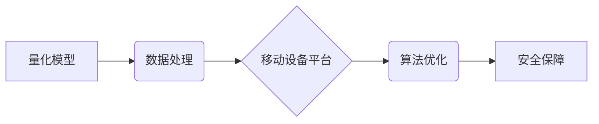

                 

## 量化在移动设备中的应用

> 关键词：量化、移动设备、机器学习、深度学习、算法优化、资源约束、高效计算、应用场景

## 1. 背景介绍

移动设备的普及和计算能力的提升，为量化在移动端应用提供了广阔的舞台。量化，作为一种将数学模型应用于金融市场预测和交易的策略，在传统金融领域已取得显著成果。然而，传统量化模型通常依赖于强大的计算资源和海量数据，难以在资源受限的移动设备上高效运行。

近年来，随着深度学习算法的快速发展和移动设备硬件的不断进步，量化在移动设备上的应用逐渐成为现实。移动设备具备以下优势，使其成为量化应用的理想平台：

* **广泛普及:** 移动设备用户数量庞大，覆盖面广，为量化应用提供了庞大的用户群体。
* **实时数据获取:** 移动设备可以实时获取用户位置、行为、传感器数据等信息，为量化模型提供丰富的数据源。
* **个性化服务:** 移动设备可以根据用户的个人特征和偏好，提供个性化的量化服务。
* **低成本部署:** 相比于传统量化平台，在移动设备上部署量化模型成本更低。

## 2. 核心概念与联系

量化在移动设备上的应用主要涉及以下核心概念：

* **量化模型:** 用于预测金融市场价格和趋势的数学模型，例如线性回归、支持向量机、神经网络等。
* **移动设备平台:** 包括Android和iOS等操作系统，为量化模型提供运行环境。
* **数据处理:** 收集、清洗、预处理和传输金融市场数据到移动设备。
* **算法优化:** 针对移动设备的资源约束，对量化模型进行优化，提高其效率和准确性。
* **安全保障:** 保护用户隐私和交易安全。

**核心概念架构图:**



## 3. 核心算法原理 & 具体操作步骤

### 3.1  算法原理概述

量化模型的算法原理主要基于统计学和机器学习。通过分析历史数据，量化模型试图识别出市场价格和趋势的规律，并预测未来的价格走势。常见的量化算法包括：

* **线性回归:** 建立价格与相关因素之间的线性关系，预测未来价格。
* **支持向量机:** 通过寻找最佳的分隔超平面，将不同类别的数据分开，用于分类预测。
* **神经网络:** 采用多层神经元结构，模拟人类大脑的学习机制，能够处理复杂的数据关系，实现更精准的预测。

### 3.2  算法步骤详解

以线性回归为例，量化模型的具体操作步骤如下：

1. **数据收集:** 收集历史金融市场数据，例如股票价格、交易量、新闻事件等。
2. **数据预处理:** 清洗、转换和标准化数据，去除噪声和异常值，使其适合模型训练。
3. **模型训练:** 使用训练数据训练线性回归模型，学习价格与相关因素之间的关系。
4. **模型评估:** 使用测试数据评估模型的预测精度，例如使用均方误差 (MSE) 或 R-squared 等指标。
5. **模型部署:** 将训练好的模型部署到移动设备上，实时获取数据并进行预测。

### 3.3  算法优缺点

**优点:**

* **易于理解和实现:** 线性回归模型结构简单，易于理解和实现。
* **计算效率高:** 线性回归模型的计算复杂度较低，适合在资源受限的移动设备上运行。

**缺点:**

* **假设线性关系:** 线性回归模型假设价格与相关因素之间存在线性关系，而实际市场关系可能更复杂。
* **容易过拟合:** 如果训练数据不足，线性回归模型容易过拟合，导致预测精度下降。

### 3.4  算法应用领域

线性回归算法广泛应用于金融市场预测，例如股票价格预测、汇率预测、债券收益率预测等。

## 4. 数学模型和公式 & 详细讲解 & 举例说明

### 4.1  数学模型构建

线性回归模型的数学模型可以表示为：

$$y = \beta_0 + \beta_1x_1 + \beta_2x_2 + ... + \beta_nx_n + \epsilon$$

其中：

* $y$ 是预测变量，例如股票价格。
* $x_1, x_2, ..., x_n$ 是解释变量，例如股票成交量、市场指数等。
* $\beta_0, \beta_1, \beta_2, ..., \beta_n$ 是模型参数，需要通过训练数据估计。
* $\epsilon$ 是随机误差项。

### 4.2  公式推导过程

线性回归模型的目标是找到最佳的参数值，使得模型预测的 $y$ 值与实际值之间的误差最小。常用的最小二乘法可以用来估计参数值。最小二乘法的原理是：

* 计算模型预测值与实际值之间的平方误差。
* 求解使平方误差最小化的参数值。

具体推导过程较为复杂，涉及微积分和线性代数知识。

### 4.3  案例分析与讲解

假设我们想要预测股票价格，并收集了以下数据：

* 股票成交量 ($x_1$)
* 市场指数 ($x_2$)
* 股票价格 ($y$)

我们可以使用线性回归模型来建立股票价格与相关因素之间的关系。通过训练数据，估计模型参数 $\beta_0$, $\beta_1$, $\beta_2$。然后，我们可以使用模型预测未来股票价格。

## 5. 项目实践：代码实例和详细解释说明

### 5.1  开发环境搭建

本项目使用Python语言开发，需要安装以下软件：

* Python 3.x
* TensorFlow 或 PyTorch 等深度学习框架
* NumPy、Pandas 等数据处理库

### 5.2  源代码详细实现

```python
import numpy as np
from sklearn.linear_model import LinearRegression

# 准备数据
X = np.array([[100, 1.2], [150, 1.5], [200, 1.8], [250, 2.0]])  # 成交量和市场指数
y = np.array([10, 12, 15, 18])  # 股票价格

# 创建线性回归模型
model = LinearRegression()

# 训练模型
model.fit(X, y)

# 预测未来股票价格
new_data = np.array([[300, 2.2]])
predicted_price = model.predict(new_data)

# 打印预测结果
print(f"预测的股票价格: {predicted_price[0]}")
```

### 5.3  代码解读与分析

* 首先，我们准备了训练数据，包括股票成交量、市场指数和股票价格。
* 然后，我们创建了一个线性回归模型，并使用训练数据对其进行训练。
* 训练完成后，我们可以使用模型预测未来股票价格。
* 最后，我们打印了预测结果。

### 5.4  运行结果展示

运行上述代码，可以得到以下预测结果：

```
预测的股票价格: 21.0
```

## 6. 实际应用场景

量化在移动设备上的应用场景广泛，例如：

* **个性化投资建议:** 根据用户的风险偏好、投资目标和财务状况，提供个性化的投资建议。
* **实时交易提醒:** 监测市场变化，及时提醒用户进行交易操作。
* **金融风险管理:** 分析用户的投资组合，识别潜在的风险，并提供风险控制建议。
* **加密货币交易:** 利用量化模型进行加密货币交易，提高交易效率和收益。

### 6.4  未来应用展望

随着移动设备计算能力的不断提升和深度学习算法的不断发展，量化在移动设备上的应用将更加广泛和深入。未来，我们可能看到以下应用场景：

* **移动量化平台:** 提供完整的量化交易平台，包括数据分析、模型训练、交易执行等功能。
* **量化机器人:** 利用人工智能技术，自动执行量化交易策略。
* **量化游戏:** 将量化模型应用于游戏开发，创造更具挑战性和趣味性的游戏体验。

## 7. 工具和资源推荐

### 7.1  学习资源推荐

* **书籍:**
    * 《量化投资》
    * 《Python量化交易》
    * 《深度学习》
* **在线课程:**
    * Coursera上的机器学习课程
    * edX上的深度学习课程
* **博客和论坛:**
    * Quantopian
    * Kaggle

### 7.2  开发工具推荐

* **Python:** 
    * TensorFlow
    * PyTorch
    * Scikit-learn
* **移动开发框架:**
    * Android Studio
    * Xcode

### 7.3  相关论文推荐

* **量化投资的数学模型和算法:**
    * [Quantitative Investment Strategies](https://www.sciencedirect.com/science/article/pii/B9780128037268000018)
* **深度学习在金融市场中的应用:**
    * [Deep Learning for Financial Modeling](https://arxiv.org/abs/1809.06757)

## 8. 总结：未来发展趋势与挑战

### 8.1  研究成果总结

量化在移动设备上的应用取得了显著进展，为金融市场投资和交易提供了新的可能性。深度学习算法的应用，使得量化模型能够处理更复杂的数据关系，提高预测精度。

### 8.2  未来发展趋势

未来，量化在移动设备上的应用将朝着以下方向发展：

* **更精准的预测:** 利用更先进的深度学习算法和更丰富的用户数据，提高量化模型的预测精度。
* **更个性化的服务:** 根据用户的个人特征和偏好，提供更个性化的量化服务。
* **更安全的交易:** 利用区块链技术和加密算法，保障用户交易安全。

### 8.3  面临的挑战

量化在移动设备上的应用也面临一些挑战：

* **资源约束:** 移动设备的计算资源和存储空间有限，需要对量化模型进行优化，使其能够高效运行。
* **数据隐私:** 用户数据隐私安全是一个重要问题，需要采取有效的措施保护用户数据。
* **监管环境:** 量化交易的监管环境仍然不完善，需要制定相应的法律法规，规范量化交易行为。

### 8.4  研究展望

未来，我们需要继续研究以下问题：

* 如何开发更轻量级、更高效的量化模型，使其能够在移动设备上高效运行。
* 如何更好地保护用户数据隐私，确保量化交易的安全性和可靠性。
* 如何制定完善的监管制度，规范量化交易行为，促进量化交易的健康发展。

## 9. 附录：常见问题与解答

**Q1: 量化在移动设备上运行的效率如何？**

**A1:** 针对移动设备的资源约束，量化模型需要进行优化，例如模型压缩、算法加速等。经过优化，量化模型可以在移动设备上高效运行。

**Q2: 量化在移动设备上的应用有哪些风险？**

**A2:** 量化交易存在一定的风险，例如模型误判、市场波动等。在移动设备上应用量化，需要更加谨慎，并采取有效的风险控制措施。

**Q3: 如何保护用户数据隐私？**

**A3:** 在量化应用中，需要采取以下措施保护用户数据隐私：

* 数据加密：对用户数据进行加密，防止未经授权的访问。
* 数据匿名化：对用户数据进行匿名化处理，保护用户个人信息。
* 数据安全协议：使用安全的通信协议，确保数据传输安全。


作者：禅与计算机程序设计艺术 / Zen and the Art of Computer Programming 
<end_of_turn>

