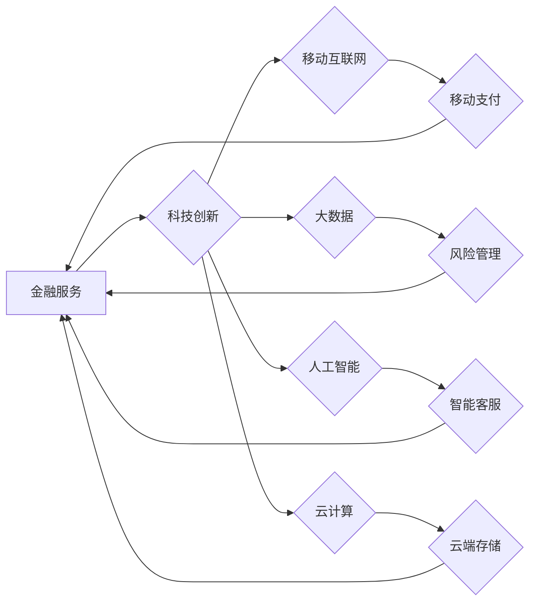

                 

## 金融科技创业：重构金融服务的未来

> 关键词：金融科技、FinTech、区块链、人工智能、机器学习、云计算、大数据、风险管理

### 1. 背景介绍

金融科技（FinTech）正以惊人的速度改变着全球金融格局。从传统的银行业务到投资理财、支付结算，FinTech正在用创新技术和商业模式重塑金融服务，为消费者和企业带来更便捷、高效、透明的体验。

近年来，随着移动互联网、大数据、人工智能等技术的快速发展，FinTech行业迎来爆发式增长。各种新兴金融服务平台和应用层出不穷，例如移动支付、在线借贷、理财平台、区块链金融等。这些创新服务不仅降低了金融服务的成本和门槛，也为金融机构带来了新的增长点和竞争优势。

然而，FinTech创业也面临着诸多挑战，例如监管环境复杂、数据安全风险高、技术迭代速度快等。如何在创新和监管之间取得平衡，如何应对技术风险和市场竞争，是FinTech创业者需要认真思考的问题。

### 2. 核心概念与联系

FinTech的核心概念是将金融服务与科技创新相结合，利用新兴技术提升金融服务的效率、便捷性和安全性。

**2.1  核心概念**

* **金融服务 (Financial Services):** 包括银行、保险、投资、支付等一系列为个人和企业提供资金管理、风险管理、财富管理等服务的行业。
* **科技创新 (Technological Innovation):** 指利用新技术、新方法、新模式，创造新的产品、服务和商业模式。

**2.2  联系**

FinTech通过将金融服务与科技创新相结合，实现以下目标：

* **提高效率:** 利用自动化、智能化技术，简化金融服务流程，提高服务效率。
* **降低成本:** 通过线上化、平台化等模式，降低金融服务的成本。
* **提升便捷性:** 利用移动互联网、云计算等技术，提供随时随地、便捷的金融服务。
* **增强安全性:** 利用区块链、人工智能等技术，提高金融服务的安全性。

**2.3  架构图**



### 3. 核心算法原理 & 具体操作步骤

FinTech的创新离不开算法的支撑。以下介绍一些常用的FinTech算法及其原理和操作步骤。

**3.1  算法原理概述**

* **机器学习 (Machine Learning):**  一种人工智能技术，通过算法训练数据，使机器能够从数据中学习规律，并对新数据进行预测或分类。
* **深度学习 (Deep Learning):**  机器学习的一种高级形式，利用多层神经网络模拟人类大脑的学习过程，能够处理更复杂的数据和任务。
* **自然语言处理 (Natural Language Processing):**  一种人工智能技术，使计算机能够理解和处理人类语言。

**3.2  算法步骤详解**

**机器学习算法步骤:**

1. **数据收集和预处理:** 收集相关数据，并进行清洗、转换、特征提取等预处理工作。
2. **模型选择:** 根据具体任务选择合适的机器学习算法模型，例如线性回归、逻辑回归、决策树、支持向量机等。
3. **模型训练:** 利用训练数据训练模型参数，使模型能够学习数据中的规律。
4. **模型评估:** 利用测试数据评估模型的性能，例如准确率、召回率、F1-score等。
5. **模型调优:** 根据评估结果调整模型参数，提高模型性能。
6. **模型部署:** 将训练好的模型部署到实际应用场景中。

**3.3  算法优缺点**

**机器学习算法的优点:**

* 能够自动学习数据中的规律，无需人工编程。
* 能够处理海量数据，发现隐藏的模式。
* 能够不断学习和改进，提高预测精度。

**机器学习算法的缺点:**

* 需要大量的训练数据。
* 模型训练过程复杂，需要专业知识和技术。
* 模型解释性较差，难以理解模型的决策过程。

**3.4  算法应用领域**

* **风险管理:** 利用机器学习算法识别欺诈行为、评估信用风险、预测市场风险等。
* **客户服务:** 利用自然语言处理技术实现智能客服，自动回答客户问题，提高服务效率。
* **投资理财:** 利用机器学习算法分析市场数据，预测股票价格、推荐投资策略等。

### 4. 数学模型和公式 & 详细讲解 & 举例说明

**4.1  数学模型构建**

在FinTech领域，数学模型广泛应用于风险管理、投资理财、定价模型等方面。例如，在信用风险评估中，可以使用Logistic回归模型来预测客户违约的概率。

**Logistic回归模型**

$$
P(Y=1|X) = \frac{1}{1 + e^{-(β_0 + β_1X_1 + β_2X_2 + ... + β_nX_n)}}
$$

其中：

* $P(Y=1|X)$ 是给定特征 $X$ 时，客户违约的概率。
* $β_0, β_1, β_2, ..., β_n$ 是模型参数。
* $X_1, X_2, ..., X_n$ 是客户的特征变量，例如收入、信用评分等。

**4.2  公式推导过程**

Logistic回归模型的推导过程基于最大似然估计。通过最大化模型对训练数据的拟合程度，可以得到模型参数的最佳估计值。

**4.3  案例分析与讲解**

假设我们有一个包含1000个客户的训练数据集，其中500个客户违约，500个客户未违约。我们可以使用Logistic回归模型来训练一个信用风险评估模型。

通过训练模型，我们可以得到模型参数的估计值。然后，我们可以使用这个模型来预测新客户的违约概率。例如，如果一个新客户的收入为50000元，信用评分为700，我们可以使用模型公式来计算其违约概率。

### 5. 项目实践：代码实例和详细解释说明

**5.1  开发环境搭建**

* **操作系统:** Linux/macOS/Windows
* **编程语言:** Python
* **库依赖:** scikit-learn, pandas, numpy

**5.2  源代码详细实现**

```python
from sklearn.linear_model import LogisticRegression
from sklearn.model_selection import train_test_split
from sklearn.metrics import accuracy_score

# 加载数据
data = pd.read_csv('credit_data.csv')

# 分割数据
X = data.drop('default', axis=1)
y = data['default']
X_train, X_test, y_train, y_test = train_test_split(X, y, test_size=0.2, random_state=42)

# 训练模型
model = LogisticRegression()
model.fit(X_train, y_train)

# 预测结果
y_pred = model.predict(X_test)

# 评估模型性能
accuracy = accuracy_score(y_test, y_pred)
print('模型准确率:', accuracy)
```

**5.3  代码解读与分析**

* **数据加载:** 使用pandas库加载数据文件。
* **数据分割:** 将数据分为训练集和测试集。
* **模型训练:** 使用LogisticRegression模型训练模型。
* **模型预测:** 使用训练好的模型预测测试集的标签。
* **模型评估:** 使用accuracy_score函数计算模型的准确率。

**5.4  运行结果展示**

运行代码后，会输出模型的准确率。

### 6. 实际应用场景

FinTech的应用场景非常广泛，例如：

* **移动支付:** Alipay、微信支付等移动支付平台利用区块链技术保障交易安全，提高支付效率。
* **在线借贷:** LendingClub、 Prosper等在线借贷平台利用机器学习算法评估借款人的信用风险，提供更便捷的借贷服务。
* **理财平台:** Robo-Advisor等理财平台利用人工智能技术提供个性化的投资建议，帮助用户理财。
* **区块链金融:** 利用区块链技术实现去中心化的金融服务，例如去中心化交易所、去中心化保险等。

**6.4  未来应用展望**

FinTech的未来发展趋势包括：

* **人工智能的更广泛应用:** 人工智能将被应用于更多金融领域，例如风险管理、客户服务、投资理财等。
* **区块链技术的普及:** 区块链技术将被应用于更多金融场景，例如支付结算、资产管理、身份认证等。
* **云计算的赋能:** 云计算将为FinTech提供更强大的计算能力和数据存储能力。
* **开放银行的兴起:** 开放银行将打破传统金融机构的壁垒，促进金融服务的创新和融合。

### 7. 工具和资源推荐

**7.1  学习资源推荐**

* **书籍:**
    * 《金融科技：重塑金融服务的未来》
    * 《人工智能与金融》
    * 《区块链技术入门》
* **在线课程:**
    * Coursera: 金融科技
    * edX: 人工智能与金融
    * Udemy: 区块链技术

**7.2  开发工具推荐**

* **编程语言:** Python
* **机器学习库:** scikit-learn
* **数据分析库:** pandas, numpy
* **云计算平台:** AWS, Azure, GCP

**7.3  相关论文推荐**

* **机器学习在金融领域的应用:**
    * 《机器学习在金融风险管理中的应用》
    * 《机器学习在金融投资中的应用》
* **区块链技术在金融领域的应用:**
    * 《区块链技术在金融服务中的应用》
    * 《区块链技术在金融监管中的应用》

### 8. 总结：未来发展趋势与挑战

**8.1  研究成果总结**

FinTech的创新成果显著，为金融服务带来了革命性的变化。机器学习、深度学习、自然语言处理等人工智能技术在金融领域的应用取得了突破性进展，为风险管理、客户服务、投资理财等领域提供了新的解决方案。区块链技术也为金融服务带来了去中心化、透明化的全新体验。

**8.2  未来发展趋势**

FinTech的未来发展趋势将更加注重人工智能、区块链、云计算等技术的融合应用，以及开放银行、金融数据共享等新模式的探索。

**8.3  面临的挑战**

FinTech的发展也面临着诸多挑战，例如：

* **监管环境复杂:** 不同国家和地区的监管环境差异较大，需要FinTech企业积极与监管机构沟通，寻求合规的解决方案。
* **数据安全风险高:** 金融数据是重要的资产，需要采取有效的安全措施保护数据安全。
* **技术迭代速度快:** FinTech领域的技术迭代速度非常快，需要企业不断学习和更新技术，才能保持竞争优势。

**8.4  研究展望**

未来，FinTech的研究将更加注重以下几个方面：

* **人工智能技术的应用场景拓展:** 将人工智能技术应用于更多金融领域，例如金融审计、反洗钱等。
* **区块链技术的安全性与可扩展性提升:** 研究如何提高区块链技术的安全性、可扩展性和隐私保护能力。
* **金融数据共享与隐私保护:** 研究如何实现金融数据的安全共享，同时保护用户隐私。


### 9. 附录：常见问题与解答

**9.1  FinTech和传统金融的区别是什么？**

FinTech利用科技创新，提供更便捷、高效、透明的金融服务，而传统金融以线下机构为主，服务模式相对传统。

**9.2  FinTech有哪些主要的应用场景？**

FinTech的应用场景非常广泛，例如移动支付、在线借贷、理财平台、区块链金融等。

**9.3  FinTech面临哪些挑战？**

FinTech面临的挑战包括监管环境复杂、数据安全风险高、技术迭代速度快等。

**9.4  FinTech的未来发展趋势是什么？**

FinTech的未来发展趋势将更加注重人工智能、区块链、云计算等技术的融合应用，以及开放银行、金融数据共享等新模式的探索。


作者：禅与计算机程序设计艺术 / Zen and the Art of Computer Programming 
<end_of_turn>

