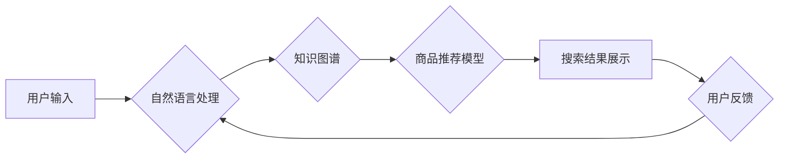

                 

## AI如何优化电商搜索的长尾商品发现

> 关键词：电商搜索、长尾商品、推荐系统、深度学习、自然语言处理、知识图谱、个性化推荐

## 1. 背景介绍

在当今以电商为核心的数字经济时代，搜索引擎已成为消费者获取商品信息和完成购买的关键入口。然而，传统的电商搜索引擎往往难以有效地挖掘和推荐长尾商品。长尾商品是指那些搜索量较低、市场份额较小的商品，它们往往具有独特的功能、个性化的需求或特定人群的偏好。由于缺乏足够的搜索数据和用户行为反馈，传统的搜索算法难以准确理解长尾商品的语义和用户需求，导致用户难以找到心仪的商品，从而影响了电商平台的销售额和用户体验。

随着人工智能技术的快速发展，特别是深度学习和自然语言处理技术的突破，为电商搜索的优化提供了新的机遇。AI技术能够从海量商品数据和用户行为数据中挖掘更深层的语义信息，更好地理解用户需求，并推荐更精准、更个性化的长尾商品。

## 2. 核心概念与联系

### 2.1  电商搜索的挑战

电商搜索面临着以下主要挑战：

* **数据稀疏性:** 长尾商品的搜索量较低，导致数据稀疏，难以训练有效的搜索模型。
* **语义理解:** 用户搜索词往往包含复杂的语义和隐含需求，传统的关键词匹配算法难以准确理解。
* **个性化推荐:** 不同用户的需求和偏好不同，需要提供个性化的商品推荐。
* **实时性:** 随着商品和用户行为的不断变化，搜索结果需要实时更新。

### 2.2  AI技术解决方案

AI技术可以有效解决上述挑战，主要包括以下几个方面：

* **深度学习:** 利用深度神经网络从海量商品数据和用户行为数据中学习特征，提高语义理解能力。
* **自然语言处理:** 对用户搜索词进行语义分析，识别用户需求和意图。
* **知识图谱:** 建立商品、用户和场景之间的知识关系，提供更丰富的商品信息和推荐依据。
* **个性化推荐:** 基于用户的历史搜索记录、购买行为和偏好，提供个性化的商品推荐。

### 2.3  AI架构

AI驱动的电商搜索系统通常包含以下几个模块：



## 3. 核心算法原理 & 具体操作步骤

### 3.1  算法原理概述

长尾商品发现的核心算法通常基于深度学习和自然语言处理技术，主要包括以下几种：

* **协同过滤:** 基于用户的历史行为数据，预测用户对特定商品的兴趣。
* **内容过滤:** 基于商品的属性和描述信息，推荐与用户兴趣相符的商品。
* **混合推荐:** 结合协同过滤和内容过滤算法，提高推荐的准确性和个性化程度。

### 3.2  算法步骤详解

以协同过滤算法为例，其具体操作步骤如下：

1. **数据收集:** 收集用户的历史搜索记录、购买行为、评分等数据。
2. **用户和商品表示:** 将用户和商品映射到低维向量空间，例如使用Word2Vec或Doc2Vec进行词嵌入。
3. **相似度计算:** 计算用户之间的相似度和商品之间的相似度，可以使用余弦相似度或皮尔逊相关系数等方法。
4. **推荐生成:** 根据用户与其他用户的相似度和商品与其他商品的相似度，推荐用户可能感兴趣的商品。

### 3.3  算法优缺点

**优点:**

* 能够挖掘用户隐性的兴趣偏好。
* 推荐结果具有较高的个性化程度。

**缺点:**

* 数据稀疏性问题，难以训练有效的模型。
* 冷启动问题，对于新用户和新商品难以进行推荐。

### 3.4  算法应用领域

协同过滤算法广泛应用于电商推荐、电影推荐、音乐推荐等领域。

## 4. 数学模型和公式 & 详细讲解 & 举例说明

### 4.1  数学模型构建

协同过滤算法的核心是计算用户和商品之间的相似度。常用的相似度度量方法包括余弦相似度和皮尔逊相关系数。

**余弦相似度:**

$$
\text{cosine similarity}(u, v) = \frac{u \cdot v}{||u|| ||v||}
$$

其中，u和v分别表示用户或商品的向量表示，u·v表示两个向量的点积，||u||和||v||分别表示两个向量的模长。

**皮尔逊相关系数:**

$$
\text{pearson correlation}(u, v) = \frac{\sum_{i=1}^{n}(u_i - \bar{u})(v_i - \bar{v})}{\sqrt{\sum_{i=1}^{n}(u_i - \bar{u})^2} \sqrt{\sum_{i=1}^{n}(v_i - \bar{v})^2}}
$$

其中，u和v分别表示用户或商品的评分向量，$\bar{u}$和$\bar{v}$分别表示两个向量的平均值，n表示评分数量。

### 4.2  公式推导过程

余弦相似度的推导过程如下：

1. 两个向量的点积表示两个向量在同一方向上的投影长度。
2. 两个向量的模长表示两个向量的长度。
3. 将点积除以两个向量的模长乘积，得到两个向量在同一方向上的投影长度与总长度的比值，即余弦相似度。

皮尔逊相关系数的推导过程较为复杂，涉及到线性回归和协方差的概念。

### 4.3  案例分析与讲解

假设有两个用户A和B，他们的评分向量分别为：

* A: [5, 4, 3, 2, 1]
* B: [4, 3, 2, 1, 0]

我们可以使用余弦相似度计算A和B之间的相似度：

$$
\text{cosine similarity}(A, B) = \frac{5 \cdot 4 + 4 \cdot 3 + 3 \cdot 2 + 2 \cdot 1 + 1 \cdot 0}{\sqrt{5^2 + 4^2 + 3^2 + 2^2 + 1^2} \sqrt{4^2 + 3^2 + 2^2 + 1^2 + 0^2}} = \frac{30}{\sqrt{55} \sqrt{30}} \approx 0.82
$$

结果表明，A和B之间的相似度为0.82，说明他们具有较高的相似性。

## 5. 项目实践：代码实例和详细解释说明

### 5.1  开发环境搭建

本项目使用Python语言开发，需要安装以下软件包：

* TensorFlow
* Keras
* Scikit-learn
* Pandas
* Numpy

### 5.2  源代码详细实现

```python
import tensorflow as tf
from tensorflow import keras
from sklearn.metrics import mean_squared_error

# 定义协同过滤模型
model = keras.Sequential([
    keras.layers.Embedding(input_dim=num_users, output_dim=embedding_dim),
    keras.layers.Embedding(input_dim=num_items, output_dim=embedding_dim),
    keras.layers.Multiply(),
    keras.layers.Flatten(),
    keras.layers.Dense(1)
])

# 编译模型
model.compile(optimizer='adam', loss='mse')

# 训练模型
model.fit(X_train, y_train, epochs=10, batch_size=32)

# 预测评分
predictions = model.predict(X_test)

# 计算均方误差
rmse = tf.sqrt(mean_squared_error(y_test, predictions))
print('RMSE:', rmse)
```

### 5.3  代码解读与分析

* **Embedding层:** 将用户和商品映射到低维向量空间。
* **Multiply层:** 将用户向量和商品向量相乘，得到用户对商品的评分预测。
* **Flatten层:** 将多维向量展平为一维向量。
* **Dense层:** 全连接层，输出用户对商品的评分预测。
* **Adam优化器:** 用于优化模型参数。
* **均方误差损失函数:** 用于衡量模型预测评分与真实评分之间的误差。

### 5.4  运行结果展示

训练完成后，可以将模型应用于新的用户和商品数据，预测用户对商品的评分。

## 6. 实际应用场景

AI驱动的电商搜索系统已在许多电商平台得到应用，例如：

* **亚马逊:** 利用深度学习和自然语言处理技术，提供个性化的商品推荐和搜索结果。
* **淘宝:** 基于用户行为数据和商品属性，推荐长尾商品和新品。
* **京东:** 建立商品知识图谱，提高商品语义理解能力和推荐精准度。

### 6.4  未来应用展望

未来，AI技术将进一步优化电商搜索，例如：

* **多模态搜索:** 支持图像、语音等多模态搜索，提供更丰富的商品信息和搜索体验。
* **实时个性化推荐:** 基于用户的实时行为数据，提供更精准和个性化的商品推荐。
* **智能客服:** 利用自然语言处理技术，提供智能客服服务，帮助用户解决购物问题。

## 7. 工具和资源推荐

### 7.1  学习资源推荐

* **深度学习书籍:** 《深度学习》
* **自然语言处理书籍:** 《自然语言处理入门》
* **在线课程:** Coursera、edX、Udacity

### 7.2  开发工具推荐

* **TensorFlow:** 深度学习框架
* **Keras:** 深度学习API
* **Scikit-learn:** 机器学习库

### 7.3  相关论文推荐

* **Collaborative Filtering for Recommender Systems**
* **Deep Learning for Recommender Systems**
* **Knowledge Graph Embedding for Recommender Systems**

## 8. 总结：未来发展趋势与挑战

### 8.1  研究成果总结

AI技术为电商搜索的优化提供了新的机遇，特别是深度学习和自然语言处理技术，能够有效解决长尾商品发现的挑战。

### 8.2  未来发展趋势

未来，AI驱动的电商搜索将朝着以下方向发展：

* **多模态搜索:** 支持图像、语音等多模态搜索，提供更丰富的商品信息和搜索体验。
* **实时个性化推荐:** 基于用户的实时行为数据，提供更精准和个性化的商品推荐。
* **智能客服:** 利用自然语言处理技术，提供智能客服服务，帮助用户解决购物问题。

### 8.3  面临的挑战

AI驱动的电商搜索也面临着一些挑战，例如：

* **数据隐私:** 如何保护用户的隐私数据，是AI技术应用中的重要问题。
* **算法公平性:** 确保AI算法的公平性和透明性，避免算法歧视和偏见。
* **可解释性:** 如何提高AI模型的可解释性，帮助用户理解模型的决策过程。

### 8.4  研究展望

未来，需要进一步研究以下问题：

* 如何开发更有效的长尾商品发现算法，提高推荐的准确性和个性化程度。
* 如何构建更完善的商品知识图谱，提供更丰富的商品信息和语义理解能力。
* 如何解决AI技术应用中的伦理问题，确保AI技术安全、可靠、可持续发展。

## 9. 附录：常见问题与解答

**Q1: 如何评估AI驱动的电商搜索系统的性能？**

**A1:** 可以使用以下指标评估AI驱动的电商搜索系统的性能：

* **准确率:** 推荐结果与用户真实需求的匹配度。
* **召回率:** 推荐结果覆盖了所有用户真实需求的比例。
* **点击率:** 用户点击推荐结果的比例。
* **转化率:** 用户点击推荐结果后完成购买的比例。

**Q2: 如何解决AI模型的冷启动问题？**

**A2:** 可以采用以下方法解决AI模型的冷启动问题：

* **利用用户画像:** 根据用户的基本信息和行为数据，进行用户画像分析，为新用户提供个性化的推荐。
* **利用商品属性:** 根据商品的属性和描述信息，进行商品分类和聚类，为新商品提供推荐。
* **利用协同过滤算法的扩展:** 采用基于内容过滤、基于规则的推荐等方法，结合协同过滤算法，为新用户和新商品提供推荐。


作者：禅与计算机程序设计艺术 / Zen and the Art of Computer Programming 
<end_of_turn>

