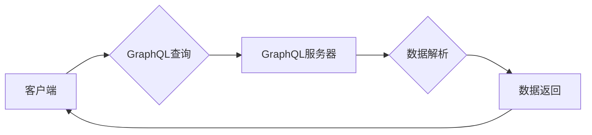

                 

## GraphQL：灵活高效的API查询语言

> 关键词：GraphQL, API, 查询语言, 数据获取, 性能优化, 类型系统, 客户端

## 1. 背景介绍

随着互联网应用的蓬勃发展，API（Application Programming Interface）作为软件系统之间通信的桥梁，扮演着越来越重要的角色。传统的RESTful API通常采用资源路径和HTTP方法来定义数据获取方式，但这种方式存在一些弊端：

* **过量获取数据（Overfetching）：** 客户端可能需要获取少量数据，但RESTful API往往返回大量冗余数据，导致网络流量浪费和客户端处理负担增加。
* **不足获取数据（Underfetching）：** 客户端可能需要获取多个资源的组合数据，但RESTful API可能需要进行多次请求才能获取所有所需数据，降低了开发效率和用户体验。
* **版本管理复杂：** RESTful API的版本管理较为复杂，需要维护多个API版本，增加开发和维护成本。

为了解决这些问题，Facebook于2015年开源了GraphQL，它是一种灵活高效的API查询语言和运行时，旨在提供更优的客户端数据获取体验。

## 2. 核心概念与联系

GraphQL的核心概念是**查询语言**和**类型系统**。

* **查询语言：** GraphQL提供了一种声明式查询语言，允许客户端明确指定所需数据，避免过量或不足获取数据的问题。
* **类型系统：** GraphQL拥有强大的类型系统，可以定义数据结构和关系，确保数据一致性和安全性。

GraphQL的架构可以概括为以下流程：



**流程说明：**

1. 客户端使用GraphQL查询语言发送请求到GraphQL服务器。
2. GraphQL服务器解析查询，并根据查询定义获取所需数据。
3. GraphQL服务器将解析后的数据返回给客户端。

## 3. 核心算法原理 & 具体操作步骤

### 3.1  算法原理概述

GraphQL的核心算法是**查询解析和数据获取**。

* **查询解析：** GraphQL服务器会解析客户端发送的查询语句，识别出所需的数据字段和关系。
* **数据获取：** 根据解析结果，GraphQL服务器会访问数据库或其他数据源，获取所需数据并进行组合和格式化。

### 3.2  算法步骤详解

1. **解析查询语句：** GraphQL服务器会使用语法分析器解析客户端发送的查询语句，识别出查询操作、数据字段和关系。
2. **构建查询计划：** 根据解析结果，GraphQL服务器会构建一个查询计划，定义数据获取的顺序和依赖关系。
3. **执行查询计划：** GraphQL服务器会根据查询计划访问数据库或其他数据源，获取所需数据。
4. **数据组合和格式化：** GraphQL服务器会将获取到的数据进行组合和格式化，按照客户端查询的结构返回数据。

### 3.3  算法优缺点

**优点：**

* **灵活高效：** 客户端可以精确指定所需数据，避免过量或不足获取数据的问题。
* **类型安全：** GraphQL的类型系统可以确保数据一致性和安全性。
* **易于维护：** GraphQL的API版本管理较为简单，减少了开发和维护成本。

**缺点：**

* **学习曲线：** GraphQL的查询语言和类型系统需要一定的学习成本。
* **服务器端复杂度：** GraphQL服务器需要处理复杂的查询解析和数据获取逻辑。

### 3.4  算法应用领域

GraphQL广泛应用于各种领域，例如：

* **移动应用开发：** GraphQL可以帮助移动应用高效获取所需数据，提高用户体验。
* **电商平台：** GraphQL可以帮助电商平台提供个性化商品推荐和快速数据查询。
* **社交媒体：** GraphQL可以帮助社交媒体平台高效处理用户数据和关系。

## 4. 数学模型和公式 & 详细讲解 & 举例说明

GraphQL的查询语言和类型系统可以抽象为数学模型，其中：

* **查询语句：** 可以表示为一个树形结构，每个节点代表一个数据字段或关系。
* **数据类型：** 可以表示为一个集合，包含各种数据类型和关系定义。

**4.1  数学模型构建**

我们可以使用图论来表示GraphQL的查询语言和类型系统。

* **节点：** 代表数据字段、数据类型或关系。
* **边：** 代表数据字段之间的关系或数据类型之间的继承关系。

**4.2  公式推导过程**

GraphQL的查询解析过程可以抽象为一个图论算法，例如深度优先搜索（DFS）或广度优先搜索（BFS）。

**4.3  案例分析与讲解**

假设我们有一个简单的GraphQL类型定义：

```graphql
type User {
  id: ID!
  name: String!
  email: String!
  posts: [Post!]!
}

type Post {
  id: ID!
  title: String!
  content: String!
}
```

客户端可以发送以下查询语句获取用户及其所有帖子：

```graphql
query {
  user(id: 1) {
    id
    name
    email
    posts {
      id
      title
      content
    }
  }
}
```

GraphQL服务器会解析查询语句，构建一个图论模型，并使用DFS或BFS算法遍历模型，获取所需数据。最终返回包含用户ID、姓名、邮箱和所有帖子信息的JSON数据。

## 5. 项目实践：代码实例和详细解释说明

### 5.1  开发环境搭建

为了演示GraphQL的应用，我们可以使用Apollo Server和Express.js搭建一个简单的GraphQL服务器。

**依赖安装：**

```bash
npm install apollo-server express graphql
```

### 5.2  源代码详细实现

```javascript
const { ApolloServer, gql } = require('apollo-server');
const express = require('express');

const app = express();
const port = 4000;

const typeDefs = gql`
  type User {
    id: ID!
    name: String!
    email: String!
    posts: [Post!]!
  }

  type Post {
    id: ID!
    title: String!
    content: String!
  }
`;

const resolvers = {
  User: {
    posts: (parent, args, context) => {
      // 从数据库或其他数据源获取用户的所有帖子
      return posts;
    },
  },
};

const server = new ApolloServer({ typeDefs, resolvers });

server.applyMiddleware({ app });

app.listen(port, () => {
  console.log(`🚀 Server ready at http://localhost:${port}${server.graphqlPath}`);
});
```

**代码解释：**

1. 我们使用`apollo-server`和`express`库搭建一个GraphQL服务器。
2. 定义了`typeDefs`，包含了用户和帖子类型的定义。
3. 定义了`resolvers`，包含了如何获取用户和帖子数据的逻辑。
4. 使用`server.applyMiddleware`将GraphQL服务器集成到Express.js应用中。
5. 启动服务器并监听端口4000。

### 5.3  代码解读与分析

* `typeDefs`定义了GraphQL的类型系统，包括数据类型和关系定义。
* `resolvers`定义了如何根据查询语句获取数据，并返回给客户端。
* `server.applyMiddleware`将GraphQL服务器集成到Express.js应用中，方便客户端发送GraphQL查询请求。

### 5.4  运行结果展示

启动服务器后，我们可以使用GraphQL客户端工具，例如GraphiQL，发送GraphQL查询请求，获取数据。

## 6. 实际应用场景

GraphQL在各种实际应用场景中都表现出色，例如：

* **电商平台：** GraphQL可以帮助电商平台提供个性化商品推荐和快速数据查询，提高用户体验。
* **社交媒体：** GraphQL可以帮助社交媒体平台高效处理用户数据和关系，提供更流畅的交互体验。
* **新闻网站：** GraphQL可以帮助新闻网站提供个性化新闻推荐和快速数据更新，提高用户粘性。

### 6.4  未来应用展望

随着GraphQL技术的不断发展，其应用场景将会更加广泛，例如：

* **物联网：** GraphQL可以帮助物联网设备高效获取数据和控制设备，实现更智能的物联网应用。
* **区块链：** GraphQL可以帮助区块链应用提供更灵活的数据访问方式，提高应用效率和安全性。

## 7. 工具和资源推荐

### 7.1  学习资源推荐

* **GraphQL官方文档：** https://graphql.org/
* **GraphQL学习指南：** https://www.apollographql.com/docs/apollo-server/

### 7.2  开发工具推荐

* **GraphiQL：** https://www.apollographql.com/docs/apollo-client/data/queries/
* **Apollo Client：** https://www.apollographql.com/docs/apollo-client/

### 7.3  相关论文推荐

* **GraphQL: A Query Language for Your API:** https://arxiv.org/abs/1509.0759

## 8. 总结：未来发展趋势与挑战

### 8.1  研究成果总结

GraphQL作为一种灵活高效的API查询语言，已经取得了显著的成果，并在各种应用场景中得到广泛应用。其强大的类型系统、声明式查询语言和数据获取机制，为开发人员提供了更便捷、高效的API开发体验。

### 8.2  未来发展趋势

GraphQL的未来发展趋势包括：

* **更强大的类型系统：** GraphQL的类型系统将会更加强大，支持更复杂的类型定义和数据关系。
* **更优的性能优化：** GraphQL的性能优化将会更加完善，例如缓存机制、数据分片等。
* **更广泛的应用场景：** GraphQL将会应用于更多领域，例如物联网、区块链等。

### 8.3  面临的挑战

GraphQL也面临一些挑战，例如：

* **学习曲线：** GraphQL的查询语言和类型系统需要一定的学习成本。
* **服务器端复杂度：** GraphQL服务器需要处理复杂的查询解析和数据获取逻辑。
* **生态系统发展：** GraphQL的生态系统还需要进一步发展，例如工具、库和社区支持。

### 8.4  研究展望

未来，我们将继续研究GraphQL的理论基础和应用实践，探索其在不同领域中的应用潜力，并推动GraphQL技术的不断发展和完善。

## 9. 附录：常见问题与解答

**Q1：GraphQL和RESTful API有什么区别？**

**A1：** GraphQL是一种查询语言和运行时，而RESTful API是一种基于HTTP协议的架构风格。GraphQL允许客户端精确指定所需数据，避免过量或不足获取数据的问题，而RESTful API通常需要多次请求才能获取所有所需数据。

**Q2：GraphQL的类型系统有什么作用？**

**A2：** GraphQL的类型系统可以确保数据一致性和安全性。它定义了数据结构和关系，并通过类型检查机制防止错误数据传递。

**Q3：如何学习GraphQL？**

**A3：** 可以参考GraphQL官方文档和学习指南，并使用GraphiQL等工具进行实践练习。

**Q4：GraphQL有哪些应用场景？**

**A4：** GraphQL广泛应用于电商平台、社交媒体、新闻网站等领域，可以提供个性化数据获取、快速数据更新和更流畅的用户体验。


作者：禅与计算机程序设计艺术 / Zen and the Art of Computer Programming 
<end_of_turn>

