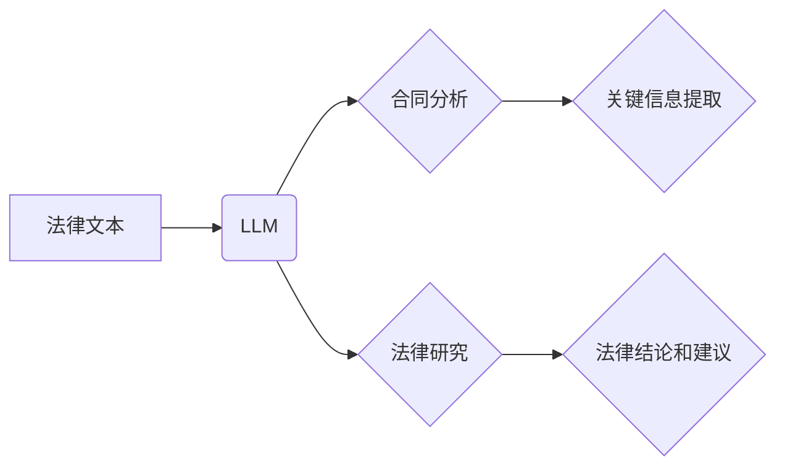

                 

## LLM 在法律行业中的应用：合同分析和法律研究

> 关键词：LLM, 大语言模型, 合同分析, 法律研究, 自然语言处理, 机器学习, 法律科技

## 1. 背景介绍

法律行业一直以来都以其复杂性、庞大的信息量和高度的专业性著称。传统的法律工作流程往往耗时费力，依赖于人工阅读、分析和理解大量的法律文件，例如合同、判例和法规。随着人工智能技术的快速发展，特别是大语言模型（LLM）的出现，法律行业迎来了数字化转型的新机遇。LLM 凭借其强大的自然语言处理能力，能够自动理解和分析法律文本，为法律工作提供高效、精准的辅助。

## 2. 核心概念与联系

### 2.1  大语言模型 (LLM)

大语言模型是近年来人工智能领域取得突破性进展的代表之一。它是一种基于深度学习的强大神经网络模型，经过海量文本数据的训练，能够理解和生成人类语言。LLM 拥有以下关键特征：

* **强大的文本理解能力:**  LLM 可以理解文本的语义、上下文和逻辑关系，并从中提取关键信息。
* **丰富的文本生成能力:** LLM 可以根据给定的文本或指令生成流畅、自然的文本，例如总结、翻译、问答等。
* **可迁移学习能力:**  LLM 可以将从一个领域学习到的知识迁移到另一个领域，从而适应不同的法律任务。

### 2.2  合同分析

合同分析是指自动识别、理解和提取合同中的关键信息，例如条款、条件、责任和义务等。传统的合同分析依赖于人工阅读和理解，效率低下且容易出错。LLM 可以通过分析合同文本，自动识别关键信息，并进行结构化存储，从而提高合同分析的效率和准确性。

### 2.3  法律研究

法律研究是指通过分析法律法规、判例和学术文献，得出法律结论和建议的过程。LLM 可以帮助律师和法学生更快、更有效地进行法律研究。它可以自动搜索和筛选相关法律文件，并进行文本摘要和比较，从而缩短法律研究的时间和成本。

**核心概念与联系流程图:**



## 3. 核心算法原理 & 具体操作步骤

### 3.1  算法原理概述

LLM 在合同分析和法律研究中的应用主要基于以下核心算法：

* **Transformer 模型:** Transformer 模型是一种深度学习架构，能够有效处理序列数据，例如文本。它通过自注意力机制学习文本之间的关系，从而提高文本理解和生成能力。
* **BERT 模型:** BERT (Bidirectional Encoder Representations from Transformers) 是基于 Transformer 模型的预训练语言模型，通过双向训练，能够更好地理解文本的语义和上下文。
* **Fine-tuning:**  将预训练的 LLM 模型在特定法律数据集上进行微调，使其能够更准确地理解和处理法律文本。

### 3.2  算法步骤详解

**合同分析:**

1. **文本预处理:** 将合同文本进行清洗、分词、标记等预处理操作，使其能够被 LLM 模型理解。
2. **特征提取:** 使用 LLM 模型提取合同文本中的关键信息，例如条款、条件、责任和义务等。
3. **信息结构化:** 将提取的关键信息进行结构化存储，例如以表格或知识图谱的形式表示。

**法律研究:**

1. **问题理解:**  理解用户提出的法律问题，并将其转化为可被 LLM 模型处理的文本查询。
2. **文献检索:** 使用 LLM 模型搜索和筛选相关法律文件，例如法规、判例和学术文献。
3. **文本摘要和比较:** 使用 LLM 模型对检索到的法律文件进行摘要和比较，并提取关键信息和法律观点。
4. **法律结论生成:**  根据检索到的法律文件和用户的问题，使用 LLM 模型生成法律结论和建议。

### 3.3  算法优缺点

**优点:**

* **提高效率:**  LLM 可以自动完成大量重复性任务，例如文本分析和信息提取，从而提高法律工作效率。
* **提高准确性:**  LLM 可以通过分析海量法律数据，识别出人类难以察觉的模式和关系，从而提高法律分析的准确性。
* **降低成本:**  LLM 可以自动化许多法律工作流程，从而降低法律服务成本。

**缺点:**

* **数据依赖:**  LLM 的性能取决于训练数据的质量和数量。如果训练数据不足或质量低劣，LLM 的性能将受到影响。
* **解释性问题:**  LLM 的决策过程通常是黑盒式的，难以解释其背后的逻辑。
* **伦理风险:**  LLM 的应用可能带来一些伦理风险，例如数据隐私和算法偏见等。

### 3.4  算法应用领域

LLM 在法律行业中的应用领域非常广泛，包括：

* **合同审查和分析:** 自动识别合同中的关键条款、风险和漏洞。
* **法律研究和文献检索:**  快速搜索和筛选相关法律文件，并提取关键信息。
* **法律写作和起草:**  辅助律师撰写法律文件，例如合同、诉状和法律意见书。
* **法律风险评估:**  分析法律风险，并提供风险管理建议。
* **法律咨询和问答:**  提供基于法律知识的咨询和问答服务。

## 4. 数学模型和公式 & 详细讲解 & 举例说明

### 4.1  数学模型构建

LLM 的核心数学模型是 Transformer 模型，它基于注意力机制和多头注意力机制。注意力机制能够学习文本中不同词语之间的关系，从而提高文本理解能力。多头注意力机制则通过使用多个注意力头，能够捕捉到不同层次的语义关系。

**注意力机制公式:**

$$
Attention(Q, K, V) = \frac{exp(Q \cdot K^T / \sqrt{d_k})}{exp(Q \cdot K^T / \sqrt{d_k})} \cdot V
$$

其中：

* $Q$：查询矩阵
* $K$：键矩阵
* $V$：值矩阵
* $d_k$：键向量的维度

**多头注意力机制公式:**

$$
MultiHead(Q, K, V) = Concat(head_1, head_2, ..., head_h) \cdot W_o
$$

其中：

* $head_1, head_2, ..., head_h$：多个注意力头的输出
* $W_o$：最终线性变换矩阵

### 4.2  公式推导过程

Transformer 模型的注意力机制和多头注意力机制的推导过程比较复杂，涉及到矩阵运算、线性变换和激活函数等。

### 4.3  案例分析与讲解

例如，在合同分析任务中，LLM 可以使用注意力机制来识别合同中最重要的条款，例如付款条款、违约条款和终止条款。通过分析这些条款之间的关系，LLM 可以更好地理解合同的整体内容和风险。

## 5. 项目实践：代码实例和详细解释说明

### 5.1  开发环境搭建

LLM 的开发环境通常需要包含以下软件：

* Python 编程语言
* TensorFlow 或 PyTorch 深度学习框架
* CUDA 和 cuDNN GPU 加速库

### 5.2  源代码详细实现

由于篇幅限制，这里只提供一个简单的代码示例，展示如何使用 BERT 模型进行法律文本分类。

```python
from transformers import AutoModelForSequenceClassification, AutoTokenizer

# 加载预训练模型和分词器
model_name = "bert-base-uncased"
tokenizer = AutoTokenizer.from_pretrained(model_name)
model = AutoModelForSequenceClassification.from_pretrained(model_name, num_labels=2)

# 文本预处理
text = "This contract is valid and enforceable."
inputs = tokenizer(text, return_tensors="pt")

# 模型预测
outputs = model(**inputs)
predicted_class = outputs.logits.argmax().item()

# 输出结果
print(f"Predicted class: {predicted_class}")
```

### 5.3  代码解读与分析

这段代码首先加载预训练的 BERT 模型和分词器。然后，对输入文本进行预处理，将其转换为模型可识别的格式。最后，使用模型进行预测，并输出预测结果。

### 5.4  运行结果展示

运行这段代码后，会输出预测的类别标签。例如，如果文本属于“有效合同”类别，则输出结果为 1；如果属于“无效合同”类别，则输出结果为 0。

## 6. 实际应用场景

LLM 在法律行业中的应用场景非常广泛，例如：

### 6.1  合同审查和分析

LLM 可以自动识别合同中的关键条款、风险和漏洞，帮助律师更快、更准确地审查合同。

### 6.2  法律研究和文献检索

LLM 可以帮助律师和法学生快速搜索和筛选相关法律文件，并提取关键信息和法律观点，从而提高法律研究效率。

### 6.3  法律写作和起草

LLM 可以辅助律师撰写法律文件，例如合同、诉状和法律意见书，提高写作效率和准确性。

### 6.4  未来应用展望

随着 LLM 技术的不断发展，其在法律行业的应用场景将更加广泛，例如：

* **智能法律咨询:**  LLM 可以提供基于法律知识的智能咨询服务，帮助公众解决法律问题。
* **法律预测:**  LLM 可以分析历史判例和法律法规，预测案件的判决结果。
* **法律合规性检查:**  LLM 可以帮助企业进行法律合规性检查，识别潜在的法律风险。

## 7. 工具和资源推荐

### 7.1  学习资源推荐

* **Stanford NLP Group:** https://nlp.stanford.edu/
* **Hugging Face:** https://huggingface.co/
* **OpenAI:** https://openai.com/

### 7.2  开发工具推荐

* **TensorFlow:** https://www.tensorflow.org/
* **PyTorch:** https://pytorch.org/
* **Jupyter Notebook:** https://jupyter.org/

### 7.3  相关论文推荐

* **BERT: Pre-training of Deep Bidirectional Transformers for Language Understanding**
* **Attention Is All You Need**
* **GPT-3: Language Models are Few-Shot Learners**

## 8. 总结：未来发展趋势与挑战

### 8.1  研究成果总结

LLM 在法律行业中的应用取得了显著成果，例如提高合同分析效率、加速法律研究速度、辅助法律写作等。

### 8.2  未来发展趋势

LLM 在法律行业的应用未来将朝着以下趋势发展：

* **更强大的模型:**  LLM 模型将更加强大，能够理解更复杂的法律文本，并提供更精准的法律分析和建议。
* **更广泛的应用场景:**  LLM 将应用于更多法律领域，例如法律咨询、法律预测、法律合规性检查等。
* **更智能的交互:**  LLM 将与用户进行更智能的交互，例如自然语言对话、个性化法律服务等。

### 8.3  面临的挑战

LLM 在法律行业的应用也面临一些挑战：

* **数据质量:**  LLM 的性能取决于训练数据的质量和数量。法律数据往往是碎片化、结构化的，需要进行大量的清洗和预处理。
* **解释性问题:**  LLM 的决策过程通常是黑盒式的，难以解释其背后的逻辑。这可能会导致法律专业人员对 LLMs 的信任度降低。
* **伦理风险:**  LLM 的应用可能带来一些伦理风险，例如数据隐私、算法偏见等。需要制定相应的法律法规和伦理规范来规范 LLMs 的应用。

### 8.4  研究展望

未来，LLM 在法律行业的应用将继续深入发展，需要进一步研究以下问题：

* 如何提高 LLMs 对法律文本的理解能力和分析能力。
* 如何解决 LLMs 的解释性问题，提高法律专业人员的信任度。
* 如何规范 LLMs 的应用，避免伦理风险。


## 9. 附录：常见问题与解答

**Q1: LLM 是否能够完全替代律师？**

A1: 目前，LLM 只能辅助律师工作，不能完全替代律师。律师需要具备丰富的法律知识、专业技能和伦理判断能力，而这些能力 LLMs 难以完全模拟。

**Q2: LLM 的应用是否会造成法律职业的失业？**

A2: LLMs 的应用可能会改变法律职业的某些方面，但不会导致法律职业的失业。相反，LLMs 可以帮助律师提高效率，专注于更复杂和需要专业判断的法律问题。

**Q3: 如何确保 LLMs 在法律领域的应用安全可靠？**

A3: 确保 LLMs 在法律领域的应用安全可靠需要多方面的努力，包括：

* 提高 LLMs 的模型质量和安全性。
* 制定相应的法律法规和伦理规范。
* 加强对 LLMs 应用的监管和监督。


作者：禅与计算机程序设计艺术 / Zen and the Art of Computer Programming 
<end_of_turn>

