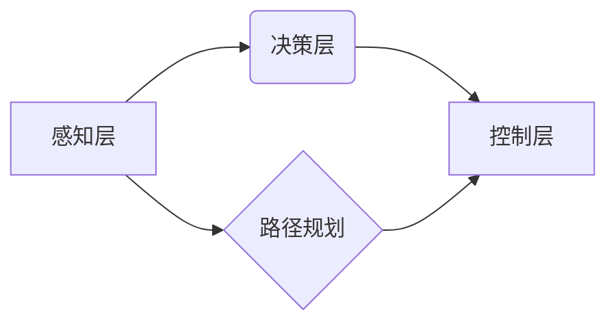

                 

## 人工智能在交通和自动驾驶中的应用

> 关键词：人工智能、自动驾驶、机器学习、深度学习、计算机视觉、传感器融合、路径规划、交通管理

## 1. 背景介绍

交通运输是现代社会不可或缺的一部分，然而，传统的交通系统面临着诸多挑战，例如交通拥堵、交通事故、能源消耗等。人工智能（AI）技术的快速发展为解决这些问题提供了新的思路和解决方案。

自动驾驶技术作为人工智能在交通领域的代表性应用，旨在通过传感器、机器学习算法和控制系统，实现车辆自主行驶，从而提高交通效率、安全性、舒适性和可持续性。

## 2. 核心概念与联系

**2.1 核心概念**

* **人工智能 (AI):** 人工智能是指模拟人类智能行为的计算机系统，包括学习、推理、决策、感知和语言理解等能力。
* **自动驾驶 (Autonomous Driving):** 自动驾驶是指车辆能够感知周围环境、规划路径、控制行驶，并实现自主行驶的系统。
* **机器学习 (Machine Learning):** 机器学习是人工智能的一个子领域，通过算法训练模型，使模型能够从数据中学习并做出预测或决策。
* **深度学习 (Deep Learning):** 深度学习是机器学习的一个子领域，利用多层神经网络模拟人类大脑的学习过程，能够处理更复杂的数据和任务。
* **计算机视觉 (Computer Vision):** 计算机视觉是指使计算机能够“看”和理解图像和视频的能力，是自动驾驶系统感知环境的重要技术。
* **传感器融合 (Sensor Fusion):** 传感器融合是指将来自多个传感器的数据进行融合，以获得更准确和可靠的环境感知信息。
* **路径规划 (Path Planning):** 路径规划是指根据目标位置和周围环境，规划车辆行驶的最佳路径。

**2.2 架构关系**



## 3. 核心算法原理 & 具体操作步骤

### 3.1 算法原理概述

自动驾驶系统依赖于多种机器学习算法，例如：

* **监督学习:** 利用标记数据训练模型，例如图像分类、物体检测、驾驶行为预测等。
* **强化学习:** 通过奖励和惩罚机制训练模型，例如路径规划、决策控制等。
* **无监督学习:** 从未标记数据中发现模式和结构，例如异常检测、驾驶风格识别等。

### 3.2 算法步骤详解

以物体检测为例，详细说明其算法步骤：

1. **数据采集:** 收集大量包含车辆、行人、交通信号灯等目标的图像数据。
2. **数据预处理:** 对图像数据进行裁剪、缩放、增强等处理，提高模型训练的效率和效果。
3. **模型选择:** 选择合适的深度学习模型，例如YOLO、SSD、Faster R-CNN等。
4. **模型训练:** 利用标记数据训练模型，调整模型参数，使模型能够准确识别目标。
5. **模型评估:** 使用测试数据评估模型的性能，例如准确率、召回率、平均精度等。
6. **模型部署:** 将训练好的模型部署到自动驾驶系统中，用于实时物体检测。

### 3.3 算法优缺点

**优点:**

* 高精度: 深度学习算法能够实现高精度的目标检测和识别。
* 鲁棒性: 深度学习模型能够适应不同的环境和条件。
* 可扩展性: 深度学习模型可以轻松扩展到处理更多类型的数据和任务。

**缺点:**

* 数据依赖: 深度学习算法需要大量标记数据进行训练。
* 计算资源: 深度学习模型训练和推理需要大量的计算资源。
* 黑盒效应: 深度学习模型的决策过程难以解释。

### 3.4 算法应用领域

* **自动驾驶:** 物体检测、路径规划、决策控制等。
* **交通管理:** 交通流量预测、拥堵检测、事故预警等。
* **智能交通信号灯:** 根据实时交通流量调整信号灯的绿灯时间。
* **车辆安全辅助系统:** 紧急制动、车道偏离预警、盲点监测等。

## 4. 数学模型和公式 & 详细讲解 & 举例说明

### 4.1 数学模型构建

自动驾驶系统中的许多算法都基于数学模型，例如路径规划、控制算法、预测模型等。

**路径规划模型:**

一个简单的路径规划模型可以利用**A*算法**，该算法通过评估节点到目标节点的代价和启发式函数，选择最优路径。

**公式:**

```latex
g(n) = cost(parent(n), n)
h(n) = estimated_cost(n, goal)
f(n) = g(n) + h(n)
```

其中：

* $g(n)$: 从起点到节点 $n$ 的实际代价。
* $h(n)$: 从节点 $n$ 到目标节点的估计代价。
* $f(n)$: 节点 $n$ 到目标节点的总代价。

**举例说明:**

假设一辆无人车需要从起点 A 到达终点 B，地图上存在障碍物。A*算法会评估每个节点到目标节点的代价和启发式函数，选择代价最低的路径。

### 4.2 公式推导过程

**控制算法:**

自动驾驶系统的控制算法通常基于**线性二次调节 (LQR)** 或 **模型预测控制 (MPC)** 等方法。

**LQR 公式:**

```latex
u = -K x
```

其中：

* $u$: 控制输入。
* $K$: 控制器增益矩阵。
* $x$: 系统状态向量。

**MPC 公式:**

```latex
u(t) = argmin_{u} \sum_{i=0}^{N-1} L(x(t+i), u(t+i)) + P(x(t+N))
```

其中：

* $u(t)$: 时刻 $t$ 的控制输入。
* $L$: 阶段代价函数。
* $P$: 最终代价函数。
* $N$: 控制预测步长。

### 4.3 案例分析与讲解

**预测模型:**

自动驾驶系统需要预测其他车辆、行人、交通信号灯等目标的运动轨迹。可以使用**Kalman滤波** 或 **粒子滤波** 等方法进行预测。

**Kalman滤波公式:**

```latex
\hat{x}_{k|k} = \hat{x}_{k|k-1} + K_k (y_k - h(\hat{x}_{k|k-1}))
```

其中：

* $\hat{x}_{k|k}$: 时刻 $k$ 的状态估计值。
* $\hat{x}_{k|k-1}$: 时刻 $k-1$ 的状态预测值。
* $K_k$: 卡尔曼增益。
* $y_k$: 时刻 $k$ 的观测值。
* $h(\cdot)$: 观测模型。

## 5. 项目实践：代码实例和详细解释说明

### 5.1 开发环境搭建

* **操作系统:** Ubuntu 18.04 或更高版本
* **编程语言:** Python 3.6 或更高版本
* **深度学习框架:** TensorFlow 或 PyTorch
* **其他工具:** OpenCV、NumPy、Pandas等

### 5.2 源代码详细实现

以下是一个简单的物体检测代码示例，使用 TensorFlow 和 YOLOv3 模型：

```python
import tensorflow as tf
from object_detection.utils import label_map_util
from object_detection.utils import visualization_utils as viz_utils

# 加载模型
model = tf.saved_model.load('path/to/model')

# 加载标签映射文件
category_index = label_map_util.create_category_index_from_labelmap('path/to/labelmap.pbtxt')

# 预处理图像
image_np = tf.io.read_file('path/to/image.jpg')
image_np = tf.image.decode_jpeg(image_np, channels=3)
image_np = tf.expand_dims(image_np, 0)

# 进行物体检测
detections = model(image_np)

# 可视化检测结果
viz_utils.visualize_boxes_and_labels_on_image_array(
    image_np[0],
    detections['detection_boxes'][0].numpy(),
    detections['detection_classes'][0].numpy().astype(int),
    detections['detection_scores'][0].numpy(),
    category_index,
    use_normalized_coordinates=True,
    max_boxes_to_draw=200,
    min_score_thresh=.30,
    agnostic_mode=False)

# 显示图像
plt.imshow(image_np[0])
plt.show()
```

### 5.3 代码解读与分析

* 该代码首先加载预训练的 YOLOv3 模型和标签映射文件。
* 然后，对输入图像进行预处理，将其转换为模型所需的格式。
* 使用模型进行物体检测，获取检测结果，包括 bounding box、类别和置信度。
* 最后，使用 OpenCV 库可视化检测结果，将检测框和类别标签绘制在图像上。

### 5.4 运行结果展示

运行该代码后，将显示一张带有检测框和类别标签的图像，展示了模型对图像中物体的检测结果。

## 6. 实际应用场景

### 6.1 自动驾驶汽车

自动驾驶汽车利用传感器数据、机器学习算法和控制系统，实现车辆自主行驶。

* **感知层:** 利用摄像头、雷达、激光雷达等传感器感知周围环境，识别车辆、行人、交通信号灯等目标。
* **决策层:** 利用机器学习算法分析感知到的环境信息，做出驾驶决策，例如加速、减速、转向、停车等。
* **控制层:** 控制车辆的动力系统、转向系统和制动系统，实现车辆的实际行驶。

### 6.2 智能交通管理

智能交通管理系统利用人工智能技术优化交通流量，提高道路通行效率。

* **交通流量预测:** 利用历史交通数据和实时传感器数据，预测未来交通流量，优化交通信号灯控制策略。
* **拥堵检测:** 利用传感器数据和机器学习算法，检测交通拥堵区域，并提供实时交通信息和建议。
* **事故预警:** 利用传感器数据和机器学习算法，识别潜在的交通事故风险，并发出预警信息。

### 6.3 其他应用场景

* **无人机:** 自动驾驶无人机用于物流运输、空中巡逻、农业喷洒等。
* **机器人:** 自动驾驶机器人用于工业自动化、服务机器人等领域。
* **智能城市:** 自动驾驶技术是构建智能城市的基石，可以提高城市交通效率、降低环境污染、提升居民生活质量。

### 6.4 未来应用展望

随着人工智能技术的不断发展，自动驾驶技术将更加成熟和普及，应用场景也将更加广泛。

* **完全自动驾驶:** 实现车辆完全自主行驶，无需人类干预。
* **个性化驾驶体验:** 根据用户的驾驶习惯和偏好，提供个性化的驾驶体验。
* **智能交通网络:** 建立智能交通网络，实现车辆之间协同行驶，提高交通效率和安全性。

## 7. 工具和资源推荐

### 7.1 学习资源推荐

* **书籍:**
    * 《深度学习》 - Ian Goodfellow, Yoshua Bengio, Aaron Courville
    * 《自动驾驶汽车》 -  Peter Corke
* **在线课程:**
    * Coursera: 深度学习 Specialization
    * Udacity: Self-Driving Car Engineer Nanodegree
* **开源项目:**
    * TensorFlow: https://www.tensorflow.org/
    * PyTorch: https://pytorch.org/
    * OpenAI Gym: https://gym.openai.com/

### 7.2 开发工具推荐

* **操作系统:** Ubuntu 18.04 或更高版本
* **编程语言:** Python 3.6 或更高版本
* **深度学习框架:** TensorFlow 或 PyTorch
* **其他工具:** OpenCV、NumPy、Pandas、ROS等

### 7.3 相关论文推荐

* **论文:**
    * "You Only Look Once: Unified, Real-Time Object Detection" - Redmon et al.
    * "End to End Learning for Self-Driving Cars" - Bojarski et al.
    * "Deep Reinforcement Learning for Autonomous Driving" - Schulman et al.

## 8. 总结：未来发展趋势与挑战

### 8.1 研究成果总结

近年来，人工智能在交通和自动驾驶领域取得了显著进展，例如：

* **物体检测精度大幅提升:** 深度学习算法使得物体检测精度达到人类水平。
* **路径规划算法更加智能:** 强化学习算法使路径规划更加灵活和安全。
* **自动驾驶系统更加可靠:** 融合多种传感器数据和算法，提高了自动驾驶系统的可靠性。

### 8.2 未来发展趋势

* **完全自动驾驶:** 实现车辆完全自主行驶，无需人类干预。
* **智能交通网络:** 建立智能交通网络，实现车辆之间协同行驶，提高交通效率和安全性。
* **个性化驾驶体验:** 根据用户的驾驶习惯和偏好，提供个性化的驾驶体验。

### 8.3 面临的挑战

* **数据安全:** 自动驾驶系统需要大量数据进行训练和运行，数据安全是一个重要的挑战。
* **伦理问题:** 自动驾驶系统面临着伦理困境，例如在紧急情况下如何做出决策。
* **法律法规:** 自动驾驶技术的应用需要完善的法律法规。

### 8.4 研究展望

未来，人工智能在交通和自动驾驶领域的研究将更加深入，例如：

* **更鲁棒的算法:** 开发更鲁棒的算法，能够应对复杂的环境和突发事件。
* **更安全的系统:** 提高自动驾驶系统的安全性，降低事故风险。
* **更智能的交互:** 实现人机交互更加智能化，提高驾驶体验。

## 9. 附录：常见问题与解答

**Q1: 自动驾驶技术什么时候能够普及？**

A1: 自动驾驶技术的普及时间取决于多种因素，例如技术发展、法规制定、公众接受度等。预计在未来 5-10 年内，部分地区将实现部分自动驾驶功能的普及，例如自动泊车、自动驾驶辅助等。完全自动驾驶可能还需要更长时间。

**Q2: 自动驾驶技术会取代人类驾驶员吗？**

A2: 自动驾驶技术可能会改变驾驶行业，但不会完全取代人类驾驶员。未来，人类驾驶员可能更多地扮演监督和决策的角色，例如在复杂环境下接管车辆控制。

**Q3: 自动驾驶技术有哪些安全风险？**

A3: 自动驾驶技术虽然能够提高交通安全，但也存在一些安全风险，例如传感器故障、算法错误、网络攻击等。需要不断完善技术和法规，降低这些风险。


作者：禅与计算机程序设计艺术 / Zen and the Art of Computer Programming<end_of_turn>

