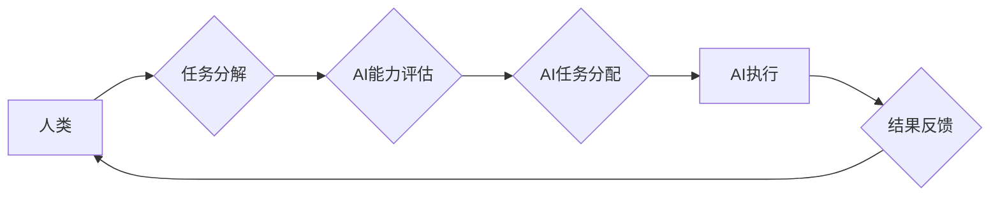

                 

## 人类-AI协作：增强人类潜能与AI能力的融合发展趋势预测分析总结挑战

> 关键词：人工智能、人类-AI协作、协同智能、增强人类潜能、AI能力提升、融合发展趋势、挑战与机遇

### 1. 背景介绍

人工智能（AI）技术近年来发展迅速，已渗透到各个领域，深刻地改变着人类的生活方式和工作模式。从自动驾驶、医疗诊断到金融分析、创意写作，AI正在展现出强大的应用潜力。然而，AI技术本身也存在局限性，例如缺乏人类的创造力、情感理解和复杂问题解决能力。因此，如何更好地将AI与人类智慧相结合，成为当前人工智能发展的重要课题。

人类-AI协作，即人类与人工智能系统共同完成任务，充分发挥各自优势，实现互补和协同，是应对这一挑战的有效途径。这种协作模式不仅可以提升工作效率和准确性，更重要的是可以帮助人类突破认知边界，拓展新的可能性。

### 2. 核心概念与联系

**2.1 核心概念**

* **人工智能（AI）：** 指计算机模拟人类智能行为的能力，包括学习、推理、决策、感知和语言理解等。
* **人类-AI协作：** 指人类与人工智能系统共同完成任务，双方相互补充，共同提高效率和效果。
* **协同智能：** 指人工智能系统与人类智能的融合，通过协作和交互，实现超越单一智能的更高水平的智能。

**2.2 架构图**



**2.3 联系分析**

人类-AI协作的核心在于将人类的智慧和创造力与AI的计算能力和数据处理能力相结合。

* **人类提供：** 
    * 复杂问题理解和定义
    * 战略决策和目标设定
    * 创造性思维和创新能力
    * 情感理解和社会认知
* **AI提供：**
    * 海量数据处理和分析
    * 快速准确的计算和推理
    * 预测和模式识别
    * 自动化任务执行

通过这种协作模式，人类可以专注于更高级别的思考和决策，而AI可以帮助人类完成重复性、耗时的任务，从而提高整体效率和效果。

### 3. 核心算法原理 & 具体操作步骤

**3.1 算法原理概述**

人类-AI协作的核心算法原理包括：

* **任务分解：** 将复杂任务分解成多个子任务，并根据任务特点分配给人类或AI执行。
* **智能代理：** 利用AI技术构建智能代理，帮助人类完成特定任务，例如日程安排、信息检索、数据分析等。
* **强化学习：** 通过强化学习算法，训练AI系统学习人类的决策模式和行为习惯，从而更好地协同人类完成任务。

**3.2 算法步骤详解**

1. **任务分析：** 首先需要对需要协作完成的任务进行详细分析，明确任务目标、输入输出、关键步骤等。
2. **角色分配：** 根据任务特点和人类和AI的优势，分配任务给人类或AI执行。
3. **数据准备：** 为AI系统提供必要的训练数据，例如历史数据、规则库、知识图谱等。
4. **模型训练：** 利用机器学习算法训练AI模型，使其能够理解任务需求、执行任务步骤、并与人类进行交互。
5. **任务执行：** 人类和AI系统根据分配的任务，协同完成任务。
6. **结果评估：** 对任务执行结果进行评估，并根据评估结果进行模型调整和优化。

**3.3 算法优缺点**

* **优点：**
    * 提高工作效率和准确性
    * 突破人类认知边界
    * 促进创新和创造
* **缺点：**
    * 需要复杂的算法和技术支持
    * 需要大量的数据和计算资源
    * 需要解决伦理和安全问题

**3.4 算法应用领域**

* **医疗保健：** AI辅助诊断、个性化治疗方案推荐
* **金融服务：** 风险评估、欺诈检测、投资决策
* **教育培训：** 个性化学习路径推荐、智能辅导系统
* **制造业：** 自动化生产、质量控制、设备维护
* **交通运输：** 自动驾驶、交通流量优化

### 4. 数学模型和公式 & 详细讲解 & 举例说明

**4.1 数学模型构建**

人类-AI协作可以抽象为一个多智能体系统，其中人类和AI分别代表不同的智能体。我们可以用以下数学模型来描述系统中的交互和协作：

* **状态空间：** 系统的当前状态，包括人类和AI的知识、目标、行为等。
* **动作空间：** 智能体可以执行的动作，例如人类决策、AI执行任务等。
* **奖励函数：** 衡量系统状态的优劣，引导智能体朝着目标方向行动。

**4.2 公式推导过程**

我们可以利用强化学习算法，例如Q-learning，来训练AI系统学习人类的决策模式和行为习惯。Q-learning的目标是学习一个Q函数，该函数可以预测在特定状态下执行特定动作的期望回报。

Q-learning算法的更新公式如下：

$$Q(s,a) = Q(s,a) + \alpha [r + \gamma \max_{a'} Q(s',a') - Q(s,a)]$$

其中：

* $Q(s,a)$ 是在状态 $s$ 下执行动作 $a$ 的期望回报
* $\alpha$ 是学习率
* $r$ 是当前状态的奖励
* $\gamma$ 是折扣因子
* $s'$ 是执行动作 $a$ 后进入的下一个状态
* $a'$ 是在下一个状态 $s'$ 中可以执行的动作

**4.3 案例分析与讲解**

例如，在医疗诊断领域，我们可以利用Q-learning算法训练AI系统学习人类医生的诊断模式。

* 状态空间：患者的症状、病史、检查结果等
* 动作空间：医生可以执行的诊断动作，例如询问病史、进行检查、诊断疾病等
* 奖励函数：根据诊断结果的准确性、患者的满意度等因素进行奖励

通过训练，AI系统可以学习到人类医生的诊断经验，并能够辅助医生进行诊断决策。

### 5. 项目实践：代码实例和详细解释说明

**5.1 开发环境搭建**

* 操作系统：Linux/Windows/macOS
* 编程语言：Python
* 深度学习框架：TensorFlow/PyTorch
* 其他工具：Git、Jupyter Notebook

**5.2 源代码详细实现**

以下是一个简单的Q-learning算法实现示例：

```python
import numpy as np

class QLearningAgent:
    def __init__(self, state_size, action_size, learning_rate=0.1, discount_factor=0.9, epsilon=0.1):
        self.state_size = state_size
        self.action_size = action_size
        self.learning_rate = learning_rate
        self.discount_factor = discount_factor
        self.epsilon = epsilon
        self.q_table = np.zeros((state_size, action_size))

    def choose_action(self, state):
        if np.random.uniform(0, 1) < self.epsilon:
            return np.random.randint(self.action_size)
        else:
            return np.argmax(self.q_table[state])

    def update_q_table(self, state, action, reward, next_state):
        self.q_table[state, action] += self.learning_rate * (reward + self.discount_factor * np.max(self.q_table[next_state]) - self.q_table[state, action])

# ... (其他代码实现)
```

**5.3 代码解读与分析**

* `QLearningAgent` 类实现了Q-learning算法的核心逻辑。
* `choose_action` 方法根据当前状态和epsilon值选择动作，其中epsilon值控制了探索和利用之间的平衡。
* `update_q_table` 方法根据Bellman方程更新Q表，学习在不同状态下执行不同动作的期望回报。

**5.4 运行结果展示**

通过训练和测试，可以观察到AI系统的Q表逐渐收敛，并能够做出越来越准确的决策。

### 6. 实际应用场景

**6.1 医疗保健**

* **辅助诊断：** AI系统可以分析患者的影像数据、病史和症状，辅助医生进行诊断。
* **个性化治疗：** AI系统可以根据患者的基因信息、生活方式和病史，推荐个性化的治疗方案。
* **药物研发：** AI系统可以加速药物研发过程，例如预测药物的活性、筛选潜在的药物靶点。

**6.2 金融服务**

* **风险评估：** AI系统可以分析客户的财务数据、信用记录和行为模式，评估其贷款风险。
* **欺诈检测：** AI系统可以识别异常交易行为，帮助金融机构防范欺诈。
* **投资决策：** AI系统可以分析市场数据、公司财务报表和新闻信息，为投资者提供投资建议。

**6.3 教育培训**

* **个性化学习：** AI系统可以根据学生的学习进度、知识掌握情况和学习风格，推荐个性化的学习内容和路径。
* **智能辅导：** AI系统可以解答学生的疑问、提供学习指导和反馈，帮助学生提高学习效率。
* **自动批改：** AI系统可以自动批改学生的作业和考试，节省教师的时间和精力。

**6.4 未来应用展望**

随着人工智能技术的不断发展，人类-AI协作将在更多领域得到应用，例如：

* **自动驾驶：** AI系统可以辅助驾驶员进行驾驶决策，提高驾驶安全性和效率。
* **机器人技术：** AI系统可以赋予机器人更强的感知、决策和执行能力，使其能够更好地协同人类完成任务。
* **创意设计：** AI系统可以辅助人类进行创意设计，例如生成音乐、绘画、文字等。

### 7. 工具和资源推荐

**7.1 学习资源推荐**

* **书籍：**
    * 《人工智能：一种现代方法》
    * 《深度学习》
    * 《机器学习》
* **在线课程：**
    * Coursera
    * edX
    * Udacity

**7.2 开发工具推荐**

* **深度学习框架：** TensorFlow, PyTorch, Keras
* **编程语言：** Python
* **数据处理工具：** Pandas, NumPy

**7.3 相关论文推荐**

* **人类-AI协作：**
    * "Human-AI Collaboration: A Survey"
    * "Towards Human-AI Collaboration: A Review of Recent Advances"
* **强化学习：**
    * "Reinforcement Learning: An Introduction"
    * "Deep Reinforcement Learning"

### 8. 总结：未来发展趋势与挑战

**8.1 研究成果总结**

近年来，人类-AI协作领域取得了显著进展，例如：

* **算法模型的改进：** 出现了更加高效、鲁棒的协作算法模型，例如强化学习、图神经网络等。
* **交互方式的创新：** 人类与AI的交互方式更加自然、直观，例如自然语言交互、虚拟现实交互等。
* **应用场景的拓展：** 人类-AI协作应用场景不断拓展，覆盖医疗、金融、教育、制造等多个领域。

**8.2 未来发展趋势**

* **更智能的AI协作伙伴：** AI系统将更加智能、具备更强的学习能力和适应能力，能够更好地理解人类需求和提供个性化服务。
* **更自然的人机交互：** 人类与AI的交互方式将更加自然、流畅，例如通过语音、图像、情感等多种方式进行交互。
* **协作智能的广泛应用：** 人类-AI协作将成为未来社会发展的重要趋势，应用于各个领域，推动社会进步。

**8.3 面临的挑战**

* **算法安全性和可靠性：** 确保AI系统安全可靠，避免算法偏差和错误决策。
* **数据隐私和安全：** 保护人类数据隐私，防止数据泄露和滥用。
* **伦理和社会影响：** 考虑人类-AI协作带来的伦理和社会影响，制定相应的规范和政策。

**8.4 研究展望**

未来研究方向包括：

* **更有效的协作算法：** 研究更有效的协作算法，提高人类-AI协作效率和效果。
* **更智能的人机交互：** 研究更智能、更自然的交互方式，增强人类与AI之间的理解和信任。
* **协作智能的社会影响评估：** 对人类-AI协作带来的社会影响进行评估，制定相应的政策和措施。

### 9. 附录：常见问题与解答

**9.1 如何选择合适的AI协作工具？**

选择AI协作工具需要根据具体应用场景、数据类型、技术需求等因素进行综合考虑。

**9.2 如何确保AI协作系统的安全性和可靠性？**

需要采取多种措施确保AI协作系统的安全性和可靠性，例如：

* 使用安全的算法和数据处理方法
* 进行严格的测试和评估
* 建立完善的监控和报警机制

**9.3 人类-AI协作会取代人类工作吗？**

人类-AI协作旨在增强人类能力，而不是取代人类工作。AI系统可以帮助人类完成重复性、耗时的任务，释放人类精力去从事更高级别的思考和创造。


作者：禅与计算机程序设计艺术 / Zen and the Art of Computer Programming 
<end_of_turn>

