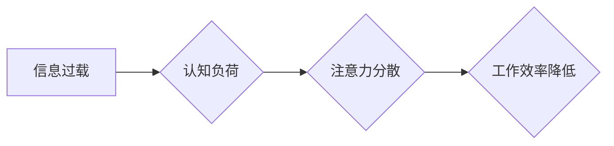

                 

## 企业如何在注意力经济中提高员工效率

> 关键词：注意力经济、员工效率、深度工作、专注力、认知负荷、番茄工作法、时间管理、数字工具、工作流程优化

## 1. 背景介绍

在当今信息爆炸的时代，我们身处一个名为“注意力经济”的全新环境中。在这个环境中，人们的注意力成为了最稀缺的资源，而获取和保持注意力成为了至关重要的竞争力。对于企业而言，如何帮助员工在纷繁的信息洪流中保持专注，提高工作效率，成为了一个亟待解决的问题。

注意力经济的本质在于，信息和内容的竞争日益激烈，人们需要花费更多的时间和精力来筛选和过滤信息，以找到真正有价值的内容。这种信息过载和注意力分散，导致人们的专注力下降，工作效率降低。

## 2. 核心概念与联系

### 2.1 注意力经济

注意力经济是指在信息时代，注意力成为一种稀缺资源，并被商业化和交易的经济模式。在这个模式中，企业通过提供吸引人的内容和服务，来争夺用户的注意力，从而获取商业利益。

### 2.2 深度工作

深度工作是指专注于一项任务，排除所有干扰，全身心投入，以达到最佳效率和创造力的状态。深度工作是提高员工效率的关键，因为它能够帮助员工集中精力，完成复杂的任务，并产生高质量的成果。

### 2.3 认知负荷

认知负荷是指大脑在处理信息时所承受的压力。当认知负荷过高时，会导致注意力分散、记忆力下降、决策能力减弱等问题。

**Mermaid 流程图**



## 3. 核心算法原理 & 具体操作步骤

### 3.1 算法原理概述

提高员工效率的核心算法在于优化工作流程，减少认知负荷，并帮助员工专注于深度工作。

### 3.2 算法步骤详解

1. **识别干扰源:** 首先，需要识别员工工作中的干扰源，例如电子邮件、社交媒体、即时通讯等。

2. **制定工作流程:** 根据员工的工作内容和特点，制定合理的、高效的工作流程，并明确每个阶段的任务和时间安排。

3. **利用番茄工作法:** 将工作时间划分为25分钟的专注工作时间和5分钟的休息时间，帮助员工保持专注力，避免疲劳。

4. **使用数字工具:** 利用各种数字工具，例如任务管理软件、时间跟踪软件、专注力辅助软件等，来帮助员工管理时间、提高效率。

5. **营造专注工作环境:** 为员工提供安静、舒适的工作环境，减少外界干扰，帮助他们更好地集中注意力。

### 3.3 算法优缺点

**优点:**

* 提高员工专注力，提升工作效率。
* 减少认知负荷，降低工作压力。
* 优化工作流程，提高工作质量。

**缺点:**

* 需要员工适应新的工作模式。
* 需要企业投入时间和资源进行流程优化和工具选型。

### 3.4 算法应用领域

该算法适用于所有需要高度专注力的工作领域，例如软件开发、写作、设计、研究等。

## 4. 数学模型和公式 & 详细讲解 & 举例说明

### 4.1 数学模型构建

我们可以用以下数学模型来描述注意力经济中的注意力分配问题：

$$
Attention = \frac{Value}{Distraction}
$$

其中：

* **Attention:** 指的是员工对特定任务的注意力水平。
* **Value:** 指的是完成该任务的价值或收益。
* **Distraction:** 指的是来自外界干扰的程度。

### 4.2 公式推导过程

该公式的推导过程基于以下假设：

* 员工的注意力会根据任务的价值和干扰程度进行分配。
* 任务的价值越高，员工的注意力就越集中。
* 干扰程度越高，员工的注意力就越分散。

### 4.3 案例分析与讲解

假设一个员工需要完成一项重要任务，该任务的价值为100，而来自电子邮件和社交媒体的干扰程度为20。根据公式，该员工对该任务的注意力水平为：

$$
Attention = \frac{100}{20} = 5
$$

这意味着该员工对该任务的注意力水平较高，能够有效地完成任务。

## 5. 项目实践：代码实例和详细解释说明

### 5.1 开发环境搭建

为了实现注意力经济中的效率提升算法，我们可以使用以下开发环境：

* 操作系统：Windows、macOS、Linux
* 编程语言：Python
* 开发工具：VS Code、PyCharm

### 5.2 源代码详细实现

以下是一个简单的Python代码示例，用于实现番茄工作法：

```python
import time

def pomodoro():
    print("开始番茄工作时间...")
    time.sleep(25 * 60)  # 工作25分钟
    print("休息时间...")
    time.sleep(5 * 60)  # 休息5分钟

while True:
    pomodoro()
```

### 5.3 代码解读与分析

该代码实现了一个简单的番茄工作法计时器。

* `pomodoro()` 函数模拟一个番茄工作周期，包括25分钟的工作时间和5分钟的休息时间。
* `time.sleep()` 函数用于暂停程序执行，模拟工作和休息时间。
* `while True` 循环使计时器无限循环，直到用户手动中断。

### 5.4 运行结果展示

运行该代码后，程序会每隔25分钟提醒用户开始工作，并在5分钟后提醒用户休息。

## 6. 实际应用场景

### 6.1 企业应用

* **软件开发:** 利用番茄工作法和专注力辅助软件，帮助开发人员提高代码编写效率。
* **市场营销:** 利用数据分析工具，分析用户注意力分布，优化营销内容和策略。
* **客服服务:** 利用聊天机器人和智能客服系统，减少客服人员的认知负荷，提高服务效率。

### 6.2 个人应用

* **学习:** 利用番茄工作法和专注力辅助软件，提高学习效率，克服拖延症。
* **写作:** 利用写作软件和专注力辅助软件，帮助写作人员集中注意力，提高写作质量。
* **生活:** 利用时间管理工具和专注力辅助软件，合理安排时间，提高生活效率。

### 6.4 未来应用展望

随着人工智能技术的不断发展，注意力经济中的应用场景将会更加广泛。未来，我们可以期待看到：

* 更智能的注意力管理工具，能够根据用户的习惯和需求，自动调整工作和休息时间。
* 更精准的注意力分析工具，能够帮助企业和个人更深入地了解用户的注意力模式，并制定更有效的策略。
* 更个性化的注意力体验，能够根据用户的不同需求，提供不同的注意力管理方案。

## 7. 工具和资源推荐

### 7.1 学习资源推荐

* 书籍：《深度工作》、《注意力经济》
* 网站：Harvard Business Review、MIT Technology Review
* 课程：Coursera、edX

### 7.2 开发工具推荐

* 任务管理软件：Trello、Asana、Todoist
* 时间跟踪软件：Toggl、RescueTime、Clockify
* 专注力辅助软件：Freedom、Forest、Noisli

### 7.3 相关论文推荐

* "Attention Is All You Need"
* "Deep Learning"
* "The Attention Economy"

## 8. 总结：未来发展趋势与挑战

### 8.1 研究成果总结

本文探讨了注意力经济的概念，并提出了提高员工效率的算法原理和具体操作步骤。通过优化工作流程、减少认知负荷、帮助员工专注于深度工作，企业可以有效地提高员工效率，提升工作质量。

### 8.2 未来发展趋势

注意力经济将继续发展，并对我们的生活和工作产生越来越大的影响。未来，我们将看到更多更智能的注意力管理工具和更精准的注意力分析工具的出现，帮助企业和个人更好地应对注意力经济的挑战。

### 8.3 面临的挑战

注意力经济也面临着一些挑战，例如：

* 如何保护用户的隐私和数据安全。
* 如何避免注意力经济过度商业化，导致用户注意力被过度操纵。
* 如何平衡注意力经济的发展与其他社会价值观，例如公平、正义、平等。

### 8.4 研究展望

未来，我们需要继续深入研究注意力经济的本质，探索更有效的注意力管理方法，并制定相应的政策和规范，以确保注意力经济的健康发展。

## 9. 附录：常见问题与解答

**Q1: 如何才能更好地集中注意力？**

**A1:** 

* 营造安静、舒适的工作环境。
* 利用番茄工作法和专注力辅助软件。
* 避免使用手机和社交媒体等干扰源。
* 保证充足的睡眠和健康的饮食。

**Q2: 如何才能提高工作效率？**

**A2:** 

* 明确工作目标和优先级。
* 制定合理的、高效的工作流程。
* 利用数字工具管理时间和任务。
* 避免多任务处理，专注于一项任务。

**Q3: 注意力经济对个人和社会有什么影响？**

**A3:** 注意力经济对个人和社会的影响是多方面的，既有积极的一面，也有消极的一面。

* 积极方面：注意力经济促进了信息传播和知识共享，提高了工作效率和生活质量。
* 消极方面：注意力经济也可能导致注意力分散、信息过载、认知负荷过高等问题，影响个人身心健康和社会和谐发展。


作者：禅与计算机程序设计艺术 / Zen and the Art of Computer Programming 
<end_of_turn>

