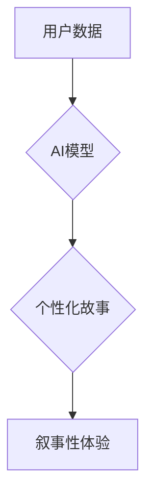

                 

## 体验的叙事性：AI驱动的个人故事创作

> 关键词：人工智能、自然语言处理、故事创作、叙事性体验、个性化内容

## 1. 背景介绍

在数字时代，我们沉浸在海量信息和数据之中。然而，信息爆炸也带来了一个新的挑战：如何将冰冷的数据转化为感人至深的体验？故事，作为人类表达情感和传递知识最古老的形式，拥有独特的魅力。它能够将抽象的概念具象化，将冰冷的数据赋予情感，并引导人们进行深度思考和共鸣。

近年来，人工智能（AI）技术突飞猛进，特别是自然语言处理（NLP）领域取得了突破性进展。AI模型能够理解和生成人类语言，甚至能够创作出具有叙事性的文本。这为我们带来了一个全新的可能性：利用AI技术，我们可以个性化地创作故事，并为用户提供沉浸式的叙事性体验。

## 2. 核心概念与联系

**2.1 叙事性体验**

叙事性体验是指通过故事、情节、人物等元素，引发用户情感共鸣、产生思考和记忆，从而获得一种身临其境、难忘的体验。

**2.2 AI驱动的个人故事创作**

AI驱动的个人故事创作是指利用人工智能技术，根据用户的个人信息、喜好、经历等数据，生成个性化的故事。

**2.3 核心概念关系**

AI驱动的个人故事创作的核心在于将叙事性体验与AI技术相结合。通过分析用户的个人数据，AI模型能够生成符合用户兴趣和情感需求的故事，从而提供个性化的叙事性体验。

**Mermaid 流程图**



## 3. 核心算法原理 & 具体操作步骤

**3.1 算法原理概述**

AI驱动的个人故事创作通常采用基于深度学习的生成式模型，例如GPT-3、T5等。这些模型通过训练大量的文本数据，学习语言的结构和规律，并能够根据输入的文本提示生成新的文本。

**3.2 算法步骤详解**

1. **数据收集和预处理:** 收集用户的个人信息、喜好、经历等数据，并进行清洗、格式化等预处理。
2. **模型训练:** 利用收集到的数据训练生成式模型，使其能够生成符合用户需求的故事。
3. **故事生成:** 根据用户的输入提示，例如人物、场景、主题等，模型生成个性化的故事文本。
4. **故事评估和优化:** 对生成的文本进行评估，例如流畅度、逻辑性、情感表达等，并根据评估结果进行优化。

**3.3 算法优缺点**

**优点:**

* **个性化:** 可以根据用户的个人信息生成个性化的故事。
* **沉浸式体验:** 可以通过生动的语言和情节，为用户提供沉浸式的叙事性体验。
* **效率高:** 可以快速生成大量的故事，满足用户的个性化需求。

**缺点:**

* **数据依赖:** 算法的性能取决于训练数据的质量和数量。
* **缺乏创造力:** 算法生成的文本可能缺乏原创性和想象力。
* **伦理问题:** 需要考虑AI生成的文本可能带来的伦理问题，例如虚假信息、偏见等。

**3.4 算法应用领域**

* **教育:** 生成个性化的学习故事，提高学生的学习兴趣和效果。
* **娱乐:** 创建互动式游戏、虚拟现实体验等，为用户提供沉浸式的娱乐体验。
* **营销:** 生成个性化的广告文案、产品故事等，提高营销效果。
* **心理咨询:** 生成模拟场景，帮助用户进行情绪管理和心理疏导。

## 4. 数学模型和公式 & 详细讲解 & 举例说明

**4.1 数学模型构建**

AI驱动的个人故事创作通常采用基于概率的语言模型，例如条件概率语言模型（CPM）。CPM假设每个单词的出现概率取决于其前文单词的序列。

**4.2 公式推导过程**

假设我们有一个训练语料库，包含一系列文本片段。我们可以使用最大似然估计（MLE）来估计每个单词的条件概率。

$$P(w_i|w_{i-1}, w_{i-2}, ..., w_{i-n}) = \frac{\text{count}(w_{i-n}, w_{i-n+1}, ..., w_{i})}{\text{count}(w_{i-n}, w_{i-n+1}, ..., w_{i-1})}$$

其中：

* $w_i$ 是第 $i$ 个单词
* $w_{i-1}, w_{i-2}, ..., w_{i-n}$ 是 $w_i$ 前 $n$ 个单词
* $\text{count}(w_{i-n}, w_{i-n+1}, ..., w_{i})$ 是在语料库中出现 $w_{i-n}, w_{i-n+1}, ..., w_{i}$ 序列的次数
* $\text{count}(w_{i-n}, w_{i-n+1}, ..., w_{i-1})$ 是在语料库中出现 $w_{i-n}, w_{i-n+1}, ..., w_{i-1}$ 序列的次数

**4.3 案例分析与讲解**

假设我们训练了一个语言模型，并输入提示“小明去公园玩”。模型根据训练数据，可以预测下一个单词可能是“了”。

$$P(\text{了}| \text{小明去公园玩}) > P(\text{吃}| \text{小明去公园玩})$$

因为在训练语料库中，“小明去公园玩了” 出现的频率比 “小明去公园玩吃” 高。

## 5. 项目实践：代码实例和详细解释说明

**5.1 开发环境搭建**

* Python 3.7+
* TensorFlow 或 PyTorch 深度学习框架
* Jupyter Notebook 或 VS Code 代码编辑器

**5.2 源代码详细实现**

```python
import tensorflow as tf

# 定义模型架构
model = tf.keras.Sequential([
    tf.keras.layers.Embedding(input_dim=vocab_size, output_dim=embedding_dim),
    tf.keras.layers.LSTM(units=128),
    tf.keras.layers.Dense(units=vocab_size, activation='softmax')
])

# 编译模型
model.compile(optimizer='adam', loss='sparse_categorical_crossentropy', metrics=['accuracy'])

# 训练模型
model.fit(train_data, train_labels, epochs=10)

# 生成故事
def generate_story(prompt):
    # 将提示转换为数字序列
    input_sequence = tokenizer.texts_to_sequences([prompt])[0]
    # 生成故事文本
    generated_text = model.predict(input_sequence)
    # 将数字序列转换为文本
    return tokenizer.sequences_to_texts(generated_text)[0]

# 生成故事示例
story = generate_story("小明去公园玩")
print(story)
```

**5.3 代码解读与分析**

* 代码首先定义了一个基于LSTM的文本生成模型。
* 模型使用Embedding层将单词转换为向量表示，LSTM层捕捉文本序列的上下文信息，Dense层输出每个单词的概率分布。
* 模型使用Adam优化器和交叉熵损失函数进行训练。
* `generate_story`函数用于根据用户输入的提示生成故事文本。

**5.4 运行结果展示**

运行代码后，模型会根据输入的提示“小明去公园玩”生成一个故事文本。

## 6. 实际应用场景

**6.1 教育领域**

* 生成个性化的学习故事，帮助学生理解复杂的知识点。
* 创建互动式游戏，提高学生的学习兴趣和参与度。

**6.2 娱乐领域**

* 创建互动式小说、虚拟现实体验等，为用户提供沉浸式的娱乐体验。
* 生成个性化的游戏剧情，提高游戏的趣味性和可玩性。

**6.3 营销领域**

* 生成个性化的广告文案、产品故事等，提高营销效果。
* 创建互动式营销活动，增强用户参与度和品牌忠诚度。

**6.4 未来应用展望**

* AI驱动的个人故事创作将更加智能化、个性化和沉浸式。
* 将与其他技术融合，例如虚拟现实、增强现实等，创造更加丰富的体验。
* 在医疗、心理咨询等领域发挥更大的作用。

## 7. 工具和资源推荐

**7.1 学习资源推荐**

* **书籍:**
    * 《深度学习》
    * 《自然语言处理》
* **在线课程:**
    * Coursera: 自然语言处理
    * edX: 深度学习

**7.2 开发工具推荐**

* **TensorFlow:** 开源深度学习框架
* **PyTorch:** 开源深度学习框架
* **Hugging Face Transformers:** 预训练语言模型库

**7.3 相关论文推荐**

* **Attention Is All You Need**
* **BERT: Pre-training of Deep Bidirectional Transformers for Language Understanding**
* **GPT-3: Language Models are Few-Shot Learners**

## 8. 总结：未来发展趋势与挑战

**8.1 研究成果总结**

AI驱动的个人故事创作取得了显著进展，能够生成具有叙事性的文本，并为用户提供个性化的体验。

**8.2 未来发展趋势**

* 模型更加智能化、个性化和沉浸式。
* 与其他技术融合，例如虚拟现实、增强现实等。
* 在更多领域发挥作用，例如医疗、心理咨询等。

**8.3 面临的挑战**

* 数据质量和数量
* 算法的创造力和想象力
* 伦理问题，例如虚假信息、偏见等

**8.4 研究展望**

* 研究更先进的生成式模型，提高故事的质量和多样性。
* 开发新的算法，赋予AI模型更强的创造力和想象力。
* 探索AI驱动的个人故事创作的伦理问题，并制定相应的规范和标准。

## 9. 附录：常见问题与解答

**9.1 如何选择合适的训练数据？**

训练数据的质量和数量直接影响模型的性能。选择与目标故事类型相关的丰富、高质量的文本数据。

**9.2 如何评估生成的文本质量？**

可以使用多种指标评估生成的文本质量，例如流畅度、逻辑性、情感表达等。

**9.3 如何避免AI生成的文本出现偏见？**

在训练数据中去除偏见，并使用公平性评估指标，可以帮助避免AI生成的文本出现偏见。


作者：禅与计算机程序设计艺术 / Zen and the Art of Computer Programming 
<end_of_turn>

