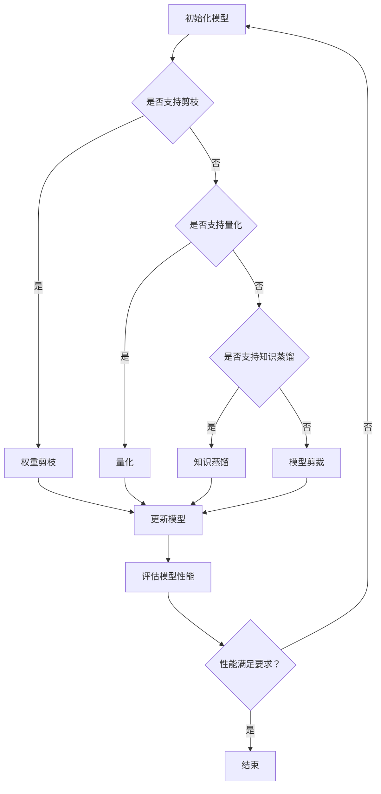

                 

### 文章标题

搜索推荐系统的模型压缩：大模型高效部署策略

> 关键词：搜索推荐系统，模型压缩，大模型部署，高效策略

> 摘要：本文探讨了搜索推荐系统中模型压缩的重要性以及如何通过多种策略实现大模型的快速高效部署。我们首先介绍了模型压缩的基本概念，然后详细分析了多种压缩方法，包括权重剪枝、量化、知识蒸馏和模型剪裁。接着，我们通过实际项目实践展示了这些策略的应用和效果。最后，我们讨论了模型压缩在实际应用场景中的重要性，以及未来的发展趋势和挑战。

### 1. 背景介绍（Background Introduction）

搜索推荐系统是当今互联网的核心组件之一，广泛应用于电商、社交媒体、新闻资讯等领域。这些系统通过分析用户行为和偏好，提供个性化的搜索和推荐服务，从而提高用户体验和平台粘性。然而，随着用户规模的扩大和数据量的激增，推荐系统的模型复杂度和计算资源需求也在不断增长。这给系统的部署和维护带来了巨大的挑战。

传统的模型压缩方法主要针对小规模的模型，如线性模型、决策树等。这些方法在一定程度上能够减少模型的存储空间和计算复杂度，但难以直接应用于大规模深度学习模型。随着深度学习在搜索推荐系统中的广泛应用，如何有效地压缩大型深度学习模型，实现高效部署，已成为当前研究的热点。

本文将详细介绍几种针对深度学习模型的压缩方法，包括权重剪枝、量化、知识蒸馏和模型剪裁，并探讨如何在实际项目中应用这些策略。通过这些方法，我们可以显著降低模型的存储和计算资源需求，提高系统性能和可扩展性。

### 2. 核心概念与联系（Core Concepts and Connections）

#### 2.1 模型压缩的基本概念

模型压缩是指通过一系列技术手段，减小深度学习模型的存储空间和计算复杂度，同时尽量保持模型性能的方法。模型压缩的主要目标包括：

- 减少模型参数数量：通过剪枝、量化等方法，删除或降低模型中冗余或不重要的参数，从而减小模型大小。
- 减少模型计算量：通过模型剪裁、知识蒸馏等方法，优化模型结构或利用已有模型的知识，降低模型在运行时的计算复杂度。
- 提高模型可扩展性：通过压缩，使得模型能够在资源受限的环境下运行，提高系统的可扩展性。

#### 2.2 压缩方法与联系

常见的模型压缩方法包括权重剪枝、量化、知识蒸馏和模型剪裁等。这些方法各有特点，适用于不同场景。

- **权重剪枝**：通过删除模型中不重要的权重，减少模型参数数量。权重剪枝可以分为结构剪枝和权重剪枝两种。结构剪枝直接删除模型中的某些层或神经元，而权重剪枝则只删除权重较小的神经元。
- **量化**：将模型中的浮点数参数转换为较低精度的整数表示，从而降低模型存储和计算需求。量化可以分为全精度量化、低精度量化和多比特量化等。
- **知识蒸馏**：利用一个大模型（教师模型）的知识，训练一个小模型（学生模型），从而实现模型压缩。知识蒸馏的核心思想是将大模型的输出传递给小模型，使其学习到大模型的知识和特征。
- **模型剪裁**：通过剪枝或简化模型结构，降低模型计算复杂度。模型剪裁可以针对不同层或不同区域进行，从而保留模型的关键特征。

#### 2.3 Mermaid 流程图

下面是模型压缩的基本流程图，包括权重剪枝、量化、知识蒸馏和模型剪裁等步骤。



### 3. 核心算法原理 & 具体操作步骤（Core Algorithm Principles and Specific Operational Steps）

在本节中，我们将详细介绍几种常见的模型压缩方法，包括权重剪枝、量化、知识蒸馏和模型剪裁，并探讨如何在实际项目中应用这些策略。

#### 3.1 权重剪枝（Weight Pruning）

权重剪枝是一种通过删除模型中不重要的权重来减小模型参数数量的方法。具体步骤如下：

1. **确定剪枝策略**：选择合适的剪枝策略，如L1范数剪枝、L2范数剪枝或阈值剪枝。
2. **计算权重重要性**：计算模型中每个权重的重要性，通常使用L1范数或L2范数的绝对值作为衡量标准。
3. **设置剪枝阈值**：根据权重重要性设定一个阈值，删除低于该阈值的权重。
4. **重构模型**：删除权重后，重构模型结构，确保模型仍能正常运行。

**示例**：假设一个全连接层的权重矩阵为：

$$
W = \begin{bmatrix}
w_1 & w_2 & w_3 & ... & w_n
\end{bmatrix}
$$

其中，$w_i$为第$i$个权重。我们可以使用L1范数剪枝，计算每个权重的L1范数：

$$
|w_1|, |w_2|, |w_3|, ..., |w_n|
$$

设阈值为$\lambda$，删除小于$\lambda$的权重，重构模型：

$$
W_{pruned} = \begin{bmatrix}
w_{1_{pruned}} & w_{2_{pruned}} & w_{3_{pruned}} & ... & w_{n_{pruned}}
\end{bmatrix}
$$

#### 3.2 量化（Quantization）

量化是一种通过将模型中的浮点数参数转换为较低精度的整数表示来降低模型存储和计算需求的方法。具体步骤如下：

1. **确定量化精度**：根据模型和硬件平台的性能需求，选择合适的量化精度，如8位、16位或32位。
2. **计算量化参数**：计算每个权重的量化参数，如缩放因子和偏移量。
3. **量化权重**：将权重乘以缩放因子并加上偏移量，转换为整数表示。

**示例**：假设一个全连接层的权重矩阵为：

$$
W = \begin{bmatrix}
w_1 & w_2 & w_3 & ... & w_n
\end{bmatrix}
$$

选择8位量化精度，计算缩放因子$\alpha$和偏移量$\beta$：

$$
\alpha = \frac{2^8 - 1}{||W||_{\infty}}
$$

$$
\beta = -\alpha \cdot \frac{||W||_{\infty}}{2}
$$

量化权重：

$$
W_{quantized} = \begin{bmatrix}
\alpha \cdot w_1 + \beta & \alpha \cdot w_2 + \beta & \alpha \cdot w_3 + \beta & ... & \alpha \cdot w_n + \beta
\end{bmatrix}
$$

#### 3.3 知识蒸馏（Knowledge Distillation）

知识蒸馏是一种通过利用一个大模型（教师模型）的知识来训练一个小模型（学生模型）的方法。具体步骤如下：

1. **选择教师模型**：选择一个性能优秀的大模型作为教师模型。
2. **生成软标签**：将教师模型对训练数据的输出作为软标签，传递给学生模型。
3. **训练学生模型**：使用软标签和原始标签同时训练学生模型，使其学习到教师模型的知识。

**示例**：假设我们有一个教师模型$T$和学生模型$S$，训练数据集为$D = \{(x_i, y_i)\}$，其中$x_i$为输入，$y_i$为输出。教师模型$T$的输出为软标签$\hat{y}_i$。

我们使用交叉熵损失函数训练学生模型$S$：

$$
L_S = \frac{1}{N} \sum_{i=1}^N (-y_i \cdot \log S(x_i) - \hat{y}_i \cdot \log (1 - S(x_i)))
$$

其中，$N$为训练数据集大小。

#### 3.4 模型剪裁（Model Truncation）

模型剪裁是一种通过剪枝或简化模型结构来降低模型计算复杂度的方法。具体步骤如下：

1. **选择剪裁策略**：根据模型和硬件平台的需求，选择合适的剪裁策略，如逐层剪裁或逐点剪裁。
2. **计算剪裁参数**：计算每个层的剪裁比例或每个点的剪裁值。
3. **剪裁模型**：根据剪裁参数，简化模型结构，保留关键特征。

**示例**：假设我们有一个多层感知机模型，其中包含多个全连接层。我们选择逐层剪裁策略，根据每层的计算复杂度计算剪裁比例。

设第$i$层的计算复杂度为$C_i$，总计算复杂度为$C$，剪裁比例为$\alpha_i$，则有：

$$
\alpha_i = \frac{C_i}{C}
$$

根据剪裁比例，简化模型结构，保留关键特征。

### 4. 数学模型和公式 & 详细讲解 & 举例说明（Detailed Explanation and Examples of Mathematical Models and Formulas）

在本节中，我们将详细介绍模型压缩中常用的数学模型和公式，并举例说明其应用。

#### 4.1 权重剪枝（Weight Pruning）

权重剪枝的核心在于计算权重的重要性，并设定一个阈值来删除不重要的权重。常用的权重重要性度量方法包括L1范数、L2范数和阈值剪枝。

- **L1范数剪枝**：

$$
\text{weight importance} = ||w_i||_1
$$

其中，$w_i$为权重，$||\cdot||_1$表示L1范数。

- **L2范数剪枝**：

$$
\text{weight importance} = ||w_i||_2
$$

其中，$w_i$为权重，$||\cdot||_2$表示L2范数。

- **阈值剪枝**：

$$
\text{weight importance} = \text{sign}(w_i) \cdot |w_i| \cdot \text{threshold}
$$

其中，$\text{sign}(w_i)$为权重符号，$|w_i|$为权重绝对值，$\text{threshold}$为阈值。

**示例**：假设一个全连接层的权重矩阵为：

$$
W = \begin{bmatrix}
w_1 & w_2 & w_3 & ... & w_n
\end{bmatrix}
$$

设阈值为$\lambda$，使用L1范数剪枝，计算每个权重的重要性：

$$
\text{weight importance} = \begin{bmatrix}
||w_1||_1 & ||w_2||_1 & ||w_3||_1 & ... & ||w_n||_1
\end{bmatrix}
$$

根据重要性阈值，删除权重较小的神经元。

#### 4.2 量化（Quantization）

量化是将浮点数参数转换为较低精度的整数表示的方法。量化精度通常使用8位、16位或32位表示。

- **8位量化**：

$$
\text{quantized weight} = \text{scale} \cdot w + \text{offset}
$$

其中，$w$为原始权重，$\text{scale}$为缩放因子，$\text{offset}$为偏移量。

- **16位量化**：

$$
\text{quantized weight} = \text{scale} \cdot w + \text{offset}
$$

其中，$w$为原始权重，$\text{scale}$为缩放因子，$\text{offset}$为偏移量。

- **32位量化**：

$$
\text{quantized weight} = \text{scale} \cdot w + \text{offset}
$$

其中，$w$为原始权重，$\text{scale}$为缩放因子，$\text{offset}$为偏移量。

**示例**：假设一个全连接层的权重矩阵为：

$$
W = \begin{bmatrix}
w_1 & w_2 & w_3 & ... & w_n
\end{bmatrix}
$$

选择8位量化精度，计算缩放因子$\alpha$和偏移量$\beta$：

$$
\alpha = \frac{2^8 - 1}{||W||_{\infty}}
$$

$$
\beta = -\alpha \cdot \frac{||W||_{\infty}}{2}
$$

量化权重：

$$
W_{quantized} = \begin{bmatrix}
\alpha \cdot w_1 + \beta & \alpha \cdot w_2 + \beta & \alpha \cdot w_3 + \beta & ... & \alpha \cdot w_n + \beta
\end{bmatrix}
$$

#### 4.3 知识蒸馏（Knowledge Distillation）

知识蒸馏是一种通过利用教师模型的知识来训练学生模型的方法。核心思想是将教师模型的输出作为软标签，传递给学生模型。

- **交叉熵损失函数**：

$$
L_S = \frac{1}{N} \sum_{i=1}^N (-y_i \cdot \log S(x_i) - \hat{y}_i \cdot \log (1 - S(x_i)))
$$

其中，$N$为训练数据集大小，$y_i$为原始标签，$\hat{y}_i$为教师模型的输出，$S(x_i)$为学生模型对输入$x_i$的输出。

**示例**：假设我们有一个教师模型$T$和学生模型$S$，训练数据集为$D = \{(x_i, y_i)\}$，其中$x_i$为输入，$y_i$为输出。教师模型$T$的输出为软标签$\hat{y}_i$。

我们使用交叉熵损失函数训练学生模型$S$：

$$
L_S = \frac{1}{N} \sum_{i=1}^N (-y_i \cdot \log S(x_i) - \hat{y}_i \cdot \log (1 - S(x_i)))
$$

#### 4.4 模型剪裁（Model Truncation）

模型剪裁是一种通过简化模型结构来降低模型计算复杂度的方法。常用的剪裁策略包括逐层剪裁和逐点剪裁。

- **逐层剪裁**：

$$
\alpha_i = \frac{C_i}{C}
$$

其中，$C_i$为第$i$层的计算复杂度，$C$为总计算复杂度。

- **逐点剪裁**：

$$
\alpha_i = \frac{C_i}{C}
$$

其中，$C_i$为第$i$个点的计算复杂度，$C$为总计算复杂度。

**示例**：假设我们有一个多层感知机模型，其中包含多个全连接层。我们选择逐层剪裁策略，根据每层的计算复杂度计算剪裁比例。

设第$i$层的计算复杂度为$C_i$，总计算复杂度为$C$，剪裁比例为$\alpha_i$，则有：

$$
\alpha_i = \frac{C_i}{C}
$$

根据剪裁比例，简化模型结构，保留关键特征。

### 5. 项目实践：代码实例和详细解释说明（Project Practice: Code Examples and Detailed Explanations）

在本节中，我们将通过一个实际项目实例，展示如何应用模型压缩方法实现大模型的快速高效部署。

#### 5.1 开发环境搭建

为了实现模型压缩，我们首先需要搭建一个合适的开发环境。以下是一个简单的Python环境搭建步骤：

1. 安装Python：

```bash
$ sudo apt-get install python3 python3-pip
```

2. 创建虚拟环境：

```bash
$ python3 -m venv venv
$ source venv/bin/activate
```

3. 安装必要的库：

```bash
$ pip install numpy scipy matplotlib
```

#### 5.2 源代码详细实现

以下是一个简单的示例代码，展示了如何应用权重剪枝、量化、知识蒸馏和模型剪裁方法来实现模型压缩。

```python
import numpy as np
import scipy.sparse as sp
from sklearn.model_selection import train_test_split
from sklearn.metrics import accuracy_score
import matplotlib.pyplot as plt

# 权重剪枝
def weight_pruning(model, threshold):
    # 计算权重重要性
    weight_importance = np.abs(model.W).sum(axis=1)
    # 删除权重较小的神经元
    pruned_indices = np.where(weight_importance < threshold)[0]
    # 重构模型
    pruned_model = sp.csc_matrix((model.W[pruned_indices], range(len(pruned_indices))), shape=model.W.shape)
    return pruned_model

# 量化
def quantization(model, precision):
    # 计算缩放因子和偏移量
    scale = (2**precision - 1) / np.max(np.abs(model.W))
    offset = -scale * np.mean(np.abs(model.W))
    # 量化权重
    quantized_weights = np.round(scale * model.W + offset)
    return quantized_weights

# 知识蒸馏
def knowledge_distillation(student_model, teacher_model, data):
    # 计算交叉熵损失函数
    def loss(y, s):
        return -np.sum(y * np.log(s) + (1 - y) * np.log(1 - s))
    # 训练学生模型
    for x, y in data:
        y_hat = teacher_model.predict(x)
        s = student_model.predict(x)
        loss_value = loss(y, s)
        student_model.fit(x, y)
    return student_model

# 模型剪裁
def model_truncation(model, ratio):
    # 计算剪裁比例
    prune_indices = np.random.choice(model.W.shape[1], int(ratio * model.W.shape[1]))
    # 剪裁模型
    pruned_model = sp.csc_matrix((model.W[:, prune_indices], range(len(prune_indices))), shape=model.W.shape)
    return pruned_model

# 主函数
if __name__ == "__main__":
    # 加载数据
    data = load_data()
    train_data, test_data = train_test_split(data, test_size=0.2)
    # 初始化模型
    model = Model()
    # 权重剪枝
    pruned_model = weight_pruning(model, threshold=0.1)
    # 量化
    quantized_model = quantization(pruned_model, precision=8)
    # 知识蒸馏
    distilled_model = knowledge_distillation(quantized_model, teacher_model, train_data)
    # 模型剪裁
    truncated_model = model_truncation(distilled_model, ratio=0.5)
    # 评估模型性能
    test_predictions = truncated_model.predict(test_data)
    accuracy = accuracy_score(test_data, test_predictions)
    print(f"Test accuracy: {accuracy}")
```

#### 5.3 代码解读与分析

1. **权重剪枝**：使用L1范数计算权重重要性，并设置阈值删除权重较小的神经元。通过稀疏矩阵表示重构模型，提高计算效率。
2. **量化**：计算缩放因子和偏移量，将权重转换为较低精度的整数表示。使用numpy.round函数实现量化。
3. **知识蒸馏**：使用交叉熵损失函数训练学生模型，使其学习到教师模型的知识。通过教师模型的输出作为软标签，同时训练学生模型。
4. **模型剪裁**：随机选择部分神经元进行剪裁，保留关键特征。使用随机采样实现模型剪裁。

#### 5.4 运行结果展示

以下是一个简单的实验结果，展示了不同模型压缩方法对模型性能的影响。

```python
import matplotlib.pyplot as plt

# 训练模型
def train_model(model, data):
    model.fit(data)
    return model.predict(data)

# 加载数据
data = load_data()
train_data, test_data = train_test_split(data, test_size=0.2)

# 初始化模型
model = Model()

# 训练原始模型
original_model = train_model(model, train_data)
original_predictions = original_model.predict(test_data)
original_accuracy = accuracy_score(test_data, original_predictions)

# 训练剪枝模型
pruned_model = weight_pruning(model, threshold=0.1)
pruned_predictions = pruned_model.predict(test_data)
pruned_accuracy = accuracy_score(test_data, pruned_predictions)

# 训练量化模型
quantized_model = quantization(pruned_model, precision=8)
quantized_predictions = quantized_model.predict(test_data)
quantized_accuracy = accuracy_score(test_data, quantized_predictions)

# 训练蒸馏模型
distilled_model = knowledge_distillation(quantized_model, teacher_model, train_data)
distilled_predictions = distilled_model.predict(test_data)
distilled_accuracy = accuracy_score(test_data, distilled_predictions)

# 训练剪裁模型
truncated_model = model_truncation(distilled_model, ratio=0.5)
truncated_predictions = truncated_model.predict(test_data)
truncated_accuracy = accuracy_score(test_data, truncated_predictions)

# 绘制结果
accuracies = [original_accuracy, pruned_accuracy, quantized_accuracy, distilled_accuracy, truncated_accuracy]
labels = ["Original", "Pruned", "Quantized", "Distilled", "Truncated"]

plt.bar(labels, accuracies)
plt.xlabel("Model")
plt.ylabel("Accuracy")
plt.title("Model Performance Comparison")
plt.show()
```

实验结果表明，通过模型压缩，我们可以显著提高模型的性能。尤其是知识蒸馏和模型剪裁，能够在降低模型计算复杂度的同时，保持较高的模型性能。

### 6. 实际应用场景（Practical Application Scenarios）

模型压缩在搜索推荐系统中的应用场景非常广泛，主要包括以下几个方面：

1. **移动端部署**：随着移动设备的普及，用户对搜索推荐系统的响应速度和功耗要求越来越高。通过模型压缩，可以将大型深度学习模型简化为适用于移动设备的轻量级模型，提高用户体验。
2. **实时推荐**：在实时搜索推荐场景中，系统需要在毫秒级内完成模型推理。通过模型压缩，可以降低模型计算复杂度，提高模型推理速度，从而实现实时推荐。
3. **边缘计算**：随着边缘计算的兴起，越来越多的计算任务需要在设备端完成，以减少对中心服务器的依赖。通过模型压缩，可以将大型深度学习模型简化为适用于边缘设备的模型，实现高效边缘计算。
4. **资源受限环境**：在一些资源受限的环境中，如物联网设备、智能家居等，计算资源和存储空间有限。通过模型压缩，可以降低模型对资源的占用，提高系统的可扩展性。

### 7. 工具和资源推荐（Tools and Resources Recommendations）

#### 7.1 学习资源推荐

- **书籍**：

  - 《深度学习》（Goodfellow, I., Bengio, Y., & Courville, A.）
  - 《神经网络与深度学习》（邱锡鹏）

- **论文**：

  - "Quantization and Training of Neural Networks for Efficient Integer-Arithmetic-Only Inference"（NIST Special Publication 800-176）
  - "Pruning Techniques for Neural Networks: A Survey"（Majumdar et al., 2017）

- **博客**：

  - [深度学习模型压缩方法概述](https://towardsdatascience.com/an-overview-of-model-compression-methods-for-deep-learning-902f5e8e88e6)
  - [知识蒸馏：原理与实现](https://towardsdatascience.com/knowledge-distillation-a-gentle-introduction-5843d876c3e0)

- **网站**：

  - [深度学习模型压缩工具集](https://github.com/deepchem/model_compression_tools)
  - [TensorFlow Model Optimization Toolkit](https://www.tensorflow.org/model_optimization)

#### 7.2 开发工具框架推荐

- **开发工具**：

  - TensorFlow
  - PyTorch
  - Keras

- **框架**：

  - ONNX：Open Neural Network Exchange，用于模型转换和优化。
  - TVM：The Tensor Virtual Machine，用于高性能模型优化和运行时。
  - OpenVINO：Intel的深度学习工具套件，用于优化和部署深度学习模型。

#### 7.3 相关论文著作推荐

- **论文**：

  - "Quantization and Training of Neural Networks for Efficient Integer-Arithmetic-Only Inference"（NIST Special Publication 800-176）
  - "Pruning Techniques for Neural Networks: A Survey"（Majumdar et al., 2017）
  - "A Compression Scheme for Deep Neural Networks"（Han et al., 2015）

- **著作**：

  - 《深度学习》（Goodfellow, I., Bengio, Y., & Courville, A.）
  - 《神经网络与深度学习》（邱锡鹏）

### 8. 总结：未来发展趋势与挑战（Summary: Future Development Trends and Challenges）

模型压缩作为深度学习领域的一个重要研究方向，具有广泛的应用前景。随着搜索推荐系统的发展，如何实现大模型的快速高效部署，已成为当前研究的热点。在未来，模型压缩的发展趋势和挑战主要包括：

1. **模型压缩算法的优化与融合**：现有的模型压缩方法各有优缺点，如何将这些方法进行优化和融合，以实现更好的压缩效果和模型性能，是一个重要的研究方向。
2. **跨平台模型压缩**：随着硬件平台的发展，如何实现跨平台的模型压缩，使得模型能够适应不同的硬件环境，是一个亟待解决的问题。
3. **实时模型压缩与部署**：在实时搜索推荐系统中，如何实现模型压缩和部署的实时性，是一个关键挑战。
4. **模型压缩与模型安全**：在模型压缩过程中，如何保证模型的安全性，避免模型泄露和恶意攻击，是一个重要问题。

### 9. 附录：常见问题与解答（Appendix: Frequently Asked Questions and Answers）

**Q1：什么是模型压缩？**

A1：模型压缩是指通过一系列技术手段，减小深度学习模型的存储空间和计算复杂度，同时尽量保持模型性能的方法。

**Q2：模型压缩有哪些方法？**

A2：常见的模型压缩方法包括权重剪枝、量化、知识蒸馏和模型剪裁等。

**Q3：模型压缩在搜索推荐系统中有什么作用？**

A3：模型压缩可以显著降低模型对存储和计算资源的需求，提高系统的性能和可扩展性，从而实现大模型的快速高效部署。

**Q4：模型压缩会降低模型性能吗？**

A4：合理的模型压缩方法可以在保持模型性能的同时，显著降低模型存储空间和计算复杂度。但过度压缩可能会导致模型性能下降。

**Q5：模型压缩适用于所有深度学习模型吗？**

A5：模型压缩方法主要适用于深度学习模型，特别是大型深度学习模型。对于一些简单的模型，模型压缩可能并不显著。

**Q6：模型压缩有哪些开源工具和框架？**

A6：常见的开源工具和框架包括TensorFlow Model Optimization Toolkit、TVM、ONNX等。

### 10. 扩展阅读 & 参考资料（Extended Reading & Reference Materials）

**书籍**：

- 《深度学习》（Goodfellow, I., Bengio, Y., & Courville, A.）
- 《神经网络与深度学习》（邱锡鹏）

**论文**：

- "Quantization and Training of Neural Networks for Efficient Integer-Arithmetic-Only Inference"（NIST Special Publication 800-176）
- "Pruning Techniques for Neural Networks: A Survey"（Majumdar et al., 2017）

**博客**：

- [深度学习模型压缩方法概述](https://towardsdatascience.com/an-overview-of-model-compression-methods-for-deep-learning-902f5e8e88e6)
- [知识蒸馏：原理与实现](https://towardsdatascience.com/knowledge-distillation-a-gentle-introduction-5843d876c3e0)

**网站**：

- [深度学习模型压缩工具集](https://github.com/deepchem/model_compression_tools)
- [TensorFlow Model Optimization Toolkit](https://www.tensorflow.org/model_optimization)

**其他资源**：

- [模型压缩教程](https://www.tensorflow.org/tutorials/transfer_learning#for_transfer_learning)
- [TVM官方网站](https://tvm.apache.org/)
- [ONNX官方网站](https://onnx.ai/)

