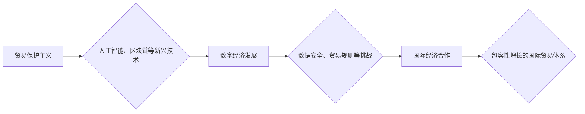

                 

## 2050年的全球贸易：从贸易保护主义到包容性增长的国际经济合作

> 关键词：全球贸易、人工智能、区块链、数据安全、跨境合作、包容性增长、数字经济、贸易规则、国际经济秩序

### 1. 背景介绍

21世纪初，全球化进程加速，国际贸易成为世界经济的重要引擎。然而，近年来，贸易保护主义抬头，地缘政治风险加剧，新冠疫情等突发事件也对全球贸易体系造成冲击。这些因素共同催生了对未来全球贸易模式的重新思考。

2050年，世界将面临更加复杂的国际环境。人口增长、资源短缺、气候变化等全球性挑战将加剧国际竞争和合作。同时，人工智能、区块链等新兴技术将深刻改变贸易模式，带来新的机遇和挑战。

在这样的背景下，构建一个更加包容、可持续、稳定的全球贸易体系至关重要。

### 2. 核心概念与联系

**2.1  包容性增长**

包容性增长是指经济增长能够惠及所有社会成员，缩小贫富差距，促进社会公平正义。在全球贸易体系中，包容性增长意味着贸易开放应该为所有国家和地区带来利益，而不是只造福少数发达国家。

**2.2  数字经济**

数字经济是指以数字技术为基础，以数据为核心要素，以网络为平台，以智能化和数字化为特征的新型经济形态。数字经济的快速发展将深刻改变全球贸易模式，例如电子商务、跨境数据流等将成为新的贸易增长点。

**2.3  国际经济合作**

国际经济合作是指各国之间在经济领域进行的协调和合作，以促进共同发展。在全球贸易体系中，国际经济合作是维护贸易规则、解决贸易争端、应对全球性挑战的关键。

**2.4  人工智能**

人工智能是指模拟人类智能的计算机系统。人工智能技术在全球贸易中将发挥重要作用，例如智能物流、智能贸易融资、智能贸易谈判等。

**2.5  区块链**

区块链是一种分布式账本技术，能够实现数据安全、透明和不可篡改。区块链技术可以应用于全球贸易领域，例如供应链管理、贸易融资、知识产权保护等。

**2.6  数据安全**

数据安全是指保护数据免受未经授权的访问、使用、披露、修改或销毁。在数字经济时代，数据安全成为全球贸易中不可忽视的重要问题。

**2.7  贸易规则**

贸易规则是指各国之间在贸易领域制定的法律法规和准则。贸易规则的制定和执行是维护公平贸易秩序、促进贸易自由化的关键。

**Mermaid 流程图**



### 3. 核心算法原理 & 具体操作步骤

**3.1  算法原理概述**

在2050年的全球贸易体系中，人工智能算法将发挥重要作用，例如：

* **预测算法**: 用于预测市场需求、价格波动、贸易风险等，帮助企业做出更明智的决策。
* **优化算法**: 用于优化物流路线、仓储管理、贸易融资等，提高贸易效率和降低成本。
* **协商算法**: 用于模拟谈判过程，帮助企业达成更公平的贸易协议。

**3.2  算法步骤详解**

以预测算法为例，其具体操作步骤如下：

1. **数据收集**: 收集历史贸易数据、市场数据、经济数据等相关信息。
2. **数据预处理**: 对收集到的数据进行清洗、转换、特征提取等处理，使其适合算法训练。
3. **模型选择**: 选择合适的预测算法模型，例如机器学习、深度学习等。
4. **模型训练**: 使用训练数据训练选择的算法模型，使其能够学习到数据中的规律。
5. **模型评估**: 使用测试数据评估模型的预测精度，并进行模型调优。
6. **模型部署**: 将训练好的模型部署到实际应用场景中，用于预测未来市场需求、价格波动等。

**3.3  算法优缺点**

* **优点**: 能够提高预测精度、优化决策、降低风险。
* **缺点**: 需要大量数据支持、算法模型需要不断更新、存在黑箱问题。

**3.4  算法应用领域**

* **市场预测**: 预测商品价格、市场需求、消费趋势等。
* **风险管理**: 预测贸易风险、金融风险、政治风险等。
* **供应链管理**: 预测物流时间、库存需求、生产计划等。
* **贸易融资**: 预测信用风险、贷款风险等。

### 4. 数学模型和公式 & 详细讲解 & 举例说明

**4.1  数学模型构建**

在2050年的全球贸易体系中，我们可以使用以下数学模型来描述贸易流量、贸易成本、贸易风险等因素之间的关系：

* **贸易流量模型**:

$$
Q = f(P, Y, T)
$$

其中：

* $Q$：贸易流量
* $P$：商品价格
* $Y$：国民收入
* $T$：贸易成本

* **贸易成本模型**:

$$
C = g(D, L, I)
$$

其中：

* $C$：贸易成本
* $D$：距离
* $L$：物流成本
* $I$：保险成本

* **贸易风险模型**:

$$
R = h(P, Y, T, S)
$$

其中：

* $R$：贸易风险
* $P$：商品价格
* $Y$：国民收入
* $T$：贸易成本
* $S$：政治风险

**4.2  公式推导过程**

这些模型的具体推导过程需要根据实际情况进行调整和完善。例如，我们可以使用经济学理论和统计学方法来推导模型参数，并使用实证数据进行模型验证。

**4.3  案例分析与讲解**

我们可以使用这些模型来分析特定贸易案例。例如，我们可以使用贸易流量模型来预测某个商品在未来一段时间内的贸易量，并根据预测结果制定相应的贸易策略。

### 5. 项目实践：代码实例和详细解释说明

**5.1  开发环境搭建**

为了实现上述算法，我们需要搭建一个合适的开发环境。例如，我们可以使用Python语言和相关的机器学习库，例如TensorFlow、PyTorch等。

**5.2  源代码详细实现**

以下是一个简单的预测算法的Python代码示例：

```python
import pandas as pd
from sklearn.model_selection import train_test_split
from sklearn.linear_model import LinearRegression

# 加载数据
data = pd.read_csv('trade_data.csv')

# 分割数据
X = data[['price', 'income']]
y = data['quantity']
X_train, X_test, y_train, y_test = train_test_split(X, y, test_size=0.2)

# 创建模型
model = LinearRegression()

# 训练模型
model.fit(X_train, y_train)

# 预测结果
y_pred = model.predict(X_test)

# 评估模型
print('模型精度:', model.score(X_test, y_test))
```

**5.3  代码解读与分析**

这段代码首先加载了贸易数据，然后将数据分割成训练集和测试集。接着，创建了一个线性回归模型，并使用训练集训练模型。最后，使用测试集预测结果，并评估模型精度。

**5.4  运行结果展示**

运行这段代码后，会输出模型的精度值。精度值越高，模型的预测能力越强。

### 6. 实际应用场景

**6.1  跨境电商平台**

跨境电商平台可以利用人工智能算法预测商品需求、优化物流路线、降低交易成本，从而提高平台的运营效率和用户体验。

**6.2  贸易金融机构**

贸易金融机构可以利用人工智能算法评估贸易风险、优化融资方案、提高资金利用效率，从而降低风险和提高盈利能力。

**6.3  政府监管部门**

政府监管部门可以利用人工智能算法监测贸易活动、打击贸易违规行为、维护公平贸易秩序，从而促进经济发展和社会稳定。

**6.4  未来应用展望**

随着人工智能、区块链等技术的不断发展，2050年的全球贸易体系将更加智能化、透明化、安全化。例如，我们可以看到：

* **智能贸易平台**: 基于人工智能和区块链技术的智能贸易平台将成为主流，能够实现自动化的贸易流程、智能化的风险管理、透明化的交易记录。
* **个性化贸易服务**: 人工智能将能够根据用户的需求提供个性化的贸易服务，例如推荐合适的贸易伙伴、提供定制化的贸易方案。
* **跨境数据流通**: 区块链技术将促进跨境数据的安全流通，为全球贸易提供更可靠的数据支持。

### 7. 工具和资源推荐

**7.1  学习资源推荐**

* **在线课程**: Coursera、edX、Udacity等平台提供人工智能、区块链等领域的在线课程。
* **书籍**: 《深度学习》、《区块链技术入门》、《人工智能与经济》等书籍可以帮助读者深入了解相关知识。
* **学术期刊**: 《人工智能》、《自然》、《科学》等学术期刊发表最新的研究成果。

**7.2  开发工具推荐**

* **Python**: Python是一种流行的编程语言，广泛应用于人工智能、数据科学等领域。
* **TensorFlow**: TensorFlow是一个开源的机器学习框架，可以用于构建和训练深度学习模型。
* **PyTorch**: PyTorch也是一个开源的机器学习框架，以其灵活性和易用性而闻名。
* **Hyperledger Fabric**: Hyperledger Fabric是一个开源的区块链平台，可以用于构建企业级区块链应用。

**7.3  相关论文推荐**

* **《人工智能与全球贸易》**: 这篇论文探讨了人工智能如何影响全球贸易模式。
* **《区块链技术在国际贸易中的应用》**: 这篇论文介绍了区块链技术在国际贸易中的应用场景和优势。
* **《包容性增长与全球贸易》**: 这篇论文分析了包容性增长对全球贸易的影响。

### 8. 总结：未来发展趋势与挑战

**8.1  研究成果总结**

2050年的全球贸易体系将更加智能化、透明化、安全化，人工智能、区块链等新兴技术将发挥重要作用。

**8.2  未来发展趋势**

* **智能化贸易**: 人工智能将被广泛应用于贸易各个环节，例如预测、优化、协商等。
* **透明化贸易**: 区块链技术将提高贸易流程的透明度和安全性。
* **包容性贸易**: 贸易规则将更加公平，贸易开放将惠及更多国家和地区。

**8.3  面临的挑战**

* **技术伦理**: 人工智能的应用需要解决伦理问题，例如算法偏见、数据隐私等。
* **数据安全**: 跨境数据流通需要保障数据安全和隐私。
* **国际合作**: 建立一个更加包容、可持续、稳定的全球贸易体系需要加强国际合作。

**8.4  研究展望**

未来研究需要关注以下几个方面：

* **人工智能算法的优化**: 开发更加高效、准确、安全的贸易预测算法。
* **区块链技术的应用场景**: 探索区块链技术在贸易领域的更多应用场景。
* **贸易规则的制定**: 制定更加公平、合理的贸易规则，促进包容性增长。


### 9. 附录：常见问题与解答

**9.1  Q: 人工智能是否会取代人类在贸易中的角色？**

**A:** 人工智能可以帮助人类提高贸易效率和降低成本，但它不会完全取代人类在贸易中的角色。人类仍然需要运用自己的智慧和经验来制定贸易策略、解决复杂问题、进行谈判等。

**9.2  Q: 区块链技术如何保障贸易数据的安全和透明度？**

**A:** 区块链技术通过加密算法和分布式账本技术来保障数据的安全和透明度。数据一旦写入区块链，就无法被篡改，并且所有参与者都可以查看交易记录，从而提高交易的安全性。

**9.3  Q: 如何促进包容性增长的国际贸易体系？**

**A:** 促进包容性增长的国际贸易体系需要各国政府、企业和国际组织共同努力，例如：

* 制定更加公平、合理的贸易规则。
* 减少贸易壁垒，促进贸易自由化。
* 支持发展中国家参与全球贸易。
* 促进技术转移和知识共享。


作者：禅与计算机程序设计艺术 / Zen and the Art of Computer Programming 
<end_of_turn>

