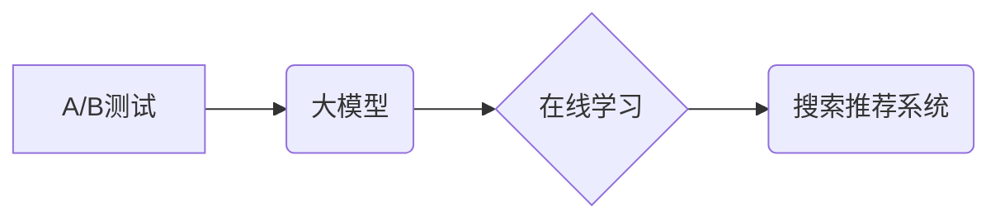

                 

## 搜索推荐系统的A/B测试：大模型时代的新方法

> 关键词：搜索推荐系统、A/B测试、大模型、机器学习、个性化推荐、在线学习、效果评估

## 1. 背景介绍

搜索推荐系统作为连接用户需求和信息资源的关键桥梁，在信息爆炸时代扮演着越来越重要的角色。传统的搜索推荐系统主要依赖于基于规则和特征工程的方法，但随着大规模数据的涌现和用户行为的复杂性增加，这些方法逐渐难以满足用户的个性化需求和不断变化的搜索意图。

大模型的出现为搜索推荐系统带来了新的机遇。大模型凭借其强大的学习能力和泛化能力，能够从海量数据中学习到更深层的用户偏好和搜索模式，从而提供更精准、更个性化的推荐结果。然而，大模型的训练和部署也带来了新的挑战，例如模型规模庞大、训练成本高、实时更新困难等。

在这样的背景下，A/B测试作为一种数据驱动的方法，在搜索推荐系统的优化和迭代中发挥着越来越重要的作用。A/B测试能够帮助我们快速评估不同算法、模型和参数配置的效果，并根据测试结果进行迭代优化，从而提高推荐系统的准确性和用户体验。

## 2. 核心概念与联系

### 2.1 A/B测试

A/B测试是一种常用的实验方法，用于比较两个或多个版本（A、B等）的差异，以确定哪个版本更优。在搜索推荐系统中，A/B测试通常用于比较不同的推荐算法、模型参数、界面设计等，以评估其对用户点击率、转化率等指标的影响。

### 2.2 大模型

大模型是指参数量巨大、训练数据海量的人工智能模型。大模型通常具有强大的泛化能力和学习能力，能够在各种自然语言处理任务中取得优异的性能。在搜索推荐系统中，大模型可以用于学习用户偏好、搜索意图和内容相关性等信息，从而提供更精准的推荐结果。

### 2.3 在线学习

在线学习是一种模型训练方法，它允许模型在不断接收新数据的同时进行更新和迭代。在线学习特别适用于搜索推荐系统，因为用户行为数据不断变化，模型需要实时更新才能保持推荐效果的准确性。

**核心概念与联系流程图**



## 3. 核心算法原理 & 具体操作步骤

### 3.1 算法原理概述

大模型时代，搜索推荐系统的A/B测试主要基于以下核心算法原理：

* **基于深度学习的推荐算法:** 

   利用深度神经网络学习用户和物品之间的复杂关系，例如协同过滤、深度因子分解机、图神经网络等。

* **在线学习算法:** 

   允许模型在不断接收新数据的同时进行更新和迭代，以适应用户行为的变化。

* **强化学习算法:** 

   通过奖励机制引导模型学习最优的推荐策略，以最大化用户点击率、转化率等指标。

### 3.2 算法步骤详解

**A/B测试流程:**

1. **定义测试目标:** 明确需要测试的目标，例如提升点击率、转化率、用户满意度等。
2. **设计测试方案:** 确定A组和B组的差异，例如使用不同的推荐算法、模型参数、界面设计等。
3. **数据准备:** 收集用户行为数据，并进行清洗和预处理。
4. **样本分配:** 将用户随机分配到A组和B组，确保两组样本的分布特征相似。
5. **数据收集:** 监控A组和B组的用户行为数据，例如点击率、转化率、停留时间等。
6. **数据分析:** 使用统计学方法分析A组和B组的数据差异，判断哪个版本更优。
7. **结果反馈:** 根据测试结果，对推荐系统进行优化和迭代。

**在线学习流程:**

1. **模型初始化:** 使用预训练模型或随机初始化模型参数。
2. **数据接收:** 接收用户行为数据，例如点击记录、评分等。
3. **模型更新:** 使用在线学习算法更新模型参数，以适应新数据。
4. **推荐生成:** 根据更新后的模型参数生成推荐结果。
5. **反馈收集:** 收集用户反馈数据，例如点击记录、评分等。
6. **模型迭代:** 将用户反馈数据用于模型更新，不断提升推荐效果。

### 3.3 算法优缺点

**A/B测试:**

* **优点:** 数据驱动、客观、可量化、易于理解和实施。
* **缺点:** 需要大量样本数据、测试时间较长、难以捕捉用户细微变化。

**大模型:**

* **优点:** 强大的学习能力、泛化能力、能够学习复杂的用户偏好。
* **缺点:** 模型规模庞大、训练成本高、实时更新困难。

**在线学习:**

* **优点:** 能够实时适应用户行为变化、模型更新效率高。
* **缺点:** 容易陷入局部最优、需要设计有效的在线学习算法。

### 3.4 算法应用领域

* **搜索引擎推荐:** 推荐相关搜索结果、个性化搜索结果、广告推荐等。
* **电商平台推荐:** 推荐商品、店铺、优惠券等。
* **内容平台推荐:** 推荐文章、视频、音频等内容。
* **社交媒体推荐:** 推荐好友、群组、话题等。

## 4. 数学模型和公式 & 详细讲解 & 举例说明

### 4.1 数学模型构建

在搜索推荐系统中，常用的数学模型包括协同过滤模型、深度因子分解机、图神经网络等。

**协同过滤模型:**

协同过滤模型基于用户的历史行为数据，预测用户对某个物品的评分或点击概率。

**深度因子分解机:**

深度因子分解机将协同过滤模型与深度神经网络相结合，能够学习用户和物品之间的复杂关系。

**图神经网络:**

图神经网络将用户和物品之间的关系表示为图结构，并利用图卷积网络学习图结构中的信息，从而进行推荐。

### 4.2 公式推导过程

**协同过滤模型的评分预测公式:**

$$
\hat{r}_{u,i} = \mathbf{p}_u \cdot \mathbf{q}_i + b_u + b_i
$$

其中：

* $\hat{r}_{u,i}$ 是模型预测的用户 $u$ 对物品 $i$ 的评分。
* $\mathbf{p}_u$ 是用户 $u$ 的隐向量。
* $\mathbf{q}_i$ 是物品 $i$ 的隐向量。
* $b_u$ 是用户 $u$ 的偏差项。
* $b_i$ 是物品 $i$ 的偏差项。

**深度因子分解机的损失函数:**

$$
L = \sum_{u,i} \left( r_{u,i} - \hat{r}_{u,i} \right)^2 + \lambda \left( ||\mathbf{p}_u||^2 + ||\mathbf{q}_i||^2 \right)
$$

其中：

* $r_{u,i}$ 是真实的用户 $u$ 对物品 $i$ 的评分。
* $\hat{r}_{u,i}$ 是模型预测的用户 $u$ 对物品 $i$ 的评分。
* $\lambda$ 是正则化参数。

### 4.3 案例分析与讲解

**案例:** 假设我们有一个电商平台，需要推荐商品给用户。我们可以使用协同过滤模型来预测用户对商品的评分。

**分析:**

* 用户行为数据：收集用户对商品的评分和购买记录。
* 模型训练：使用用户行为数据训练协同过滤模型，学习用户和商品之间的关系。
* 推荐生成：根据用户历史行为和模型预测，推荐用户可能感兴趣的商品。

**举例说明:**

* 用户 A 对商品 1 和商品 2 都给出了 5 分的评分，而用户 B 对商品 2 和商品 3 都给出了 4 分的评分。
* 模型学习到用户 A 和用户 B 的偏好，并预测用户 A 可能对商品 3 也感兴趣。

## 5. 项目实践：代码实例和详细解释说明

### 5.1 开发环境搭建

* **操作系统:** Linux/macOS
* **编程语言:** Python
* **深度学习框架:** TensorFlow/PyTorch
* **数据处理库:** Pandas/NumPy
* **A/B测试工具:** Google Optimize/Optimizely

### 5.2 源代码详细实现

```python
# 导入必要的库
import pandas as pd
from sklearn.model_selection import train_test_split
from sklearn.metrics import mean_squared_error

# 加载用户行为数据
data = pd.read_csv('user_behavior.csv')

# 将数据分为训练集和测试集
train_data, test_data = train_test_split(data, test_size=0.2)

# 训练协同过滤模型
from implicit.als import AlternatingLeastSquares
model = AlternatingLeastSquares(factors=10, regularization=0.1)
model.fit(train_data[['user_id', 'item_id', 'rating']])

# 使用模型预测测试集的用户评分
predictions = model.predict(test_data[['user_id', 'item_id']])

# 计算模型的均方误差
rmse = mean_squared_error(test_data['rating'], predictions, squared=False)
print(f'RMSE: {rmse}')
```

### 5.3 代码解读与分析

* **数据加载:** 使用 Pandas 库加载用户行为数据。
* **数据分割:** 使用 scikit-learn 库将数据分为训练集和测试集。
* **模型训练:** 使用 implicit 库的 AlternatingLeastSquares 模型训练协同过滤模型。
* **模型预测:** 使用训练好的模型预测测试集的用户评分。
* **效果评估:** 使用均方误差 (RMSE) 作为模型性能指标。

### 5.4 运行结果展示

运行上述代码后，会输出模型的 RMSE 值，该值越低，模型的预测效果越好。

## 6. 实际应用场景

### 6.1 搜索引擎推荐

* **相关搜索结果推荐:** 根据用户的搜索关键词，推荐与之相关的其他搜索结果。
* **个性化搜索结果推荐:** 根据用户的历史搜索记录、浏览记录和兴趣偏好，推荐个性化的搜索结果。
* **广告推荐:** 根据用户的搜索关键词和兴趣偏好，推荐相关的广告。

### 6.2 电商平台推荐

* **商品推荐:** 根据用户的浏览记录、购买记录和兴趣偏好，推荐相关的商品。
* **店铺推荐:** 根据用户的浏览记录、购买记录和兴趣偏好，推荐相关的店铺。
* **优惠券推荐:** 根据用户的购买记录和兴趣偏好，推荐相关的优惠券。

### 6.3 内容平台推荐

* **文章推荐:** 根据用户的阅读记录、点赞记录和评论记录，推荐相关的文章。
* **视频推荐:** 根据用户的观看记录、点赞记录和评论记录，推荐相关的视频。
* **音频推荐:** 根据用户的收听记录、点赞记录和评论记录，推荐相关的音频。

### 6.4 未来应用展望

随着大模型技术的不断发展，搜索推荐系统的A/B测试将更加智能化、自动化和个性化。

* **更精准的推荐:** 大模型能够学习用户更深层的偏好和需求，从而提供更精准的推荐结果。
* **更个性化的体验:** A/B测试能够帮助我们根据用户的不同特征和行为，提供个性化的推荐体验。
* **更实时更新的推荐:** 在线学习算法能够实时更新模型参数，从而保证推荐结果的时效性。

## 7. 工具和资源推荐

### 7.1 学习资源推荐

* **书籍:**
    * 《深度学习》
    * 《推荐系统实践》
    * 《机器学习》
* **在线课程:**
    * Coursera: 深度学习
    * Udacity: 机器学习工程师
    * fast.ai: 深度学习课程

### 7.2 开发工具推荐

* **深度学习框架:** TensorFlow, PyTorch
* **数据处理库:** Pandas, NumPy
* **A/B测试工具:** Google Optimize, Optimizely

### 7.3 相关论文推荐

* **深度学习推荐系统:**
    * "Neural Collaborative Filtering"
    * "Factorization Machines"
    * "DeepFM"
* **在线学习推荐系统:**
    * "Online Learning for Recommender Systems"
    * "Bandit Algorithms for Recommender Systems"
    * "Contextual Bandits for Recommender Systems"

## 8. 总结：未来发展趋势与挑战

### 8.1 研究成果总结

大模型时代，搜索推荐系统的A/B测试取得了显著的成果，例如推荐效果的提升、用户体验的增强、个性化推荐的实现等。

### 8.2 未来发展趋势

* **更强大的大模型:** 大模型的规模和能力将不断提升，从而提供更精准、更个性化的推荐结果。
* **更智能的A/B测试:** A/B测试将更加智能化、自动化和个性化，能够更有效地评估和优化推荐系统。
* **更丰富的推荐场景:** 大模型和A/B测试将应用于更多场景，例如教育、医疗、金融等。

### 8.3 面临的挑战

* **模型训练成本:** 大模型的训练成本很高，需要大量的计算资源和数据。
* **模型解释性:** 大模型的决策过程难以解释，这可能会导致用户对推荐结果的信任度降低。
* **数据隐私:** 搜索推荐系统需要收集大量的用户数据，如何保护用户隐私是一个重要的挑战。

### 8.4 研究展望

未来，我们需要继续探索大模型和A/B测试的结合，开发更强大、更智能、更安全的搜索推荐系统，为用户提供更优质的体验。

## 9. 附录：常见问题与解答

* **Q1: 如何选择合适的A/B测试方案？**

   A1: 选择合适的A/B测试方案需要根据具体的业务目标、用户群体和数据情况进行分析。

* **Q2: 如何评估A/B测试的结果？**

   A2: 可以使用统计学方法评估A/B测试的结果，例如显著性检验、置信区间等。

* **Q3: 如何应对大模型的训练成本？**

   A3: 可以使用云计算平台进行大模型的训练，或者采用模型压缩和量化技术降低模型规模。


作者：禅与计算机程序设计艺术 / Zen and the Art of Computer Programming<end_of_turn>

