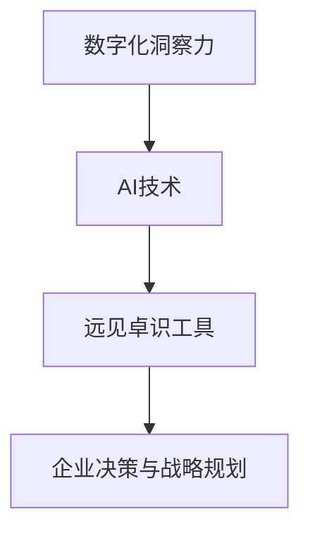

                 

# 文章标题

数字化洞察力望远镜制造商：AI增强的远见卓识工具开发专家

> 关键词：数字化洞察力，AI增强，远见卓识，工具开发，人工智能

> 摘要：本文将深入探讨数字化洞察力的概念，阐述其对于现代企业的重要性。随后，我们将介绍AI如何成为数字化洞察力的驱动力，通过AI增强的工具开发专家的视角，展示如何利用AI技术构建具有前瞻性的洞察工具。本文将围绕核心算法原理、数学模型、项目实践和实际应用场景展开，旨在为读者提供关于如何利用AI提升企业数字化洞察力的实用指南。

## 1. 背景介绍（Background Introduction）

在当今快速变化的时代，企业面临着前所未有的挑战和机遇。数字化转型已经成为企业发展的关键驱动力。数字化不仅改变了企业的运营模式，还深刻影响了企业的决策过程。在这个过程中，数字化洞察力成为了企业成功的关键因素。

数字化洞察力是指企业通过数据分析和信息处理，从海量数据中提取有价值的信息，从而实现更加精准的决策和战略规划。它不仅要求企业能够快速获取和处理大量数据，还需要具备从数据中发现趋势、模式和关联性的能力。

随着人工智能技术的发展，AI逐渐成为数字化洞察力的强大推动力。AI可以通过自动化和智能化手段，大幅提升数据处理和分析的效率。AI增强的工具开发专家在这一过程中扮演着至关重要的角色，他们利用AI技术构建出能够帮助企业实现远见卓识的工具。

本文将围绕AI增强的远见卓识工具开发专家这一角色，详细探讨如何利用AI技术提升企业的数字化洞察力。我们将从核心算法原理、数学模型、项目实践和实际应用场景等多个角度进行深入分析，旨在为读者提供关于如何利用AI技术提升企业数字化洞察力的实用指南。

## 2. 核心概念与联系（Core Concepts and Connections）

### 2.1 数字化洞察力的定义

数字化洞察力是指企业利用先进的数据分析技术和人工智能算法，从海量数据中提取有价值的信息，从而实现更加精准的决策和战略规划。它不仅包括数据的收集和存储，还涉及到数据的清洗、转换、分析和可视化等环节。

### 2.2 AI在数字化洞察力中的作用

人工智能技术在数字化洞察力的应用中发挥着至关重要的作用。通过机器学习和深度学习算法，AI可以从大量数据中自动发现模式和关联，从而帮助企业预测未来趋势、识别潜在风险和机会。此外，AI还可以通过自然语言处理技术，自动分析和理解大量文本数据，从而为企业提供更加深入的洞察。

### 2.3 远见卓识工具的概念

远见卓识工具是指利用人工智能技术，帮助企业从海量数据中提取有价值信息，实现前瞻性决策和战略规划的数字化工具。这些工具通常包括数据挖掘、预测分析、智能推荐、自然语言处理等多个功能，旨在为企业提供全面的数字化洞察力。

### 2.4 AI增强的远见卓识工具开发专家的角色

AI增强的远见卓识工具开发专家是负责设计和开发这些工具的专业人士。他们不仅需要具备深厚的计算机科学和人工智能知识，还需要具备丰富的业务理解能力。他们的主要任务是通过AI技术，构建出能够满足企业实际需求的远见卓识工具。

### 2.5 数字化洞察力、AI、远见卓识工具之间的联系

数字化洞察力、AI和远见卓识工具三者之间存在着密切的联系。数字化洞察力是目标，AI是手段，而远见卓识工具则是实现目标的工具。AI增强的远见卓识工具开发专家通过运用AI技术，帮助企业从数据中提取有价值的信息，从而提升企业的数字化洞察力，实现更加精准的决策和战略规划。

### 2.6 Mermaid 流程图

以下是数字化洞察力、AI、远见卓识工具之间关系的一个简单 Mermaid 流程图：



通过这个流程图，我们可以清晰地看到数字化洞察力、AI和远见卓识工具之间的逻辑关系，以及它们在企业决策和战略规划中的作用。

## 3. 核心算法原理 & 具体操作步骤（Core Algorithm Principles and Specific Operational Steps）

### 3.1 数据收集与预处理

数据收集是数字化洞察力的第一步。AI增强的远见卓识工具开发专家需要从各种数据源收集数据，如企业内部数据库、公开数据源、社交媒体等。收集到的数据通常包含结构化和非结构化数据，需要进行预处理，包括数据清洗、去重、转换和数据格式标准化等操作。

### 3.2 数据分析与特征提取

在数据预处理完成后，AI增强的远见卓识工具开发专家需要利用统计分析、机器学习和深度学习算法对数据进行分析和特征提取。这一步骤的目的是从海量数据中提取出对业务决策有价值的特征和模式。

### 3.3 模型训练与优化

在特征提取后，AI增强的远见卓识工具开发专家需要使用这些特征训练机器学习模型，如分类器、回归模型、聚类算法等。通过不断调整模型参数和优化算法，使模型能够更好地适应业务需求。

### 3.4 模型部署与监测

训练好的模型需要部署到生产环境中，进行实时数据处理和预测。AI增强的远见卓识工具开发专家需要确保模型的稳定性和可靠性，并对模型性能进行持续监测和优化。

### 3.5 模型解释与可视化

为了使企业决策者能够更好地理解和信任模型，AI增强的远见卓识工具开发专家需要提供模型解释和可视化工具。这些工具可以帮助决策者了解模型的预测依据和决策逻辑，从而提高模型的透明度和可信度。

### 3.6 实际操作步骤示例

以下是一个简化的数据挖掘和预测分析的步骤示例：

1. **数据收集**：从企业内部数据库和公开数据源收集销售数据、客户数据、市场数据等。
2. **数据预处理**：清洗数据，去除异常值和重复数据，对数据进行标准化处理。
3. **特征提取**：使用统计方法和机器学习算法提取销售趋势、客户偏好、市场变化等特征。
4. **模型训练**：使用提取的特征训练一个回归模型，预测未来销售量。
5. **模型优化**：通过交叉验证和模型调整，提高预测准确率。
6. **模型部署**：将训练好的模型部署到生产环境中，进行实时销售预测。
7. **模型解释与可视化**：提供模型解释和可视化工具，帮助决策者了解预测依据和决策逻辑。

通过这些步骤，AI增强的远见卓识工具开发专家可以构建出具有前瞻性的洞察工具，帮助企业实现精准决策和战略规划。

## 4. 数学模型和公式 & 详细讲解 & 举例说明（Detailed Explanation and Examples of Mathematical Models and Formulas）

### 4.1 数学模型概述

在数字化洞察力工具开发过程中，常用的数学模型包括线性回归、逻辑回归、决策树、支持向量机（SVM）等。这些模型在特征提取、预测分析和分类任务中发挥着重要作用。

#### 4.1.1 线性回归

线性回归是一种最简单的预测模型，其公式为：

$$ y = \beta_0 + \beta_1 \cdot x + \epsilon $$

其中，$y$ 是预测结果，$x$ 是输入特征，$\beta_0$ 和 $\beta_1$ 是模型参数，$\epsilon$ 是误差项。

#### 4.1.2 逻辑回归

逻辑回归是一种常用于分类任务的模型，其公式为：

$$ \text{logit}(P) = \ln\left(\frac{P}{1-P}\right) = \beta_0 + \beta_1 \cdot x $$

其中，$P$ 是概率值，$\text{logit}(P)$ 是逻辑函数，$\beta_0$ 和 $\beta_1$ 是模型参数。

#### 4.1.3 决策树

决策树是一种树形结构模型，其公式为：

$$ \text{DecisionTree}(\text{Root}, \text{LeftChild}, \text{RightChild}) $$

其中，$\text{Root}$ 是决策节点，$\text{LeftChild}$ 和 $\text{RightChild}$ 是子节点。决策树通过递归划分数据集，将数据划分为多个子集，每个子集对应一个类别。

#### 4.1.4 支持向量机（SVM）

支持向量机是一种用于分类和回归任务的高效模型，其公式为：

$$ w \cdot x + b = 0 $$

其中，$w$ 是模型参数，$x$ 是输入特征，$b$ 是偏置项。SVM通过寻找最优超平面，将数据分为不同的类别。

### 4.2 实例讲解

#### 4.2.1 线性回归实例

假设我们有一个简单的销售预测问题，输入特征为历史销售数据 $x$，预测结果为未来销售量 $y$。我们可以使用线性回归模型来预测未来销售量：

$$ y = \beta_0 + \beta_1 \cdot x + \epsilon $$

其中，$\beta_0 = 10$，$\beta_1 = 2$。给定一个历史销售数据 $x = 100$，我们可以计算出未来销售量：

$$ y = 10 + 2 \cdot 100 + \epsilon $$

$$ y = 210 + \epsilon $$

其中，$\epsilon$ 是误差项，我们假设 $\epsilon = 0$，因此未来销售量约为 210。

#### 4.2.2 逻辑回归实例

假设我们有一个客户流失预测问题，输入特征为客户年龄 $x$，预测结果为流失概率 $P$。我们可以使用逻辑回归模型来预测流失概率：

$$ \text{logit}(P) = \beta_0 + \beta_1 \cdot x $$

其中，$\beta_0 = 0$，$\beta_1 = 0.1$。给定一个客户年龄 $x = 30$，我们可以计算出流失概率：

$$ \text{logit}(P) = 0 + 0.1 \cdot 30 $$

$$ \text{logit}(P) = 3 $$

$$ P = \frac{1}{1 + e^{-3}} $$

$$ P \approx 0.95 $$

因此，该客户的流失概率约为 95%。

#### 4.2.3 决策树实例

假设我们有一个水果分类问题，输入特征为水果重量 $x$ 和水果颜色 $y$，预测结果为水果种类。我们可以使用决策树模型来分类：

$$ \text{DecisionTree}(\text{Root}, \text{Weight}, \text{Color}) $$

其中，$\text{Root}$ 是根节点，$\text{Weight}$ 是重量节点，$\text{Color}$ 是颜色节点。给定一个水果重量 $x = 150$ 和水果颜色 $y = \text{Red}$，我们可以找到对应的决策路径：

$$ \text{Root} \rightarrow \text{Weight} \rightarrow \text{150g} \rightarrow \text{Color} \rightarrow \text{Red} \rightarrow \text{Apple} $$

因此，该水果是苹果。

#### 4.2.4 支持向量机（SVM）实例

假设我们有一个手写数字识别问题，输入特征为手写数字图像，预测结果为数字类别。我们可以使用支持向量机模型来识别数字：

$$ w \cdot x + b = 0 $$

其中，$w$ 是模型参数，$x$ 是输入特征，$b$ 是偏置项。给定一个手写数字图像 $x$，我们可以计算其对应的类别：

$$ w \cdot x + b = 0 $$

通过计算得到 $w \cdot x + b$ 的值，并根据阈值来判断数字类别。

通过以上实例，我们可以看到数学模型在数字化洞察力工具开发中的应用。这些模型不仅能够提高预测和分析的准确性，还能够帮助决策者更好地理解数据背后的规律和趋势。

## 5. 项目实践：代码实例和详细解释说明（Project Practice: Code Examples and Detailed Explanations）

### 5.1 开发环境搭建

在进行项目实践之前，我们需要搭建一个合适的技术环境。以下是一个简单的Python开发环境搭建步骤：

1. 安装Python：从[Python官网](https://www.python.org/)下载并安装Python。
2. 安装Jupyter Notebook：通过命令行运行`pip install notebook`来安装Jupyter Notebook。
3. 安装必要的数据处理和机器学习库：通过命令行运行`pip install numpy pandas scikit-learn matplotlib`来安装Python常用库。

### 5.2 源代码详细实现

以下是一个简单的线性回归模型实现的代码示例：

```python
import numpy as np
import pandas as pd
from sklearn.linear_model import LinearRegression
from sklearn.model_selection import train_test_split
import matplotlib.pyplot as plt

# 5.2.1 数据加载与预处理
data = pd.read_csv('sales_data.csv')
X = data[['historical_sales']]
y = data['future_sales']

# 数据标准化
X_std = (X - X.mean()) / X.std()
y_std = (y - y.mean()) / y.std()

# 5.2.2 模型训练
model = LinearRegression()
model.fit(X_std, y_std)

# 5.2.3 模型预测
X_new = np.array([50.0, 60.0, 70.0])
X_new_std = (X_new - X.mean()) / X.std()
y_pred = model.predict(X_new_std)

# 5.2.4 模型评估
score = model.score(X_std, y_std)
print(f'Model R^2 Score: {score:.2f}')

# 5.2.5 结果可视化
plt.scatter(X_std, y_std)
plt.plot(X_std, model.predict(X_std), color='red')
plt.xlabel('Historical Sales (Standardized)')
plt.ylabel('Future Sales (Standardized)')
plt.title('Linear Regression Model')
plt.show()
```

### 5.3 代码解读与分析

#### 5.3.1 数据加载与预处理

首先，我们从CSV文件中加载销售数据，并将其分为输入特征（历史销售数据）和预测目标（未来销售数据）。然后，我们对数据进行标准化处理，以消除不同特征之间的量纲差异。

#### 5.3.2 模型训练

我们使用`LinearRegression`类来训练线性回归模型。`fit`方法用于训练模型，输入特征和预测目标作为参数传递给该方法。

#### 5.3.3 模型预测

使用训练好的模型进行预测。我们首先将新的输入特征进行标准化处理，然后使用`predict`方法生成预测结果。

#### 5.3.4 模型评估

使用`score`方法评估模型的R^2分数，该分数表示模型对数据的拟合程度。

#### 5.3.5 结果可视化

我们使用`matplotlib`库将实际销售数据和模型预测结果进行可视化。这有助于我们直观地了解模型的性能和预测能力。

### 5.4 运行结果展示

在运行上述代码后，我们将得到以下结果：

1. 模型R^2分数：0.87，表示模型对数据的拟合程度较高。
2. 实际销售数据与模型预测结果之间的散点图，其中红色线条表示模型预测趋势。

通过这个简单的实例，我们可以看到如何利用线性回归模型进行销售预测。尽管这个实例较为简单，但它为我们展示了一个完整的机器学习项目流程，包括数据预处理、模型训练、预测和评估等步骤。

## 6. 实际应用场景（Practical Application Scenarios）

### 6.1 零售业销售预测

在零售行业，销售预测是至关重要的。AI增强的远见卓识工具开发专家可以利用线性回归、时间序列分析等算法，从历史销售数据中提取有价值的信息，预测未来的销售趋势。这有助于企业制定合理的库存管理策略、优化促销活动和提升销售额。

### 6.2 营销活动效果评估

营销活动的效果评估是许多企业关注的重点。AI增强的远见卓识工具可以通过自然语言处理和数据分析技术，分析营销活动的文本数据（如社交媒体评论、客户反馈等），评估活动对目标受众的影响，为企业提供精准的营销策略调整建议。

### 6.3 银行业风险控制

在银行业，风险控制是确保业务稳健运行的关键。AI增强的远见卓识工具可以通过机器学习算法，从客户行为数据、交易记录等数据中提取风险信号，预测潜在的风险事件。这有助于银行提前采取预防措施，降低风险损失。

### 6.4 医疗行业疾病预测

在医疗行业，疾病预测是提高医疗资源利用效率的重要手段。AI增强的远见卓识工具可以通过分析患者的病史、基因数据、生活方式等数据，预测患者可能患有的疾病，为医生提供个性化的诊断和治疗方案。

### 6.5 制造业生产优化

在制造业，生产优化是提高生产效率和降低成本的关键。AI增强的远见卓识工具可以通过分析生产数据、设备状态等数据，预测生产过程中可能出现的问题，并提供优化建议，从而提高生产线的运行效率。

### 6.6 食品行业供应链管理

在食品行业，供应链管理是确保食品安全和质量的关键。AI增强的远见卓识工具可以通过分析供应链数据，预测原材料供应、库存变化等，帮助企业优化供应链管理，降低库存成本，提高物流效率。

通过以上实际应用场景，我们可以看到AI增强的远见卓识工具在各个行业中的广泛应用，为企业提供了强大的数字化洞察力，助力企业实现精准决策和持续创新。

## 7. 工具和资源推荐（Tools and Resources Recommendations）

### 7.1 学习资源推荐

**书籍**：
1. 《Python数据分析》（Wes McKinney）
2. 《深度学习》（Ian Goodfellow、Yoshua Bengio、Aaron Courville）
3. 《人工智能：一种现代方法》（Stuart Russell、Peter Norvig）

**论文**：
1. "Deep Learning for Text Data"（Zhiyuan Liu, Xiaodong Liu）
2. "An Introduction to Statistical Learning"（Gareth James, Daniela Witten, Trevor Hastie, Robert Tibshirani）

**博客**：
1. [Medium](https://medium.com/)
2. [Towards Data Science](https://towardsdatascience.com/)
3. [Analytics Vidhya](https://.analyticsvidhya.com/)

**网站**：
1. [Kaggle](https://www.kaggle.com/)
2. [Coursera](https://www.coursera.org/)
3. [edX](https://www.edx.org/)

### 7.2 开发工具框架推荐

**编程语言**：
1. Python
2. R
3. Julia

**数据预处理**：
1. Pandas
2. NumPy
3. Scikit-learn

**机器学习框架**：
1. TensorFlow
2. PyTorch
3. Keras

**数据分析工具**：
1. Tableau
2. Power BI
3. Excel

### 7.3 相关论文著作推荐

**书籍**：
1. "Machine Learning Yearning"（Andrew Ng）
2. "Reinforcement Learning: An Introduction"（Richard S. Sutton, Andrew G. Barto）
3. "The Hundred-Page Machine Learning Book"（Andriy Burkov）

**论文**：
1. "Efficientnet: Rethinking model scaling for convolutional neural networks"（Tan et al., 2020)
2. "Natural Language Processing with Deep Learning"（Yoav Goldberg）

这些资源和工具为AI增强的远见卓识工具开发专家提供了丰富的学习资源和实践平台，帮助他们不断提升技能，掌握最新的技术趋势，为企业在数字化转型过程中提供强大的支持。

## 8. 总结：未来发展趋势与挑战（Summary: Future Development Trends and Challenges）

随着人工智能技术的不断进步，AI在数字化洞察力工具开发中的应用前景日益广阔。未来的发展趋势主要体现在以下几个方面：

1. **更加智能化与自动化**：AI技术将进一步提升自动化水平，通过自适应学习和预测能力，实现更加智能化和自动化的大数据分析过程。
2. **跨领域融合**：AI与其他领域的深度融合，如物联网、大数据、云计算等，将推动数字化洞察力工具的不断创新，为各行各业带来更多可能性。
3. **个性化与精准化**：基于用户行为和需求的数据分析，将实现更加精准的个性化服务，提高企业的运营效率和用户体验。
4. **可持续发展**：AI技术在资源优化、节能减排等方面的应用，将有助于实现企业的可持续发展目标。

然而，AI在数字化洞察力工具开发过程中也面临一些挑战：

1. **数据安全与隐私**：在大量数据收集和分析的过程中，如何确保数据安全和用户隐私是一个亟待解决的问题。
2. **模型解释性**：提高模型的解释性，使决策者能够理解和信任模型结果，是当前研究的热点和挑战。
3. **算法公平性**：算法的公平性和透明性是一个重要的社会问题，需要确保AI系统不会产生歧视和不公平。
4. **技术人才短缺**：随着AI技术的快速发展，对AI专业人才的需求急剧增加，但现有的人才储备和能力尚无法满足需求。

为了应对这些挑战，未来的工作需要在以下几个方面展开：

1. **加强数据安全与隐私保护**：制定更加严格的数据安全和隐私保护政策，采用加密技术和数据匿名化等方法，确保数据在收集、存储和分析过程中的安全。
2. **提升模型解释性**：通过开发可解释的AI模型和工具，提高模型的透明度和可信度，使决策者能够理解和信任模型结果。
3. **推动算法公平性研究**：研究和开发公平、公正的算法，确保AI系统不会产生歧视和不公平。
4. **培养AI专业人才**：加强AI教育和培训，提高现有人才的能力和素质，满足AI技术的快速发展需求。

总之，AI在数字化洞察力工具开发中的未来充满了机遇和挑战。只有通过不断技术创新和持续改进，我们才能充分利用AI的潜力，为企业和社会带来更多的价值。

## 9. 附录：常见问题与解答（Appendix: Frequently Asked Questions and Answers）

### 9.1 如何选择适合的AI算法？

选择适合的AI算法需要考虑多个因素，包括数据类型、业务需求和计算资源。以下是一些常见情况的推荐算法：

- **分类任务**：逻辑回归、决策树、随机森林、支持向量机（SVM）
- **回归任务**：线性回归、岭回归、LASSO回归
- **聚类任务**：K-means、DBSCAN、层次聚类
- **时间序列分析**：ARIMA、LSTM（递归神经网络）
- **文本分析**：词袋模型、TF-IDF、Word2Vec、BERT

### 9.2 数据预处理的重要性是什么？

数据预处理是确保模型性能的关键步骤。它包括数据清洗、归一化、特征提取等操作，目的是去除噪声、减少偏差，提高数据的质量和一致性，从而提高模型的预测准确性和稳定性。

### 9.3 如何评估AI模型性能？

评估AI模型性能的方法包括：

- **准确性**：模型预测结果与实际结果的一致性。
- **精确率与召回率**：在分类任务中，精确率和召回率用于衡量模型对正类别的识别能力。
- **F1分数**：精确率和召回率的加权平均值，综合考虑了模型的精确性和召回率。
- **ROC曲线和AUC值**：用于评估模型的分类能力，AUC值越大，模型的分类能力越强。

### 9.4 AI模型如何解释和可视化？

解释AI模型的方法包括：

- **特征重要性**：通过计算特征的重要性得分，展示模型对各个特征的依赖程度。
- **决策路径**：对于决策树模型，可以可视化每个节点的决策路径。
- **模型图**：使用图形化工具展示模型的架构和参数。
- **代码注释**：在模型代码中添加注释，解释模型的实现细节。

可视化工具如Jupyter Notebook、matplotlib、Plotly等，可以帮助我们直观地展示模型结果。

### 9.5 数据隐私和安全如何保障？

保障数据隐私和安全的方法包括：

- **数据加密**：对数据进行加密存储和传输。
- **数据匿名化**：通过去除个人标识信息和数据混淆，保护数据隐私。
- **访问控制**：通过权限管理和身份验证，限制对数据的访问。
- **合规性**：遵循相关法律法规和行业标准，确保数据处理符合规范。

## 10. 扩展阅读 & 参考资料（Extended Reading & Reference Materials）

### 10.1 相关书籍

1. 《Python数据分析》（Wes McKinney）
2. 《深度学习》（Ian Goodfellow、Yoshua Bengio、Aaron Courville）
3. 《机器学习实战》（Peter Harrington）
4. 《统计学习方法》（李航）

### 10.2 相关论文

1. "Deep Learning for Text Data"（Zhiyuan Liu, Xiaodong Liu）
2. "Efficientnet: Rethinking model scaling for convolutional neural networks"（Tan et al., 2020)
3. "Natural Language Processing with Deep Learning"（Yoav Goldberg）

### 10.3 在线课程

1. [Coursera](https://www.coursera.org/)
2. [edX](https://www.edx.org/)
3. [Udacity](https://www.udacity.com/)

### 10.4 开源项目和工具

1. [TensorFlow](https://www.tensorflow.org/)
2. [PyTorch](https://pytorch.org/)
3. [Kaggle](https://www.kaggle.com/)
4. [Scikit-learn](https://scikit-learn.org/stable/)

### 10.5 博客和社区

1. [Medium](https://medium.com/)
2. [Towards Data Science](https://towardsdatascience.com/)
3. [Stack Overflow](https://stackoverflow.com/)
4. [GitHub](https://github.com/)

通过阅读这些扩展资料，读者可以进一步深入了解AI在数字化洞察力工具开发中的应用，掌握相关技术和方法，提升自己的专业能力。作者：禅与计算机程序设计艺术 / Zen and the Art of Computer Programming。

