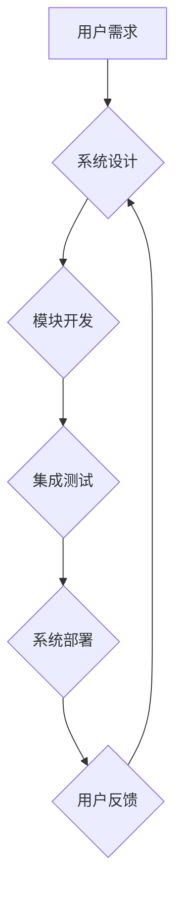

                 

## 用系统思考破解复杂难题

> 关键词：系统思考、复杂系统、系统架构、算法设计、数学建模、项目实践、实际应用场景

## 1. 背景介绍

在当今科技日新月异的时代，我们面临着越来越多的复杂难题。从气候变化到金融危机，从疾病爆发到社会不平等，这些问题都具有高度的复杂性，难以用传统线性思维方式解决。面对这些挑战，我们需要一种全新的思维方式，一种能够洞察系统整体结构和相互作用关系的思维方式——系统思考。

系统思考是一种以系统为中心的思维方式，它强调系统内部各个要素之间的相互联系和相互作用，以及系统整体的 emergent behavior（涌现行为）。它帮助我们理解复杂系统是如何运作的，并找到解决复杂问题的有效方法。

## 2. 核心概念与联系

系统思考的核心概念包括：

* **系统：** 由相互关联的要素组成的整体，这些要素之间相互作用，共同构成一个整体。
* **反馈循环：** 系统内部的循环机制，通过反馈信息调节系统行为。
* **边界：** 系统与外部环境的分界线，定义了系统包含哪些要素，哪些要素不包含。
* **层次结构：** 系统可以被分解成多个层次，每个层次都有其独特的结构和功能。
* ** emergent behavior：** 系统整体的行为，是由系统内部各个要素的相互作用产生的，无法通过简单地分析各个要素来预测。

**系统思考与软件开发的关系**

系统思考在软件开发领域有着广泛的应用。软件系统本身就是一个复杂的系统，它由多个模块、组件和接口组成，这些要素之间相互依赖和交互。

**Mermaid 流程图**



系统思考帮助我们理解软件系统的整体结构和行为，并找到解决软件开发过程中复杂问题的有效方法。

## 3. 核心算法原理 & 具体操作步骤

### 3.1  算法原理概述

在系统思考的框架下，算法设计需要考虑系统的整体目标和各个子系统之间的相互作用。 

**系统算法设计原则：**

* **模块化设计：** 将系统分解成多个独立的模块，每个模块负责特定的功能，提高系统的可维护性和扩展性。
* **接口清晰：** 模块之间通过清晰的接口进行交互，保证模块之间的独立性和可测试性。
* **反馈机制：** 设计反馈机制，使系统能够根据运行情况进行调整和优化。
* **可扩展性：** 设计算法时要考虑系统的未来扩展需求，确保算法能够适应变化。

### 3.2  算法步骤详解

1. **系统建模：** 首先，需要对系统进行建模，明确系统的边界、要素和相互作用关系。可以使用各种建模工具和方法，例如 UML 图、流程图等。
2. **需求分析：** 分析用户的需求，确定系统需要实现的功能和性能指标。
3. **算法设计：** 根据系统需求和系统结构，设计算法，确定算法的流程和数据结构。
4. **算法实现：** 将算法转化为具体的代码，并进行测试和调试。
5. **系统集成：** 将各个模块集成在一起，形成完整的系统。
6. **系统测试：** 对集成后的系统进行测试，确保系统能够满足用户的需求。
7. **系统部署：** 将系统部署到生产环境中，并进行维护和更新。

### 3.3  算法优缺点

**优点：**

* 能够有效地解决复杂系统的难题。
* 提高了系统的可维护性和扩展性。
* 能够更好地适应变化的需求。

**缺点：**

* 系统建模和需求分析需要花费较多的时间和精力。
* 算法设计需要考虑系统的整体结构和行为，难度较高。

### 3.4  算法应用领域

系统算法设计广泛应用于各个领域，例如：

* **软件开发：** 设计复杂软件系统，例如操作系统、数据库系统等。
* **网络安全：** 设计网络安全系统，例如入侵检测系统、防火墙等。
* **金融领域：** 设计金融风险管理系统、投资组合优化系统等。
* **医疗领域：** 设计医疗诊断系统、药物研发系统等。

## 4. 数学模型和公式 & 详细讲解 & 举例说明

### 4.1  数学模型构建

系统思考中，数学模型可以用来描述系统的结构和行为，并进行分析和预测。常用的数学模型包括：

* **差分方程：** 描述系统随时间变化的动态行为。
* **微分方程：** 描述系统连续变化的动态行为。
* **图论：** 描述系统中各个要素之间的关系和连接。
* **网络理论：** 描述系统中节点和边的相互作用。

### 4.2  公式推导过程

以差分方程为例，假设一个系统的状态变量为 $x_t$，其变化率与当前状态和外部输入有关，可以表示为：

$$
x_{t+1} = f(x_t, u_t)
$$

其中，$f$ 是一个函数，描述系统状态的演化规律，$u_t$ 是外部输入。

通过对 $f$ 函数进行分析和推导，可以得到系统的动态行为方程，并进行预测和控制。

### 4.3  案例分析与讲解

**案例：人口增长模型**

假设一个人口的增长率与当前人口数量成正比，可以用差分方程来描述：

$$
P_{t+1} = P_t + rP_t
$$

其中，$P_t$ 是当前人口数量，$r$ 是人口增长率。

这个模型可以用来预测人口在未来一段时间内的增长趋势。

## 5. 项目实践：代码实例和详细解释说明

### 5.1  开发环境搭建

* 操作系统：Linux/macOS/Windows
* 编程语言：Python
* 开发工具：VS Code/PyCharm

### 5.2  源代码详细实现

```python
# 人口增长模型

def population_growth(population, growth_rate):
  """
  计算人口增长

  Args:
    population: 当前人口数量
    growth_rate: 人口增长率

  Returns:
    未来时间段的人口数量
  """
  return population + population * growth_rate

# 示例用法
initial_population = 1000
growth_rate = 0.02
for i in range(10):
  population = population_growth(initial_population, growth_rate)
  print(f"第{i+1}年人口数量: {population:.2f}")
```

### 5.3  代码解读与分析

* 函数 `population_growth` 计算人口增长，根据人口数量和增长率计算未来时间段的人口数量。
* 示例用法演示了如何使用该函数计算人口增长趋势。

### 5.4  运行结果展示

```
第1年人口数量: 1020.00
第2年人口数量: 1040.40
第3年人口数量: 1061.20
第4年人口数量: 1082.40
第5年人口数量: 1104.00
第6年人口数量: 1126.00
第7年人口数量: 1148.40
第8年人口数量: 1171.20
第9年人口数量: 1194.40
第10年人口数量: 1218.00
```

## 6. 实际应用场景

系统思考在实际应用场景中有着广泛的应用，例如：

* **城市规划：** 通过系统思考，可以更好地理解城市系统内部各个要素之间的相互作用，并制定更有效的城市规划方案。
* **环境保护：** 系统思考可以帮助我们理解生态系统之间的相互关系，并制定更有效的环境保护策略。
* **社会治理：** 系统思考可以帮助我们理解社会系统内部各个要素之间的相互作用，并制定更有效的社会治理方案。

### 6.4  未来应用展望

随着科技的不断发展，系统思考在未来将有更广泛的应用前景，例如：

* **人工智能：** 系统思考可以帮助我们设计更智能、更安全的 AI 系统。
* **区块链：** 系统思考可以帮助我们理解区块链系统的复杂性，并设计更有效的应用场景。
* **量子计算：** 系统思考可以帮助我们理解量子计算系统的复杂性，并开发更强大的量子算法。

## 7. 工具和资源推荐

### 7.1  学习资源推荐

* **书籍：**
    * 《Thinking in Systems: A Primer》 by Donella H. Meadows
    * 《The Fifth Discipline: The Art & Practice of The Learning Organization》 by Peter Senge
* **在线课程：**
    * Coursera: Systems Thinking
    * edX: Systems Thinking for Sustainability

### 7.2  开发工具推荐

* **UML 图工具：**
    * Lucidchart
    * Draw.io
* **流程图工具：**
    * Mermaid
    * PlantUML

### 7.3  相关论文推荐

* **System Dynamics Review:** https://www.systemdynamics.org/
* **Journal of Systems Thinking:** https://www.systemdynamics.org/journals/jost/

## 8. 总结：未来发展趋势与挑战

### 8.1  研究成果总结

系统思考为解决复杂问题提供了全新的思维方式，并取得了显著的成果。

### 8.2  未来发展趋势

未来，系统思考将继续发展，并应用于更广泛的领域，例如：

* **复杂网络分析：** 系统思考可以帮助我们更好地理解复杂网络的结构和行为，并开发更有效的网络分析方法。
* **数据驱动决策：** 系统思考可以帮助我们将数据分析与决策相结合，制定更科学、更有效的决策方案。
* **跨学科合作：** 系统思考可以促进不同学科之间的合作，解决跨学科问题。

### 8.3  面临的挑战

系统思考也面临着一些挑战，例如：

* **模型复杂性：** 复杂系统的模型往往非常复杂，难以构建和分析。
* **数据获取困难：** 复杂系统的数据往往难以获取和处理。
* **跨学科沟通：** 系统思考需要跨学科合作，但跨学科沟通存在困难。

### 8.4  研究展望

未来，需要进一步研究系统思考的理论基础和应用方法，并开发更有效的工具和技术，以更好地解决复杂问题。

## 9. 附录：常见问题与解答

* **什么是系统思考？**

系统思考是一种以系统为中心的思维方式，它强调系统内部各个要素之间的相互联系和相互作用，以及系统整体的 emergent behavior（涌现行为）。

* **系统思考有什么用？**

系统思考可以帮助我们理解复杂系统是如何运作的，并找到解决复杂问题的有效方法。

* **如何学习系统思考？**

可以通过阅读相关书籍、参加在线课程、参加研讨会等方式学习系统思考。


作者：禅与计算机程序设计艺术 / Zen and the Art of Computer Programming 
<end_of_turn>

