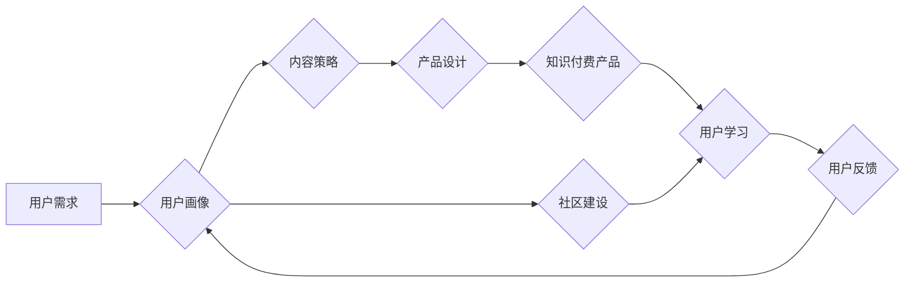

                 

## 程序员的知识付费用户运营策略

> 关键词：知识付费、程序员、用户运营、内容策略、社区建设、产品设计、数据分析

### 1. 背景介绍

近年来，随着互联网技术的发展和普及，知识付费行业蓬勃发展，成为一种新的经济模式。程序员作为技术人才，拥有丰富的专业知识和经验，也成为知识付费领域的优质内容创作者。然而，知识付费市场竞争激烈，程序员想要成功运营知识付费产品，需要制定合理的策略，并不断优化和迭代。

### 2. 核心概念与联系

**2.1 知识付费的核心概念**

知识付费是指通过付费的方式获取知识、技能和经验。它是一种以知识为核心、以价值为导向的商业模式。

**2.2 用户运营的核心概念**

用户运营是指围绕用户需求，通过一系列策略和手段，提升用户体验，促进用户粘性，最终实现商业目标。

**2.3 程序员知识付费用户运营的联系**

程序员知识付费用户运营是指针对程序员用户群体，通过制定合理的知识付费策略，并结合用户运营手段，实现知识付费产品的成功运营。

**2.3.1 用户画像**

程序员用户群体具有多样性，需要进行细分，了解不同类型的程序员用户的需求、痛点和行为习惯。

**2.3.2 内容策略**

根据用户画像，制定针对性的内容策略，提供高质量、有价值的知识和技能培训内容。

**2.3.3 社区建设**

构建线上线下社区，促进用户之间的交流互动，形成知识共享和学习氛围。

**2.3.4 产品设计**

设计用户友好的知识付费产品，提供便捷的学习体验和服务。

**2.3.5 数据分析**

利用数据分析工具，监测用户行为，优化产品和运营策略。

**Mermaid 流程图**



### 3. 核心算法原理 & 具体操作步骤

**3.1 算法原理概述**

用户运营的核心算法原理是基于用户行为数据分析，通过挖掘用户需求和行为模式，实现精准的用户画像、内容推荐和个性化服务。

**3.2 算法步骤详解**

1. **数据收集:** 收集用户行为数据，包括用户注册信息、学习记录、评论反馈、社区互动等。
2. **数据清洗:** 对收集到的数据进行清洗和处理，去除无效数据和噪声数据。
3. **特征提取:** 从用户行为数据中提取特征，例如用户学习偏好、学习时长、学习进度、社区活跃度等。
4. **模型训练:** 利用机器学习算法，对用户特征进行建模，构建用户画像和行为预测模型。
5. **用户分群:** 根据用户画像，将用户进行分群，形成不同的用户群体。
6. **个性化推荐:** 基于用户行为预测模型，为用户推荐个性化的学习内容和服务。
7. **用户运营策略优化:** 根据用户反馈和数据分析结果，不断优化用户运营策略，提升用户体验和粘性。

**3.3 算法优缺点**

**优点:**

* 精准的用户画像和行为预测
* 个性化内容推荐和服务
* 提升用户体验和粘性
* 数据驱动的运营策略优化

**缺点:**

* 数据收集和清洗难度大
* 模型训练需要专业技术
* 算法效果受数据质量影响
* 存在用户隐私安全问题

**3.4 算法应用领域**

* 用户行为分析
* 内容推荐系统
* 个性化营销
* 社区运营
* 教育培训

### 4. 数学模型和公式 & 详细讲解 & 举例说明

**4.1 数学模型构建**

用户行为预测模型可以采用多种数学模型，例如线性回归、逻辑回归、支持向量机、决策树等。

**4.2 公式推导过程**

每个模型都有其特定的公式推导过程，例如线性回归模型的损失函数为均方误差，公式如下：

$$
L(w) = \frac{1}{n} \sum_{i=1}^{n} (y_i - \hat{y}_i)^2
$$

其中：

* $w$ 为模型参数
* $n$ 为样本数量
* $y_i$ 为真实值
* $\hat{y}_i$ 为预测值

**4.3 案例分析与讲解**

假设我们想要预测用户是否会购买某个知识付费课程，可以使用逻辑回归模型。

* **特征:** 用户年龄、学习时长、课程评价等
* **目标变量:** 是否购买课程（0/1）

通过训练逻辑回归模型，我们可以得到一个预测模型，用于预测用户是否会购买课程。

### 5. 项目实践：代码实例和详细解释说明

**5.1 开发环境搭建**

* Python 3.x
* Jupyter Notebook
* TensorFlow/PyTorch

**5.2 源代码详细实现**

```python
# 导入必要的库
import pandas as pd
from sklearn.model_selection import train_test_split
from sklearn.linear_model import LogisticRegression
from sklearn.metrics import accuracy_score

# 加载数据
data = pd.read_csv('user_data.csv')

# 分割数据
X = data.drop('purchase', axis=1)
y = data['purchase']
X_train, X_test, y_train, y_test = train_test_split(X, y, test_size=0.2, random_state=42)

# 训练模型
model = LogisticRegression()
model.fit(X_train, y_train)

# 预测结果
y_pred = model.predict(X_test)

# 计算准确率
accuracy = accuracy_score(y_test, y_pred)
print(f'准确率: {accuracy}')
```

**5.3 代码解读与分析**

* 代码首先导入必要的库，包括 pandas 用于数据处理，sklearn 用于机器学习模型训练和评估。
* 然后加载用户数据，并将其分割为训练集和测试集。
* 训练逻辑回归模型，并使用测试集评估模型的准确率。

**5.4 运行结果展示**

运行代码后，会输出模型的准确率，例如：

```
准确率: 0.85
```

这表示模型在预测用户是否购买课程方面达到了 85% 的准确率。

### 6. 实际应用场景

**6.1 程序员知识付费平台**

程序员知识付费平台可以利用用户运营策略，提供个性化的学习内容推荐、社区互动功能、在线答疑服务等，提升用户体验和粘性。

**6.2 在线编程课程平台**

在线编程课程平台可以根据用户的学习进度和掌握情况，提供个性化的学习路径和练习题，帮助用户更快地掌握编程技能。

**6.3 技术博客和论坛**

技术博客和论坛可以利用用户运营策略，构建活跃的社区，促进用户之间的交流互动，分享技术经验和知识。

**6.4 企业内部培训**

企业可以利用用户运营策略，针对不同岗位和技能等级的员工，提供个性化的培训课程和学习资源，提升员工技能水平和工作效率。

**6.5 未来应用展望**

随着人工智能技术的不断发展，用户运营策略将更加智能化和个性化。未来，程序员知识付费平台将更加注重用户体验，提供更加精准的学习推荐、个性化的学习路径和更丰富的学习资源。

### 7. 工具和资源推荐

**7.1 学习资源推荐**

* **书籍:** 《用户运营实战》、《数据驱动用户运营》、《人工智能算法》
* **课程:** Coursera、edX、Udemy 等平台上的用户运营和数据分析课程
* **博客:**  用户运营相关的博客和网站

**7.2 开发工具推荐**

* **数据分析工具:**  Python (Pandas, NumPy, Scikit-learn)、R、Tableau
* **机器学习平台:** TensorFlow、PyTorch、Spark MLlib
* **用户运营平台:**  Amplitude、Mixpanel、Heap

**7.3 相关论文推荐**

* 《用户运营的理论与实践》
* 《数据驱动用户运营》
* 《人工智能在用户运营中的应用》

### 8. 总结：未来发展趋势与挑战

**8.1 研究成果总结**

程序员知识付费用户运营策略的研究成果表明，通过数据分析、用户画像、个性化推荐和社区建设等手段，可以有效提升用户体验和粘性，促进知识付费产品的成功运营。

**8.2 未来发展趋势**

* **人工智能技术的应用:**  人工智能技术将更加广泛地应用于用户运营领域，实现更加智能化和个性化的用户运营策略。
* **数据隐私保护:**  随着用户数据隐私保护意识的增强，用户运营策略需要更加注重数据安全和隐私保护。
* **跨平台用户运营:**  用户运营策略需要跨越平台边界，实现用户在不同平台的统一运营。

**8.3 面临的挑战**

* **数据质量问题:**  用户运营策略的有效性依赖于高质量的数据，数据收集、清洗和处理难度较大。
* **算法模型的复杂性:**  用户运营算法模型的训练和优化需要专业技术，对技术人员的要求较高。
* **用户隐私安全问题:**  用户运营策略需要平衡用户体验和数据隐私安全，避免侵犯用户隐私。

**8.4 研究展望**

未来，程序员知识付费用户运营策略的研究将更加注重人工智能技术的应用、数据隐私保护和跨平台用户运营，为程序员知识付费平台的持续发展提供理论支持和实践指导。

### 9. 附录：常见问题与解答

**9.1 如何进行用户画像？**

用户画像可以通过收集用户行为数据，例如用户注册信息、学习记录、评论反馈、社区互动等，并利用数据分析工具进行分析和挖掘，形成用户画像。

**9.2 如何进行个性化推荐？**

个性化推荐可以通过用户画像、学习行为数据和算法模型，为用户推荐个性化的学习内容和服务。

**9.3 如何构建活跃的社区？**

构建活跃的社区可以通过提供丰富的社区功能，例如论坛、讨论组、在线答疑等，并鼓励用户之间的交流互动。


作者：禅与计算机程序设计艺术 / Zen and the Art of Computer Programming 
<end_of_turn>

