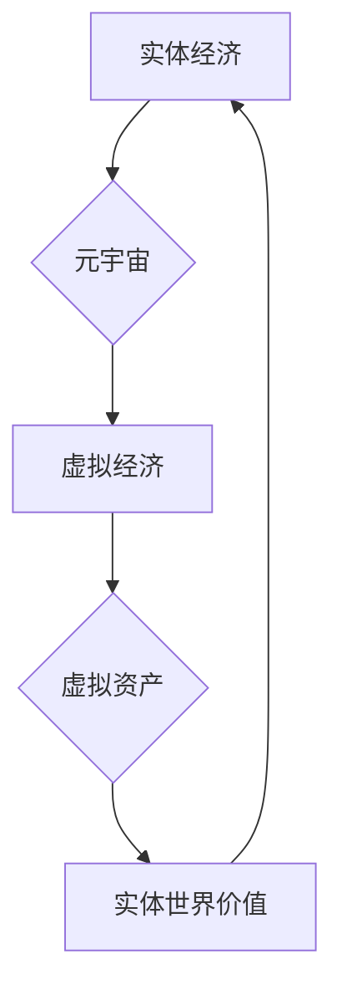

                 

## 虚拟经济与实体经济：元宇宙时代的双轨并行

> 关键词：元宇宙、虚拟经济、实体经济、数字孪生、Web3、区块链、NFT

### 1. 背景介绍

近年来，元宇宙概念的兴起，将虚拟世界与现实世界紧密相连，引发了人们对虚拟经济与实体经济关系的深入思考。元宇宙，作为下一代互联网的雏形，构建了一个沉浸式、交互式的虚拟空间，用户可以在其中进行社交、娱乐、工作、学习等各种活动。随着元宇宙技术的不断发展，虚拟经济也随之蓬勃发展，并与实体经济产生了紧密联系。

传统经济模式以实体世界为基础，而虚拟经济则以数字资产和虚拟活动为核心。两者之间存在着相互补充、相互促进的关系。虚拟经济为实体经济提供了新的增长点和发展机遇，而实体经济为虚拟经济提供了现实世界的基础和支撑。

### 2. 核心概念与联系

#### 2.1 虚拟经济

虚拟经济是指在虚拟世界中进行的经济活动，其核心要素包括：

* **虚拟资产：** 虚拟货币、NFT、虚拟土地、虚拟物品等。
* **虚拟交易：** 使用虚拟货币进行虚拟资产的买卖、租赁、交易等。
* **虚拟服务：** 在虚拟世界中提供虚拟服务，例如虚拟演唱会、虚拟培训、虚拟咨询等。

#### 2.2 实体经济

实体经济是指以物质生产和消费为基础的经济活动，其核心要素包括：

* **实体商品：**tangible goods
* **实体服务：** physical services
* **实体交易：** 使用法定货币进行实体商品和服务的买卖

#### 2.3 元宇宙与虚拟经济、实体经济的联系

元宇宙作为虚拟世界的平台，为虚拟经济提供了发展空间，也为实体经济提供了新的应用场景。

* **虚拟经济促进实体经济发展：** 元宇宙中的虚拟资产和虚拟服务可以转化为实体世界中的价值，例如虚拟土地可以租赁给实体企业进行虚拟展示，虚拟物品可以与实体商品进行捆绑销售。
* **实体经济为虚拟经济提供基础：** 实体世界中的资源、技术和人才为虚拟经济的发展提供了基础保障。例如，区块链技术为虚拟资产的交易提供了安全保障，而游戏开发技术为虚拟世界的构建提供了技术支持。

**元宇宙与虚拟经济、实体经济的联系流程图**



### 3. 核心算法原理 & 具体操作步骤

#### 3.1 算法原理概述

虚拟经济的核心算法原理主要包括：

* **加密货币算法：** 用于生成和管理虚拟货币，例如比特币的SHA-256算法。
* **智能合约算法：** 用于实现虚拟资产的自动交易和管理，例如以太坊的EVM虚拟机。
* **去中心化自治组织（DAO）算法：** 用于管理虚拟世界的治理和决策，例如 Aragon的DAO框架。

#### 3.2 算法步骤详解

以智能合约为例，其具体操作步骤如下：

1. **定义合约：** 使用编程语言编写智能合约代码，明确合约的功能和规则。
2. **部署合约：** 将合约代码部署到区块链网络上，生成一个唯一的合约地址。
3. **调用合约：** 用户可以通过钱包地址调用合约函数，执行合约中的逻辑操作。
4. **执行合约：** 区块链网络会验证合约代码的合法性，并执行合约中的逻辑操作，例如转移虚拟资产。
5. **记录交易：** 合约执行结果会记录到区块链网络中，形成不可篡改的交易记录。

#### 3.3 算法优缺点

**优点：**

* **透明度高：** 所有交易记录都记录在区块链网络中，公开透明。
* **安全性高：** 区块链网络的加密算法和去中心化特性保证了交易的安全性。
* **可信度高：** 无需第三方机构参与，交易双方直接交互，提高了可信度。

**缺点：**

* **技术门槛高：** 开发和部署智能合约需要一定的编程和区块链技术知识。
* **可扩展性有限：** 区块链网络的处理能力有限，难以处理大量交易。
* **监管难度大：** 去中心化的特性使得虚拟经济的监管难度较大。

#### 3.4 算法应用领域

* **虚拟资产交易：** NFT、虚拟货币等虚拟资产的买卖和管理。
* **虚拟游戏：** 游戏道具、虚拟货币等虚拟资产的交易和管理。
* **虚拟世界建设：** 数字孪生、虚拟土地等虚拟世界的构建和管理。
* **数字身份认证：** 基于区块链技术的数字身份认证和管理。

### 4. 数学模型和公式 & 详细讲解 & 举例说明

#### 4.1 数学模型构建

虚拟经济中的交易行为可以抽象为一个博弈模型，其中参与者是虚拟经济中的用户，目标是最大化自身利益。

* **参与者：** 用户
* **策略：** 购买、出售、持有虚拟资产
* **收益：** 虚拟资产的价值变化

#### 4.2 公式推导过程

假设用户持有虚拟资产 $x$，虚拟资产的价格为 $p$，用户购买虚拟资产的成本为 $c$，用户出售虚拟资产的收益为 $r$。

* **购买收益：** $r - c$
* **出售收益：** $p \cdot x - c$
* **持有收益：** $p \cdot x$

用户将根据上述收益进行决策，选择购买、出售或持有虚拟资产。

#### 4.3 案例分析与讲解

例如，假设用户持有 10 个虚拟货币，当前价格为 10 美元，用户购买成本为 8 美元，用户出售收益为 12 美元。

* **购买收益：** 12 - 8 = 4 美元
* **出售收益：** 10 * 10 - 8 = 92 美元
* **持有收益：** 10 * 10 = 100 美元

根据收益分析，用户选择持有虚拟货币，以获得最大的收益。

### 5. 项目实践：代码实例和详细解释说明

#### 5.1 开发环境搭建

* **编程语言：** Solidity
* **区块链平台：** 以太坊
* **开发工具：** Remix IDE

#### 5.2 源代码详细实现

```solidity
pragma solidity ^0.8.0;

contract SimpleToken {
    string public name;
    string public symbol;
    uint256 public totalSupply;

    mapping(address => uint256) public balanceOf;

    event Transfer(address indexed from, address indexed to, uint256 value);

    constructor(string memory _name, string memory _symbol, uint256 _totalSupply) {
        name = _name;
        symbol = _symbol;
        totalSupply = _totalSupply;
        balanceOf[msg.sender] = totalSupply;
    }

    function transfer(address _to, uint256 _value) public {
        require(balanceOf[msg.sender] >= _value, "Insufficient balance");
        balanceOf[msg.sender] -= _value;
        balanceOf[_to] += _value;
        emit Transfer(msg.sender, _to, _value);
    }
}
```

#### 5.3 代码解读与分析

* **pragma solidity ^0.8.0;** 指定合约的 Solidity 版本。
* **contract SimpleToken { ... }** 定义一个名为 SimpleToken 的合约。
* **string public name;** 定义一个名为 name 的字符串变量，用于存储代币名称。
* **mapping(address => uint256) public balanceOf;** 定义一个映射，用于存储每个地址的代币余额。
* **event Transfer(address indexed from, address indexed to, uint256 value);** 定义一个名为 Transfer 的事件，用于记录代币转移。
* **constructor(string memory _name, string memory _symbol, uint256 _totalSupply) { ... }** 合约构造函数，用于初始化代币名称、符号和总量。
* **function transfer(address _to, uint256 _value) public { ... }** 定义一个名为 transfer 的函数，用于转移代币。

#### 5.4 运行结果展示

部署合约后，用户可以通过钱包地址调用 transfer 函数，将代币转移到其他地址。

### 6. 实际应用场景

#### 6.1 游戏虚拟经济

元宇宙游戏中的虚拟货币和虚拟物品可以作为虚拟经济的媒介，玩家可以通过游戏活动获得虚拟资产，并将其用于游戏内交易或兑换成现实世界中的价值。

#### 6.2 数字艺术品交易

NFT（不可替代代币）技术为数字艺术品的交易提供了新的平台，艺术家可以通过 NFT 将自己的作品数字化，并将其出售给收藏家。

#### 6.3 元宇宙社交平台

元宇宙社交平台可以提供虚拟社交空间，用户可以在其中创建虚拟形象，与其他用户进行互动，并进行虚拟商品的交易。

#### 6.4 未来应用展望

* **虚拟房地产：** 在元宇宙中购买和出售虚拟土地，用于建设虚拟建筑和商业场所。
* **虚拟身份认证：** 基于区块链技术的数字身份认证，用于验证用户身份和权限。
* **虚拟金融服务：** 提供虚拟货币借贷、投资等金融服务。

### 7. 工具和资源推荐

#### 7.1 学习资源推荐

* **书籍：** 《区块链革命》、《元宇宙：下一代互联网》
* **在线课程：** Coursera、Udemy、edX
* **社区论坛：** BitcoinTalk、Ethereum Stack Exchange

#### 7.2 开发工具推荐

* **Remix IDE：** 在线 Solidity 开发环境
* **Truffle Suite：** 区块链开发工具套件
* **Hardhat：** 区块链开发工具

#### 7.3 相关论文推荐

* **The Bitcoin White Paper：** 比特币白皮书
* **A Next Generation Internet Architecture：** 元宇宙架构论文
* **Decentralized Finance：** 去中心化金融论文

### 8. 总结：未来发展趋势与挑战

#### 8.1 研究成果总结

虚拟经济与实体经济的融合将为人类社会带来巨大的变革，为经济发展提供新的动力。元宇宙技术的不断发展，将推动虚拟经济的快速发展，并与实体经济更加紧密地结合。

#### 8.2 未来发展趋势

* **虚拟经济规模扩大：** 随着元宇宙的普及，虚拟经济规模将不断扩大。
* **虚拟资产价值提升：** 虚拟资产将更加多样化，价值也将得到提升。
* **虚拟经济与实体经济融合：** 虚拟经济与实体经济将更加紧密地融合，形成一个新的经济体系。

#### 8.3 面临的挑战

* **技术挑战：** 元宇宙技术的开发和应用还面临着许多技术挑战，例如可扩展性、安全性、隐私等。
* **监管挑战：** 虚拟经济的监管难度较大，需要制定相应的法律法规。
* **伦理挑战：** 虚拟经济的发展也面临着伦理挑战，例如虚拟资产的价值评估、虚拟身份的保护等。

#### 8.4 研究展望

未来，我们需要继续深入研究虚拟经济与实体经济的融合机制，探索虚拟经济的未来发展趋势，并积极应对虚拟经济带来的挑战，推动虚拟经济健康发展。

### 9. 附录：常见问题与解答

* **什么是元宇宙？** 元宇宙是一个下一代互联网的雏形，是一个沉浸式、交互式的虚拟世界，用户可以在其中进行社交、娱乐、工作、学习等各种活动。
* **虚拟货币和实体货币有什么区别？** 虚拟货币是一种在虚拟世界中流通的数字货币，而实体货币是一种在现实世界中流通的物理货币。
* **NFT是什么？** NFT（不可替代代币）是一种基于区块链技术的数字资产，代表着独一无二的数字物品，例如数字艺术品、虚拟游戏道具等。

作者：禅与计算机程序设计艺术 / Zen and the Art of Computer Programming


<end_of_turn>

