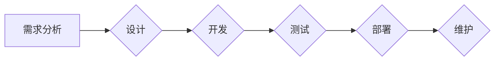

                 

## 项目管理：从构思到交付的全过程指南

> 关键词：项目管理, 软件开发, 需求分析, 迭代开发, 风险管理, 团队协作, 质量保证

### 1. 背景介绍

在当今科技日新月异的时代，软件项目扮演着越来越重要的角色。从移动应用到云计算平台，从智能家居到自动驾驶汽车，软件无处不在，深刻地影响着我们的生活和工作。然而，软件项目开发的复杂性也日益增加，成功交付高质量软件产品需要严谨的项目管理方法和高效的团队协作。

传统的瀑布式项目管理模式，以其线性、阶段性的特点，在面对复杂、变化多端的软件项目时显得捉襟见肘。而敏捷开发方法，以其迭代、灵活、注重用户反馈的特点，逐渐成为软件项目管理的主流趋势。

本文将深入探讨项目管理的各个环节，从需求分析到交付上线，从团队协作到风险管理，全面介绍软件项目管理的最佳实践，帮助读者掌握项目管理的精髓，提高软件项目成功率。

### 2. 核心概念与联系

项目管理的核心在于有效地规划、组织、执行和监控项目资源，以实现预定的目标。

**2.1 项目生命周期**

软件项目通常经历以下几个阶段：

* **需求分析阶段:** 确定项目目标、范围、功能需求和用户期望。
* **设计阶段:** 设计软件架构、界面、数据库结构等。
* **开发阶段:** 编写代码、进行单元测试、集成测试。
* **测试阶段:** 对软件进行功能测试、性能测试、安全测试等。
* **部署阶段:** 将软件部署到生产环境。
* **维护阶段:** 对软件进行 bug 修复、功能升级、性能优化等。

**2.2 项目管理流程图**



**2.3 项目管理工具**

项目管理工具可以帮助项目经理跟踪项目进度、管理任务、协作沟通等。常见的项目管理工具包括：

* **Trello:** 基于 Kanban 的项目管理工具，适合小型团队协作。
* **Jira:** 功能强大的项目管理工具，适合大型软件开发项目。
* **Asana:** 灵活的项目管理工具，支持多种项目管理方法。

### 3. 核心算法原理 & 具体操作步骤

**3.1 算法原理概述**

在项目管理中，算法可以帮助我们优化资源分配、预测项目风险、提高项目效率。例如，甘特图算法可以帮助我们可视化项目进度，识别关键路径和潜在风险；PERT 算法可以帮助我们估算项目完成时间和成本。

**3.2 算法步骤详解**

* **甘特图算法:**

1. 将项目分解成多个任务。
2. 确定每个任务的开始时间、结束时间和持续时间。
3. 将任务绘制在甘特图上，形成项目进度条。
4. 识别关键路径，即项目完成时间最长的路径。
5. 分析关键路径上的任务，识别潜在风险。

* **PERT 算法:**

1. 确定每个任务的乐观时间、悲观时间和最可能时间。
2. 计算每个任务的期望时间和方差。
3. 计算项目完成时间的期望值和方差。
4. 根据期望值和方差，评估项目完成时间和成本的风险。

**3.3 算法优缺点**

* **甘特图算法:**

    * **优点:** 可视化项目进度，识别关键路径，易于理解和沟通。
    * **缺点:** 难以处理项目变化，对任务依赖关系的描述不够灵活。

* **PERT 算法:**

    * **优点:** 考虑任务时间的不确定性，评估项目风险，提供更准确的项目计划。
    * **缺点:** 需要收集大量任务时间数据，计算过程较为复杂。

**3.4 算法应用领域**

* **甘特图算法:** 软件开发项目、建筑工程项目、营销活动策划等。
* **PERT 算法:** 大型复杂项目、科研项目、国防项目等。

### 4. 数学模型和公式 & 详细讲解 & 举例说明

**4.1 数学模型构建**

在项目管理中，我们可以使用数学模型来描述项目进度、资源分配、风险评估等方面。例如，我们可以使用线性规划模型来优化资源分配，使用概率模型来评估项目风险。

**4.2 公式推导过程**

* **线性规划模型:**

    * 目标函数: 
        $$
        Maximize Z = c_1x_1 + c_2x_2 + ... + c_nx_n
        $$
    * 约束条件:
        $$
        a_{11}x_1 + a_{12}x_2 + ... + a_{1n}x_n \leq b_1
        $$
        $$
        a_{21}x_1 + a_{22}x_2 + ... + a_{2n}x_n \leq b_2
        $$
        $$
        ...
        $$
        $$
        a_{m1}x_1 + a_{m2}x_2 + ... + a_{mn}x_n \leq b_m
        $$
        $$
        x_i \geq 0, i = 1, 2, ..., n
        $$

    其中:

    * $Z$ 是目标函数值，例如项目完成时间或成本。
    * $c_i$ 是每个变量的系数，例如每个任务的完成时间或成本。
    * $x_i$ 是每个变量的值，例如每个任务的分配时间或资源量。
    * $a_{ij}$ 是约束条件的系数。
    * $b_i$ 是约束条件的值。

* **概率模型:**

    * 项目完成时间服从正态分布，其期望值为 $\mu$，标准差为 $\sigma$。
    * 项目风险概率可以用贝叶斯公式计算:
        $$
        P(A|B) = \frac{P(B|A)P(A)}{P(B)}
        $$
    其中:

    * $P(A|B)$ 是在事件 $B$ 发生的情况下事件 $A$ 发生的概率。
    * $P(B|A)$ 是在事件 $A$ 发生的情况下事件 $B$ 发生的概率。
    * $P(A)$ 是事件 $A$ 发生的概率。
    * $P(B)$ 是事件 $B$ 发生的概率。

**4.3 案例分析与讲解**

* **线性规划模型案例:**

    假设一个软件项目需要开发三个功能模块，每个模块需要分配开发人员和测试人员。开发人员的时薪为 $50$ 美元，测试人员的时薪为 $40$ 美元。项目预算为 $10000$ 美元，开发人员和测试人员的总工作时间不能超过 $200$ 小时。

    我们可以使用线性规划模型来优化资源分配，使得项目成本最低。

* **概率模型案例:**

    假设一个软件项目的开发时间服从正态分布，期望值为 $6$ 个月，标准差为 $1$ 个月。

    我们可以使用贝叶斯公式来计算项目开发时间超过 $7$ 个月的概率。

### 5. 项目实践：代码实例和详细解释说明

**5.1 开发环境搭建**

* 安装 Java 开发环境。
* 下载并安装 Git 版本控制工具。
* 创建一个新的 Git 仓库。

**5.2 源代码详细实现**

```java
public class ProjectManager {

    public static void main(String[] args) {
        // 需求分析
        String[] requirements = {
                "功能模块一",
                "功能模块二",
                "功能模块三"
        };

        // 设计阶段
        String[] designs = {
                "模块一设计文档",
                "模块二设计文档",
                "模块三设计文档"
        };

        // 开发阶段
        String[] code = {
                "模块一代码",
                "模块二代码",
                "模块三代码"
        };

        // 测试阶段
        String[] tests = {
                "模块一测试用例",
                "模块二测试用例",
                "模块三测试用例"
        };

        // 部署阶段
        String[] deployment = {
                "部署到测试环境",
                "部署到生产环境"
        };

        // 维护阶段
        String[] maintenance = {
                "bug 修复",
                "功能升级"
        };

        // 项目进度输出
        System.out.println("项目进度:");
        System.out.println("需求分析: " + Arrays.toString(requirements));
        System.out.println("设计阶段: " + Arrays.toString(designs));
        System.out.println("开发阶段: " + Arrays.toString(code));
        System.out.println("测试阶段: " + Arrays.toString(tests));
        System.out.println("部署阶段: " + Arrays.toString(deployment));
        System.out.println("维护阶段: " + Arrays.toString(maintenance));
    }
}
```

**5.3 代码解读与分析**

这段代码演示了软件项目生命周期的基本流程。

* 首先，定义了项目需求、设计、开发、测试、部署和维护等阶段。
* 然后，使用数组存储每个阶段的任务列表。
* 最后，使用 `System.out.println()` 方法输出项目进度信息。

**5.4 运行结果展示**

运行这段代码后，会输出以下项目进度信息：

```
项目进度:
需求分析: [功能模块一, 功能模块二, 功能模块三]
设计阶段: [模块一设计文档, 模块二设计文档, 模块三设计文档]
开发阶段: [模块一代码, 模块二代码, 模块三代码]
测试阶段: [模块一测试用例, 模块二测试用例, 模块三测试用例]
部署阶段: [部署到测试环境, 部署到生产环境]
维护阶段: [bug 修复, 功能升级]
```

### 6. 实际应用场景

**6.1 软件开发项目**

项目管理在软件开发项目中至关重要。从需求分析到代码部署，每个阶段都需要有效的计划、执行和监控。

**6.2 建筑工程项目**

建筑工程项目也需要项目管理来确保按时、按预算完成。项目经理需要协调各方资源，管理进度和成本，并应对突发事件。

**6.3 营销活动策划**

营销活动策划需要项目管理来确保活动目标的达成。项目经理需要制定活动计划，分配资源，跟踪进度，并评估活动效果。

**6.4 未来应用展望**

随着人工智能和自动化技术的不断发展，项目管理将更加智能化和自动化。例如，人工智能可以帮助项目经理预测项目风险、优化资源分配、自动生成项目报告。

### 7. 工具和资源推荐

**7.1 学习资源推荐**

* **书籍:**

    * 《项目管理实战》
    * 《敏捷软件开发》
    * 《项目管理知识体系》

* **在线课程:**

    * Coursera: 项目管理课程
    * Udemy: 项目管理课程
    * edX: 项目管理课程

**7.2 开发工具推荐**

* **Trello:** 基于 Kanban 的项目管理工具
* **Jira:** 功能强大的项目管理工具
* **Asana:** 灵活的项目管理工具

**7.3 相关论文推荐**

* **The Standish Group Chaos Report:** 项目管理的现状和挑战
* **Agile Manifesto:** 敏捷软件开发宣言
* **Project Management Institute (PMI) Standards:** 项目管理标准

### 8. 总结：未来发展趋势与挑战

**8.1 研究成果总结**

项目管理研究取得了显著成果，例如敏捷开发方法、风险管理理论、项目管理工具等。这些成果提高了项目成功率，降低了项目成本和风险。

**8.2 未来发展趋势**

* **人工智能驱动的项目管理:** 人工智能将帮助项目经理预测项目风险、优化资源分配、自动生成项目报告。
* **云计算时代的项目管理:** 云计算将提供更加灵活、可扩展的项目管理平台。
* **跨文化项目管理:** 随着全球化进程的加速，跨文化项目管理将成为新的挑战和机遇。

**8.3 面临的挑战**

* **项目复杂性增加:** 软件项目越来越复杂，需要更加 sophisticated 的项目管理方法。
* **人才短缺:** 项目管理人才短缺是全球性的问题。
* **技术变革快速:** 需要不断学习新的技术和方法来应对技术变革。

**8.4 研究展望**

未来项目管理研究将更加注重人工智能、云计算、跨文化等方面的研究，以应对新的挑战，推动项目管理的持续发展。

### 9. 附录：常见问题与解答

**9.1 什么是项目管理？**

项目管理是指规划、组织、执行和监控项目资源，以实现预定的目标。

**9.2 项目管理有哪些重要原则？**

* **明确目标:** 项目目标要清晰、具体、可衡量。
* **有效沟通:** 项目团队成员之间需要保持良好的沟通。
* **风险管理:** 需要识别和评估项目风险，并制定相应的应对措施。
* **持续改进:** 需要不断反思和改进项目管理方法。

**9.3 什么是敏捷开发？**

敏捷开发是一种迭代开发方法，强调灵活、快速响应变化。

**9.4 如何选择合适的项目管理工具？**

选择合适的项目管理工具需要考虑项目规模、团队规模、项目类型等因素。

**9.5 如何评估项目成功？**

项目成功的评估指标包括项目成本、时间、质量、客户满意度等。


作者：禅与计算机程序设计艺术 / Zen and the Art of Computer Programming<end_of_turn>

