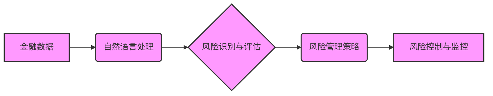

                 

## 风险管理专家：LLM 在金融领域的应用

> 关键词：LLM, 大语言模型, 风险管理, 金融科技, 预测分析, 欺诈检测, 监管合规

## 1. 背景介绍

金融行业一直以来都面临着各种各样的风险，包括市场风险、信用风险、操作风险和法律合规风险等。传统风险管理方法往往依赖于经验和规则，难以应对复杂、动态的金融环境。近年来，随着人工智能技术的快速发展，特别是大语言模型（LLM）的出现，为金融风险管理带来了新的机遇。

LLM 是一种强大的机器学习模型，能够理解和生成人类语言。它拥有海量文本数据训练，具备强大的文本处理能力，可以分析和理解复杂的金融文本，例如财务报表、新闻报道、市场评论等。LLM 的应用可以帮助金融机构提高风险识别、评估和管理的效率和准确性。

## 2. 核心概念与联系

**2.1 核心概念**

* **大语言模型 (LLM):**  一种基于深度学习的强大人工智能模型，能够理解和生成人类语言。它通过训练海量文本数据，学习语言的语法、语义和上下文关系。

* **金融风险管理:**  金融机构为了规避和控制各种风险而采取的一系列措施和策略。

* **自然语言处理 (NLP):**  让计算机能够理解、处理和生成人类语言的技术领域。

**2.2 架构关系**



## 3. 核心算法原理 & 具体操作步骤

**3.1 算法原理概述**

LLM 在金融风险管理中的应用主要基于以下核心算法原理：

* **文本分类:**  利用 LLM 对金融文本进行分类，例如识别欺诈交易、违规行为或市场风险信号。
* **文本摘要:**  提取金融文本的关键信息，例如财务报表中的关键指标或新闻报道中的风险因素。
* **文本生成:**  根据金融数据生成风险报告、预测分析或策略建议。
* **关系抽取:**  从金融文本中识别实体之间的关系，例如客户与账户、公司与投资等，帮助构建风险图谱。

**3.2 算法步骤详解**

1. **数据收集:**  收集相关金融数据，包括文本数据（例如财务报表、新闻报道、市场评论）、结构化数据（例如交易记录、客户信息）。
2. **数据预处理:**  对收集到的数据进行清洗、格式化和转换，例如去除停用词、标点符号、HTML 标签等。
3. **模型训练:**  使用 LLM 模型对预处理后的数据进行训练，例如使用 BERT、GPT-3 等预训练模型进行微调。
4. **模型评估:**  使用测试数据评估模型的性能，例如准确率、召回率、F1 分数等。
5. **模型部署:**  将训练好的模型部署到生产环境中，用于实际的风险管理应用。

**3.3 算法优缺点**

**优点:**

* **强大的文本处理能力:**  LLM 可以理解和处理复杂的金融文本，提取关键信息和隐含关系。
* **自动化和效率提升:**  LLM 可以自动化许多风险管理任务，例如文本分类、风险识别、报告生成，提高效率和准确性。
* **个性化风险管理:**  LLM 可以根据客户的特定情况和风险偏好提供个性化的风险管理建议。

**缺点:**

* **数据依赖性:**  LLM 的性能依赖于训练数据的质量和数量。
* **解释性问题:**  LLM 的决策过程往往是黑盒，难以解释其背后的逻辑。
* **伦理风险:**  LLM 可能存在偏见和歧视问题，需要谨慎使用和监管。

**3.4 算法应用领域**

* **欺诈检测:**  识别信用卡欺诈、网络钓鱼、洗钱等欺诈行为。
* **信用风险评估:**  评估客户的信用风险，例如贷款申请、信用评分。
* **市场风险管理:**  预测市场波动、识别风险因素，帮助投资决策。
* **监管合规:**  自动识别和处理监管合规风险，例如反洗钱、反恐融资。

## 4. 数学模型和公式 & 详细讲解 & 举例说明

**4.1 数学模型构建**

LLM 的训练过程本质上是一个优化问题，目标是找到模型参数，使得模型在训练数据上的预测性能达到最大。常用的数学模型包括：

* **交叉熵损失函数:**  用于分类任务，衡量模型预测结果与真实标签之间的差异。
* **均方误差损失函数:**  用于回归任务，衡量模型预测结果与真实值之间的差异。

**4.2 公式推导过程**

假设我们有一个分类任务，模型输出一个概率分布 $p(y|x)$，其中 $x$ 是输入数据，$y$ 是真实标签。交叉熵损失函数定义如下：

$$
L(p, y) = - \sum_{y} y \log p(y|x)
$$

其中，$y$ 是真实标签的 one-hot 编码。

**4.3 案例分析与讲解**

例如，在欺诈检测任务中，LLM 可以学习识别欺诈交易的特征，并输出一个概率，表示该交易是欺诈交易的可能性。如果模型预测概率大于某个阈值，则将其标记为欺诈交易。

## 5. 项目实践：代码实例和详细解释说明

**5.1 开发环境搭建**

* Python 3.x
* TensorFlow 或 PyTorch
* NLTK 或 SpaCy 等 NLP 库

**5.2 源代码详细实现**

```python
import tensorflow as tf
from tensorflow.keras.layers import Embedding, LSTM, Dense

# 数据预处理
# ...

# 模型构建
model = tf.keras.Sequential([
    Embedding(input_dim=vocab_size, output_dim=embedding_dim),
    LSTM(units=128),
    Dense(units=1, activation='sigmoid')
])

# 模型编译
model.compile(optimizer='adam', loss='binary_crossentropy', metrics=['accuracy'])

# 模型训练
model.fit(x_train, y_train, epochs=10)

# 模型评估
loss, accuracy = model.evaluate(x_test, y_test)
print('Loss:', loss)
print('Accuracy:', accuracy)
```

**5.3 代码解读与分析**

* 该代码示例使用 TensorFlow 构建了一个简单的 LLM 模型，用于欺诈检测任务。
* 模型结构包括 Embedding 层、LSTM 层和 Dense 层。
* Embedding 层将文本单词映射到向量空间。
* LSTM 层用于捕捉文本序列中的长距离依赖关系。
* Dense 层用于输出欺诈概率。

**5.4 运行结果展示**

* 模型训练完成后，可以评估其在测试数据上的性能，例如准确率、召回率等。
* 还可以使用模型预测新的数据，例如识别新的欺诈交易。

## 6. 实际应用场景

**6.1 欺诈检测**

LLM 可以分析交易记录、客户行为和网络活动等数据，识别欺诈交易模式，例如信用卡欺诈、网络钓鱼、洗钱等。

**6.2 信用风险评估**

LLM 可以分析客户的财务报表、信用记录、社交媒体信息等数据，评估客户的信用风险，例如贷款申请、信用评分。

**6.3 市场风险管理**

LLM 可以分析市场新闻、社交媒体评论、财务报表等数据，预测市场波动、识别风险因素，帮助投资决策。

**6.4 监管合规**

LLM 可以自动识别和处理监管合规风险，例如反洗钱、反恐融资、客户身份验证等。

**6.5 未来应用展望**

* **个性化风险管理:**  根据客户的特定情况和风险偏好提供个性化的风险管理建议。
* **实时风险监控:**  实时监控市场变化和客户行为，及时识别和应对风险。
* **自动化风险控制:**  自动化许多风险管理任务，例如风险评估、策略调整、警报触发等。

## 7. 工具和资源推荐

**7.1 学习资源推荐**

* **书籍:**  《深度学习》、《自然语言处理》
* **在线课程:**  Coursera、edX、Udacity 等平台上的深度学习和 NLP 课程。
* **博客和论坛:**  Hugging Face、Towards Data Science 等平台上的相关博客和论坛。

**7.2 开发工具推荐**

* **Python:**  主流的深度学习和 NLP 开发语言。
* **TensorFlow:**  开源深度学习框架。
* **PyTorch:**  开源深度学习框架。
* **NLTK:**  自然语言处理工具包。
* **SpaCy:**  高效的自然语言处理库。

**7.3 相关论文推荐**

* **BERT:**  Bidirectional Encoder Representations from Transformers
* **GPT-3:**  Generative Pre-trained Transformer 3
* **XLNet:**  Generalized Autoregressive Pretraining for Language Understanding

## 8. 总结：未来发展趋势与挑战

**8.1 研究成果总结**

LLM 在金融风险管理领域取得了显著的成果，例如提高了欺诈检测的准确率、优化了信用风险评估、增强了市场风险管理等。

**8.2 未来发展趋势**

* **模型规模和能力提升:**  未来 LLM 模型将更加强大，能够处理更复杂的任务，例如更精准的风险预测、更个性化的风险管理建议。
* **解释性增强:**  研究人员将致力于提高 LLM 的解释性，使得其决策过程更加透明和可理解。
* **多模态融合:**  LLM 将与其他模态数据（例如图像、音频）融合，实现更全面的风险管理。

**8.3 面临的挑战**

* **数据安全和隐私:**  LLM 的训练和应用需要处理大量敏感数据，需要加强数据安全和隐私保护措施。
* **算法偏见和歧视:**  LLM 可能存在偏见和歧视问题，需要进行公平性和可解释性方面的研究。
* **监管和伦理:**  LLM 的应用需要制定相应的监管和伦理规范，确保其安全、公平和可持续发展。

**8.4 研究展望**

未来，LLM 在金融风险管理领域将继续发挥重要作用，推动金融科技的创新发展。研究人员将继续探索 LLM 的潜力，解决其面临的挑战，为金融行业提供更安全、高效、智能的风险管理解决方案。


## 9. 附录：常见问题与解答

**9.1 如何选择合适的 LLM 模型？**

选择合适的 LLM 模型取决于具体的应用场景和数据特点。例如，对于文本分类任务，BERT 和 RoBERTa 等预训练模型效果较好；对于文本生成任务，GPT-3 等生成式模型更适合。

**9.2 如何处理 LLM 模型的输出结果？**

LLM 模型的输出结果通常是一个概率分布或向量，需要进行适当的处理才能得到可用的结果。例如，对于欺诈检测任务，可以根据模型输出的概率阈值判断交易是否为欺诈。

**9.3 如何评估 LLM 模型的性能？**

常用的评估指标包括准确率、召回率、F1 分数、AUC 等。选择合适的评估指标取决于具体的应用场景和任务目标。


作者：禅与计算机程序设计艺术 / Zen and the Art of Computer Programming 
<end_of_turn>

