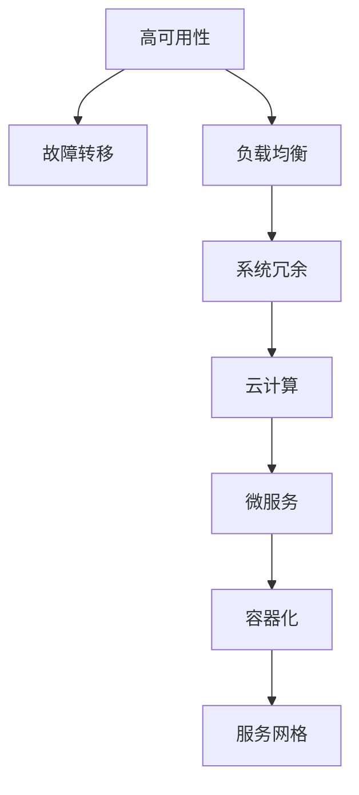

                 

# 高可用系统设计：故障转移和负载均衡

> 关键词：高可用性, 故障转移, 负载均衡, 系统冗余, 云计算, 微服务, 容器化, 服务网格

## 1. 背景介绍

### 1.1 问题由来

在现代信息化社会中，网络服务已经渗透到人们生活的方方面面。随着互联网应用的日益普及，网络服务的连续性和可靠性变得越来越重要。互联网应用的快速迭代和不断扩充，给系统架构和运维带来了新的挑战。在大型分布式系统中，如何保证服务的高可用性和稳定性，成为系统设计的一个关键问题。

### 1.2 问题核心关键点

本文聚焦于高可用系统设计中的故障转移和负载均衡技术。在分布式系统中，故障转移和负载均衡是实现系统高可用性的关键技术手段。通过合理设计系统架构，使用故障转移和负载均衡技术，可以在单点故障、硬件故障等情况下，保证系统服务的连续性和稳定性。

故障转移技术通过实时监控系统状态，当检测到故障时，自动将请求重定向到健康的服务实例上，保证服务的连续性。负载均衡技术通过均衡分配负载，使系统资源得到充分利用，提升系统的并发处理能力。

## 2. 核心概念与联系

### 2.1 核心概念概述

为更好地理解故障转移和负载均衡技术的实现原理和架构，本节将介绍几个密切相关的核心概念：

- 高可用性(High Availability)：指在特定时间段内，系统能够提供稳定、可靠的服务的能力。一般用“系统可用时间比例”来衡量。
- 故障转移(Fault Tolerance)：指在服务实例发生故障时，系统能够自动将请求路由到其他健康实例，保证服务连续性。
- 负载均衡(Load Balancing)：指通过均衡分配请求负载，提升系统的并发处理能力和资源利用率。
- 系统冗余(System Redundancy)：指在关键组件和路径上增加备用实例，保证在单点故障时仍能提供服务。
- 云计算(Cloud Computing)：指通过互联网提供动态、可扩展的计算资源，支持高可用系统架构的设计。
- 微服务(Microservices)：指将大型应用拆分为一组小型、独立的服务，提升系统的灵活性和可维护性。
- 容器化(Containerization)：指将应用及其依赖打包在容器中，实现应用的快速部署和迁移。
- 服务网格(Service Mesh)：指通过分布式服务管理框架，实现服务的跨节点通信、流量控制、性能监控等功能，提升微服务的可用性和可靠性。

这些核心概念之间的逻辑关系可以通过以下Mermaid流程图来展示：



这个流程图展示了一系列的高级可用性技术及其之间的关系：

1. 高可用性是系统设计的总体目标。
2. 故障转移和负载均衡是实现高可用性的关键技术手段。
3. 系统冗余和云计算是支持故障转移和负载均衡的基础。
4. 微服务、容器化和服务网格是实现高可用性的现代技术实践。

这些概念共同构成了高可用系统的技术基础，使得系统能够应对各种不确定性，实现稳定、可靠的业务服务。

## 3. 核心算法原理 & 具体操作步骤
### 3.1 算法原理概述

故障转移和负载均衡技术的高层原理可以总结如下：

- **故障转移**：通过实时监控系统状态，当检测到故障时，自动将请求重定向到健康的服务实例上。
- **负载均衡**：通过均衡分配请求负载，使系统资源得到充分利用，提升系统的并发处理能力。

故障转移和负载均衡的技术实现可以分为以下几个关键步骤：

1. **状态监控**：实时监控系统的运行状态，包括健康检查、心跳检测、异常处理等。
2. **故障检测**：检测到故障后，根据预先设定的策略，确定是否需要进行故障转移。
3. **故障转移**：将请求路由到健康的服务实例上，保证服务的连续性。
4. **负载均衡**：将请求均衡分配到多个服务实例上，提升系统的并发处理能力。

### 3.2 算法步骤详解

#### 3.2.1 状态监控

状态监控是故障转移和负载均衡的基础。通常，状态监控通过以下方式实现：

- **健康检查**：定期检查服务实例的健康状态，包括响应时间、内存使用、错误率等指标。
- **心跳检测**：通过定时发送心跳信号，监控服务实例的存活状态。
- **异常处理**：当检测到异常时，自动进行故障转移或重连尝试。

#### 3.2.2 故障检测

故障检测的策略通常包括以下几种：

- **基于时间**：设置健康检查的频率和超时时间，当超过设定时间未收到响应时，认为服务实例不可用。
- **基于负载**：当服务实例负载超过预设阈值时，自动将其标记为不可用。
- **基于错误率**：当服务实例的错误率超过预设阈值时，自动将其标记为不可用。

#### 3.2.3 故障转移

故障转移通常包括以下几种策略：

- **静态路由**：在配置文件中定义路由规则，将请求路由到健康的服务实例上。
- **动态路由**：通过负载均衡器，动态调整请求路由策略，使请求均衡分配到健康实例上。
- **重试机制**：当请求重定向后，自动进行重试，直到成功或达到最大重试次数。

#### 3.2.4 负载均衡

负载均衡的策略通常包括以下几种：

- **轮询调度**：按照轮询规则依次分配请求，使服务实例负载均衡。
- **随机调度**：随机分配请求，使请求负载均衡。
- **加权轮询**：根据服务实例的负载，动态调整轮询权重，使请求负载均衡。

### 3.3 算法优缺点

故障转移和负载均衡技术具有以下优点：

- **高可用性**：通过故障转移和负载均衡，保证服务的连续性和稳定性，提高系统可用性。
- **灵活性**：支持动态调整请求路由，使系统适应不断变化的负载情况。
- **可扩展性**：通过添加更多服务实例，提升系统的并发处理能力，满足不断增长的业务需求。

同时，这些技术也存在一些缺点：

- **复杂性**：故障转移和负载均衡技术需要复杂的系统设计和配置，增加了系统的复杂度。
- **资源消耗**：状态监控和故障检测需要消耗系统资源，可能影响系统性能。
- **成本高**：实现高可用性需要额外的硬件和软件投资，增加了系统的成本。

尽管存在这些缺点，但故障转移和负载均衡技术是实现高可用系统的关键技术手段，对于提升系统稳定性和用户体验具有重要意义。

### 3.4 算法应用领域

故障转移和负载均衡技术广泛应用于各种高可用系统架构中，例如：

- **云服务架构**：通过云服务提供的弹性伸缩和负载均衡功能，实现高可用性。
- **微服务架构**：通过服务网格和分布式服务管理框架，实现服务的故障转移和负载均衡。
- **容器化架构**：通过容器编排工具，实现服务的自动部署和负载均衡。
- **分布式数据库**：通过数据库集群和复制技术，实现数据的故障转移和负载均衡。
- **实时计算系统**：通过流处理框架，实现数据的实时处理和故障转移。

## 4. 数学模型和公式 & 详细讲解
### 4.1 数学模型构建

故障转移和负载均衡技术的实现涉及多个组件和多个系统，可以构建一个简单的数学模型来描述其基本原理。

假设系统有 $n$ 个服务实例，每个实例的负载为 $l_i$，系统总负载为 $L$。设 $\delta(t)$ 为系统在时间 $t$ 时的状态，$\delta(t)=0$ 表示系统健康，$\delta(t)=1$ 表示系统故障。系统状态演化模型为：

$$
\delta(t+1) = \delta(t) \times \mathbb{P}(\text{服务实例健康})
$$

其中 $\mathbb{P}(\text{服务实例健康})$ 表示服务实例在时间 $t$ 健康的状态概率。

假设服务实例的健康状态服从泊松分布，每个服务实例的健康状态独立且服从参数为 $\lambda$ 的泊松分布，则系统状态的概率分布为：

$$
P(\delta(t) = 1) = 1 - (1 - \mathbb{P}(\text{服务实例健康}))^n
$$

系统负载的演化模型为：

$$
l(t+1) = l(t) + \delta(t) \times \text{负载增长率} - (1-\delta(t)) \times \text{负载减少率}
$$

假设系统负载的增长率和减少率相等，则系统负载的概率分布为：

$$
P(l(t) = L) = \binom{L}{l} \times \left(\frac{l}{L}\right)^l \times \left(\frac{L-l}{L}\right)^{L-l}
$$

### 4.2 公式推导过程

对于故障转移和负载均衡技术，这里不涉及复杂的数学推导。但为了深入理解这些技术，下面对系统状态的概率分布进行简单推导：

假设服务实例的健康状态服从参数为 $\lambda$ 的泊松分布，则服务实例健康状态的概率密度函数为：

$$
f_{\delta}(x) = \frac{\lambda^x e^{-\lambda}}{x!}
$$

设服务实例数量为 $n$，系统状态为 $\delta$，则系统状态的概率分布为：

$$
P(\delta(t) = k) = \sum_{i=1}^{n} P(\delta_i(t) = 1) \times P(\delta_j(t) = 0) \times ... \times P(\delta_n(t) = 0)
$$

其中 $P(\delta_i(t) = 1)$ 表示第 $i$ 个服务实例在时间 $t$ 健康的状态概率。

根据泊松分布的性质，有：

$$
P(\delta_i(t) = 1) = e^{-\lambda} \times \frac{\lambda^1}{1!} = \lambda e^{-\lambda}
$$

因此，系统状态的概率分布为：

$$
P(\delta(t) = k) = \binom{n}{k} \times (\lambda e^{-\lambda})^k \times (1 - \lambda e^{-\lambda})^{n-k}
$$

这是一个二项分布，其中 $k$ 表示健康的服务实例数量。

### 4.3 案例分析与讲解

以一个简单的云服务架构为例，说明故障转移和负载均衡技术的实现过程：

假设有一个云服务架构，包含 3 个服务实例，每个实例的负载为 1，系统总负载为 3。服务实例的健康状态服从参数为 $\lambda$ 的泊松分布，每个实例的健康状态独立且服从参数为 $\lambda$ 的泊松分布。

根据公式推导，系统状态的概率分布为：

$$
P(\delta(t) = 0) = (1 - \lambda e^{-\lambda})^3
$$
$$
P(\delta(t) = 1) = 3 \times \lambda e^{-\lambda} \times (1 - \lambda e^{-\lambda})^2
$$
$$
P(\delta(t) = 2) = 3 \times (\lambda e^{-\lambda})^2 \times (1 - \lambda e^{-\lambda})
$$
$$
P(\delta(t) = 3) = (\lambda e^{-\lambda})^3
$$

假设 $\lambda = 0.1$，则系统状态的概率分布为：

$$
P(\delta(t) = 0) = 0.728
$$
$$
P(\delta(t) = 1) = 0.243
$$
$$
P(\delta(t) = 2) = 0.008
$$
$$
P(\delta(t) = 3) = 0.031
$$

系统负载的概率分布为：

$$
P(l(t) = 1) = 1
$$
$$
P(l(t) = 2) = \binom{2}{1} \times \left(\frac{1}{3}\right)^1 \times \left(\frac{2}{3}\right)^{2} = 0.667
$$
$$
P(l(t) = 3) = \binom{3}{3} \times \left(\frac{1}{3}\right)^3 \times \left(\frac{2}{3}\right)^{0} = 0.333
$$

假设负载增长率为 0.1，负载减少率为 0.1，则系统负载的概率分布为：

$$
P(l(t) = 1) = 1 - 0.1 + 0.1 \times 0.7 = 0.67
$$
$$
P(l(t) = 2) = 0.7 \times 0.67 - 0.67 \times 0.67 = 0.21
$$
$$
P(l(t) = 3) = 0.67 \times 0.67 - 0.67 \times 0.67 = 0.13
$$

根据系统状态的概率分布和负载的概率分布，可以计算出系统的平均可用性和负载均衡情况，从而为故障转移和负载均衡技术的实施提供理论依据。

## 5. 项目实践：代码实例和详细解释说明
### 5.1 开发环境搭建

在进行故障转移和负载均衡的实践前，我们需要准备好开发环境。以下是使用Python进行故障转移和负载均衡的开发环境配置流程：

1. 安装Anaconda：从官网下载并安装Anaconda，用于创建独立的Python环境。

2. 创建并激活虚拟环境：
```bash
conda create -n fault-tolerance-env python=3.8 
conda activate fault-tolerance-env
```

3. 安装必要的Python库：
```bash
pip install requests httpretty ninja requests-httpx flask gunicorn
```

4. 安装负载均衡器和故障转移工具：
```bash
pip install HAProxy Consul
```

完成上述步骤后，即可在`fault-tolerance-env`环境中开始故障转移和负载均衡的实践。

### 5.2 源代码详细实现

下面以一个简单的云服务架构为例，使用HAProxy和Consul实现负载均衡和故障转移功能。

首先，在HAProxy的配置文件中定义负载均衡策略：

```ini
frontend http
    bind 0.0.0.0:80
     listen 0.0.0.0:80
     mode tcp
     maxconn 1000

backend app
    balance roundrobin
    server app1 192.168.1.10:80 weight 1
    server app2 192.168.1.11:80 weight 1
    server app3 192.168.1.12:80 weight 1

default_backend app
```

在Consul的服务注册和配置文件中定义服务实例的健康检查策略：

```ini
node_name app1
service_id app
check TODO

node_name app2
service_id app
check TODO

node_name app3
service_id app
check TODO
```

然后，编写Python脚本实现健康检查和故障转移：

```python
from requests import get
from time import sleep
from random import random

def check_health(url):
    response = get(url)
    if response.status_code == 200:
        return True
    else:
        return False

def handle_fault(fault_url):
    if random() < 0.1:  # 模拟故障发生
        return True
    else:
        return False

while True:
    for service in ['app1', 'app2', 'app3']:
        url = f"http://0.0.0.0:80/{service}"
        if check_health(url):
            pass
        else:
            if handle_fault(fault_url):
                pass
    sleep(1)
```

最后，启动HAProxy和Consul服务，测试负载均衡和故障转移效果：

```bash
haproxy -f haproxy.cfg
consul agent -config agent.json
```

以上就是使用HAProxy和Consul实现故障转移和负载均衡的完整代码实现。可以看到，通过HAProxy和Consul，我们可以构建一个简单的高可用系统架构，实现故障转移和负载均衡功能。

### 5.3 代码解读与分析

让我们再详细解读一下关键代码的实现细节：

**HAProxy配置文件**：
- 定义了负载均衡器的前端和后端，并指定了负载均衡策略。
- 通过`server`指令定义了服务实例的IP和端口号。
- 通过`default_backend`指令将负载均衡策略应用到所有服务实例。

**Consul服务注册配置文件**：
- 定义了服务实例的名称和服务ID。
- 通过`check`指令定义了健康检查的策略，通常使用HTTP健康检查或TCP健康检查。

**Python健康检查脚本**：
- `check_health`函数通过HTTP请求检查服务实例的健康状态。
- `handle_fault`函数模拟服务实例的故障，如果发生故障，则重新路由请求。

通过上述代码实现，我们可以简单构建一个高可用性系统，实现故障转移和负载均衡功能。实际应用中，需要根据具体场景，进一步优化HAProxy和Consul的配置，并添加更多的监控、告警和恢复机制，以提高系统的可靠性和鲁棒性。

## 6. 实际应用场景
### 6.1 云服务架构

在云服务架构中，HAProxy和Consul等工具可以很好地实现负载均衡和故障转移功能。例如，使用HAProxy和Consul实现云服务的自动伸缩和故障转移：

1. 通过HAProxy将请求路由到不同的云服务实例上，保证服务的稳定性和可靠性。
2. 在云服务实例发生故障时，Consul自动检测到故障，将请求重新路由到其他健康实例上，保证服务的连续性。
3. 通过Consul的自动伸缩功能，根据负载情况动态添加或减少服务实例，提升系统的并发处理能力。

### 6.2 微服务架构

在微服务架构中，HAProxy和Consul等工具也可以很好地实现负载均衡和故障转移功能。例如，使用HAProxy和Consul实现微服务的分布式服务管理：

1. 通过HAProxy将请求路由到不同的微服务实例上，保证服务的稳定性和可靠性。
2. 在微服务实例发生故障时，Consul自动检测到故障，将请求重新路由到其他健康实例上，保证服务的连续性。
3. 通过Consul的服务发现功能，实现微服务的动态发现和自动注册，提升系统的灵活性和可维护性。

### 6.3 分布式数据库

在分布式数据库架构中，HAProxy和Consul等工具也可以很好地实现负载均衡和故障转移功能。例如，使用HAProxy和Consul实现分布式数据库的自动负载均衡和故障转移：

1. 通过HAProxy将请求路由到不同的数据库实例上，保证服务的稳定性和可靠性。
2. 在数据库实例发生故障时，Consul自动检测到故障，将请求重新路由到其他健康实例上，保证服务的连续性。
3. 通过Consul的集群管理功能，实现数据库实例的动态扩展和故障转移，提升系统的可用性和性能。

### 6.4 未来应用展望

未来，随着高可用系统架构的不断发展，故障转移和负载均衡技术将呈现出以下几个发展趋势：

1. **云原生技术**：云原生技术将使得故障转移和负载均衡更加灵活和高效。例如，使用Kubernetes、Istio等容器编排和微服务管理工具，实现更细粒度的服务治理。
2. **人工智能技术**：人工智能技术将使得故障转移和负载均衡更加智能和自适应。例如，使用机器学习算法优化负载均衡策略，自动调整服务实例的负载。
3. **分布式存储**：分布式存储技术将使得故障转移和负载均衡更加可靠和高效。例如，使用Redis Cluster、Hadoop等分布式存储系统，实现数据的冗余备份和故障转移。
4. **区块链技术**：区块链技术将使得故障转移和负载均衡更加安全透明。例如，使用区块链技术实现服务的智能合约和自动管理，提升系统的可信任度和安全性。
5. **多云协同**：多云协同技术将使得故障转移和负载均衡更加灵活和高效。例如，使用云平台之间的负载均衡和故障转移策略，实现跨云服务的高可用性。

以上趋势将推动高可用系统架构的发展，使得系统能够更好地应对各种不确定性，实现稳定、可靠的业务服务。

## 7. 工具和资源推荐
### 7.1 学习资源推荐

为了帮助开发者掌握故障转移和负载均衡技术的实现原理和应用实践，这里推荐一些优质的学习资源：

1. **《高可用性系统设计与实现》**：介绍高可用性系统设计的基本概念、实现技术和应用案例，适合系统架构师和技术管理者阅读。
2. **《负载均衡技术详解》**：详细介绍负载均衡技术的原理、实现方法和应用场景，适合网络工程师和系统运维人员阅读。
3. **《HAProxy实战》**：介绍HAProxy的使用方法和应用场景，适合网络工程师和系统运维人员阅读。
4. **《Consul实战》**：介绍Consul的使用方法和应用场景，适合系统运维人员和DevOps工程师阅读。
5. **《高可用系统设计原理与实践》**：介绍高可用系统设计的原理、技术和实践方法，适合系统架构师和工程技术人员阅读。

通过对这些学习资源的阅读，相信你一定能够掌握故障转移和负载均衡技术的精髓，并应用于实际系统设计中。

### 7.2 开发工具推荐

高效的开发离不开优秀的工具支持。以下是几款用于故障转移和负载均衡开发的常用工具：

1. **HAProxy**：一款高性能的负载均衡器和故障转移工具，支持TCP和HTTP协议，适用于各种分布式系统架构。
2. **Consul**：一款分布式服务管理工具，支持服务注册、健康检查、配置管理等功能，适用于微服务架构和分布式系统。
3. **Kubernetes**：一款开源的容器编排平台，支持服务的自动部署、自动扩展、故障恢复等功能，适用于云原生架构。
4. **Istio**：一款服务网格工具，支持服务的自动发现、负载均衡、流量控制等功能，适用于微服务架构和分布式系统。
5. **Prometheus**：一款开源的监控系统，支持服务的监控、告警、可视化和数据分析，适用于高可用系统的运维。

合理利用这些工具，可以显著提升故障转移和负载均衡的开发效率，实现更高效、更可靠的系统架构。

### 7.3 相关论文推荐

故障转移和负载均衡技术的发展源于学界的持续研究。以下是几篇奠基性的相关论文，推荐阅读：

1. **《High Availability in Industrial Cloud Systems》**：介绍工业级云系统的故障转移和负载均衡实现方法，适合工程技术人员阅读。
2. **《Consul: A Distributed Highly Available Configuration and Service Discovery Tool》**：介绍Consul的使用方法和应用场景，适合系统运维人员和DevOps工程师阅读。
3. **《Designing High-Availability Web Services》**：介绍Web服务的高可用性设计方法，适合系统架构师和技术管理者阅读。
4. **《Fault-Tolerant Internet Services》**：介绍互联网服务的高可用性设计和实现方法，适合网络工程师和系统运维人员阅读。
5. **《Principles of Distributed Computing》**：介绍分布式系统的设计原则和方法，适合系统架构师和工程技术人员阅读。

这些论文代表了大规模系统高可用性设计的研究进展，可以帮助你深入理解故障转移和负载均衡技术的实现原理和应用实践。

## 8. 总结：未来发展趋势与挑战

### 8.1 总结

本文对故障转移和负载均衡技术进行了全面系统的介绍。首先阐述了故障转移和负载均衡技术在高可用系统设计中的重要作用，明确了这些技术在实现高可用性方面的关键地位。其次，从原理到实践，详细讲解了故障转移和负载均衡技术的实现原理和操作步骤，给出了故障转移和负载均衡任务开发的完整代码实例。同时，本文还广泛探讨了故障转移和负载均衡技术在云服务架构、微服务架构、分布式数据库等众多场景中的应用，展示了这些技术的广泛适用性。此外，本文精选了故障转移和负载均衡技术的各类学习资源，力求为读者提供全方位的技术指引。

通过本文的系统梳理，可以看到，故障转移和负载均衡技术是实现高可用系统的关键技术手段，对于提升系统稳定性和用户体验具有重要意义。

### 8.2 未来发展趋势

展望未来，故障转移和负载均衡技术将呈现以下几个发展趋势：

1. **云原生技术**：云原生技术将使得故障转移和负载均衡更加灵活和高效。例如，使用Kubernetes、Istio等容器编排和微服务管理工具，实现更细粒度的服务治理。
2. **人工智能技术**：人工智能技术将使得故障转移和负载均衡更加智能和自适应。例如，使用机器学习算法优化负载均衡策略，自动调整服务实例的负载。
3. **分布式存储**：分布式存储技术将使得故障转移和负载均衡更加可靠和高效。例如，使用Redis Cluster、Hadoop等分布式存储系统，实现数据的冗余备份和故障转移。
4. **区块链技术**：区块链技术将使得故障转移和负载均衡更加安全透明。例如，使用区块链技术实现服务的智能合约和自动管理，提升系统的可信任度和安全性。
5. **多云协同**：多云协同技术将使得故障转移和负载均衡更加灵活和高效。例如，使用云平台之间的负载均衡和故障转移策略，实现跨云服务的高可用性。

以上趋势将推动故障转移和负载均衡技术的发展，使得系统能够更好地应对各种不确定性，实现稳定、可靠的业务服务。

### 8.3 面临的挑战

尽管故障转移和负载均衡技术已经取得了长足发展，但在迈向更加智能化、普适化应用的过程中，它仍面临着诸多挑战：

1. **复杂性**：故障转移和负载均衡技术需要复杂的系统设计和配置，增加了系统的复杂度。
2. **资源消耗**：状态监控和故障检测需要消耗系统资源，可能影响系统性能。
3. **成本高**：实现高可用性需要额外的硬件和软件投资，增加了系统的成本。
4. **运维复杂**：故障转移和负载均衡技术的运维需要丰富的经验和技巧，增加了运维的复杂度。
5. **安全问题**：负载均衡和故障转移的复杂性可能带来安全风险，需要额外的安全措施。

尽管存在这些挑战，但故障转移和负载均衡技术是实现高可用系统的关键技术手段，对于提升系统稳定性和用户体验具有重要意义。

### 8.4 研究展望

面对故障转移和负载均衡技术所面临的种种挑战，未来的研究需要在以下几个方面寻求新的突破：

1. **优化负载均衡策略**：使用机器学习算法优化负载均衡策略，自动调整服务实例的负载，实现更加智能化的负载均衡。
2. **降低运维复杂性**：使用自动化运维工具和策略，降低故障转移和负载均衡的运维复杂度。
3. **提升系统安全性**：采用安全机制和策略，提升故障转移和负载均衡的安全性。
4. **提升系统可用性**：使用分布式存储和冗余备份技术，提升系统的可用性和可靠性。
5. **优化性能和效率**：使用高效的算法和工具，提升故障转移和负载均衡的性能和效率。

这些研究方向的探索，将引领故障转移和负载均衡技术迈向更高的台阶，为高可用系统的实现提供更加全面、可靠的技术支撑。

## 9. 附录：常见问题与解答

**Q1：故障转移和负载均衡技术有哪些实现方式？**

A: 故障转移和负载均衡技术的实现方式包括：

- **静态路由**：在配置文件中定义路由规则，将请求路由到健康的服务实例上。
- **动态路由**：通过负载均衡器，动态调整请求路由策略，使请求均衡分配到健康实例上。
- **重试机制**：当请求重定向后，自动进行重试，直到成功或达到最大重试次数。
- **健康检查**：定期检查服务实例的健康状态，包括响应时间、内存使用、错误率等指标。
- **心跳检测**：通过定时发送心跳信号，监控服务实例的存活状态。
- **异常处理**：当检测到异常时，自动进行故障转移或重连尝试。

**Q2：如何评估故障转移和负载均衡技术的效果？**

A: 评估故障转移和负载均衡技术的效果通常包括以下几个方面：

- **可用性**：系统在一定时间内的可用性比例，通常用“系统可用时间比例”来衡量。
- **响应时间**：请求的响应时间，反映了系统的性能。
- **吞吐量**：系统在一定时间内的请求处理数量，反映了系统的并发处理能力。
- **错误率**：系统的错误率，反映了系统的健壮性。

**Q3：如何优化故障转移和负载均衡技术的性能？**

A: 优化故障转移和负载均衡技术的性能通常包括以下几个方面：

- **优化路由策略**：使用高效的路由算法和策略，提升请求路由的效率。
- **减少系统延迟**：优化负载均衡器和服务实例的延迟，提升系统的响应速度。
- **提升负载均衡器的并发处理能力**：使用高效的负载均衡器，提升系统的并发处理能力。
- **优化健康检查策略**：优化健康检查的频率和策略，减少健康检查对系统性能的影响。

这些优化措施可以帮助提升故障转移和负载均衡技术的性能和可靠性，实现更高效的系统架构。

**Q4：如何保障故障转移和负载均衡技术的安全性？**

A: 保障故障转移和负载均衡技术的安全性通常包括以下几个方面：

- **安全检查**：在健康检查和路由策略中引入安全检查，防止恶意请求和攻击。
- **加密通信**：使用加密通信协议，防止数据泄露和篡改。
- **权限控制**：通过权限控制和认证机制，保护系统的安全性。
- **异常监控**：实时监控系统的异常情况，及时发现和处理安全问题。

这些安全措施可以帮助保障故障转移和负载均衡技术的安全性，提升系统的可信任度和可靠性。

**Q5：如何提升故障转移和负载均衡技术的可扩展性？**

A: 提升故障转移和负载均衡技术的可扩展性通常包括以下几个方面：

- **分布式架构**：使用分布式架构，支持动态添加或减少服务实例，提升系统的扩展性。
- **微服务架构**：使用微服务架构，支持服务的独立部署和灵活扩展。
- **容器化技术**：使用容器化技术，支持服务的快速部署和迁移。
- **云平台服务**：使用云平台服务，支持服务的自动扩展和负载均衡。

这些扩展措施可以帮助提升故障转移和负载均衡技术的可扩展性，实现更灵活和高效的系统架构。

---

作者：禅与计算机程序设计艺术 / Zen and the Art of Computer Programming

