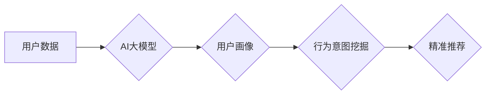

                 

## AI 大模型在电商搜索推荐中的用户画像应用：深度挖掘用户需求与行为意图

> 关键词：AI大模型、用户画像、电商搜索推荐、需求挖掘、行为意图、深度学习、自然语言处理

## 1. 背景介绍

随着电商行业的蓬勃发展，用户搜索和商品推荐已成为电商平台的核心竞争力。传统基于规则或协同过滤的推荐算法难以满足用户个性化需求和快速变化的市场趋势。近年来，深度学习技术在自然语言处理（NLP）和计算机视觉等领域取得了突破性进展，为电商搜索推荐提供了新的机遇。

AI大模型，特别是基于Transformer架构的模型，凭借其强大的语义理解和文本生成能力，在用户画像构建和需求挖掘方面展现出巨大潜力。通过对用户搜索历史、浏览记录、购买行为等海量数据进行深度学习，AI大模型可以构建更加精准的用户画像，并挖掘用户的潜在需求和行为意图，从而实现更精准、更个性化的商品推荐。

## 2. 核心概念与联系

### 2.1 用户画像

用户画像是指对用户进行数据分析和建模，以描述用户的基本特征、兴趣爱好、消费习惯、行为模式等，形成一个多维度的用户描述。

### 2.2 行为意图

行为意图是指用户在特定场景下执行特定行为的动机和目的。例如，用户搜索“运动鞋”可能意图购买运动鞋，也可能只是想了解运动鞋的款式和价格。

### 2.3 核心概念联系

AI大模型在电商搜索推荐中的用户画像应用，核心在于将用户画像与行为意图相结合，实现对用户需求的深度挖掘。

**Mermaid 流程图**



## 3. 核心算法原理 & 具体操作步骤

### 3.1 算法原理概述

AI大模型在用户画像构建和行为意图挖掘方面，主要采用以下算法：

* **深度神经网络（DNN）**: 用于学习用户数据中的复杂特征和模式。
* **循环神经网络（RNN）**: 用于处理用户行为序列数据，例如搜索历史和浏览记录。
* **Transformer**: 用于捕捉用户文本数据中的长距离依赖关系，提升语义理解能力。

### 3.2 算法步骤详解

1. **数据收集和预处理**: 收集用户搜索历史、浏览记录、购买行为等数据，并进行清洗、格式化和特征提取。
2. **模型训练**: 使用深度学习算法训练AI大模型，输入预处理后的用户数据，输出用户画像和行为意图预测结果。
3. **用户画像构建**: 根据模型训练结果，构建用户画像，包括用户基本信息、兴趣爱好、消费习惯、行为模式等。
4. **行为意图挖掘**: 利用AI大模型对用户行为进行分析，挖掘用户的潜在需求和行为意图。
5. **精准推荐**: 基于用户画像和行为意图，为用户推荐个性化商品。

### 3.3 算法优缺点

**优点**:

* 能够学习用户数据中的复杂特征和模式，构建更加精准的用户画像。
* 能够捕捉用户文本数据中的长距离依赖关系，提升语义理解能力。
* 能够挖掘用户的潜在需求和行为意图，实现更精准的商品推荐。

**缺点**:

* 需要海量数据进行训练，训练成本较高。
* 模型解释性较差，难以理解模型的决策过程。
* 存在数据偏差和隐私安全问题。

### 3.4 算法应用领域

* **电商搜索推荐**: 为用户提供个性化商品推荐，提升用户体验和转化率。
* **内容推荐**: 为用户推荐个性化内容，例如新闻、视频、文章等。
* **广告推荐**: 为用户推荐个性化广告，提升广告效果。
* **客户服务**: 利用AI大模型分析用户问题，提供更精准的客户服务。

## 4. 数学模型和公式 & 详细讲解 & 举例说明

### 4.1 数学模型构建

用户画像构建可以采用以下数学模型：

* **概率模型**: 使用贝叶斯网络或马尔科夫链等概率模型，描述用户特征之间的概率关系。
* **统计模型**: 使用聚类算法或主成分分析等统计模型，将用户数据聚类成不同的用户群体。
* **深度学习模型**: 使用深度神经网络，学习用户数据中的复杂特征和模式，构建用户画像。

### 4.2 公式推导过程

例如，使用贝叶斯网络构建用户画像，可以推导以下公式：

$$P(U|D) = \frac{P(D|U)P(U)}{P(D)}$$

其中：

* $P(U|D)$: 用户特征 $U$ 在数据 $D$ 下的条件概率。
* $P(D|U)$: 数据 $D$ 在用户特征 $U$ 下的条件概率。
* $P(U)$: 用户特征 $U$ 的先验概率。
* $P(D)$: 数据 $D$ 的边缘概率。

### 4.3 案例分析与讲解

假设我们想要构建一个用户画像模型，预测用户是否会购买某款商品。我们可以使用贝叶斯网络，将用户特征（例如年龄、性别、购买历史等）作为节点，将购买行为作为目标节点。通过训练模型，我们可以得到每个用户特征在购买行为下的条件概率，从而预测用户是否会购买该商品。

## 5. 项目实践：代码实例和详细解释说明

### 5.1 开发环境搭建

* Python 3.7+
* TensorFlow 2.0+
* PyTorch 1.0+
* Jupyter Notebook

### 5.2 源代码详细实现

```python
# 导入必要的库
import tensorflow as tf

# 定义用户画像模型
class UserPortraitModel(tf.keras.Model):
    def __init__(self):
        super(UserPortraitModel, self).__init__()
        self.embedding = tf.keras.layers.Embedding(input_dim=10000, output_dim=128)
        self.lstm = tf.keras.layers.LSTM(units=64)
        self.dense = tf.keras.layers.Dense(units=1, activation='sigmoid')

    def call(self, inputs):
        x = self.embedding(inputs)
        x = self.lstm(x)
        x = self.dense(x)
        return x

# 实例化模型
model = UserPortraitModel()

# 编译模型
model.compile(optimizer='adam', loss='binary_crossentropy', metrics=['accuracy'])

# 训练模型
model.fit(x_train, y_train, epochs=10)

# 预测用户画像
predictions = model.predict(x_test)
```

### 5.3 代码解读与分析

* 该代码定义了一个用户画像模型，使用Embedding层将用户特征向量化，LSTM层捕捉用户行为序列信息，Dense层输出用户画像预测结果。
* 模型使用Adam优化器，Binary Crossentropy损失函数，并使用Accuracy作为评估指标。
* 模型训练完成后，可以使用模型预测新的用户画像。

### 5.4 运行结果展示

训练完成后，可以查看模型的训练和验证损失以及准确率，评估模型的性能。

## 6. 实际应用场景

### 6.1 个性化商品推荐

AI大模型可以根据用户的兴趣爱好、购买历史等信息，为用户推荐个性化的商品，提升用户体验和转化率。

### 6.2 内容推荐

AI大模型可以根据用户的阅读习惯、浏览记录等信息，为用户推荐个性化的内容，例如新闻、视频、文章等。

### 6.3 广告推荐

AI大模型可以根据用户的兴趣爱好、行为模式等信息，为用户推荐个性化的广告，提升广告效果。

### 6.4 未来应用展望

* **更精准的个性化推荐**: 随着AI大模型技术的不断发展，未来可以构建更加精准的用户画像，实现更个性化的商品推荐。
* **跨平台用户画像**: 未来可以将用户数据整合到不同的平台，构建跨平台的用户画像，实现更全面的用户理解。
* **多模态用户画像**: 未来可以将文本、图像、视频等多模态数据融合到用户画像中，构建更加丰富的用户画像。

## 7. 工具和资源推荐

### 7.1 学习资源推荐

* **书籍**:
    * Deep Learning by Ian Goodfellow, Yoshua Bengio, and Aaron Courville
    * Natural Language Processing with Python by Steven Bird, Ewan Klein, and Edward Loper
* **在线课程**:
    * TensorFlow Tutorials: https://www.tensorflow.org/tutorials
    * PyTorch Tutorials: https://pytorch.org/tutorials/

### 7.2 开发工具推荐

* **TensorFlow**: https://www.tensorflow.org/
* **PyTorch**: https://pytorch.org/
* **Jupyter Notebook**: https://jupyter.org/

### 7.3 相关论文推荐

* Attention Is All You Need (Vaswani et al., 2017)
* BERT: Pre-training of Deep Bidirectional Transformers for Language Understanding (Devlin et al., 2018)
* Transformer-XL: Attentive Language Modeling Beyond Millions of Tokens (Dai et al., 2019)

## 8. 总结：未来发展趋势与挑战

### 8.1 研究成果总结

AI大模型在电商搜索推荐中的用户画像应用取得了显著成果，能够构建更加精准的用户画像，挖掘用户的潜在需求和行为意图，实现更精准的商品推荐。

### 8.2 未来发展趋势

* **模型规模和能力提升**: 未来AI大模型的规模和能力将进一步提升，能够处理更加复杂的用户数据，构建更加精准的用户画像。
* **多模态用户画像**: 未来将融合文本、图像、视频等多模态数据，构建更加丰富的用户画像。
* **解释性增强**: 未来将研究如何提高AI大模型的解释性，使得模型的决策过程更加透明。

### 8.3 面临的挑战

* **数据隐私安全**: AI大模型需要海量用户数据进行训练，如何保护用户数据隐私安全是一个重要的挑战。
* **模型公平性**: AI大模型可能会存在偏见，导致推荐结果不公平，需要研究如何保证模型的公平性。
* **模型可解释性**: AI大模型的决策过程复杂，难以理解，需要研究如何提高模型的可解释性。

### 8.4 研究展望

未来将继续研究AI大模型在电商搜索推荐中的应用，探索更精准、更个性化的推荐方法，提升用户体验和商业价值。

## 9. 附录：常见问题与解答

* **Q1: AI大模型的训练成本很高吗？**

A1: 确实，AI大模型的训练成本较高，需要大量的计算资源和数据。

* **Q2: 如何保证AI大模型的公平性？**

A2: 这是一个重要的挑战，需要在数据收集、模型训练和评估过程中，关注公平性问题，并采取相应的措施。

* **Q3: 如何提高AI大模型的可解释性？**

A3: 这是一个活跃的研究方向，目前有一些方法可以提高模型的可解释性，例如使用可解释的机器学习模型、进行模型分析和解释。


作者：禅与计算机程序设计艺术 / Zen and the Art of Computer Programming 
<end_of_turn>

