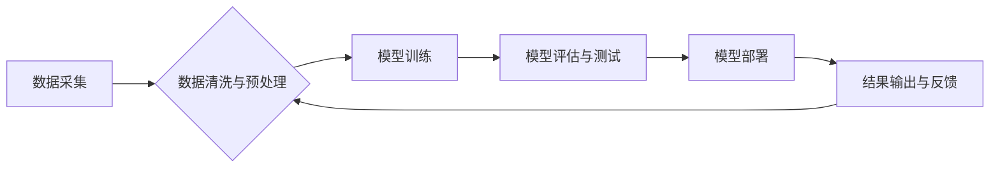

                 

## AI伦理困境:如何确保信息的准确性和可靠性

> 关键词：人工智能、信息准确性、信息可靠性、算法偏见、数据质量、可解释性、伦理规范

### 1. 背景介绍

人工智能（AI）技术近年来发展迅速，已渗透到生活的方方面面，从医疗诊断到金融交易，从自动驾驶到个性化推荐，AI正在改变着我们的世界。然而，随着AI技术的应用越来越广泛，其带来的伦理困境也日益凸显。其中，确保信息的准确性和可靠性是AI发展面临的重大挑战之一。

AI模型的训练依赖于海量数据，而数据本身可能存在偏差、错误或不完整等问题。这些问题会导致AI模型产生不准确、不公平甚至有害的预测结果，从而引发一系列伦理问题。例如，在招聘领域，如果AI模型训练数据存在性别或种族偏见，可能会导致算法歧视特定群体，造成不公平的招聘结果。

此外，AI模型的决策过程通常是复杂的，难以被人类理解。这使得我们难以判断AI模型是如何得出结论的，也难以识别和纠正潜在的错误或偏见。缺乏可解释性会降低人们对AI技术的信任，并阻碍其在社会中的广泛应用。

### 2. 核心概念与联系

**2.1 信息准确性与可靠性**

信息准确性是指信息与事实相符，不存在错误或偏差。信息可靠性是指信息的来源可信，能够被证实和验证。

**2.2 算法偏见**

算法偏见是指AI模型在训练过程中由于数据偏差而产生的预测结果不公平或歧视性。

**2.3 数据质量**

数据质量是指数据的准确性、完整性、一致性和及时性等方面。高质量的数据是训练可靠AI模型的基础。

**2.4 可解释性**

可解释性是指AI模型的决策过程能够被人类理解和解释。

**2.5 伦理规范**

伦理规范是指指导AI技术开发和应用的道德准则和原则。

**2.6 流程图**



### 3. 核心算法原理 & 具体操作步骤

**3.1 算法原理概述**

确保信息准确性和可靠性需要从多个方面入手，包括数据质量控制、算法设计、模型评估和伦理规范制定等。

**3.2 算法步骤详解**

1. **数据采集:** 收集来自各种来源的数据，包括文本、图像、音频等多种类型。
2. **数据清洗与预处理:** 对收集到的数据进行清洗和预处理，去除噪声、错误数据和重复数据，并对数据进行格式转换和特征提取。
3. **模型训练:** 使用训练数据训练AI模型，例如监督学习、强化学习等。
4. **模型评估与测试:** 对训练好的模型进行评估和测试，使用测试数据评估模型的准确性、可靠性和泛化能力。
5. **模型部署:** 将经过评估和测试的模型部署到实际应用场景中。
6. **结果输出与反馈:** 收集模型输出结果并进行反馈，根据反馈信息进行模型调整和优化。

**3.3 算法优缺点**

**优点:**

* 可以自动识别和提取信息，提高效率。
* 可以处理海量数据，发现隐藏的模式和趋势。
* 可以提供个性化服务，满足用户的特定需求。

**缺点:**

* 容易受到数据偏差的影响，产生不准确或不公平的结果。
* 决策过程难以被理解，缺乏可解释性。
* 需要大量的数据和计算资源，成本较高。

**3.4 算法应用领域**

* 医疗诊断
* 金融风险评估
* 自动驾驶
* 人工翻译
* 个性化推荐

### 4. 数学模型和公式 & 详细讲解 & 举例说明

**4.1 数学模型构建**

信息准确性和可靠性的评估可以基于概率论和统计学模型。例如，可以使用贝叶斯定理来计算模型预测结果的置信度，并根据置信度阈值判断结果的准确性。

**4.2 公式推导过程**

贝叶斯定理公式如下：

$$P(A|B) = \frac{P(B|A)P(A)}{P(B)}$$

其中：

* $P(A|B)$ 是在已知事件 B 发生的情况下，事件 A 发生的概率。
* $P(B|A)$ 是在已知事件 A 发生的情况下，事件 B 发生的概率。
* $P(A)$ 是事件 A 发生的概率。
* $P(B)$ 是事件 B 发生的概率。

**4.3 案例分析与讲解**

假设我们有一个AI模型用于识别猫和狗的图片。训练数据包含1000张猫的图片和1000张狗的图片。模型在测试数据上识别猫的准确率为90%，识别狗的准确率为85%。

如果我们输入一张图片，模型预测为“猫”，那么我们可以使用贝叶斯定理计算该预测结果的置信度。需要根据实际情况确定 $P(B|A)$、$P(A)$ 和 $P(B)$ 的值，例如：

* $P(B|A)$：已知图片是猫的情况下，模型预测为猫的概率（90%）。
* $P(A)$：训练数据中猫的比例（50%）。
* $P(B)$：测试数据中猫和狗的比例（50%）。

将这些值代入贝叶斯定理公式，可以计算出模型预测结果的置信度。

### 5. 项目实践：代码实例和详细解释说明

**5.1 开发环境搭建**

* Python 3.x
* TensorFlow 或 PyTorch 等深度学习框架
* Jupyter Notebook 或 VS Code 等代码编辑器

**5.2 源代码详细实现**

```python
import tensorflow as tf

# 定义模型结构
model = tf.keras.models.Sequential([
  tf.keras.layers.Conv2D(32, (3, 3), activation='relu', input_shape=(28, 28, 1)),
  tf.keras.layers.MaxPooling2D((2, 2)),
  tf.keras.layers.Conv2D(64, (3, 3), activation='relu'),
  tf.keras.layers.MaxPooling2D((2, 2)),
  tf.keras.layers.Flatten(),
  tf.keras.layers.Dense(10, activation='softmax')
])

# 编译模型
model.compile(optimizer='adam',
              loss='sparse_categorical_crossentropy',
              metrics=['accuracy'])

# 训练模型
model.fit(x_train, y_train, epochs=10)

# 评估模型
loss, accuracy = model.evaluate(x_test, y_test)
print('Test loss:', loss)
print('Test accuracy:', accuracy)
```

**5.3 代码解读与分析**

这段代码定义了一个简单的卷积神经网络模型，用于识别手写数字。模型包含两个卷积层、两个最大池化层、一个全连接层和一个softmax输出层。

模型使用Adam优化器、交叉熵损失函数和准确率指标进行训练。训练过程使用训练数据进行迭代，每次迭代更新模型参数，直到达到预设的精度或迭代次数。

**5.4 运行结果展示**

训练完成后，可以使用测试数据评估模型的性能。输出结果会显示测试数据的损失值和准确率。

### 6. 实际应用场景

**6.1 医疗诊断**

AI模型可以辅助医生诊断疾病，例如识别肿瘤、预测患者的风险等。

**6.2 金融风险评估**

AI模型可以分析客户的财务数据，评估其信用风险和投资风险。

**6.3 自动驾驶**

AI模型可以帮助自动驾驶汽车识别道路环境、做出决策和控制车辆。

**6.4 人工翻译**

AI模型可以自动翻译文本和语音，打破语言障碍。

**6.5 个性化推荐**

AI模型可以根据用户的喜好和行为数据，推荐个性化的商品、服务和内容。

**6.6 未来应用展望**

随着AI技术的不断发展，其应用场景将更加广泛，例如：

* 个性化教育
* 智能家居
* 医疗机器人
* 药物研发

### 7. 工具和资源推荐

**7.1 学习资源推荐**

* **书籍:**

    * 《深度学习》
    * 《人工智能：一种现代方法》
    * 《机器学习实战》

* **在线课程:**

    * Coursera
    * edX
    * Udacity

**7.2 开发工具推荐**

* TensorFlow
* PyTorch
* scikit-learn

**7.3 相关论文推荐**

* 《Attention Is All You Need》
* 《BERT: Pre-training of Deep Bidirectional Transformers for Language Understanding》
* 《ImageNet Classification with Deep Convolutional Neural Networks》

### 8. 总结：未来发展趋势与挑战

**8.1 研究成果总结**

近年来，AI技术取得了显著进展，在多个领域取得了突破性成果。例如，在图像识别、自然语言处理、语音识别等领域，AI模型的性能已经接近或超过人类水平。

**8.2 未来发展趋势**

* **更加强大的计算能力:** 随着硬件技术的进步，AI模型将能够处理更加复杂的数据，并实现更加精细的预测和分析。
* **更加注重可解释性:** 人们将更加重视AI模型的透明度和可解释性，以便更好地理解模型的决策过程。
* **更加广泛的应用场景:** AI技术将应用到更多领域，例如医疗、教育、金融、交通等，为人们的生活带来更多便利。

**8.3 面临的挑战**

* **数据质量问题:** AI模型的性能依赖于数据的质量，而现实世界的数据往往存在偏差、错误和不完整等问题。
* **算法偏见问题:** AI模型容易受到训练数据中的偏见影响，导致产生不公平或歧视性的结果。
* **伦理规范问题:** AI技术的快速发展引发了一系列伦理问题，例如隐私保护、责任归属、算法透明度等。

**8.4 研究展望**

未来，我们需要更加重视AI技术的伦理规范和社会影响，并积极探索解决数据质量、算法偏见等问题的方法。同时，还需要加强AI技术的解释性和可控性研究，确保AI技术能够安全、可靠地服务于人类社会。

### 9. 附录：常见问题与解答

**9.1 如何确保AI模型的准确性？**

* 使用高质量的数据进行训练。
* 选择合适的算法和模型架构。
* 对模型进行充分的训练和测试。
* 定期评估模型的性能，并进行调整和优化。

**9.2 如何解决AI模型的算法偏见问题？**

* 使用更加多样化的训练数据，减少数据偏差。
* 开发算法去偏见的方法，例如公平学习算法。
* 对模型的输出结果进行监控和评估，及时发现和纠正偏见。

**9.3 如何提高AI模型的可解释性？**

* 使用可解释的机器学习算法，例如规则学习算法。
* 开发模型解释方法，例如局部解释方法、全局解释方法。
* 将模型解释结果可视化，方便人类理解。


作者：禅与计算机程序设计艺术 / Zen and the Art of Computer Programming 
<end_of_turn>

