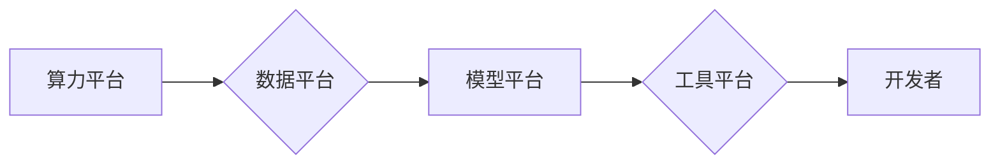

                 

## AI基础设施的国产化：Lepton AI的技术自主

> 关键词：AI基础设施、国产化、Lepton AI、深度学习、模型压缩、高效训练、开源社区

### 1. 背景介绍

近年来，人工智能（AI）技术蓬勃发展，深度学习算法取得了令人瞩目的成就，广泛应用于各个领域，如图像识别、自然语言处理、语音识别等。然而，当前AI基础设施的构建主要依赖于国外厂商提供的平台和工具，这导致了技术依赖性强、数据安全风险高、成本高昂等问题。

为了打破技术垄断，提升自主创新能力，国内企业和研究机构积极探索AI基础设施的国产化之路。Lepton AI作为一家致力于打造自主可控的AI基础设施平台的企业，凭借其领先的技术实力和丰富的行业经验，在AI基础设施国产化领域取得了显著进展。

### 2. 核心概念与联系

Lepton AI的核心概念是构建一个高效、灵活、可扩展的AI基础设施平台，为开发者提供一站式服务，简化AI应用开发流程，降低开发门槛。

Lepton AI平台的核心架构包括以下几个模块：

* **算力平台:** 提供高性能的计算资源，支持GPU、TPU等多种加速器，满足不同规模的AI模型训练和推理需求。
* **数据平台:** 提供数据存储、处理、管理等功能，支持海量数据的存储和高效的查询和分析。
* **模型平台:** 提供模型训练、部署、管理等功能，支持多种深度学习框架，并提供模型压缩、优化等工具，提高模型的效率和性能。
* **工具平台:** 提供一系列开发工具和SDK，帮助开发者快速构建和部署AI应用。

Lepton AI平台的架构图如下：



### 3. 核心算法原理 & 具体操作步骤

Lepton AI平台的核心算法原理包括模型压缩、高效训练等技术，旨在提高模型的效率和性能。

#### 3.1  算法原理概述

* **模型压缩:** 通过减少模型参数量、降低模型复杂度，提高模型的推理速度和内存占用效率。常用的模型压缩技术包括量化、剪枝、知识蒸馏等。
* **高效训练:** 通过优化训练算法、利用分布式训练等技术，加速模型训练速度，降低训练成本。

#### 3.2  算法步骤详解

* **模型量化:** 将模型参数从高精度浮点数转换为低精度整数，例如将32位浮点数转换为8位整数。量化可以显著减少模型参数的存储空间和计算量。
* **模型剪枝:** 通过移除模型中不重要的参数或连接，减少模型复杂度。剪枝算法通常使用正则化技术或梯度分析来识别不重要的参数。
* **知识蒸馏:** 将一个大型模型的知识迁移到一个小型模型中，使小型模型在性能上接近大型模型。知识蒸馏通过最小化大型模型和小型模型的输出之间的差异来实现。
* **分布式训练:** 将模型训练任务分解成多个子任务，在多个计算节点上并行训练，加速训练速度。分布式训练需要考虑数据并行、模型并行等策略。

#### 3.3  算法优缺点

* **模型压缩:**
    * **优点:** 降低模型大小、加速推理速度、节省内存占用。
    * **缺点:** 可能导致模型精度下降。
* **高效训练:**
    * **优点:** 加速训练速度、降低训练成本。
    * **缺点:** 需要复杂的算法和硬件支持。

#### 3.4  算法应用领域

* **移动端应用:** 模型压缩技术可以将深度学习模型部署到移动设备上，实现高效的语音识别、图像识别等功能。
* **边缘计算:** 模型压缩技术可以将深度学习模型部署到边缘设备上，实现实时数据处理和决策。
* **云计算:** 高效训练技术可以加速大规模模型的训练，提高云计算平台的效率。

### 4. 数学模型和公式 & 详细讲解 & 举例说明

#### 4.1  数学模型构建

Lepton AI平台的模型压缩算法基于量化技术，将模型参数从高精度浮点数转换为低精度整数。

假设模型参数为浮点数 $w$, 则量化后的整数参数为 $w'$. 量化过程可以表示为：

$$w' = \text{round}(w \cdot q)$$

其中，$q$为量化因子，决定了整数参数的精度。

#### 4.2  公式推导过程

量化过程会引入一定的精度损失，可以通过以下公式衡量：

$$\text{Quantization Error} = ||w - w'||_2$$

其中，$||\cdot||_2$表示欧几里得范数。

#### 4.3  案例分析与讲解

例如，将32位浮点数参数量化为8位整数，则量化因子 $q = 2^{24}$. 

量化后的参数精度会降低，但可以显著减少模型参数的存储空间和计算量。

### 5. 项目实践：代码实例和详细解释说明

#### 5.1  开发环境搭建

Lepton AI平台支持多种开发环境，例如Linux、Windows等。

开发环境搭建步骤如下：

1. 安装Python和必要的库，例如TensorFlow、PyTorch等。
2. 下载Lepton AI平台的SDK。
3. 配置Lepton AI平台的连接信息。

#### 5.2  源代码详细实现

Lepton AI平台提供了一系列API，方便开发者进行模型训练、部署等操作。

例如，使用Lepton AI平台训练一个图像分类模型，代码示例如下：

```python
import lepton_ai as la

# 加载数据集
dataset = la.datasets.ImageNet()

# 创建模型
model = la.models.ResNet50()

# 训练模型
model.train(dataset)

# 保存模型
model.save("resnet50.model")
```

#### 5.3  代码解读与分析

* `import lepton_ai as la`: 导入Lepton AI平台的SDK。
* `dataset = la.datasets.ImageNet()`: 加载ImageNet数据集。
* `model = la.models.ResNet50()`: 创建ResNet50模型。
* `model.train(dataset)`: 使用ImageNet数据集训练ResNet50模型。
* `model.save("resnet50.model")`: 保存训练好的模型。

#### 5.4  运行结果展示

训练完成后，可以将模型部署到Lepton AI平台的推理服务，进行图像分类任务。

### 6. 实际应用场景

Lepton AI平台已在多个领域取得应用，例如：

* **医疗诊断:** 用于辅助医生进行疾病诊断，提高诊断准确率。
* **金融风险控制:** 用于识别金融风险，降低金融风险损失。
* **智能制造:** 用于提高生产效率，降低生产成本。

#### 6.4  未来应用展望

Lepton AI平台未来将继续拓展应用场景，例如：

* **自动驾驶:** 用于辅助自动驾驶系统进行决策，提高驾驶安全性和效率。
* **智慧城市:** 用于构建智慧城市基础设施，提高城市管理效率。
* **个性化教育:** 用于提供个性化的教育服务，提高教育质量。

### 7. 工具和资源推荐

#### 7.1  学习资源推荐

* Lepton AI官方文档: https://docs.lepton.ai/
* 深度学习教程: https://www.deeplearning.ai/

#### 7.2  开发工具推荐

* TensorFlow: https://www.tensorflow.org/
* PyTorch: https://pytorch.org/

#### 7.3  相关论文推荐

* [BERT: Pre-training of Deep Bidirectional Transformers for Language Understanding](https://arxiv.org/abs/1810.04805)
* [Attention Is All You Need](https://arxiv.org/abs/1706.03762)

### 8. 总结：未来发展趋势与挑战

#### 8.1  研究成果总结

Lepton AI平台在AI基础设施国产化领域取得了显著进展，为开发者提供了高效、灵活、可扩展的AI开发平台。

#### 8.2  未来发展趋势

Lepton AI平台将继续致力于以下几个方面：

* **模型压缩技术:** 开发更先进的模型压缩技术，进一步提高模型的效率和性能。
* **高效训练技术:** 开发更有效的训练算法和硬件加速技术，加速模型训练速度。
* **开源社区建设:** 积极建设开源社区，推动AI基础设施的共建共享。

#### 8.3  面临的挑战

Lepton AI平台面临的挑战包括：

* **技术壁垒:** AI基础设施技术复杂，需要持续投入研发，才能保持技术领先。
* **人才短缺:** AI领域人才需求量大，需要吸引和培养更多AI人才。
* **市场竞争:** AI基础设施市场竞争激烈，需要不断创新，才能赢得市场份额。

#### 8.4  研究展望

Lepton AI平台将继续致力于突破技术瓶颈，推动AI基础设施的国产化发展，为中国AI产业的健康发展贡献力量。

### 9. 附录：常见问题与解答

#### 9.1  常见问题

* Lepton AI平台支持哪些深度学习框架？
* Lepton AI平台的收费标准是什么？
* Lepton AI平台的安全性如何保障？

#### 9.2  解答

* Lepton AI平台支持TensorFlow、PyTorch等主流深度学习框架。
* Lepton AI平台提供免费试用和付费订阅两种服务模式。
* Lepton AI平台采用多层安全防护机制，保障用户数据安全。


作者：禅与计算机程序设计艺术 / Zen and the Art of Computer Programming 
<end_of_turn>

