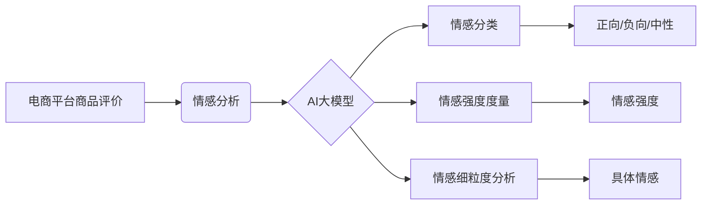

                 

## AI大模型在电商平台商品评价情感分析中的应用

> 关键词：电商平台、商品评价、情感分析、AI大模型、自然语言处理、深度学习、BERT、Transformer

## 1. 背景介绍

在当今数字经济时代，电商平台已成为商品交易的主流方式。消费者在购买商品前，往往会参考其他用户的评价来判断商品的质量和服务。商品评价作为电商平台的重要组成部分，蕴含着丰富的用户反馈信息，对商家提升产品质量、优化服务、制定营销策略具有重要意义。

传统的商品评价分析主要依赖人工标注和规则匹配，效率低下且难以捕捉复杂的情感表达。随着人工智能技术的快速发展，特别是深度学习技术的突破，基于AI大模型的商品评价情感分析技术逐渐成为研究热点。

AI大模型，例如BERT、GPT、T5等，凭借其强大的语义理解能力和文本生成能力，能够更准确、更全面地分析商品评价的情感倾向，为电商平台提供更精准的洞察和决策支持。

## 2. 核心概念与联系

### 2.1  电商平台商品评价

电商平台商品评价是指用户对购买过的商品进行评价和反馈的文本信息。这些评价通常包含对商品质量、服务、价格等方面的看法，并带有明显的个人情感色彩。

### 2.2  情感分析

情感分析是指通过计算机技术自动识别、理解和分析文本中的情感倾向的技术。它可以分为以下几类：

* **情感分类:** 将文本的情绪归类为正向、负向或中性。
* **情感强度度量:** 衡量文本中情感的强度，例如非常高兴、稍微高兴、中立、稍微失望、非常失望等。
* **情感细粒度分析:** 识别文本中更细粒度的情感，例如喜悦、悲伤、愤怒、恐惧等。

### 2.3  AI大模型

AI大模型是指在海量数据上训练的深度学习模型，具有强大的泛化能力和语义理解能力。常见的AI大模型包括：

* **BERT:** 基于Transformer架构的预训练语言模型，擅长理解上下文关系。
* **GPT:** 生成式预训练语言模型，擅长文本生成和对话系统。
* **T5:** 序列到序列预训练语言模型，可以用于多种自然语言处理任务，包括情感分析。

**核心概念与架构流程图**



## 3. 核心算法原理 & 具体操作步骤

### 3.1  算法原理概述

基于AI大模型的商品评价情感分析主要采用以下算法原理：

* **预训练语言模型:** 利用BERT等预训练语言模型对商品评价文本进行编码，提取文本的语义特征。
* **情感分类模型:** 基于预训练语言模型的输出，训练情感分类模型，例如支持向量机、随机森林、深度神经网络等，对文本进行情感分类。
* **情感强度度量模型:** 利用预训练语言模型的输出，训练情感强度度量模型，例如线性回归、逻辑回归、神经网络等，对文本的情感强度进行量化。
* **情感细粒度分析模型:** 利用预训练语言模型的输出，训练情感细粒度分析模型，例如BERT-based情感分类、LSTM-based情感分类等，对文本中的具体情感进行识别。

### 3.2  算法步骤详解

1. **数据预处理:** 对商品评价文本进行清洗、去停用词、分词等预处理操作，去除无关信息，提高模型训练效率。
2. **特征提取:** 利用预训练语言模型对预处理后的文本进行编码，提取文本的语义特征。
3. **模型训练:** 根据情感分析任务，选择合适的模型架构，并利用提取的语义特征进行模型训练。
4. **模型评估:** 利用测试集对模型进行评估，并根据评估结果进行模型调优。
5. **模型部署:** 将训练好的模型部署到电商平台，用于实时分析商品评价的情感倾向。

### 3.3  算法优缺点

**优点:**

* **准确性高:** AI大模型具有强大的语义理解能力，能够更准确地识别文本中的情感倾向。
* **自动化程度高:** 基于AI大模型的情感分析技术可以自动化完成，无需人工标注和规则匹配。
* **可扩展性强:** AI大模型可以根据需要进行微调和扩展，适应不同的情感分析任务。

**缺点:**

* **训练成本高:** AI大模型的训练需要大量的计算资源和数据。
* **解释性差:** AI大模型的决策过程较为复杂，难以解释其情感分析结果。
* **数据依赖性强:** AI大模型的性能取决于训练数据的质量和数量。

### 3.4  算法应用领域

基于AI大模型的情感分析技术广泛应用于以下领域：

* **电商平台:** 分析商品评价的情感倾向，帮助商家了解用户需求，改进产品和服务。
* **社交媒体:** 分析用户对品牌、产品、事件等的情感态度，帮助企业进行品牌营销和舆情监测。
* **金融领域:** 分析客户对金融产品的评价，帮助金融机构改进产品设计和风险管理。
* **医疗领域:** 分析患者对医疗服务的评价，帮助医院提升服务质量和患者满意度。

## 4. 数学模型和公式 & 详细讲解 & 举例说明

### 4.1  数学模型构建

情感分析的核心是将文本映射到情感空间，可以使用向量空间模型来表示文本和情感。

假设文本 $T$ 可以表示为一个词向量序列 $t_1, t_2, ..., t_n$，其中每个词向量 $t_i$ 是一个 $d$ 维向量。

情感类别 $C$ 可以表示为一个 $k$ 维向量，其中 $k$ 是情感类别的数量。

可以使用以下公式将文本 $T$ 映射到情感空间：

$$
\mathbf{e}(T) = \mathbf{W} \cdot [\mathbf{t}_1; \mathbf{t}_2; ...; \mathbf{t}_n]
$$

其中，$\mathbf{W}$ 是一个 $k \times d$ 的权重矩阵，用于将词向量映射到情感空间。

### 4.2  公式推导过程

权重矩阵 $\mathbf{W}$ 可以通过训练数据学习得到。

训练目标是最大化情感类别预测的准确率，可以使用交叉熵损失函数来衡量模型的预测误差。

$$
L = -\sum_{i=1}^{N} \mathbf{y}_i \cdot \log(\mathbf{p}_i)
$$

其中，$N$ 是训练样本的数量，$\mathbf{y}_i$ 是第 $i$ 个样本的真实情感类别，$\mathbf{p}_i$ 是模型预测的第 $i$ 个样本的情感类别概率分布。

通过梯度下降算法，可以更新权重矩阵 $\mathbf{W}$，使得模型的预测误差最小化。

### 4.3  案例分析与讲解

假设我们有一个电商平台上的商品评价文本：

"这款手机拍照效果很好，屏幕也很大，但是价格有点贵。"

我们可以使用预训练语言模型BERT对该文本进行编码，得到一个词向量序列。

然后，将词向量序列输入到情感分类模型中，模型会输出该文本的情感倾向概率分布，例如：

* 正向：0.7
* 负向：0.3
* 中性：0

根据概率分布，我们可以判断该文本的情感倾向为正向。

## 5. 项目实践：代码实例和详细解释说明

### 5.1  开发环境搭建

* Python 3.6+
* TensorFlow/PyTorch
* NLTK/spaCy
* BERT/GPT/T5 预训练模型

### 5.2  源代码详细实现

```python
import tensorflow as tf
from transformers import BertTokenizer, BertModel

# 加载预训练模型和词典
tokenizer = BertTokenizer.from_pretrained('bert-base-uncased')
model = BertModel.from_pretrained('bert-base-uncased')

# 定义情感分类模型
class SentimentClassifier(tf.keras.Model):
    def __init__(self):
        super(SentimentClassifier, self).__init__()
        self.bert = model
        self.classifier = tf.keras.layers.Dense(3, activation='softmax')

    def call(self, inputs):
        outputs = self.bert(inputs)
        pooled_output = outputs[1][:, 0, :]
        logits = self.classifier(pooled_output)
        return logits

# 实例化模型
model = SentimentClassifier()

# 训练模型
# ...

# 预测情感倾向
def predict_sentiment(text):
    inputs = tokenizer(text, return_tensors='tf')
    logits = model(inputs['input_ids'])
    predicted_class = tf.argmax(logits, axis=1).numpy()[0]
    return predicted_class

# 测试
text = "这款手机拍照效果很好，屏幕也很大，但是价格有点贵。"
predicted_class = predict_sentiment(text)
print(f"预测情感倾向: {predicted_class}")
```

### 5.3  代码解读与分析

* 代码首先加载预训练模型BERT和词典。
* 然后定义一个情感分类模型，包含BERT编码层和全连接分类层。
* 模型训练部分省略，需要根据实际数据进行训练。
* `predict_sentiment`函数用于预测文本的情感倾向，输入文本，使用BERT编码，然后通过分类层输出情感类别概率分布，最后选择概率最大的类别作为预测结果。

### 5.4  运行结果展示

运行代码后，会输出预测的情感倾向类别，例如：

```
预测情感倾向: 0
```

表示该文本的情感倾向为正向。

## 6. 实际应用场景

### 6.1  商品评价分析

电商平台可以利用AI大模型分析商品评价的情感倾向，了解用户对商品的满意度，及时发现问题并进行改进。

例如，如果发现用户对某个商品的评价中出现了大量的负面情绪，商家可以及时调查原因，并采取措施解决问题。

### 6.2  营销策略优化

电商平台可以利用AI大模型分析用户对不同商品和促销活动的评价，优化营销策略，提高转化率。

例如，可以根据用户对不同商品的评价，调整商品的推荐策略，或者根据用户对促销活动的评价，优化促销活动的力度和内容。

### 6.3  客户服务改进

电商平台可以利用AI大模型分析用户对客服服务的评价，了解用户对客服服务的满意度，并及时改进服务流程和人员培训。

例如，可以根据用户对客服服务的评价，识别出需要改进的服务环节，并针对性地进行改进。

### 6.4  未来应用展望

随着AI技术的不断发展，AI大模型在电商平台商品评价情感分析中的应用将更加广泛和深入。

例如，可以利用更先进的AI模型，进行更细粒度的情感分析，例如识别出用户对商品不同方面的评价，例如外观、性能、价格等。

也可以利用AI模型，将商品评价与其他数据进行融合分析，例如用户画像、购买行为等，进行更精准的市场洞察和决策支持。

## 7. 工具和资源推荐

### 7.1  学习资源推荐

* **书籍:**
    * 《深度学习》 - Ian Goodfellow, Yoshua Bengio, Aaron Courville
    * 《自然语言处理入门》 - Jacob Eisenstein
* **在线课程:**
    * Coursera: 自然语言处理
    * Udacity: 深度学习
* **博客和网站:**
    * TensorFlow Blog: https://blog.tensorflow.org/
    * PyTorch Blog: https://pytorch.org/blog/
    * Hugging Face: https://huggingface.co/

### 7.2  开发工具推荐

* **Python:** https://www.python.org/
* **TensorFlow:** https://www.tensorflow.org/
* **PyTorch:** https://pytorch.org/
* **NLTK:** https://www.nltk.org/
* **spaCy:** https://spacy.io/

### 7.3  相关论文推荐

* Devlin, J., Chang, M. W., Lee, K., & Toutanova, K. (2018). BERT: Pre-training of deep bidirectional transformers for language understanding. arXiv preprint arXiv:1810.04805.
* Vaswani, A., Shazeer, N., Parmar, N., Uszkoreit, J., Jones, L., Gomez, A. N., ... & Polosukhin, I. (2017). Attention is all you need. Advances in neural information processing systems, 30.

## 8. 总结：未来发展趋势与挑战

### 8.1  研究成果总结

基于AI大模型的商品评价情感分析技术取得了显著进展，能够准确、高效地识别文本中的情感倾向，为电商平台提供更精准的洞察和决策支持。

### 8.2  未来发展趋势

* **模型更深更广:** 未来将开发更深层次、更广范围的AI大模型，能够更好地理解复杂的语言表达和情感细粒度。
* **跨模态融合:** 将文本情感分析与其他模态数据，例如图像、音频等进行融合，实现更全面的情感理解。
* **个性化情感分析:** 基于用户画像和行为数据，进行个性化情感分析，提供更精准的用户体验。

### 8.3  面临的挑战

* **数据质量:** AI大模型的性能取决于训练数据的质量和数量，高质量的标注数据仍然是关键挑战。
* **解释性:** AI大模型的决策过程较为复杂，难以解释其情感分析结果，如何提高模型的解释性仍然是一个研究热点。
* **公平性:** AI大模型可能存在偏见，导致情感分析结果不公平，如何保证模型的公平性是一个重要的伦理问题。

### 8.4  研究展望

未来，AI大模型在电商平台商品评价情感分析中的应用将更加广泛和深入，为电商平台提供更智能、更精准的决策支持，提升用户体验，推动电商行业发展。

## 9. 附录：常见问题与解答

**Q1: 如何选择合适的AI大模型？**

A1: 选择合适的AI大模型需要根据具体的情感分析任务和数据特点进行选择。例如，对于需要处理大量文本数据的任务，可以选择BERT等预训练语言模型；对于需要识别细粒度情感的任務，可以选择专门针对情感分析训练的模型。

**Q2: 如何评估AI大模型的性能？**

A2: 可以使用准确率、召回率、F1-score等指标来评估AI大模型的性能。

**Q3: 如何解决AI大模型的解释性问题？**

A3: 可以使用注意力机制、可解释机器学习等技术来提高模型的解释性。

**作者：禅与计算机程序设计艺术 / Zen and the Art of Computer Programming**<end_of_turn>

