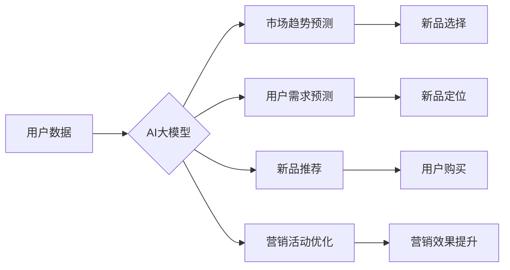

                 

## AI大模型如何优化电商平台的新品上市策略

> 关键词：电商平台、新品上市、AI大模型、预测分析、个性化推荐、市场营销、数据驱动

## 1. 背景介绍

在当今竞争激烈的电商市场，新品上市策略的成功与否直接关系到企业的盈利能力和市场份额。传统电商平台往往依赖经验和市场调研来制定新品上市策略，但这种方法往往不够精准，难以应对快速变化的市场需求。

近年来，随着人工智能（AI）技术的快速发展，特别是大模型技术的突破，AI大模型开始在电商平台的新品上市策略中发挥越来越重要的作用。AI大模型能够通过对海量数据进行分析和学习，预测市场趋势、用户需求和新品表现，为电商平台提供更精准、更有效的新品上市策略建议。

## 2. 核心概念与联系

### 2.1  AI大模型

AI大模型是指在海量数据上训练的深度学习模型，拥有强大的泛化能力和学习能力。它能够理解和处理复杂的文本、图像、音频等数据，并从中提取有价值的信息。

### 2.2  电商平台新品上市策略

电商平台新品上市策略是指企业在推出新产品时，制定的一系列营销活动和运营方案，旨在提高新品的曝光度、销量和用户口碑。

### 2.3  AI大模型与电商平台新品上市策略的联系

AI大模型能够通过以下方式优化电商平台的新品上市策略：

* **预测市场趋势和用户需求:** AI大模型可以分析历史销售数据、用户行为数据、市场新闻等信息，预测未来市场趋势和用户需求，帮助电商平台选择更有潜力的新品。
* **个性化推荐:** AI大模型可以根据用户的购买历史、浏览记录、兴趣爱好等信息，为用户推荐合适的新品，提高新品的曝光度和转化率。
* **优化营销活动:** AI大模型可以分析营销活动的成效，优化营销策略，提高营销活动的ROI。
* **智能客服:** AI大模型可以作为智能客服，解答用户关于新品的疑问，提高用户体验。

**Mermaid 流程图**



## 3. 核心算法原理 & 具体操作步骤

### 3.1  算法原理概述

AI大模型在优化电商平台新品上市策略中，常用的算法包括：

* **机器学习算法:** 比如回归算法、分类算法、聚类算法等，用于预测市场趋势、用户需求和新品表现。
* **深度学习算法:** 比如卷积神经网络（CNN）、循环神经网络（RNN）、Transformer等，用于处理海量文本、图像、音频等数据，提取有价值的信息。
* **强化学习算法:** 用于优化营销活动，提高营销活动的ROI。

### 3.2  算法步骤详解

**以预测市场趋势为例，具体操作步骤如下：**

1. **数据收集:** 收集历史销售数据、用户行为数据、市场新闻等相关数据。
2. **数据预处理:** 对收集到的数据进行清洗、转换、特征工程等处理，使其适合模型训练。
3. **模型选择:** 根据数据特点和预测目标，选择合适的机器学习算法或深度学习算法。
4. **模型训练:** 使用训练数据训练模型，并通过交叉验证等方法评估模型性能。
5. **模型部署:** 将训练好的模型部署到线上环境，用于预测未来市场趋势。
6. **结果分析:** 分析模型预测结果，并根据结果调整新品上市策略。

### 3.3  算法优缺点

**机器学习算法:**

* **优点:** 算法相对简单，易于理解和实现。
* **缺点:** 对于复杂的数据关系难以建模，泛化能力较弱。

**深度学习算法:**

* **优点:** 能够处理复杂的数据关系，泛化能力强。
* **缺点:** 算法复杂，需要大量的训练数据和计算资源。

### 3.4  算法应用领域

AI大模型在电商平台新品上市策略中的应用领域非常广泛，包括：

* **新品选择:** 预测新品的市场潜力和销量。
* **新品定价:** 预测用户的接受价格范围。
* **新品推广:** 优化营销活动，提高新品的曝光度和转化率。
* **用户画像:** 建立用户画像，精准推送新品推荐。
* **库存管理:** 预测新品的需求量，优化库存管理。

## 4. 数学模型和公式 & 详细讲解 & 举例说明

### 4.1  数学模型构建

**预测新品销量模型:**

假设我们想要预测新品A在未来时间段内的销量，我们可以构建以下数学模型：

$$
S_A = f(D_1, D_2, D_3, ..., D_n)
$$

其中：

* $S_A$ 表示新品A的销量。
* $D_1, D_2, D_3, ..., D_n$ 表示影响新品A销量的因素，例如：历史销售数据、用户行为数据、市场趋势数据、促销活动数据等。
* $f$ 表示一个映射函数，用于将这些因素映射到新品A的销量。

### 4.2  公式推导过程

具体的映射函数 $f$ 可以根据实际情况选择不同的算法进行构建。例如，我们可以使用线性回归模型，将 $f$ 定义为：

$$
f(D_1, D_2, D_3, ..., D_n) = w_1D_1 + w_2D_2 + w_3D_3 + ... + w_nD_n + b
$$

其中：

* $w_1, w_2, w_3, ..., w_n$ 表示各个因素的权重。
* $b$ 表示截距。

通过训练数据，我们可以使用最小二乘法等方法求解出 $w$ 和 $b$ 的最佳值，从而得到一个能够预测新品销量的模型。

### 4.3  案例分析与讲解

假设我们想要预测一款新品手机的销量，我们可以收集以下数据：

* 历史销售数据：过去一年不同型号手机的销量数据。
* 用户行为数据：用户对不同手机型号的浏览记录、购买记录等数据。
* 市场趋势数据：手机市场整体趋势、竞争对手新品发布情况等数据。
* 促销活动数据：手机促销活动的价格、时间、力度等数据。

我们可以将这些数据作为输入，使用线性回归模型或深度学习模型进行训练，预测这款新品手机的销量。

## 5. 项目实践：代码实例和详细解释说明

### 5.1  开发环境搭建

* Python 3.x
* TensorFlow 或 PyTorch 深度学习框架
* Jupyter Notebook 或 VS Code 开发环境

### 5.2  源代码详细实现

```python
# 使用 TensorFlow 构建一个简单的预测模型
import tensorflow as tf

# 定义模型结构
model = tf.keras.Sequential([
    tf.keras.layers.Dense(64, activation='relu', input_shape=(n_features,)),
    tf.keras.layers.Dense(32, activation='relu'),
    tf.keras.layers.Dense(1)
])

# 编译模型
model.compile(optimizer='adam', loss='mse')

# 训练模型
model.fit(X_train, y_train, epochs=10)

# 预测
predictions = model.predict(X_test)
```

### 5.3  代码解读与分析

* **导入 TensorFlow 库:** 首先导入 TensorFlow 库，以便使用其提供的深度学习功能。
* **定义模型结构:** 使用 `tf.keras.Sequential` 创建一个顺序模型，并添加多个全连接层 (`tf.keras.layers.Dense`)。
* **编译模型:** 使用 `model.compile` 方法编译模型，指定优化器、损失函数等参数。
* **训练模型:** 使用 `model.fit` 方法训练模型，传入训练数据和训练轮数。
* **预测:** 使用 `model.predict` 方法预测测试数据的结果。

### 5.4  运行结果展示

训练完成后，我们可以使用测试数据评估模型的性能，例如计算均方误差 (MSE) 等指标。

## 6. 实际应用场景

AI大模型在电商平台新品上市策略中的应用场景非常广泛，例如：

* **淘宝:** 利用 AI 大模型预测新品销量，优化新品定价和库存管理。
* **京东:** 使用 AI 大模型进行个性化推荐，提高新品的曝光度和转化率。
* **拼多多:** 利用 AI 大模型分析用户画像，精准推送新品广告。

### 6.4  未来应用展望

未来，AI大模型在电商平台新品上市策略中的应用将会更加深入和广泛，例如：

* **更精准的预测:** 利用更先进的算法和更丰富的训练数据，实现更精准的市场趋势和用户需求预测。
* **更个性化的推荐:** 基于用户的行为数据和偏好，提供更个性化的新品推荐，提高用户体验。
* **更智能的营销活动:** 利用 AI 大模型优化营销活动策略，提高营销活动的ROI。
* **更全面的数据分析:** 利用 AI 大模型分析更全面的数据，例如用户评论、社交媒体数据等，为新品上市策略提供更全面的支持。

## 7. 工具和资源推荐

### 7.1  学习资源推荐

* **斯坦福大学 CS224N 自然语言处理课程:** https://web.stanford.edu/class/cs224n/
* **DeepLearning.AI 深度学习专业证书课程:** https://www.deeplearning.ai/
* **TensorFlow 官方文档:** https://www.tensorflow.org/

### 7.2  开发工具推荐

* **Jupyter Notebook:** https://jupyter.org/
* **VS Code:** https://code.visualstudio.com/
* **TensorFlow:** https://www.tensorflow.org/
* **PyTorch:** https://pytorch.org/

### 7.3  相关论文推荐

* **Attention Is All You Need:** https://arxiv.org/abs/1706.03762
* **BERT: Pre-training of Deep Bidirectional Transformers for Language Understanding:** https://arxiv.org/abs/1810.04805
* **Generative Pre-trained Transformer 3 (GPT-3):** https://openai.com/blog/gpt-3/

## 8. 总结：未来发展趋势与挑战

### 8.1  研究成果总结

AI大模型在优化电商平台新品上市策略方面取得了显著的成果，能够帮助电商平台更精准地预测市场趋势、用户需求和新品表现，从而制定更有效的新品上市策略。

### 8.2  未来发展趋势

未来，AI大模型在电商平台新品上市策略中的应用将会更加深入和广泛，例如：

* **更精准的预测:** 利用更先进的算法和更丰富的训练数据，实现更精准的市场趋势和用户需求预测。
* **更个性化的推荐:** 基于用户的行为数据和偏好，提供更个性化的新品推荐，提高用户体验。
* **更智能的营销活动:** 利用 AI 大模型优化营销活动策略，提高营销活动的ROI。
* **更全面的数据分析:** 利用 AI 大模型分析更全面的数据，例如用户评论、社交媒体数据等，为新品上市策略提供更全面的支持。

### 8.3  面临的挑战

尽管 AI大模型在电商平台新品上市策略中的应用前景广阔，但也面临一些挑战：

* **数据质量:** AI大模型的性能依赖于数据的质量，而电商平台的数据往往存在不完整、不准确、格式混乱等问题。
* **算法复杂性:** 一些 AI大模型的算法非常复杂，需要大量的计算资源和专业知识才能训练和部署。
* **伦理问题:** AI大模型的应用可能会带来一些伦理问题，例如数据隐私、算法偏见等。

### 8.4  研究展望

未来，我们需要继续研究如何提高 AI大模型的准确性、效率和安全性，并解决其带来的伦理问题，使其更好地服务于电商平台新品上市策略。


## 9. 附录：常见问题与解答

**Q1: AI大模型的训练需要多少数据？**

A1: 训练 AI大模型所需的训练数据量取决于模型的复杂度和任务的难度。一般来说，需要大量的训练数据才能获得良好的性能。

**Q2: 如何评估 AI大模型的性能？**

A2: 可以使用各种指标来评估 AI大模型的性能，例如准确率、召回率、F1-score、AUC等。具体的指标选择取决于任务的类型和目标。

**Q3: AI大模型的应用会带来哪些伦理问题？**

A3: AI大模型的应用可能会带来一些伦理问题，例如数据隐私、算法偏见、责任归属等。我们需要认真思考这些问题，并制定相应的解决方案。


作者：禅与计算机程序设计艺术 / Zen and the Art of Computer Programming 
<end_of_turn>

