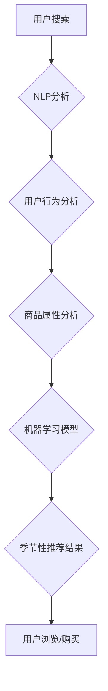

                 

## AI如何优化电商搜索的季节性推荐

> 关键词：电商搜索、季节性推荐、人工智能、机器学习、深度学习、自然语言处理、用户行为分析

## 1. 背景介绍

随着电商行业的蓬勃发展，用户对商品搜索的需求日益增长。传统的电商搜索引擎主要依靠关键词匹配和商品属性检索，难以满足用户对个性化、精准的商品推荐需求。尤其是在季节性商品销售旺季，用户搜索行为更加复杂，传统的搜索引擎难以有效捕捉用户的季节性需求。

人工智能（AI）技术为电商搜索的季节性推荐提供了新的解决方案。通过对用户行为、商品属性、市场趋势等多方面数据的分析，AI算法可以精准预测用户的季节性需求，并推荐符合用户偏好的商品。

## 2. 核心概念与联系

### 2.1  季节性推荐的概念

季节性推荐是指根据用户的历史购买记录、浏览记录、搜索记录等数据，以及商品的季节性属性，推荐与当前季节相关的商品。例如，在夏季，AI系统会推荐凉爽的服装、泳衣、防晒用品等；在冬季，则会推荐保暖的衣物、羽绒服、滑雪装备等。

### 2.2  AI技术在电商搜索中的应用

AI技术在电商搜索中的应用主要包括：

* **自然语言处理（NLP）：** 用于理解用户的搜索意图，识别关键词和长尾关键词，并进行语义分析。
* **机器学习（ML）：** 用于从海量用户数据中学习用户行为模式，预测用户的季节性需求。
* **深度学习（DL）：** 用于构建更复杂的推荐模型，提高推荐的准确性和个性化程度。
* **用户行为分析：** 用于分析用户的搜索、浏览、购买等行为，挖掘用户的兴趣偏好和季节性需求。

**核心概念与架构流程图**



## 3. 核心算法原理 & 具体操作步骤

### 3.1  算法原理概述

季节性推荐算法的核心是利用机器学习模型，从历史数据中学习用户对不同季节商品的偏好，并预测用户在特定季节的商品需求。常用的算法包括：

* **协同过滤算法：** 基于用户的相似性或商品的相似性进行推荐。
* **基于内容的推荐算法：** 基于商品的属性和用户历史行为进行推荐。
* **深度学习推荐算法：** 利用深度神经网络，学习用户和商品之间的复杂关系，进行更精准的推荐。

### 3.2  算法步骤详解

以基于内容的推荐算法为例，其具体操作步骤如下：

1. **数据收集和预处理：** 收集用户历史购买记录、浏览记录、搜索记录等数据，以及商品的属性信息（如类别、品牌、价格、季节性标签等）。对数据进行清洗、转换和特征提取。
2. **构建商品特征向量：** 将商品的属性信息转换为数值向量，表示商品的特征。
3. **构建用户兴趣向量：** 根据用户的历史行为数据，构建用户的兴趣向量，表示用户对不同商品类型的偏好。
4. **计算商品与用户兴趣的相似度：** 利用余弦相似度等算法，计算商品特征向量与用户兴趣向量的相似度。
5. **排序推荐结果：** 根据商品与用户兴趣的相似度进行排序，推荐与用户兴趣最匹配的商品。

### 3.3  算法优缺点

**优点：**

* 能够根据用户的兴趣偏好进行个性化推荐。
* 能够推荐与当前季节相关的商品。
* 算法相对简单易实现。

**缺点：**

* 依赖于历史数据，对于新用户或新商品的推荐效果可能较差。
* 难以捕捉用户的动态变化的兴趣偏好。

### 3.4  算法应用领域

基于内容的推荐算法广泛应用于电商平台、音乐平台、视频平台等，用于推荐商品、音乐、视频等内容。

## 4. 数学模型和公式 & 详细讲解 & 举例说明

### 4.1  数学模型构建

基于内容的推荐算法可以构建如下数学模型：

$$
r_{ui} = \frac{v_u \cdot v_i}{||v_u|| ||v_i||}
$$

其中：

* $r_{ui}$ 表示用户 $u$ 对商品 $i$ 的评分或推荐得分。
* $v_u$ 表示用户 $u$ 的兴趣向量。
* $v_i$ 表示商品 $i$ 的特征向量。
* $||v_u||$ 和 $||v_i||$ 分别表示用户 $u$ 和商品 $i$ 的特征向量的长度。

### 4.2  公式推导过程

该公式基于余弦相似度，计算用户兴趣向量和商品特征向量的夹角余弦值。余弦值越大，表示用户兴趣和商品特征越相似，推荐得分越高。

### 4.3  案例分析与讲解

假设用户 $u$ 的兴趣向量为 $[0.8, 0.5, 0.2]$, 商品 $i$ 的特征向量为 $[0.6, 0.7, 0.3]$. 则用户 $u$ 对商品 $i$ 的推荐得分计算如下：

$$
r_{ui} = \frac{[0.8, 0.5, 0.2] \cdot [0.6, 0.7, 0.3]}{|| [0.8, 0.5, 0.2] || || [0.6, 0.7, 0.3] ||}
$$

$$
r_{ui} = \frac{0.48 + 0.35 + 0.06}{\sqrt{0.64 + 0.25 + 0.04} \sqrt{0.36 + 0.49 + 0.09}}
$$

$$
r_{ui} = \frac{0.89}{\sqrt{0.93} \sqrt{0.94}}
$$

$$
r_{ui} \approx 0.95
$$

该结果表明，用户 $u$ 对商品 $i$ 的推荐得分较高，说明该商品与用户的兴趣偏好相符。

## 5. 项目实践：代码实例和详细解释说明

### 5.1  开发环境搭建

本项目使用 Python 语言进行开发，所需的库包括：

* **pandas:** 用于数据处理和分析。
* **scikit-learn:** 用于机器学习算法的实现。
* **numpy:** 用于数值计算。

### 5.2  源代码详细实现

```python
import pandas as pd
from sklearn.metrics.pairwise import cosine_similarity

# 加载用户数据和商品数据
user_data = pd.read_csv('user_data.csv')
item_data = pd.read_csv('item_data.csv')

# 构建用户兴趣向量和商品特征向量
user_vectors = user_data[['category1', 'category2', 'category3']].values
item_vectors = item_data[['category1', 'category2', 'category3']].values

# 计算商品与用户兴趣的余弦相似度
similarity_matrix = cosine_similarity(item_vectors, user_vectors)

# 获取用户对商品的推荐得分
recommendations = similarity_matrix.argsort()[:, ::-1]

# 打印推荐结果
print(recommendations)
```

### 5.3  代码解读与分析

* **数据加载:** 使用 pandas 库加载用户数据和商品数据。
* **特征向量构建:** 将用户和商品的类别信息转换为数值向量，作为特征向量。
* **余弦相似度计算:** 使用 scikit-learn 库的 cosine_similarity 函数计算商品与用户兴趣的余弦相似度。
* **推荐得分获取:** 使用 argsort 函数获取相似度矩阵中最大的相似度对应的商品索引，作为推荐结果。
* **结果打印:** 打印用户对商品的推荐得分。

### 5.4  运行结果展示

运行代码后，将输出一个包含用户对商品推荐得分排序的矩阵。

## 6. 实际应用场景

### 6.1  电商平台

电商平台可以利用季节性推荐算法，推荐与当前季节相关的商品，提高用户购物体验和转化率。例如，在夏季，可以推荐凉爽的服装、泳衣、防晒用品等；在冬季，可以推荐保暖的衣物、羽绒服、滑雪装备等。

### 6.2  旅游平台

旅游平台可以利用季节性推荐算法，推荐与当前季节相关的旅游目的地和旅游产品。例如，在夏季，可以推荐海滩度假、水上运动等；在冬季，可以推荐滑雪、温泉等。

### 6.3  其他应用场景

季节性推荐算法还可以应用于其他领域，例如：

* **音乐平台:** 推荐与当前季节相关的音乐。
* **视频平台:** 推荐与当前季节相关的视频内容。
* **新闻平台:** 推荐与当前季节相关的新闻资讯。

### 6.4  未来应用展望

随着人工智能技术的不断发展，季节性推荐算法将更加智能化、个性化。未来，我们可以期待：

* **更精准的推荐:** 利用更先进的机器学习算法和深度学习模型，更加精准地预测用户的季节性需求。
* **更个性化的推荐:** 基于用户的历史行为、偏好、地理位置等多方面数据，提供更加个性化的推荐。
* **更丰富的推荐内容:** 不仅限于商品、旅游产品等，还可以推荐与季节相关的活动、服务、资讯等。

## 7. 工具和资源推荐

### 7.1  学习资源推荐

* **机器学习课程:** Coursera、edX、Udacity 等平台提供丰富的机器学习课程。
* **深度学习课程:** fast.ai、DeepLearning.AI 等平台提供深度学习课程。
* **书籍:** 《机器学习实战》、《深度学习》等书籍。

### 7.2  开发工具推荐

* **Python:** 广泛应用于机器学习和深度学习开发。
* **pandas:** 用于数据处理和分析。
* **scikit-learn:** 用于机器学习算法的实现。
* **TensorFlow/PyTorch:** 用于深度学习模型的开发。

### 7.3  相关论文推荐

* **Collaborative Filtering for Implicit Feedback Datasets**
* **Deep Learning for Recommender Systems**
* **Context-Aware Recommender Systems**

## 8. 总结：未来发展趋势与挑战

### 8.1  研究成果总结

AI技术在电商搜索的季节性推荐领域取得了显著成果，能够有效提升用户体验和转化率。基于内容的推荐算法、协同过滤算法、深度学习推荐算法等都取得了不错的效果。

### 8.2  未来发展趋势

未来，季节性推荐算法将朝着以下方向发展：

* **更精准的推荐:** 利用更先进的机器学习算法和深度学习模型，更加精准地预测用户的季节性需求。
* **更个性化的推荐:** 基于用户的历史行为、偏好、地理位置等多方面数据，提供更加个性化的推荐。
* **更丰富的推荐内容:** 不仅限于商品、旅游产品等，还可以推荐与季节相关的活动、服务、资讯等。
* **跨平台推荐:** 将用户数据整合到多个平台，实现跨平台的个性化推荐。

### 8.3  面临的挑战

尽管取得了显著成果，季节性推荐算法也面临一些挑战：

* **数据稀疏性:** 用户行为数据往往是稀疏的，难以训练出精准的推荐模型。
* **冷启动问题:** 对于新用户或新商品，难以获取足够的训练数据，导致推荐效果较差。
* **用户隐私保护:** 用户数据敏感性高，需要采取有效的措施保护用户隐私。

### 8.4  研究展望

未来，需要进一步研究以下问题：

* 如何解决数据稀疏性和冷启动问题。
* 如何构建更加个性化、智能化的推荐模型。
* 如何保障用户数据安全和隐私。


## 9. 附录：常见问题与解答

### 9.1  Q1: 如何评估季节性推荐算法的性能？

**A1:** 可以使用以下指标评估季节性推荐算法的性能：

* **准确率:** 推荐结果与用户实际需求的匹配度。
* **召回率:** 推荐结果包含用户实际需求的商品比例。
* **点击率:** 用户点击推荐结果的比例。
* **转化率:** 用户购买推荐结果的比例。

### 9.2  Q2: 如何处理季节性商品的属性信息？

**A2:** 可以将季节性信息作为商品属性的一部分，例如：

* 使用类别标签表示商品的季节性，如“夏季服装”、“冬季服装”。
* 使用数值表示商品的季节性强度，如“夏季强度：5”、“冬季强度：3”。

### 9.3  Q3: 如何应对用户行为数据变化？

**A3:** 需要定期更新训练数据，并使用在线学习算法，实时更新推荐模型，以适应用户行为数据变化。


作者：禅与计算机程序设计艺术 / Zen and the Art of Computer Programming 
<end_of_turn>

