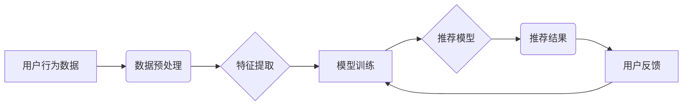

                 

## AI如何改善电商平台的购物车商品组合推荐

> 关键词：电商平台、购物车推荐、人工智能、协同过滤、深度学习、个性化推荐、商品组合

## 1. 背景介绍

在当今竞争激烈的电商市场，提升用户购物体验和转化率至关重要。购物车商品组合推荐作为一种重要的个性化推荐策略，能够帮助电商平台向用户推荐与已选商品相匹配的补充产品，从而增加用户的购买意愿和订单价值。传统的商品组合推荐方法往往依赖于规则引擎或基于商品属性的相似度计算，缺乏对用户行为和偏好的精准理解。

随着人工智能技术的快速发展，特别是深度学习算法的突破，电商平台可以利用海量用户数据和商品信息，构建更智能、更精准的购物车商品组合推荐系统。AI驱动的推荐系统能够根据用户的历史购买记录、浏览行为、购物车内容等多方面信息，学习用户的个性化需求，并推荐最符合用户偏好的商品组合。

## 2. 核心概念与联系

### 2.1 购物车商品组合推荐

购物车商品组合推荐是指在用户添加商品到购物车后，根据用户的购物意图和历史行为，推荐与已选商品相匹配的补充产品，以引导用户购买更多商品，从而提高订单价值和用户满意度。

### 2.2 AI在推荐系统中的应用

人工智能技术在推荐系统中扮演着越来越重要的角色。AI算法能够从海量用户数据中挖掘出隐藏的模式和关系，并根据这些模式对用户进行精准的画像，从而提供更个性化、更精准的商品推荐。

### 2.3 核心概念架构



## 3. 核心算法原理 & 具体操作步骤

### 3.1 算法原理概述

购物车商品组合推荐算法通常基于以下核心原理：

* **协同过滤:** 根据用户的历史购买行为和商品之间的关联性，预测用户对特定商品的兴趣。
* **基于内容的推荐:** 根据商品的属性和描述，推荐与用户过去购买或浏览过的商品相似的商品。
* **深度学习:** 利用深度神经网络模型，从用户行为数据和商品信息中学习更复杂的特征和模式，进行更精准的推荐。

### 3.2 算法步骤详解

**协同过滤算法步骤:**

1. **数据收集:** 收集用户购买历史、浏览记录、评分等数据。
2. **数据预处理:** 清洗数据、处理缺失值、对数据进行标准化处理。
3. **用户-商品矩阵构建:** 将用户和商品映射到二维矩阵中，其中每个元素表示用户对商品的评分或购买行为。
4. **相似度计算:** 计算用户之间的相似度或商品之间的相似度。
5. **推荐生成:** 根据用户的相似用户或商品的相似商品，推荐用户可能感兴趣的商品。

**基于内容的推荐算法步骤:**

1. **商品特征提取:** 从商品的属性、描述、类别等信息中提取特征向量。
2. **用户兴趣建模:** 根据用户的历史购买记录和浏览行为，构建用户的兴趣向量。
3. **相似度计算:** 计算商品特征向量和用户兴趣向量的相似度。
4. **推荐生成:** 推荐与用户兴趣向量相似度最高的商品。

**深度学习算法步骤:**

1. **数据预处理:** 对用户行为数据和商品信息进行预处理，例如文本处理、图像处理等。
2. **模型构建:** 选择合适的深度学习模型，例如神经网络、卷积神经网络、循环神经网络等。
3. **模型训练:** 利用训练数据训练深度学习模型，学习用户行为和商品特征之间的复杂关系。
4. **推荐生成:** 将训练好的模型应用于新的用户数据，预测用户对特定商品的兴趣，并生成推荐结果。

### 3.3 算法优缺点

| 算法类型 | 优点 | 缺点 |
|---|---|---|
| 协同过滤 | 能够发现用户之间的隐性关联，推荐个性化商品 | 需要大量用户数据，容易出现冷启动问题 |
| 基于内容的推荐 | 不需要大量用户数据，能够解释推荐结果 | 难以捕捉用户细微的兴趣变化 |
| 深度学习 | 能够学习更复杂的特征和模式，推荐更精准的商品 | 需要大量数据和计算资源，模型解释性较差 |

### 3.4 算法应用领域

购物车商品组合推荐算法广泛应用于以下领域：

* **电商平台:** 提高用户购物体验、增加订单价值、提升转化率。
* **社交媒体:** 推荐用户可能感兴趣的内容、商品或服务。
* **音乐平台:** 推荐用户可能喜欢的音乐、艺术家或专辑。
* **视频平台:** 推荐用户可能感兴趣的视频、节目或电影。

## 4. 数学模型和公式 & 详细讲解 & 举例说明

### 4.1 数学模型构建

协同过滤算法的核心是用户-商品矩阵，该矩阵可以表示为一个n x m的矩阵，其中n代表用户数量，m代表商品数量。每个元素$R_{ui}$表示用户$u$对商品$i$的评分或购买行为。

### 4.2 公式推导过程

**余弦相似度:**

余弦相似度是一种常用的相似度度量方法，用于衡量两个向量的角度。

$$
\text{相似度}(u,v) = \frac{u \cdot v}{||u|| ||v||}
$$

其中，$u$和$v$是两个用户或商品的特征向量，$u \cdot v$表示两个向量的点积，$||u||$和$||v||$分别表示两个向量的模长。

**基于内容的推荐的相似度计算:**

$$
\text{相似度}(i,j) = \frac{\sum_{k=1}^{n} f_{ik} \cdot f_{jk}}{\sqrt{\sum_{k=1}^{n} f_{ik}^2} \sqrt{\sum_{k=1}^{n} f_{jk}^2}}
$$

其中，$i$和$j$是两个商品，$f_{ik}$表示商品$i$的第$k$个特征值。

### 4.3 案例分析与讲解

**案例:** 假设有两个用户A和B，他们的购买历史如下：

* 用户A购买了商品1、2、3。
* 用户B购买了商品2、3、4。

我们可以构建一个用户-商品矩阵，并使用余弦相似度计算用户A和用户B之间的相似度。

**用户-商品矩阵:**

| 用户 | 商品1 | 商品2 | 商品3 | 商品4 |
|---|---|---|---|---|
| A | 1 | 1 | 1 | 0 |
| B | 0 | 1 | 1 | 1 |

**相似度计算:**

$$
\text{相似度}(A,B) = \frac{1 \cdot 1 + 1 \cdot 1 + 1 \cdot 1}{\sqrt{1^2 + 1^2 + 1^2} \sqrt{0^2 + 1^2 + 1^2 + 1^2}} = \frac{3}{\sqrt{3} \sqrt{3}} = 1
$$

结果表明，用户A和用户B之间的相似度为1，说明他们具有非常相似的购物偏好。

## 5. 项目实践：代码实例和详细解释说明

### 5.1 开发环境搭建

* Python 3.x
* TensorFlow/PyTorch
* Pandas
* Scikit-learn

### 5.2 源代码详细实现

```python
# 协同过滤算法示例代码

import pandas as pd
from sklearn.metrics.pairwise import cosine_similarity

# 加载用户-商品矩阵
data = pd.read_csv('user_item_matrix.csv')

# 计算用户之间的余弦相似度
user_similarity = cosine_similarity(data)

# 获取用户A的相似用户
user_a_index = 0
similar_users = user_similarity[user_a_index].argsort()[:-6:-1]

# 推荐给用户A的商品
recommended_items = data.iloc[similar_users].mean().sort_values(ascending=False)

print(recommended_items)
```

### 5.3 代码解读与分析

* 首先，加载用户-商品矩阵数据。
* 然后，使用Scikit-learn库中的`cosine_similarity`函数计算用户之间的余弦相似度。
* 接着，获取用户A的相似用户，并根据这些用户的平均评分推荐商品给用户A。

### 5.4 运行结果展示

运行代码后，将输出一个包含推荐商品及其评分的列表。

## 6. 实际应用场景

### 6.1 电商平台

* **商品组合推荐:** 在用户添加商品到购物车后，推荐与已选商品相匹配的补充产品，例如推荐搭配的衣服、鞋子、配件等。
* **个性化推荐:** 根据用户的历史购买记录和浏览行为，推荐用户可能感兴趣的商品，提高用户购物体验和转化率。
* **跨界推荐:** 推荐与用户已购买商品相关的其他商品，例如推荐与手机相关的配件、软件、服务等。

### 6.2 其他领域

* **社交媒体:** 推荐用户可能感兴趣的内容、商品或服务。
* **音乐平台:** 推荐用户可能喜欢的音乐、艺术家或专辑。
* **视频平台:** 推荐用户可能感兴趣的视频、节目或电影。

### 6.4 未来应用展望

随着人工智能技术的不断发展，购物车商品组合推荐系统将更加智能、精准和个性化。未来，我们可以期待以下应用场景：

* **多模态推荐:** 利用文本、图像、视频等多模态数据进行商品推荐。
* **实时推荐:** 基于用户的实时行为，动态调整推荐结果。
* **个性化价格推荐:** 根据用户的购买偏好和历史行为，提供个性化的价格推荐。

## 7. 工具和资源推荐

### 7.1 学习资源推荐

* **书籍:**
    * 《推荐系统实践》
    * 《深度学习》
* **在线课程:**
    * Coursera: Recommender Systems
    * Udacity: Deep Learning Nanodegree

### 7.2 开发工具推荐

* **Python:** 
    * TensorFlow
    * PyTorch
    * Scikit-learn
* **数据库:**
    * MySQL
    * PostgreSQL

### 7.3 相关论文推荐

* **协同过滤:**
    * "Collaborative Filtering: A User-Based Approach"
* **深度学习:**
    * "Neural Collaborative Filtering"
    * "Deep Learning for Recommender Systems"

## 8. 总结：未来发展趋势与挑战

### 8.1 研究成果总结

AI驱动的购物车商品组合推荐系统能够有效提升用户购物体验和转化率，并为电商平台带来新的商业价值。

### 8.2 未来发展趋势

未来，购物车商品组合推荐系统将更加智能、精准和个性化，并融合更多新技术，例如多模态学习、强化学习、联邦学习等。

### 8.3 面临的挑战

* **数据质量:** 推荐系统的准确性依赖于高质量的用户数据和商品信息。
* **冷启动问题:** 新用户和新商品难以获得准确的推荐结果。
* **模型解释性:** 深度学习模型的决策过程难以解释，这可能会影响用户的信任度。

### 8.4 研究展望

未来研究方向包括：

* 开发更鲁棒、更有效的推荐算法。
* 探索新的数据来源和特征提取方法。
* 提高模型的解释性和可解释性。


## 9. 附录：常见问题与解答

**Q1: 协同过滤算法容易出现数据稀疏问题，如何解决？**

**A1:** 

* 使用矩阵分解技术，将用户-商品矩阵分解成低维的用户和商品特征向量。
* 使用混合推荐算法，结合协同过滤和基于内容的推荐。
* 利用其他数据源，例如用户评论、商品描述等，补充用户-商品矩阵。

**Q2: 深度学习模型训练需要大量数据，如何解决数据不足的问题？**

**A2:**

* 使用迁移学习，利用预训练的深度学习模型，减少训练数据需求。
* 使用数据增强技术，例如数据合成、数据扩充等，增加训练数据量。
* 使用少样本学习算法，训练更少数据量的深度学习模型。


作者：禅与计算机程序设计艺术 / Zen and the Art of Computer Programming 
<end_of_turn>

