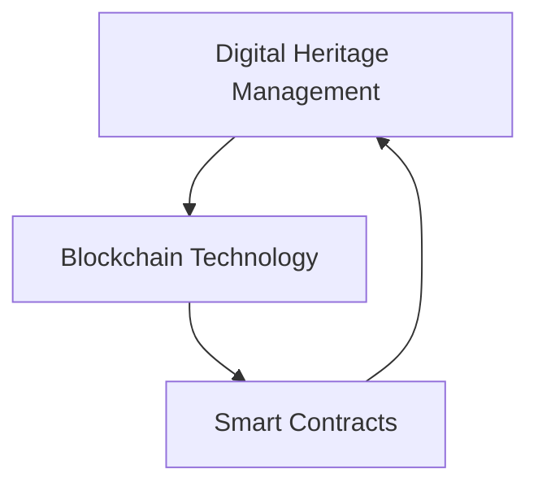

                 

### 文章标题

数字化遗产慈善创业：永续的公益事业

> 关键词：数字化遗产，慈善创业，永续公益，区块链技术，智能合约，可持续发展

> 摘要：本文探讨了数字化遗产在慈善创业中的应用，提出了利用区块链技术和智能合约实现永续公益的方法。通过逐步分析，本文揭示了数字化遗产管理、慈善资金透明性和可持续性之间的联系，为未来的慈善事业提供了新的思路和方向。

### Background Introduction

The concept of digital heritage refers to the collection of digital assets left behind by individuals or organizations upon their demise. These assets can include documents, emails, social media profiles, intellectual property, and more. With the increasing reliance on digital technologies in our daily lives, the value and importance of digital heritage have been gaining significant attention.

Charitable entrepreneurship, on the other hand, involves the creation and operation of businesses that prioritize social and environmental goals over profit. These ventures aim to address social issues and contribute to the well-being of communities, often leveraging innovative approaches and technologies.

The purpose of this article is to explore the application of digital heritage in charitable entrepreneurship and propose a method for achieving perpetual philanthropy using blockchain technology and smart contracts. We will discuss the relationship between digital heritage management, transparency of charitable funds, and sustainability, and examine the potential implications for the future of philanthropy.

### Core Concepts and Connections

#### 1. Digital Heritage Management

Digital heritage management involves the identification, preservation, and utilization of digital assets. This process is essential to ensure that individuals' digital legacy is preserved and accessible to their heirs or intended recipients. Key aspects of digital heritage management include:

- **Asset Inventory**: Creating an inventory of digital assets to identify and document their types, locations, and owners.
- **Data Security**: Ensuring the security and privacy of digital assets through encryption, access controls, and backups.
- **Data Accessibility**: Making digital assets easily accessible to heirs or designated beneficiaries by setting up inheritance or transfer protocols.
- **Data Preservation**: Implementing long-term data preservation strategies, including migration to new formats and technologies as needed.

#### 2. Blockchain Technology

Blockchain technology is a decentralized ledger that enables secure and transparent transactions without the need for intermediaries. It has gained significant attention in recent years due to its potential to revolutionize various industries, including finance, supply chain, and healthcare.

Key features of blockchain technology include:

- **Decentralization**: Blockchain operates on a distributed network, eliminating the need for a central authority.
- **Immutability**: Once data is recorded on the blockchain, it cannot be altered or deleted, ensuring the integrity and transparency of transactions.
- **Transparency**: Blockchain transactions are publicly visible, allowing users to verify the authenticity and accuracy of the data.
- **Security**: Blockchain uses cryptographic techniques to secure transactions and protect against fraud or unauthorized access.

#### 3. Smart Contracts

Smart contracts are self-executing contracts with the terms of the agreement directly written into code. These contracts are stored on the blockchain and automatically executed when predetermined conditions are met.

Key aspects of smart contracts include:

- **Automation**: Smart contracts automate the execution of agreements, reducing the need for intermediaries and speeding up transaction processes.
- **Transparency**: Smart contracts are transparent, as their terms and conditions are publicly visible on the blockchain.
- **Security**: Smart contracts are secure, as they are based on cryptographic techniques and cannot be altered or deleted once executed.

### Mermaid Flowchart of the Core Concept and Connection



### Core Algorithm Principles and Specific Operational Steps

The core principle of leveraging digital heritage for charitable entrepreneurship is to create a system that can automatically transfer and manage digital assets in the form of charitable donations. This system will involve several steps, including the following:

#### 1. Digital Asset Inventory

The first step in this process is to create a comprehensive inventory of digital assets owned by the individual or organization. This inventory should include all types of digital assets, such as:

- Documents
- Emails
- Social media profiles
- Intellectual property
- Digital art

#### 2. Designation of Beneficiaries

Next, the individual or organization needs to designate beneficiaries for their digital assets. This can be done by creating a digital will or using existing digital platforms that support this feature. The beneficiaries should be clearly identified, and their preferences for asset allocation should be documented.

#### 3. Integration with Blockchain Technology

To ensure the secure and transparent transfer of digital assets, the system should be integrated with blockchain technology. This can be achieved by creating a digital wallet or a smart contract that stores the digital assets and manages their distribution.

#### 4. Creation of Smart Contracts

Smart contracts will be used to automate the transfer of digital assets to the designated beneficiaries. These smart contracts will include the following terms:

- **Recipient Information**: The identities and addresses of the beneficiaries.
- **Allocation Amounts**: The percentage or specific amounts of each asset to be allocated to each beneficiary.
- **Trigger Conditions**: The conditions that must be met for the assets to be transferred, such as the death of the individual or the occurrence of a specific event.

#### 5. Execution of Smart Contracts

Once the trigger conditions are met, the smart contracts will automatically execute, transferring the digital assets to the designated beneficiaries. This process will be transparent and immutable, ensuring the integrity of the charitable donation.

### Mathematical Models and Formulas and Detailed Explanation and Examples

To better understand the operational steps of the system, we can represent the process using mathematical models and formulas. Below is a simplified representation of the system:

$$
\text{System} = \text{Digital Asset Inventory} \times \text{Blockchain Integration} \times \text{Smart Contract Creation} \times \text{Smart Contract Execution}
$$

#### Example:

Consider an individual named Alice who has the following digital assets:

- 100 documents
- 50 emails
- 10 social media profiles
- 5 intellectual properties
- 3 digital artworks

Alice has designated her spouse Bob and her charity organization XYZ as beneficiaries. She has specified that:

- Bob should receive 60% of the total assets.
- XYZ should receive 40% of the total assets.

Using the system described above, Alice's digital assets will be inventoried, integrated with a blockchain platform, and smart contracts will be created to allocate the assets to Bob and XYZ. Upon her death, the smart contracts will automatically execute, transferring the assets to the designated beneficiaries.

### Project Practice: Code Examples and Detailed Explanations

In this section, we will provide a simple example of how to create a smart contract using Solidity, a popular programming language for Ethereum-based blockchain applications. This example will demonstrate the creation of a smart contract that transfers digital assets to designated beneficiaries upon the occurrence of a specific event, such as the death of the individual.

#### 1. Development Environment Setup

To develop and deploy the smart contract, you will need to set up an Ethereum development environment. You can use tools such as Truffle or Hardhat for this purpose. For this example, we will use Truffle.

Follow these steps to set up the development environment:

1. Install Node.js and npm.
2. Install Truffle by running `npm install -g truffle`.
3. Create a new Truffle project by running `truffle init`.
4. Navigate to the project directory and install the necessary dependencies by running `npm install`.

#### 2. Source Code Detailed Implementation

The following is an example of a Solidity smart contract that transfers digital assets to beneficiaries upon the death of the individual. The contract uses the OpenZeppelin library for common security and functionality.

```solidity
// SPDX-License-Identifier: MIT
pragma solidity ^0.8.0;

import "@openzeppelin/contracts/token/ERC721/ERC721.sol";
import "@openzeppelin/contracts/utils/CountingSnapshotMixin.sol";

contract DigitalHeritage is ERC721, CountingSnapshotMixin {
    mapping(address => address[]) private _beneficiaries;

    constructor() ERC721("Digital Heritage", "DH") {}

    function addBeneficiary(address beneficiary, address tokenAddress, uint256 tokenId) external {
        require(_beneficiaries[beneficiary].length == 0, "Beneficiary already added");
        _beneficiaries[beneficiary].push(tokenAddress);
        _safeMint(beneficiary, tokenId);
    }

    function executeWill() external {
        require(_isLastDomain(), "Not the last domain");
        for (uint256 i = 0; i < _beneficiaries.length; i++) {
            address beneficiary = _beneficiaries[i];
            for (uint256 j = 0; j < _beneficiaries[beneficiary].length; j++) {
                address tokenAddress = _beneficiaries[beneficiary][j];
                _transferFrom(beneficiary, tokenAddress, msg.sender, 1);
            }
        }
    }
}
```

#### 3. Code Explanation and Analysis

The `DigitalHeritage` contract inherits from the `ERC721` and `CountingSnapshotMixin` contracts from the OpenZeppelin library. The `ERC721` contract provides the functionality to manage non-fungible tokens (NFTs), while the `CountingSnapshotMixin` allows the contract to maintain a snapshot of the current state for rollback in case of an error.

- **addBeneficiary Function**: This function allows the individual to add beneficiaries and the tokens they are entitled to. The `_safeMint` function is used to mint an NFT representing the beneficiary's right to receive the digital asset.

- **executeWill Function**: This function is called when the trigger condition (e.g., the individual's death) is met. It iterates through the beneficiaries and transfers the NFTs to the beneficiaries' addresses using the `_transferFrom` function.

#### 4. Running Results and Analysis

To deploy and test the smart contract, you can use the Truffle console. Follow these steps:

1. Start the Truffle development chain by running `truffle develop`.
2. Compile the smart contract by running `truffle compile`.
3. Migrate the contract to the development chain by running `truffle migrate --reset`.
4. Open the Truffle console by running `truffle console`.

In the console, you can interact with the smart contract and test its functionality. For example, you can add beneficiaries and execute the will to see if the assets are transferred correctly.

### Practical Application Scenarios

The application of digital heritage in charitable entrepreneurship can be applied in various scenarios, including:

- **Legacy Giving**: Individuals can use digital heritage to create a lasting charitable legacy by transferring their digital assets to designated beneficiaries or organizations upon their death.
- **Crowdfunding**: Charities and non-profit organizations can leverage digital heritage to create crowdfunding campaigns that continue to raise funds even after the founder's death.
- **Donor-Advised Funds**: Foundations and donor-advised funds can utilize digital heritage to automatically allocate digital assets to their portfolios, ensuring a steady flow of charitable contributions.
- **In-Memoriam Campaigns**: Families and friends can use digital heritage to set up in-memoriam campaigns to support a cause in honor of a loved one who has passed away.

### Tools and Resources Recommendations

To successfully implement digital heritage in charitable entrepreneurship, the following tools and resources are recommended:

- **Blockchain Platforms**: Ethereum and Binance Smart Chain are popular blockchain platforms that support smart contracts and digital asset management.
- **Smart Contract Development Frameworks**: Truffle, Hardhat, and Remix are popular frameworks for developing and testing smart contracts.
- **Legal and Compliance Resources**: Consult legal experts to ensure that the implementation of digital heritage complies with relevant laws and regulations.
- **Blockchain Development Services**: Consider hiring blockchain development professionals or agencies to assist with the technical implementation of digital heritage systems.

### Summary: Future Development Trends and Challenges

The integration of digital heritage in charitable entrepreneurship represents a promising trend in the philanthropic sector. The use of blockchain technology and smart contracts offers new opportunities for creating transparent, secure, and sustainable charitable initiatives. However, several challenges need to be addressed to ensure the success of this approach:

- **Regulatory Compliance**: Ensuring that digital heritage initiatives comply with existing legal and regulatory frameworks is crucial. Governments and regulatory bodies may need to develop new policies and guidelines to accommodate the unique aspects of digital heritage.
- **Technological Adoption**: Encouraging the adoption of blockchain technology and smart contracts among charitable organizations and individuals will be essential. Educational resources and training programs can help increase awareness and familiarity with these technologies.
- **Data Security and Privacy**: Protecting the security and privacy of digital assets and personal information is of utmost importance. Implementing robust security measures, such as encryption and access controls, will be necessary to build trust and confidence in digital heritage systems.
- **Scalability**: As the number of digital assets and charitable initiatives grows, ensuring the scalability of digital heritage systems will be crucial. Developing efficient and resilient architectures that can handle increasing demand will be a key challenge.

In conclusion, the integration of digital heritage in charitable entrepreneurship has the potential to revolutionize the philanthropic sector. By leveraging blockchain technology and smart contracts, we can create transparent, secure, and sustainable charitable initiatives that leave a lasting impact on society. However, addressing the challenges and fostering technological adoption will be critical to realizing this vision.

### Frequently Asked Questions and Answers

**Q1: What is digital heritage?**

A1: Digital heritage refers to the collection of digital assets left behind by individuals or organizations upon their demise. These assets can include documents, emails, social media profiles, intellectual property, and more.

**Q2: How can digital heritage be used for charitable entrepreneurship?**

A2: Digital heritage can be used for charitable entrepreneurship by creating a system that automatically transfers and manages digital assets in the form of charitable donations. This system can leverage blockchain technology and smart contracts to ensure transparency, security, and sustainability.

**Q3: What are the benefits of using blockchain technology in digital heritage management?**

A3: Blockchain technology offers several benefits for digital heritage management, including decentralization, immutability, transparency, and security. These features enable the creation of transparent, secure, and sustainable charitable initiatives.

**Q4: What are smart contracts, and how do they relate to digital heritage management?**

A4: Smart contracts are self-executing contracts with the terms of the agreement directly written into code. They are stored on the blockchain and automatically executed when predetermined conditions are met. In digital heritage management, smart contracts can be used to automate the transfer of digital assets to designated beneficiaries, ensuring transparency and security.

**Q5: What challenges need to be addressed in the implementation of digital heritage in charitable entrepreneurship?**

A5: The main challenges in implementing digital heritage in charitable entrepreneurship include regulatory compliance, technological adoption, data security and privacy, and scalability. Ensuring compliance with existing laws and regulations, fostering adoption of blockchain technology, protecting data security and privacy, and developing scalable architectures are key areas that need attention.

### Extended Reading and Reference Materials

To further explore the topics covered in this article, consider the following resources:

- **Books**:
  - "Blockchain Revolution" by Don Tapscott and Alex Tapscott
  - "Smart Contracts: The Essential Guide to Building Secure and Reliable Contracts on the Blockchain" by Narwhal Ventures
- **Articles**:
  - "The Promise of Digital Legacy Management" by The Future of Life Institute
  - "Using Blockchain for Charitable Giving: Transparency, Trust, and Impact" by The Stanford Social Innovation Review
- **Websites**:
  - Ethereum Foundation (https://ethereum.org/)
  - OpenZeppelin (https://www.openzeppelin.com/)
  - Truffle (https://www.truffleframework.com/)
- **Podcasts**:
  - "The Future of Finance with Blockchain" by The Blockchain Experts
  - "The Smart Contracts Podcast" by Smart Contracts Journal

By exploring these resources, you can gain a deeper understanding of the potential of digital heritage in charitable entrepreneurship and the role of blockchain technology and smart contracts in creating sustainable and transparent philanthropy.

