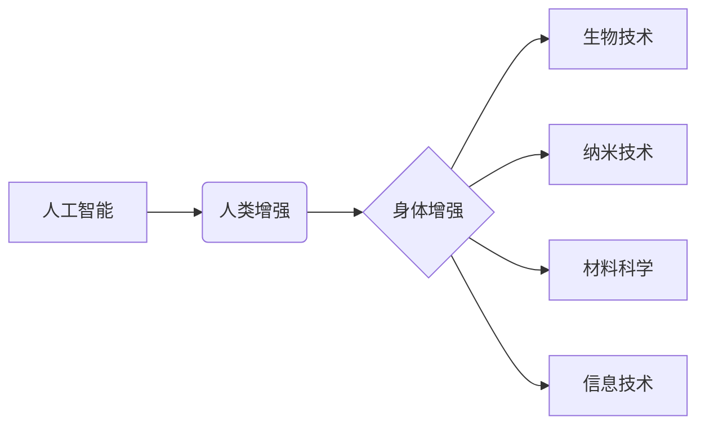

                 

## AI时代的人类增强：道德考虑与身体增强的未来发展机遇分析机遇挑战

> 关键词：人工智能、人类增强、身体增强、道德伦理、未来趋势、机遇挑战

## 1. 背景介绍

人工智能（AI）技术的飞速发展，正在深刻地改变着人类社会。从自动驾驶到医疗诊断，从个性化教育到智能家居，AI正在渗透到生活的方方面面。而其中，人类增强领域尤为引人注目。人类增强是指利用科技手段提升人类的认知能力、物理能力和寿命，从而实现超越自然界限制的全新境界。

身体增强作为人类增强的重要组成部分，旨在通过技术手段改造和提升人类的身体机能。例如，脑机接口技术可以实现人脑与计算机的直接交互，从而增强人类的感知、记忆和控制能力；基因编辑技术可以修正基因缺陷，提高人类的健康水平和寿命；生物打印技术可以制造人工器官，解决器官移植的难题。

## 2. 核心概念与联系

**2.1 人类增强与AI的融合**

人类增强与AI技术的融合将催生出更加强大的增强能力。AI可以分析海量数据，识别人类的需求，并提供个性化的增强方案。例如，AI可以根据用户的生理特征和行为模式，定制个性化的运动训练计划，帮助用户提升身体素质；AI可以根据用户的学习习惯和知识结构，提供个性化的学习内容和辅导，帮助用户提升学习效率。

**2.2 身体增强技术体系**

身体增强技术体系包含多个相互关联的领域，包括：

* **生物技术:** 基因编辑、细胞治疗、生物打印等技术，用于改造和修复人体组织和器官。
* **纳米技术:** 利用纳米材料和纳米技术，构建微型传感器、微型机器人等，实现对人体内部的精准控制和调控。
* **材料科学:** 开发新型生物兼容材料，用于制造人体植入物和增强设备。
* **信息技术:** 脑机接口、虚拟现实、增强现实等技术，用于连接人脑与外部世界，扩展人类感知和交互能力。

**2.3 核心概念关系图**



## 3. 核心算法原理 & 具体操作步骤

**3.1 算法原理概述**

身体增强算法的核心在于对人体生理机制的理解和模拟。通过对人体数据进行分析和建模，可以开发出能够精准控制和调控人体机能的算法。例如，运动增强算法可以根据用户的运动轨迹和生理数据，优化运动方案，提高运动效率；医疗诊断算法可以分析患者的医疗影像数据，识别疾病特征，辅助医生进行诊断。

**3.2 算法步骤详解**

1. **数据采集:** 收集人体相关数据，例如运动轨迹、生理指标、基因信息等。
2. **数据预处理:** 对采集到的数据进行清洗、转换和格式化，使其能够被算法处理。
3. **模型构建:** 根据人体生理机制，构建数学模型或神经网络模型，模拟人体机能。
4. **模型训练:** 利用训练数据，训练模型，使其能够准确预测和控制人体机能。
5. **算法应用:** 将训练好的模型应用于实际场景，例如运动增强、医疗诊断、疾病治疗等。

**3.3 算法优缺点**

* **优点:** 能够精准控制和调控人体机能，提升人类能力；
* **缺点:** 算法的准确性和安全性需要不断验证和提升；数据隐私和安全问题需要得到妥善解决。

**3.4 算法应用领域**

* **运动增强:** 提升运动效率、预防运动损伤、个性化训练计划。
* **医疗诊断:** 辅助医生进行疾病诊断，提高诊断准确率。
* **疾病治疗:** 开发个性化治疗方案，提高治疗效果。
* **康复训练:** 帮助患者恢复身体功能，提高生活质量。

## 4. 数学模型和公式 & 详细讲解 & 举例说明

**4.1 数学模型构建**

身体增强算法通常基于生物物理模型和神经网络模型。生物物理模型模拟人体生理机制，例如肌肉收缩、神经传导等。神经网络模型则模拟大脑的学习和决策过程。

**4.2 公式推导过程**

例如，运动增强算法可以使用牛顿第二定律来描述肌肉的运动力学：

$$F = ma$$

其中，F是肌肉产生的力，m是肌肉的质量，a是肌肉的加速度。通过分析用户的运动轨迹和生理数据，可以计算出肌肉所需的力，并通过算法控制肌肉的收缩，实现运动增强。

**4.3 案例分析与讲解**

例如，利用脑机接口技术，可以实现人脑与机械臂的直接交互。通过训练神经网络模型，可以将用户的意图转化为机械臂的动作指令。

## 5. 项目实践：代码实例和详细解释说明

**5.1 开发环境搭建**

* 操作系统: Ubuntu 20.04
* 编程语言: Python 3.8
* 深度学习框架: TensorFlow 2.0
* 其他工具: Jupyter Notebook, Git

**5.2 源代码详细实现**

```python
import tensorflow as tf

# 定义神经网络模型
model = tf.keras.models.Sequential([
    tf.keras.layers.Dense(128, activation='relu', input_shape=(1024,)),
    tf.keras.layers.Dense(64, activation='relu'),
    tf.keras.layers.Dense(1, activation='sigmoid')
])

# 编译模型
model.compile(optimizer='adam', loss='binary_crossentropy', metrics=['accuracy'])

# 训练模型
model.fit(X_train, y_train, epochs=10)

# 评估模型
loss, accuracy = model.evaluate(X_test, y_test)
print('Loss:', loss)
print('Accuracy:', accuracy)
```

**5.3 代码解读与分析**

这段代码定义了一个简单的深度学习模型，用于分类任务。模型包含三个全连接层，分别具有128、64和1个神经元。激活函数为ReLU和sigmoid。模型使用Adam优化器，损失函数为二分类交叉熵，评价指标为准确率。

**5.4 运行结果展示**

训练完成后，可以评估模型的性能，例如准确率、损失值等。

## 6. 实际应用场景

**6.1 运动增强**

* **个性化运动训练:** 根据用户的运动目标、身体素质和运动习惯，定制个性化的运动计划，提高运动效率和效果。
* **运动损伤预防:** 通过分析用户的运动数据，识别潜在的运动风险，并提供相应的预防措施，降低运动损伤的发生率。
* **康复训练:** 帮助运动损伤患者进行康复训练，恢复身体功能。

**6.2 医疗诊断**

* **疾病早期诊断:** 利用AI算法分析患者的医疗影像数据，识别疾病特征，实现疾病的早期诊断。
* **精准医疗:** 根据患者的基因信息和病理数据，制定个性化的治疗方案，提高治疗效果。
* **远程医疗:** 利用AI技术，实现远程医疗诊断和咨询，提高医疗服务的可及性。

**6.3 其他应用场景**

* **增强现实:** 利用AR技术，将虚拟信息叠加到现实世界中，增强用户的感知和交互体验。
* **虚拟现实:** 利用VR技术，创造虚拟环境，用于游戏、教育、培训等领域。
* **机器人技术:** 利用AI技术，开发更加智能的机器人，用于工业生产、服务业等领域。

**6.4 未来应用展望**

随着AI技术的不断发展，身体增强技术将应用于更多领域，为人类社会带来更加深刻的变革。例如，未来可能出现以下应用场景：

* **人类寿命延长:** 通过基因编辑和细胞治疗技术，延长人类的寿命。
* **人类能力提升:** 通过脑机接口技术，增强人类的认知能力、感知能力和控制能力。
* **人类与机器融合:** 通过身体增强技术，实现人类与机器的融合，创造更加强大的生命体。

## 7. 工具和资源推荐

**7.1 学习资源推荐**

* **书籍:**
    * 《深度学习》
    * 《人工智能：一种现代方法》
    * 《机器学习》
* **在线课程:**
    * Coursera
    * edX
    * Udacity

**7.2 开发工具推荐**

* **编程语言:** Python, C++, Java
* **深度学习框架:** TensorFlow, PyTorch, Keras
* **数据处理工具:** Pandas, NumPy

**7.3 相关论文推荐**

* **Nature:** https://www.nature.com/
* **Science:** https://www.science.org/
* **arXiv:** https://arxiv.org/

## 8. 总结：未来发展趋势与挑战

**8.1 研究成果总结**

近年来，身体增强领域取得了显著进展，例如脑机接口技术、基因编辑技术、生物打印技术等取得了突破性进展。这些技术为人类增强提供了强大的工具和手段。

**8.2 未来发展趋势**

* **人工智能与生物技术的融合:** AI技术将与生物技术更加紧密地融合，开发出更加智能和精准的身体增强算法。
* **个性化身体增强:** 基于用户的基因信息、生理数据和生活习惯，开发出更加个性化的身体增强方案。
* **伦理与社会影响:** 随着身体增强技术的不断发展，其伦理和社会影响将更加凸显，需要加强相关研究和讨论。

**8.3 面临的挑战**

* **技术瓶颈:** 身体增强技术还面临着许多技术瓶颈，例如生物兼容性、安全性、可靠性等。
* **伦理道德:** 身体增强技术可能带来一些伦理道德问题，例如公平性、隐私性、人性的本质等。
* **社会接受度:** 身体增强技术可能面临社会大众的抵触和不信任，需要加强公众教育和宣传。

**8.4 研究展望**

未来，身体增强领域将继续朝着更加智能、个性化、安全的方向发展。需要加强基础研究，突破技术瓶颈，并积极应对伦理和社会挑战，确保身体增强技术能够真正造福人类。

## 9. 附录：常见问题与解答

**9.1 Q: 身体增强技术是否安全？**

**A:** 身体增强技术尚处于发展阶段，其安全性需要不断验证和提升。目前，一些身体增强技术已经应用于临床，例如 cochlear implants (人工耳蜗) 和 deep brain stimulation (深度脑刺激)，但仍存在一些潜在风险。

**9.2 Q: 身体增强技术会改变人类的本质吗？**

**A:** 身体增强技术可能会改变人类的生理和认知能力，但其是否会改变人类的本质是一个复杂的问题，需要哲学和伦理学家的深入探讨。

**9.3 Q: 身体增强技术会加剧社会不平等吗？**

**A:** 身体增强技术可能导致社会资源分配不均，加剧社会不平等。因此，需要制定相应的政策和措施，确保身体增强技术能够公平地惠及所有人群。


作者：禅与计算机程序设计艺术 / Zen and the Art of Computer Programming 
<end_of_turn>

