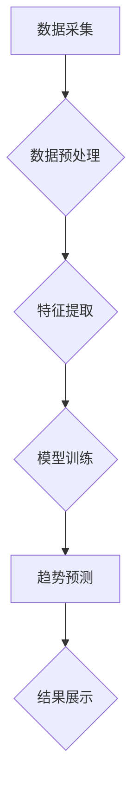

                 

## AI时尚预测分析平台：为时尚行业提供数据分析和预测服务

> 关键词：人工智能、时尚预测、数据分析、机器学习、深度学习、时装趋势、市场预测、商业智能

## 1. 背景介绍

时尚行业是一个充满创意和竞争的领域，其成功与否往往取决于对市场趋势的精准预测和把握。传统上，时尚品牌依靠经验、直觉和市场调研来预测未来的流行趋势，但这些方法往往不够准确和高效。随着人工智能技术的快速发展，AI技术为时尚行业带来了新的机遇，可以帮助品牌更精准地预测市场趋势，优化产品设计和营销策略。

AI时尚预测分析平台利用大数据、机器学习和深度学习等技术，从海量的数据中挖掘出隐藏的模式和规律，从而预测未来的时尚趋势。该平台可以分析各种数据源，包括社交媒体数据、搜索引擎数据、销售数据、天气数据等，并利用先进的算法模型进行趋势分析和预测。

## 2. 核心概念与联系

**2.1 核心概念**

* **人工智能 (AI):** 人工智能是指模拟人类智能行为的计算机系统，包括学习、推理、决策、感知等能力。
* **机器学习 (ML):** 机器学习是人工智能的一个子领域，它通过算法训练模型，使模型能够从数据中学习并做出预测。
* **深度学习 (DL):** 深度学习是机器学习的一个子领域，它使用多层神经网络来模拟人类大脑的学习过程，能够处理更复杂的数据和任务。
* **数据分析:** 数据分析是指从数据中提取有价值的信息，并将其转化为可理解的见解。
* **时尚趋势预测:**  利用数据分析和机器学习技术预测未来的时尚趋势。

**2.2 架构图**



**2.3 核心联系**

AI时尚预测分析平台的核心是将数据分析、机器学习和深度学习技术结合起来，实现对时尚趋势的精准预测。

数据采集阶段，平台从各种数据源收集相关数据，例如社交媒体数据、搜索引擎数据、销售数据、天气数据等。数据预处理阶段，平台对收集到的数据进行清洗、转换和格式化，以确保数据质量和模型训练的有效性。特征提取阶段，平台从数据中提取出具有预测价值的特征，例如颜色、款式、材质、价格等。模型训练阶段，平台利用机器学习和深度学习算法训练模型，使模型能够从提取的特征中学习出时尚趋势的规律。趋势预测阶段，平台利用训练好的模型对未来的时尚趋势进行预测。结果展示阶段，平台将预测结果以图表、报告等形式展示给用户，帮助用户了解未来的时尚趋势。

## 3. 核心算法原理 & 具体操作步骤

**3.1 算法原理概述**

AI时尚预测分析平台通常采用以下几种核心算法：

* **线性回归:** 用于预测连续变量，例如销售额、价格等。
* **逻辑回归:** 用于预测分类变量，例如产品是否畅销、颜色是否流行等。
* **决策树:** 用于构建决策规则，例如根据用户特征预测用户的购买意愿。
* **支持向量机 (SVM):** 用于分类和回归问题，能够处理高维数据。
* **神经网络:** 用于处理复杂数据，例如图像、文本等，能够学习更复杂的模式和规律。

**3.2 算法步骤详解**

1. **数据收集:** 从各种数据源收集相关数据，例如社交媒体数据、搜索引擎数据、销售数据、天气数据等。
2. **数据预处理:** 对收集到的数据进行清洗、转换和格式化，以确保数据质量和模型训练的有效性。
3. **特征提取:** 从数据中提取出具有预测价值的特征，例如颜色、款式、材质、价格等。
4. **模型选择:** 根据预测任务和数据特点选择合适的算法模型。
5. **模型训练:** 利用训练数据训练模型，调整模型参数，使模型能够准确预测目标变量。
6. **模型评估:** 利用测试数据评估模型的性能，例如准确率、召回率、F1-score等。
7. **模型部署:** 将训练好的模型部署到生产环境中，用于对实时数据进行预测。

**3.3 算法优缺点**

不同的算法模型具有不同的优缺点，需要根据具体任务和数据特点选择合适的算法。

* **线性回归:** 优点：简单易懂、计算效率高。缺点：假设数据服从线性关系，对非线性关系的预测能力较弱。
* **逻辑回归:** 优点：适用于分类问题，易于解释。缺点：对复杂数据处理能力有限。
* **决策树:** 优点：易于理解和解释，能够处理非线性关系。缺点：容易过拟合，对数据噪声敏感。
* **支持向量机 (SVM):** 优点：能够处理高维数据，对非线性关系有较好的处理能力。缺点：训练时间较长，参数选择较复杂。
* **神经网络:** 优点：能够学习复杂模式，对非线性关系有很好的处理能力。缺点：训练时间较长，参数选择较复杂，解释性较差。

**3.4 算法应用领域**

AI时尚预测分析平台的算法模型可以应用于以下领域：

* **产品设计:** 预测未来的流行趋势，帮助品牌设计更符合市场需求的产品。
* **营销策略:** 预测消费者的购买行为，帮助品牌制定更有效的营销策略。
* **库存管理:** 预测产品的销售量，帮助品牌优化库存管理。
* **价格制定:** 预测产品的市场价格，帮助品牌制定更合理的定价策略。

## 4. 数学模型和公式 & 详细讲解 & 举例说明

**4.1 数学模型构建**

AI时尚预测分析平台通常采用以下几种数学模型：

* **线性回归模型:** 用于预测连续变量，例如销售额、价格等。模型假设目标变量与输入特征之间存在线性关系。

$$
y = \beta_0 + \beta_1x_1 + \beta_2x_2 + ... + \beta_nx_n + \epsilon
$$

其中：

* $y$ 是目标变量
* $x_1, x_2, ..., x_n$ 是输入特征
* $\beta_0, \beta_1, \beta_2, ..., \beta_n$ 是模型参数
* $\epsilon$ 是误差项

* **逻辑回归模型:** 用于预测分类变量，例如产品是否畅销、颜色是否流行等。模型将输入特征线性组合后通过sigmoid函数进行转换，得到预测概率。

$$
p(y=1|x) = \frac{1}{1 + e^{-( \beta_0 + \beta_1x_1 + \beta_2x_2 + ... + \beta_nx_n )}}
$$

其中：

* $p(y=1|x)$ 是预测目标变量为1的概率
* $x_1, x_2, ..., x_n$ 是输入特征
* $\beta_0, \beta_1, \beta_2, ..., \beta_n$ 是模型参数

**4.2 公式推导过程**

线性回归模型的模型参数可以通过最小二乘法进行估计。最小二乘法旨在找到模型参数，使得模型预测值与实际值之间的误差平方和最小。

逻辑回归模型的模型参数可以通过最大似然估计法进行估计。最大似然估计法旨在找到模型参数，使得模型能够最大化观测数据的似然概率。

**4.3 案例分析与讲解**

假设我们想要预测一款服装的销售量。我们可以收集以下数据：

* 服装颜色
* 服装款式
* 服装材质
* 服装价格
* 天气状况

我们可以使用线性回归模型来预测服装的销售量。模型的输入特征包括服装颜色、款式、材质、价格和天气状况，而目标变量是销售量。通过训练模型，我们可以得到模型参数，并利用这些参数对未来的服装销售量进行预测。

## 5. 项目实践：代码实例和详细解释说明

**5.1 开发环境搭建**

* 操作系统：Windows/macOS/Linux
* Python 版本：3.6+
* 必要的库：pandas, numpy, scikit-learn, matplotlib, seaborn

**5.2 源代码详细实现**

```python
import pandas as pd
from sklearn.model_selection import train_test_split
from sklearn.linear_model import LinearRegression
from sklearn.metrics import mean_squared_error

# 加载数据
data = pd.read_csv('fashion_data.csv')

# 选择特征和目标变量
features = ['color', 'style', 'material', 'price', 'weather']
target = 'sales'

# 将数据分割为训练集和测试集
X_train, X_test, y_train, y_test = train_test_split(data[features], data[target], test_size=0.2, random_state=42)

# 创建线性回归模型
model = LinearRegression()

# 训练模型
model.fit(X_train, y_train)

# 对测试集进行预测
y_pred = model.predict(X_test)

# 计算模型性能
mse = mean_squared_error(y_test, y_pred)
print(f'Mean Squared Error: {mse}')

# 可视化预测结果
import matplotlib.pyplot as plt
plt.scatter(y_test, y_pred)
plt.xlabel('Actual Sales')
plt.ylabel('Predicted Sales')
plt.title('Actual vs Predicted Sales')
plt.show()
```

**5.3 代码解读与分析**

* 首先，我们加载数据并选择特征和目标变量。
* 然后，我们将数据分割为训练集和测试集，用于训练和评估模型。
* 接下来，我们创建线性回归模型并训练模型。
* 训练完成后，我们使用模型对测试集进行预测。
* 最后，我们计算模型性能并可视化预测结果。

**5.4 运行结果展示**

运行代码后，会输出模型的均方误差 (MSE) 值，以及一个散点图，展示实际销售量与预测销售量的关系。

## 6. 实际应用场景

AI时尚预测分析平台可以应用于以下实际场景：

* **品牌设计:** 帮助品牌设计师了解未来的流行趋势，设计更符合市场需求的产品。例如，平台可以分析社交媒体数据，预测哪些颜色、款式和材质将成为未来的流行趋势，帮助设计师进行产品设计。
* **营销推广:** 帮助品牌制定更有效的营销策略。例如，平台可以分析用户购买行为数据，预测哪些用户更可能购买特定产品，帮助品牌进行精准营销。
* **库存管理:** 帮助品牌优化库存管理，避免库存积压或缺货。例如，平台可以预测产品的销售量，帮助品牌合理安排库存。
* **定价策略:** 帮助品牌制定更合理的定价策略。例如，平台可以分析市场价格趋势，帮助品牌制定更具竞争力的定价策略。

**6.4 未来应用展望**

随着人工智能技术的不断发展，AI时尚预测分析平台将拥有更强大的预测能力，并应用于更多场景。例如：

* **个性化推荐:** 基于用户的个人喜好和购买历史，为用户提供更个性化的产品推荐。
* **虚拟试衣间:** 利用虚拟现实技术，让用户在虚拟环境中试穿衣服，并根据用户的体型和喜好进行个性化推荐。
* **智能服装设计:** 利用人工智能算法，自动生成新的服装设计，并根据市场需求进行优化。

## 7. 工具和资源推荐

**7.1 学习资源推荐**

* **书籍:**
    * 《Python机器学习》
    * 《深度学习》
    * 《人工智能：一种现代方法》
* **在线课程:**
    * Coursera: 机器学习
    * edX: 深度学习
    * Udacity: 人工智能工程师

**7.2 开发工具推荐**

* **Python:** 
    * Jupyter Notebook: 用于代码编写和可视化
    * TensorFlow: 深度学习框架
    * PyTorch: 深度学习框架
* **数据可视化工具:**
    * Matplotlib
    * Seaborn
    * Plotly

**7.3 相关论文推荐**

* **Fashion-MNIST: A Novel Image Dataset for Benchmarking Machine Learning Algorithms**
* **Deep Learning for Fashion Recommendation**
* **A Survey of Deep Learning Applications in Fashion**

## 8. 总结：未来发展趋势与挑战

**8.1 研究成果总结**

AI时尚预测分析平台已经取得了一些显著成果，例如：

* 能够准确预测未来的时尚趋势
* 帮助品牌设计更符合市场需求的产品
* 优化品牌营销策略和库存管理

**8.2 未来发展趋势**

未来，AI时尚预测分析平台将朝着以下方向发展：

* **更精准的预测:** 利用更先进的算法模型和更丰富的數據源，提高预测的准确性。
* **更个性化的服务:** 基于用户的个人喜好和购买历史，提供更个性化的产品推荐和服务。
* **更智能的决策支持:** 提供更智能的决策支持，帮助品牌制定更有效的策略。

**8.3 面临的挑战**

AI时尚预测分析平台也面临一些挑战：

* **数据质量:** 确保数据质量和准确性是模型训练的关键。
* **算法模型:** 寻找更适合时尚行业预测的算法模型是一个持续的研究课题。
* **解释性:** 提升模型的解释性，帮助品牌更好地理解预测结果。

**8.4 研究展望**

未来，我们将继续研究和开发更先进的AI时尚预测分析平台，为时尚行业提供更精准、更智能的服务。

## 9. 附录：常见问题与解答

**Q1: 如何获取时尚行业的数据？**

A1: 可以从以下渠道获取时尚行业的数据：

* 社交媒体数据：例如Instagram、Pinterest、Twitter等平台的用户数据和内容数据。
* 搜索引擎数据：例如Google Trends、Baidu Index等平台的搜索趋势数据。
* 销售数据：例如电商平台的销售数据、零售店的销售数据等。
* 天气数据：例如气象局的公开天气数据。

**Q2: 如何选择合适的算法模型？**

A2: 选择合适的算法模型需要根据具体的预测任务和数据特点进行选择。例如，如果要预测连续变量，可以使用线性回归模型；如果要预测分类变量，可以使用逻辑回归模型。

**Q3: 如何评估模型的性能？**

A3: 可以使用以下指标评估模型的性能：

* 均方误差 (MSE)
* R-squared
* 精确率 (Accuracy)
* 召回率 (Recall)
* F1-score


作者：禅与计算机程序设计艺术 / Zen and the Art of Computer Programming<end_of_turn>

