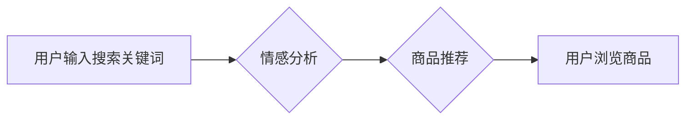

                 

## AI电商搜索中的情感分析应用

> 关键词：情感分析、电商搜索、自然语言处理、机器学习、深度学习、用户体验

## 1. 背景介绍

随着电商行业的蓬勃发展，用户对商品搜索体验的需求日益提高。传统的基于关键词匹配的搜索方式难以满足用户多样化的需求，例如用户可能使用模糊的语言、表达情感或隐含意图进行搜索。因此，如何理解用户搜索背后的情感倾向，并将其融入搜索结果排序和推荐系统中，成为电商搜索领域的重要研究方向。

情感分析作为一种自然语言处理技术，能够从文本中识别和提取情感信息，例如正面、负面或中性。将情感分析应用于电商搜索，可以帮助商家更好地理解用户需求，提供更精准的商品推荐，提升用户购物体验。

## 2. 核心概念与联系

### 2.1 情感分析

情感分析是指通过计算机程序自动识别、理解和分析文本中的情感倾向的技术。它主要包括以下几个方面：

* **情感分类:** 将文本的情绪类别分为正面、负面或中性。
* **情感强度:** 衡量文本中情感的强度，例如非常高兴、稍微高兴、中立、稍微难过、非常难过。
* **情感细粒度分析:** 识别文本中更细粒度的情感，例如喜悦、悲伤、愤怒、恐惧等。

### 2.2 电商搜索

电商搜索是指用户在电商平台上输入关键词或短语，并希望获得与之相关的商品信息的过程。传统的电商搜索主要基于关键词匹配算法，但这种方法难以捕捉用户搜索背后的隐含意图和情感倾向。

### 2.3 情感分析与电商搜索的结合

将情感分析应用于电商搜索，可以帮助商家更好地理解用户需求，并提供更精准的商品推荐。例如，当用户搜索“手机”时，如果用户表达了对价格的关注，则可以推荐价格更优惠的手机；如果用户表达了对性能的关注，则可以推荐性能更强大的手机。

**Mermaid 流程图**



## 3. 核心算法原理 & 具体操作步骤

### 3.1 算法原理概述

情感分析算法主要分为以下几种类型：

* **基于规则的算法:** 基于人工定义的规则，例如情感词典、语法规则等，来识别和分类文本的情感。
* **基于机器学习的算法:** 利用机器学习算法，例如支持向量机、朴素贝叶斯、随机森林等，从训练数据中学习情感分类模型。
* **基于深度学习的算法:** 利用深度学习算法，例如循环神经网络、卷积神经网络等，从文本数据中提取更深层的特征，进行情感分析。

### 3.2 算法步骤详解

以基于机器学习的算法为例，其具体操作步骤如下：

1. **数据收集:** 收集包含情感标签的文本数据，例如用户评论、产品评价等。
2. **数据预处理:** 对文本数据进行清洗、分词、去停用词等预处理操作，以便于算法训练。
3. **特征提取:** 从文本数据中提取特征，例如词频、词向量、情感词等。
4. **模型训练:** 利用机器学习算法，例如支持向量机、朴素贝叶斯等，训练情感分类模型。
5. **模型评估:** 使用测试数据评估模型的性能，例如准确率、召回率、F1-score等。
6. **模型部署:** 将训练好的模型部署到电商搜索系统中，用于识别用户搜索关键词的情感倾向。

### 3.3 算法优缺点

**优点:**

* 能够识别文本中的细粒度情感。
* 能够适应不同的文本风格和领域。
* 性能优于基于规则的算法。

**缺点:**

* 需要大量的训练数据。
* 模型训练时间较长。
* 对数据质量要求较高。

### 3.4 算法应用领域

情感分析算法广泛应用于以下领域：

* **电商搜索:** 识别用户搜索关键词的情感倾向，提供更精准的商品推荐。
* **客户服务:** 分析客户反馈，识别客户情绪，提供更有效的客户服务。
* **市场营销:** 分析用户对产品的评价，了解用户需求，改进产品和营销策略。
* **社会舆情监测:** 分析网络舆情，识别公众对事件的看法和态度。

## 4. 数学模型和公式 & 详细讲解 & 举例说明

### 4.1 数学模型构建

情感分析模型通常采用分类模型，将文本的情绪类别分为正、负或中性。常用的分类模型包括逻辑回归、支持向量机和朴素贝叶斯等。

**逻辑回归模型**

逻辑回归模型是一种用于二分类问题的线性模型，其输出结果是一个概率值，表示文本属于正向情感的概率。

**公式:**

$$
P(y=1|x) = \frac{1}{1 + e^{-(w^T x + b)}}
$$

其中：

* $P(y=1|x)$ 是文本属于正向情感的概率。
* $x$ 是文本的特征向量。
* $w$ 是模型参数向量。
* $b$ 是模型偏置项。

**支持向量机模型**

支持向量机模型是一种基于核函数的分类模型，其目标是找到一个最佳的分隔超平面，将正向情感和负向情感的数据点分开。

**公式:**

$$
\max_{w,b} \frac{1}{2} ||w||^2 - C \sum_{i=1}^{n} \xi_i
$$

其中：

* $w$ 是模型参数向量。
* $b$ 是模型偏置项。
* $C$ 是惩罚参数。
* $\xi_i$ 是松弛变量，用于容忍分类错误。

### 4.2 公式推导过程

公式推导过程较为复杂，需要涉及到线性代数、微积分等数学知识。

### 4.3 案例分析与讲解

假设我们有一个文本数据集，包含用户对产品的评价，以及对应的情感标签（正向、负向或中性）。我们可以使用逻辑回归模型训练一个情感分类模型。

**举例说明:**

用户评价： “这款手机拍照效果很棒，非常满意！”

情感标签： 正向

我们可以将文本特征提取为词频向量，例如“很棒”的词频为1，“满意”的词频为1，其他词的词频为0。然后将特征向量输入到逻辑回归模型中，模型会输出一个概率值，表示该文本属于正向情感的概率。

## 5. 项目实践：代码实例和详细解释说明

### 5.1 开发环境搭建

* Python 3.x
* TensorFlow 或 PyTorch
* NLTK 或 spaCy

### 5.2 源代码详细实现

```python
import tensorflow as tf

# 定义模型结构
model = tf.keras.models.Sequential([
    tf.keras.layers.Embedding(input_dim=vocab_size, output_dim=embedding_dim),
    tf.keras.layers.LSTM(units=128),
    tf.keras.layers.Dense(units=1, activation='sigmoid')
])

# 编译模型
model.compile(optimizer='adam',
              loss='binary_crossentropy',
              metrics=['accuracy'])

# 训练模型
model.fit(x_train, y_train, epochs=10)

# 评估模型
loss, accuracy = model.evaluate(x_test, y_test)
print('Loss:', loss)
print('Accuracy:', accuracy)
```

### 5.3 代码解读与分析

* **Embedding层:** 将词向量化，将每个词映射到一个低维向量空间。
* **LSTM层:** 利用循环神经网络，捕捉文本序列中的上下文信息。
* **Dense层:** 全连接层，输出情感分类结果。
* **编译模型:** 指定优化器、损失函数和评估指标。
* **训练模型:** 使用训练数据训练模型。
* **评估模型:** 使用测试数据评估模型性能。

### 5.4 运行结果展示

运行结果会显示模型的损失值和准确率。

## 6. 实际应用场景

### 6.1 商品推荐

电商平台可以利用情感分析技术，分析用户对商品的评价，识别用户对商品的喜好和需求，并推荐更符合用户偏好的商品。

### 6.2 搜索结果排序

电商平台可以根据用户搜索关键词的情感倾向，对搜索结果进行排序，优先展示与用户情感相符的商品。

### 6.3 个性化营销

电商平台可以根据用户的购物历史和情感倾向，进行个性化营销，例如推荐相关的促销活动或优惠券。

### 6.4 未来应用展望

随着人工智能技术的不断发展，情感分析技术在电商搜索领域的应用将更加广泛和深入。例如，可以利用情感分析技术，识别用户对商品的隐含需求，提供更精准的商品推荐；可以利用情感分析技术，分析用户对电商平台的评价，改进平台服务和用户体验。

## 7. 工具和资源推荐

### 7.1 学习资源推荐

* **书籍:**
    * “自然语言处理入门” by Steven Bird, Ewan Klein, Edward Loper
    * “深度学习” by Ian Goodfellow, Yoshua Bengio, Aaron Courville
* **在线课程:**
    * Coursera: Natural Language Processing Specialization
    * edX: Deep Learning

### 7.2 开发工具推荐

* **Python:** 
    * NLTK: 自然语言处理工具包
    * spaCy: 自然语言处理工具包
    * TensorFlow: 深度学习框架
    * PyTorch: 深度学习框架

### 7.3 相关论文推荐

* “Recurrent Neural Network for Text Classification” by Graves, A. (2012)
* “Sentiment Analysis with Deep Learning” by Socher, R., et al. (2013)

## 8. 总结：未来发展趋势与挑战

### 8.1 研究成果总结

情感分析技术在电商搜索领域取得了显著的成果，能够帮助商家更好地理解用户需求，提供更精准的商品推荐，提升用户购物体验。

### 8.2 未来发展趋势

* **多模态情感分析:** 将文本、图像、音频等多模态数据融合，进行更全面的情感分析。
* **跨语言情感分析:** 突破语言障碍，实现跨语言的情感分析。
* **微表情识别:** 识别用户微表情，捕捉更细微的情感变化。

### 8.3 面临的挑战

* **数据标注:** 情感分析模型需要大量的标注数据，数据标注成本较高。
* **情感细粒度分析:** 识别更细粒度的情感，例如喜悦、悲伤、愤怒等，仍然是一个挑战。
* **解释性:** 深度学习模型的决策过程难以解释，如何提高模型的解释性是一个重要问题。

### 8.4 研究展望

未来，情感分析技术将继续发展，在电商搜索领域发挥更重要的作用。研究者将致力于解决数据标注、情感细粒度分析和模型解释性等挑战，推动情感分析技术向更智能、更精准的方向发展。

## 9. 附录：常见问题与解答

**问题:** 情感分析模型的准确率如何？

**解答:** 情感分析模型的准确率取决于多种因素，例如训练数据质量、模型结构、算法参数等。一般来说，基于深度学习的模型能够达到较高的准确率，例如超过90%。

**问题:** 如何进行情感分析模型的评估？

**解答:** 情感分析模型的评估指标包括准确率、召回率、F1-score等。可以使用测试数据对模型进行评估，并选择性能最好的模型。

**问题:** 情感分析技术有哪些伦理问题？

**解答:** 情感分析技术可能会被用于识别和利用用户的隐私信息，因此需要谨慎使用，并制定相应的伦理规范。


作者：禅与计算机程序设计艺术 / Zen and the Art of Computer Programming 
<end_of_turn>

