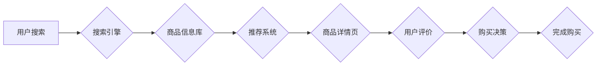

                 

# AI电商搜索平台的商品详情页优化

> 关键词：电商搜索、商品详情页、AI优化、自然语言处理、推荐系统、用户体验、转化率

## 1. 背景介绍

在当今以电商为核心的数字经济时代，搜索引擎已经成为消费者获取商品信息和完成购买决策的关键入口。电商平台的商品详情页作为用户与商品之间直接交互的窗口，其优化至关重要。传统的商品详情页主要依靠人工编辑和关键词堆砌，难以满足用户日益增长的个性化需求和信息获取效率。

随着人工智能技术的快速发展，AI技术开始被广泛应用于电商搜索平台的商品详情页优化，为用户提供更精准、更个性化的商品信息和购物体验。AI驱动的商品详情页优化能够通过分析用户行为、商品特征和市场趋势，实现以下目标：

* **提升商品信息匹配度:**  AI算法能够理解用户搜索意图，并根据商品属性和用户偏好，推荐更符合用户需求的商品信息。
* **个性化商品推荐:**  AI系统可以根据用户的历史浏览记录、购买行为和兴趣爱好，个性化推荐相关商品，提升用户购物体验。
* **智能内容生成:**  AI技术可以自动生成商品描述、标题、标签等内容，提高商品详情页的丰富性和吸引力。
* **实时更新商品信息:**  AI算法可以实时监控商品价格、库存、评价等信息，确保用户获取到最新、最准确的商品信息。

## 2. 核心概念与联系

### 2.1  电商搜索平台

电商搜索平台是电商网站的核心功能之一，其目的是帮助用户快速找到所需的商品。电商搜索平台通常包含以下几个关键模块：

* **搜索引擎:**  负责处理用户搜索请求，并返回相关商品结果。
* **商品信息库:**  存储所有商品的详细信息，包括商品名称、描述、价格、图片等。
* **推荐系统:**  根据用户的搜索历史、浏览记录和购买行为，推荐相关商品。
* **用户界面:**  展示搜索结果和商品详情页，方便用户浏览和选择商品。

### 2.2  商品详情页

商品详情页是用户了解商品信息和完成购买决策的关键页面。商品详情页通常包含以下内容：

* **商品图片:**  展示商品的外观和细节。
* **商品名称:**  简洁明了地描述商品的名称。
* **商品描述:**  详细介绍商品的特性、功能和使用方法。
* **商品价格:**  显示商品的售价和促销信息。
* **商品评价:**  展示其他用户的评价和评分。
* **购买按钮:**  方便用户完成购买操作。

### 2.3  AI优化

AI优化是指利用人工智能技术来提升商品详情页的质量和用户体验。AI优化可以应用于以下几个方面：

* **搜索结果排序:**  AI算法可以根据用户的搜索意图和商品特征，对搜索结果进行排序，提升用户搜索效率。
* **商品推荐:**  AI系统可以根据用户的历史浏览记录、购买行为和兴趣爱好，推荐相关商品，提升用户购物体验。
* **内容生成:**  AI技术可以自动生成商品描述、标题、标签等内容，提高商品详情页的丰富性和吸引力。
* **用户画像:**  AI算法可以分析用户的行为数据，构建用户画像，为用户提供更个性化的商品推荐和服务。

**AI电商搜索平台商品详情页优化流程图**



## 3. 核心算法原理 & 具体操作步骤

### 3.1  算法原理概述

AI电商搜索平台商品详情页优化主要依赖于以下核心算法：

* **自然语言处理 (NLP):**  用于理解用户搜索意图和商品描述中的语义信息。
* **机器学习 (ML):**  用于训练推荐模型，预测用户对商品的兴趣和购买可能性。
* **深度学习 (DL):**  用于构建更复杂的推荐模型，例如基于图神经网络的推荐系统。

### 3.2  算法步骤详解

1. **数据收集和预处理:**  收集用户搜索记录、浏览历史、购买行为、商品信息等数据，并进行清洗、格式化和特征提取。
2. **用户画像构建:**  利用机器学习算法，构建用户画像，包括用户的兴趣爱好、购买偏好、消费习惯等。
3. **商品特征提取:**  提取商品的文本特征、图像特征、价格特征、评价特征等，构建商品的特征向量。
4. **推荐模型训练:**  利用机器学习或深度学习算法，训练推荐模型，预测用户对商品的兴趣和购买可能性。
5. **商品详情页个性化推荐:**  根据用户的画像和推荐模型的预测结果，为用户推荐个性化的商品信息和相关商品。
6. **用户反馈收集和模型更新:**  收集用户的点击、购买、评价等反馈信息，并将其用于更新推荐模型，不断提升推荐效果。

### 3.3  算法优缺点

**优点:**

* **精准推荐:**  AI算法能够根据用户的个性化需求，精准推荐符合用户兴趣的商品。
* **提升用户体验:**  个性化推荐和智能内容生成，提升用户购物体验和效率。
* **数据驱动:**  AI优化基于数据分析和模型训练，能够不断优化推荐效果。

**缺点:**

* **数据依赖:**  AI算法需要大量的用户数据进行训练，数据质量直接影响推荐效果。
* **算法复杂:**  训练和维护复杂的AI模型需要专业的技术人员和资源。
* **伦理问题:**  AI算法可能会存在偏见和歧视问题，需要进行伦理审查和监管。

### 3.4  算法应用领域

AI电商搜索平台商品详情页优化算法广泛应用于以下领域:

* **电商平台:**  提升商品推荐精准度，提高用户转化率。
* **搜索引擎:**  优化搜索结果排序，提升用户搜索体验。
* **内容推荐系统:**  推荐个性化内容，例如新闻、视频、音乐等。
* **广告投放:**  精准投放广告，提高广告效果。

## 4. 数学模型和公式 & 详细讲解 & 举例说明

### 4.1  数学模型构建

商品推荐系统通常采用基于协同过滤的推荐模型，该模型基于用户的历史行为和商品的相似性来预测用户对商品的兴趣。

**协同过滤模型的数学公式:**

$$
r_{ui} = \frac{\sum_{j \in N(u)} s_{uj} \cdot s_{uj} }{\sum_{j \in N(u)} s_{uj}^2}
$$

其中:

* $r_{ui}$: 用户 $u$ 对商品 $i$ 的评分或购买概率。
* $s_{uj}$: 用户 $u$ 对商品 $j$ 的评分或购买行为。
* $N(u)$: 用户 $u$ 购买过的商品集合。

### 4.2  公式推导过程

协同过滤模型的核心思想是，如果用户 $u$ 和用户 $v$ 对相似的商品有相似的评分或购买行为，那么用户 $u$ 也可能喜欢用户 $v$ 喜欢的商品。

公式推导过程如下:

1. 计算用户 $u$ 和所有其他用户 $v$ 之间的相似度。
2. 对于用户 $u$ 喜欢的商品 $j$，计算用户 $v$ 对商品 $j$ 的评分或购买行为。
3. 根据用户 $u$ 和用户 $v$ 的相似度和用户 $v$ 对商品 $j$ 的评分或购买行为，预测用户 $u$ 对商品 $j$ 的评分或购买概率。

### 4.3  案例分析与讲解

假设用户 $A$ 和用户 $B$ 都购买了商品 $X$ 和商品 $Y$，并且对这两个商品的评分都较高。如果用户 $B$ 购买了商品 $Z$，那么根据协同过滤模型，我们可以预测用户 $A$ 也可能喜欢商品 $Z$。

## 5. 项目实践：代码实例和详细解释说明

### 5.1  开发环境搭建

* **操作系统:**  Linux 或 macOS
* **编程语言:**  Python
* **库依赖:**  pandas, numpy, scikit-learn, tensorflow

### 5.2  源代码详细实现

```python
import pandas as pd
from sklearn.metrics.pairwise import cosine_similarity

# 加载用户商品交互数据
data = pd.read_csv('user_item_interactions.csv')

# 构建用户商品交互矩阵
user_item_matrix = data.pivot_table(index='user_id', columns='item_id', values='rating')

# 计算用户之间的相似度
user_similarity = cosine_similarity(user_item_matrix)

# 预测用户对商品的评分
def predict_rating(user_id, item_id):
    # 获取用户 $u$ 喜欢的商品集合
    liked_items = user_item_matrix.loc[user_id].index[user_item_matrix.loc[user_id] > 3]

    # 计算用户 $u$ 与其他用户的相似度
    similarities = user_similarity[user_id]

    # 预测用户 $u$ 对商品 $i$ 的评分
    predicted_rating = sum([similarities[v] * user_item_matrix.loc[v, item_id] for v in range(len(user_similarity))]) / sum(similarities)

    return predicted_rating

# 预测用户 1 对商品 5 的评分
predicted_rating = predict_rating(1, 5)
print(f'Predicted rating for user 1 on item 5: {predicted_rating}')
```

### 5.3  代码解读与分析

* 代码首先加载用户商品交互数据，并构建用户商品交互矩阵。
* 然后，使用余弦相似度计算用户之间的相似度。
* 预测用户对商品的评分函数 `predict_rating` 接收用户 ID 和商品 ID 作为输入，并根据用户相似度和其他用户的评分预测用户对商品的评分。

### 5.4  运行结果展示

运行代码后，会输出用户 1 对商品 5 的预测评分。

## 6. 实际应用场景

### 6.1  电商平台商品推荐

AI电商搜索平台商品详情页优化可以用于个性化推荐商品，提升用户购物体验和转化率。例如，当用户浏览某个商品详情页时，AI系统可以根据用户的浏览历史、购买行为和商品特征，推荐其他用户也可能感兴趣的商品。

### 6.2  搜索引擎结果排序

AI算法可以用于优化搜索引擎结果排序，提升用户搜索体验。例如，当用户搜索某个商品时，AI系统可以根据用户的搜索意图和商品特征，将最相关的商品排在前面。

### 6.3  内容推荐系统

AI电商搜索平台商品详情页优化算法也可以应用于内容推荐系统，例如推荐新闻、视频、音乐等。

### 6.4  未来应用展望

随着人工智能技术的不断发展，AI电商搜索平台商品详情页优化将会有更广泛的应用场景，例如：

* **虚拟试衣间:**  利用计算机视觉技术，实现虚拟试衣间，帮助用户在线试穿衣服。
* **个性化商品设计:**  根据用户的喜好和需求，自动生成个性化的商品设计方案。
* **智能客服:**  利用自然语言处理技术，构建智能客服系统，为用户提供更便捷的购物体验。

## 7. 工具和资源推荐

### 7.1  学习资源推荐

* **书籍:**
    * 《深度学习》
    * 《机器学习实战》
    * 《自然语言处理入门》
* **在线课程:**
    * Coursera: 深度学习 Specialization
    * edX: 机器学习
    * Udacity: 自然语言处理 Nanodegree

### 7.2  开发工具推荐

* **Python:**  Python 是机器学习和深度学习的常用编程语言。
* **TensorFlow:**  TensorFlow 是 Google 开发的开源深度学习框架。
* **PyTorch:**  PyTorch 是 Facebook 开发的开源深度学习框架。
* **Scikit-learn:**  Scikit-learn 是 Python 的机器学习库。

### 7.3  相关论文推荐

* **Collaborative Filtering for Recommender Systems**
* **Deep Learning for Recommender Systems**
* **Natural Language Processing for Recommender Systems**

## 8. 总结：未来发展趋势与挑战

### 8.1  研究成果总结

AI电商搜索平台商品详情页优化取得了显著成果，例如：

* **提升商品推荐精准度:**  AI算法能够根据用户的个性化需求，精准推荐符合用户兴趣的商品。
* **提升用户购物体验:**  个性化推荐和智能内容生成，提升用户购物体验和效率。
* **提高电商平台转化率:**  精准推荐和个性化服务，提高用户购买意愿和转化率。

### 8.2  未来发展趋势

未来，AI电商搜索平台商品详情页优化将朝着以下方向发展:

* **更精准的推荐:**  利用更先进的机器学习和深度学习算法，构建更精准的推荐模型。
* **更个性化的服务:**  利用用户画像和行为数据，提供更个性化的商品推荐和服务。
* **更丰富的交互体验:**  利用虚拟现实、增强现实等技术，构建更丰富的商品详情页交互体验。

### 8.3  面临的挑战

AI电商搜索平台商品详情页优化也面临一些挑战:

* **数据质量:**  AI算法需要大量的用户数据进行训练，数据质量直接影响推荐效果。
* **算法复杂度:**  训练和维护复杂的AI模型需要专业的技术人员和资源。
* **伦理问题:**  AI算法可能会存在偏见和歧视问题，需要进行伦理审查和监管。

### 8.4  研究展望

未来，我们需要继续研究以下问题:

* 如何提高AI算法的鲁棒性和泛化能力，使其能够应对数据质量问题和用户行为变化。
* 如何构建更公平、更透明的AI推荐系统，避免算法偏见和歧视。
* 如何利用新兴技术，例如虚拟现实和增强现实，构建更丰富的商品详情页交互体验。


## 9. 附录：常见问题与解答

**Q1:  AI电商搜索平台商品详情页优化需要哪些数据?**

**A1:**  AI电商搜索平台商品详情页优化需要以下数据:

* 用户搜索记录
* 用户浏览历史
* 用户购买行为
* 商品信息 (名称、描述、价格、图片等)
* 商品评价

**Q2:  AI电商搜索平台商品详情页优化的成本如何?**

**A2:**  AI电商搜索平台商品详情页优化的成本取决于以下因素:

* 数据收集和预处理成本
* 模型训练和维护成本
* 人工智能工程师的薪资成本

**Q3:  AI电商搜索平台商品详情页优化有哪些伦理问题?**

**A3:**  AI电商搜索平台商品详情页优化可能存在以下伦理问题:

* 算法偏见和歧视
* 用户隐私泄露
* 数据安全问题


作者：禅与计算机程序设计艺术 / Zen and the Art of Computer Programming<end_of_turn>

