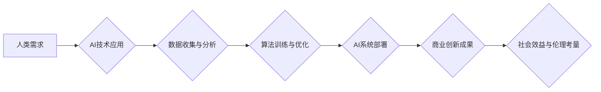

                 

## AI驱动的创新：人类计算在商业中的道德考虑因素与应用前景趋势

> 关键词：人工智能、商业创新、道德伦理、人类计算、应用前景、算法、机器学习、深度学习、数据隐私、算法偏见

### 1. 背景介绍

人工智能（AI）正以惊人的速度发展，深刻地改变着我们生活的方方面面。从自动驾驶汽车到个性化医疗，从智能家居到金融风控，AI技术的应用场景日益广泛。在商业领域，AI驱动的创新正在掀起一场革命，为企业带来前所未有的机遇和挑战。

然而，AI技术的快速发展也引发了广泛的社会关注和伦理探讨。如何确保AI技术的应用安全、公平、透明？如何避免AI算法带来的潜在风险？这些问题迫切需要我们认真思考和解决。

本篇文章将深入探讨AI驱动的商业创新，重点关注人类计算在商业中的道德考虑因素和应用前景趋势。

### 2. 核心概念与联系

**2.1 人类计算**

人类计算是指人类参与和引导AI算法决策的过程。它强调人类的智慧、经验和判断力在AI应用中的重要性，旨在将AI技术与人类智能相结合，发挥协同效应。

**2.2 商业创新**

商业创新是指企业在产品、服务、流程、商业模式等方面进行的变革和改进，以满足市场需求、创造价值并获得竞争优势。

**2.3 AI驱动的商业创新**

AI驱动的商业创新是指利用AI技术，例如机器学习、深度学习等，推动商业模式创新、产品服务升级、运营效率提升等。

**2.4 伦理考量**

在AI驱动的商业创新中，需要认真考虑以下伦理问题：

* **数据隐私保护:** AI算法依赖于大量数据进行训练和运行，因此需要确保数据的安全性和隐私性。
* **算法公平性:** AI算法可能会存在偏见，导致不公平的结果。需要确保算法的公平性和公正性。
* **责任归属:** 当AI系统导致负面后果时，谁应该承担责任？需要明确责任归属机制。
* **透明度和可解释性:** AI算法的决策过程往往难以理解，需要提高算法的透明度和可解释性。

**2.5 流程图**



### 3. 核心算法原理 & 具体操作步骤

**3.1 算法原理概述**

机器学习是AI的核心技术之一，它通过算法学习数据中的模式和规律，从而实现预测、分类、聚类等功能。常见的机器学习算法包括：

* **监督学习:** 利用标记数据训练模型，例如分类、回归等。
* **无监督学习:** 利用未标记数据发现数据中的隐藏结构，例如聚类、降维等。
* **强化学习:** 通过试错学习，实现目标最大化。

**3.2 算法步骤详解**

1. **数据收集与预处理:** 收集相关数据，并进行清洗、转换、特征工程等预处理工作。
2. **模型选择:** 根据具体任务选择合适的机器学习算法。
3. **模型训练:** 利用训练数据训练模型，调整模型参数，使其能够准确地预测或分类。
4. **模型评估:** 利用测试数据评估模型的性能，例如准确率、召回率、F1-score等。
5. **模型部署:** 将训练好的模型部署到实际应用场景中。

**3.3 算法优缺点**

**优点:**

* 自动化学习能力: 可以自动从数据中学习模式和规律。
* 适应性强: 可以适应不断变化的数据环境。
* 性能优异: 在某些任务上可以达到甚至超过人类水平。

**缺点:**

* 数据依赖性强: 需要大量高质量数据进行训练。
* 算法解释性差: 难以理解算法的决策过程。
* 存在偏见风险: 算法可能会继承训练数据中的偏见。

**3.4 算法应用领域**

机器学习算法广泛应用于各个领域，例如：

* **图像识别:** 人脸识别、物体检测、图像分类等。
* **自然语言处理:** 文本分类、情感分析、机器翻译等。
* **推荐系统:** 商品推荐、内容推荐、用户画像等。
* **金融风控:** 欺诈检测、风险评估、信用评分等。
* **医疗诊断:** 疾病预测、影像分析、药物研发等。

### 4. 数学模型和公式 & 详细讲解 & 举例说明

**4.1 数学模型构建**

机器学习算法通常基于数学模型进行构建。例如，线性回归模型可以表示为：

$$y = w_0 + w_1x_1 + w_2x_2 + ... + w_nx_n + \epsilon$$

其中：

* $y$ 是预测值。
* $w_0, w_1, w_2, ..., w_n$ 是模型参数。
* $x_1, x_2, ..., x_n$ 是输入特征。
* $\epsilon$ 是误差项。

**4.2 公式推导过程**

机器学习算法的训练过程通常是通过优化模型参数来最小化误差。常用的优化算法包括梯度下降法、随机梯度下降法等。

**4.3 案例分析与讲解**

例如，在训练线性回归模型时，可以使用梯度下降法来优化模型参数。梯度下降法的核心思想是沿着误差梯度方向迭代更新模型参数，直到达到最小误差。

### 5. 项目实践：代码实例和详细解释说明

**5.1 开发环境搭建**

可以使用Python语言和相关的机器学习库，例如Scikit-learn、TensorFlow、PyTorch等，进行机器学习项目开发。

**5.2 源代码详细实现**

```python
from sklearn.linear_model import LinearRegression
from sklearn.model_selection import train_test_split
from sklearn.metrics import mean_squared_error

# 加载数据
data = ...

# 将数据分为训练集和测试集
X_train, X_test, y_train, y_test = train_test_split(data.drop('target', axis=1), data['target'], test_size=0.2)

# 创建线性回归模型
model = LinearRegression()

# 训练模型
model.fit(X_train, y_train)

# 预测测试集数据
y_pred = model.predict(X_test)

# 计算模型性能
mse = mean_squared_error(y_test, y_pred)
print(f'Mean Squared Error: {mse}')
```

**5.3 代码解读与分析**

这段代码演示了如何使用Scikit-learn库训练一个线性回归模型。

* 首先，加载数据并将其分为训练集和测试集。
* 然后，创建线性回归模型对象。
* 接着，使用训练集数据训练模型。
* 最后，使用测试集数据预测结果并计算模型性能。

**5.4 运行结果展示**

运行代码后，会输出模型的平均平方误差（MSE）值，用于评估模型的性能。

### 6. 实际应用场景

**6.1 商业智能分析**

AI驱动的商业智能分析可以帮助企业洞察市场趋势、客户行为、运营效率等，从而做出更明智的决策。

**6.2 个性化营销**

AI可以根据用户的行为数据和偏好，提供个性化的产品推荐、广告投放和营销内容，提高营销效果。

**6.3 自动化运营**

AI可以自动化许多重复性任务，例如数据录入、客户服务、订单处理等，提高运营效率。

**6.4 产品创新**

AI可以帮助企业开发新的产品和服务，例如智能家居、自动驾驶汽车、个性化医疗等。

**6.5 未来应用展望**

随着AI技术的不断发展，其在商业领域的应用前景更加广阔。例如：

* **更智能的客户服务:** AI驱动的聊天机器人可以提供更智能、更个性化的客户服务。
* **更精准的市场预测:** AI可以利用大数据分析，更精准地预测市场趋势和客户需求。
* **更安全的金融交易:** AI可以帮助金融机构识别欺诈交易，提高交易安全。
* **更有效的医疗诊断:** AI可以辅助医生进行疾病诊断，提高诊断准确率。

### 7. 工具和资源推荐

**7.1 学习资源推荐**

* **在线课程:** Coursera、edX、Udacity等平台提供丰富的AI课程。
* **书籍:** 《深度学习》、《机器学习实战》等书籍是学习AI的基础教材。
* **博客和论坛:** Kaggle、Towards Data Science等平台提供大量的AI技术博客和论坛讨论。

**7.2 开发工具推荐**

* **Python:** Python是机器学习开发最常用的编程语言。
* **Scikit-learn:** Scikit-learn是Python最流行的机器学习库。
* **TensorFlow:** TensorFlow是Google开发的开源机器学习框架。
* **PyTorch:** PyTorch是Facebook开发的开源机器学习框架。

**7.3 相关论文推荐**

* **《ImageNet Classification with Deep Convolutional Neural Networks》**
* **《Attention Is All You Need》**
* **《BERT: Pre-training of Deep Bidirectional Transformers for Language Understanding》**

### 8. 总结：未来发展趋势与挑战

**8.1 研究成果总结**

近年来，AI技术取得了长足的进步，在各个领域都取得了显著的应用成果。

**8.2 未来发展趋势**

* **更强大的计算能力:** 随着硬件技术的进步，AI模型将变得更加强大，能够处理更复杂的任务。
* **更广泛的应用场景:** AI技术将应用到更多领域，例如教育、医疗、交通等。
* **更注重伦理和可解释性:** AI技术的应用将更加注重伦理和可解释性，确保其安全、公平、透明。

**8.3 面临的挑战**

* **数据安全和隐私保护:** AI算法依赖于大量数据，如何确保数据的安全性和隐私性是一个重要的挑战。
* **算法偏见和公平性:** AI算法可能会继承训练数据中的偏见，导致不公平的结果。
* **算法解释性和可控性:** 许多AI算法的决策过程难以理解，如何提高算法的解释性和可控性是一个重要的研究方向。

**8.4 研究展望**

未来，AI研究将更加注重以下几个方面：

* **发展更安全、更可靠的AI算法:** 确保AI算法的安全性、可靠性和可控性。
* **解决AI算法的偏见问题:** 开发更公平、更公正的AI算法。
* **提高AI算法的解释性和可理解性:** 使AI算法的决策过程更加透明和可解释。


### 9. 附录：常见问题与解答

**9.1 如何避免AI算法的偏见？**

* 使用更全面、更代表性的训练数据。
* 开发算法去偏见的方法，例如对抗训练、公平学习等。
* 定期评估算法的公平性，并进行调整。

**9.2 如何确保AI算法的安全性？**

* 对AI算法进行安全评估，识别潜在的风险。
* 开发安全机制，防止AI算法被恶意攻击或滥用。
* 建立AI算法的责任归属机制，明确责任主体。

**9.3 如何提高AI算法的可解释性？**

* 使用可解释的机器学习算法，例如规则学习、决策树等。
* 开发可视化工具，帮助理解AI算法的决策过程。
* 构建AI算法的解释模型，解释算法的决策依据。


作者：禅与计算机程序设计艺术 / Zen and the Art of Computer Programming 
<end_of_turn>

