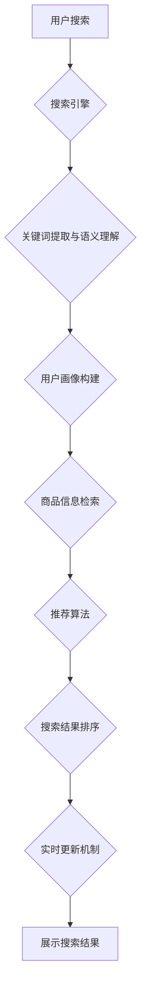

                 

## AI驱动的电商搜索结果实时更新机制

> 关键词：电商搜索、实时更新、人工智能、机器学习、推荐系统、自然语言处理、用户行为分析

## 1. 背景介绍

在当今数字经济时代，电商平台已成为人们获取商品和服务的首选渠道。搜索引擎作为电商平台的核心功能之一，直接影响着用户体验和商业转化率。传统的电商搜索机制主要依赖于关键词匹配和商品属性检索，难以满足用户日益增长的个性化需求和搜索行为的多样性。

随着人工智能技术的快速发展，AI驱动的电商搜索结果实时更新机制应运而生，旨在通过机器学习、自然语言处理等技术，更精准、更智能地理解用户搜索意图，并根据实时数据动态调整搜索结果，提供更个性化、更相关的购物体验。

## 2. 核心概念与联系

### 2.1  核心概念

* **实时更新:**  指搜索结果根据用户行为、商品信息、市场趋势等实时数据动态调整，确保搜索结果始终是最新的和最相关的。
* **人工智能 (AI):**  模拟人类智能的计算机系统，通过学习和推理，实现智能决策和行为。
* **机器学习 (ML):**  人工智能的一个分支，通过算法训练，使计算机能够从数据中学习，并根据学习到的知识进行预测和决策。
* **自然语言处理 (NLP):**  使计算机能够理解、处理和生成人类语言的技术。
* **推荐系统:**  根据用户历史行为、偏好等信息，推荐用户可能感兴趣的商品或内容。

### 2.2  架构



## 3. 核心算法原理 & 具体操作步骤

### 3.1  算法原理概述

AI驱动的电商搜索结果实时更新机制主要基于以下核心算法：

* **关键词提取与语义理解:** 利用自然语言处理技术，从用户搜索词中提取关键词，并理解其语义，例如识别用户搜索的商品类别、品牌、属性等信息。
* **用户画像构建:**  根据用户的搜索历史、浏览记录、购买行为等数据，构建用户的兴趣偏好、购买习惯等画像，为个性化推荐提供依据。
* **商品信息检索:**  根据用户搜索关键词和语义，从商品数据库中检索出相关商品信息，并进行排序和筛选。
* **推荐算法:**  利用机器学习算法，根据用户画像、商品信息、实时数据等因素，推荐用户可能感兴趣的商品。
* **搜索结果排序:**  根据推荐算法的结果，对搜索结果进行排序，并将最相关的商品展示在用户面前。

### 3.2  算法步骤详解

1. **用户搜索:** 用户输入搜索关键词。
2. **关键词提取与语义理解:**  搜索引擎使用自然语言处理技术，提取用户搜索词中的关键词，并理解其语义。
3. **用户画像构建:**  搜索引擎根据用户的搜索历史、浏览记录、购买行为等数据，构建用户的兴趣偏好、购买习惯等画像。
4. **商品信息检索:**  搜索引擎根据用户搜索关键词和语义，从商品数据库中检索出相关商品信息。
5. **推荐算法:**  搜索引擎使用机器学习算法，根据用户画像、商品信息、实时数据等因素，推荐用户可能感兴趣的商品。
6. **搜索结果排序:**  搜索引擎根据推荐算法的结果，对搜索结果进行排序，并将最相关的商品展示在用户面前。
7. **实时更新:**  搜索引擎持续监控用户行为、商品信息、市场趋势等实时数据，并根据这些数据动态调整搜索结果，确保搜索结果始终是最新的和最相关的。

### 3.3  算法优缺点

**优点:**

* **更精准的搜索结果:**  通过语义理解和用户画像构建，可以更精准地理解用户搜索意图，并推荐更相关的商品。
* **更个性化的购物体验:**  根据用户的兴趣偏好和购买习惯，提供个性化的商品推荐，提升用户购物体验。
* **更实时的数据更新:**  通过实时更新机制，确保搜索结果始终是最新的和最相关的。

**缺点:**

* **算法复杂度高:**  AI驱动的搜索算法通常比较复杂，需要大量的计算资源和数据支持。
* **数据安全和隐私问题:**  收集和使用用户数据需要谨慎处理，确保数据安全和用户隐私。
* **算法偏差问题:**  机器学习算法可能会存在偏差，导致搜索结果不公平或不准确。

### 3.4  算法应用领域

AI驱动的电商搜索结果实时更新机制广泛应用于以下领域:

* **电商平台:**  提高商品搜索精准度和用户购物体验。
* **搜索引擎:**  提供更个性化和相关的搜索结果。
* **内容推荐系统:**  推荐用户可能感兴趣的新闻、视频、文章等内容。
* **广告投放:**  根据用户兴趣和行为，精准投放广告。

## 4. 数学模型和公式 & 详细讲解 & 举例说明

### 4.1  数学模型构建

**用户兴趣模型:**

$$
P(u,i) = \alpha \cdot \text{sim}(u,i) + \beta \cdot \text{hist}(u,i) + \gamma \cdot \text{trend}(i)
$$

其中:

* $P(u,i)$ 表示用户 $u$ 对商品 $i$ 的兴趣概率。
* $\text{sim}(u,i)$ 表示用户 $u$ 和商品 $i$ 之间的相似度。
* $\text{hist}(u,i)$ 表示用户 $u$ 对商品 $i$ 的历史交互记录。
* $\text{trend}(i)$ 表示商品 $i$ 的市场趋势。
* $\alpha$, $\beta$, $\gamma$ 为权重系数，通过训练模型确定。

**商品推荐模型:**

$$
R(u) = \text{sort}( \sum_{i \in I} P(u,i) )
$$

其中:

* $R(u)$ 表示推荐给用户 $u$ 的商品列表。
* $I$ 为所有商品的集合。
* $\text{sort}$ 为排序函数，根据商品兴趣概率排序。

### 4.2  公式推导过程

用户兴趣模型的推导过程基于以下假设:

* 用户对商品的兴趣概率受用户和商品的相似度、用户历史交互记录和商品市场趋势的影响。
* 这些因素之间存在线性关系。

通过训练模型，可以确定权重系数 $\alpha$, $\beta$, $\gamma$ 的值，使得模型能够准确预测用户对商品的兴趣概率。

商品推荐模型的推导过程基于以下假设:

* 用户对商品的兴趣概率越高，商品越有可能被推荐给用户。
* 商品推荐列表需要按照兴趣概率进行排序。

### 4.3  案例分析与讲解

假设用户 $u$ 对电子产品感兴趣，历史购买记录中有智能手机和笔记本电脑。市场趋势显示智能手表正在流行。

根据用户兴趣模型，我们可以计算用户 $u$ 对不同商品的兴趣概率:

* 智能手机:  $\text{sim}(u, \text{智能手机}) + \text{hist}(u, \text{智能手机}) > 0$
* 笔记本电脑:  $\text{sim}(u, \text{笔记本电脑}) + \text{hist}(u, \text{笔记本电脑}) > 0$
* 智能手表:  $\text{sim}(u, \text{智能手表}) + \text{trend}(\text{智能手表}) > 0$

根据商品推荐模型，我们可以将用户 $u$ 推荐的商品列表排序为:

* 智能手机
* 笔记本电脑
* 智能手表

## 5. 项目实践：代码实例和详细解释说明

### 5.1  开发环境搭建

* 操作系统: Ubuntu 20.04
* Python 版本: 3.8
* 虚拟环境: venv
* 依赖库: numpy, pandas, scikit-learn, tensorflow

### 5.2  源代码详细实现

```python
# 用户兴趣模型
class UserInterestModel:
    def __init__(self, alpha, beta, gamma):
        self.alpha = alpha
        self.beta = beta
        self.gamma = gamma

    def predict(self, user, item):
        # 计算用户和商品的相似度、用户历史交互记录和商品市场趋势
        # ...
        return self.alpha * sim(user, item) + self.beta * hist(user, item) + self.gamma * trend(item)

# 商品推荐模型
class ItemRecommendationModel:
    def __init__(self, user_interest_model):
        self.user_interest_model = user_interest_model

    def recommend(self, user):
        # 获取所有商品
        items = get_all_items()
        # 计算用户对每个商品的兴趣概率
        item_interests = [self.user_interest_model.predict(user, item) for item in items]
        # 根据兴趣概率排序商品
        sorted_items = sorted(zip(items, item_interests), key=lambda x: x[1], reverse=True)
        # 返回推荐商品列表
        return [item for item, interest in sorted_items]

# ... 其他代码
```

### 5.3  代码解读与分析

* **UserInterestModel:**  该类定义了用户兴趣模型，并提供了一个 `predict` 方法来计算用户对商品的兴趣概率。
* **ItemRecommendationModel:**  该类定义了商品推荐模型，并提供了一个 `recommend` 方法来推荐给用户的商品列表。

### 5.4  运行结果展示

运行上述代码，可以得到一个推荐给用户的商品列表，列表中的商品按照兴趣概率排序。

## 6. 实际应用场景

AI驱动的电商搜索结果实时更新机制已在许多电商平台得到应用，例如:

* **阿里巴巴:**  淘宝、天猫等平台使用 AI 技术，根据用户的搜索历史、浏览记录、购买行为等数据，提供个性化的商品推荐和搜索结果。
* **京东:**  京东商城使用 AI 技术，实时更新商品价格、库存等信息，并根据用户的兴趣偏好，推荐相关商品。
* **亚马逊:**  亚马逊使用 AI 技术，分析用户的搜索行为和购买习惯，并提供个性化的商品推荐和搜索结果。

### 6.4  未来应用展望

未来，AI驱动的电商搜索结果实时更新机制将更加智能化和个性化，例如:

* **多模态搜索:**  支持用户使用语音、图像、视频等多种方式进行搜索。
* **场景化推荐:**  根据用户的场景和需求，提供更精准的商品推荐。
* **协同推荐:**  结合用户的社交关系和群体行为，提供更个性化的商品推荐。

## 7. 工具和资源推荐

### 7.1  学习资源推荐

* **书籍:**
    * 《深度学习》
    * 《机器学习实战》
    * 《自然语言处理入门》
* **在线课程:**
    * Coursera:  深度学习、机器学习
    * edX:  自然语言处理、数据科学
* **博客和网站:**
    * Towards Data Science
    * Machine Learning Mastery
    * Analytics Vidhya

### 7.2  开发工具推荐

* **Python:**  用于机器学习和数据分析的编程语言。
* **TensorFlow:**  用于深度学习的开源框架。
* **PyTorch:**  用于深度学习的开源框架。
* **Scikit-learn:**  用于机器学习的开源库。

### 7.3  相关论文推荐

* **BERT: Pre-training of Deep Bidirectional Transformers for Language Understanding**
* **Attention Is All You Need**
* **Recurrent Neural Networks for Sequence Learning**

## 8. 总结：未来发展趋势与挑战

### 8.1  研究成果总结

AI驱动的电商搜索结果实时更新机制取得了显著的成果，例如:

* **搜索结果精准度提升:**  通过语义理解和用户画像构建，可以更精准地理解用户搜索意图，并推荐更相关的商品。
* **用户购物体验提升:**  根据用户的兴趣偏好和购买习惯，提供个性化的商品推荐，提升用户购物体验。
* **商业转化率提升:**  通过精准的商品推荐，可以提高用户的购买意愿，提升电商平台的商业转化率。

### 8.2  未来发展趋势

未来，AI驱动的电商搜索结果实时更新机制将朝着以下方向发展:

* **更智能的搜索算法:**  利用更先进的机器学习算法，例如强化学习、迁移学习等，提高搜索结果的精准度和个性化程度。
* **更丰富的搜索方式:**  支持用户使用语音、图像、视频等多种方式进行搜索，提供更便捷的购物体验。
* **更场景化的推荐:**  根据用户的场景和需求，提供更精准的商品推荐，例如根据用户的地理位置、时间、天气等信息，推荐相关的商品。

### 8.3  面临的挑战

AI驱动的电商搜索结果实时更新机制也面临着一些挑战:

* **数据安全和隐私问题:**  收集和使用用户数据需要谨慎处理，确保数据安全和用户隐私。
* **算法偏差问题:**  机器学习算法可能会存在偏差，导致搜索结果不公平或不准确。
* **计算资源和成本:**  训练和部署复杂的 AI 模型需要大量的计算资源和成本。

### 8.4  研究展望

未来，我们需要继续研究和探索以下问题:

* 如何设计更公平、更准确的 AI 算法?
* 如何更好地保护用户数据安全和隐私?
* 如何降低 AI 模型的训练和部署成本?


## 9. 附录：常见问题与解答

**Q1:  AI驱动的电商搜索结果实时更新机制会取代传统的搜索引擎吗?**

**A1:**  AI驱动的电商搜索结果实时更新机制可以提升搜索结果的精准度和个性化程度，但它并不会完全取代传统的搜索引擎。传统的搜索引擎仍然在某些场景下发挥着重要作用，例如需要快速获取大量信息时。

**Q2:  AI驱动的电商搜索结果实时更新机制会降低用户搜索的自由度吗?**

**A2:**  AI驱动的电商搜索结果实时更新机制会根据用户的兴趣偏好和行为推荐相关的商品，但用户仍然可以自由选择搜索关键词和浏览商品。

**Q3:  AI驱动的电商搜索结果实时更新机制会带来哪些伦理问题?**

**A3:**  AI驱动的电商搜索结果实时更新机制可能会带来一些伦理问题，例如算法偏差、数据隐私等问题。我们需要谨慎处理这些问题，确保 AI 技术的健康发展。


作者：禅与计算机程序设计艺术 / Zen and the Art of Computer Programming<end_of_turn>

