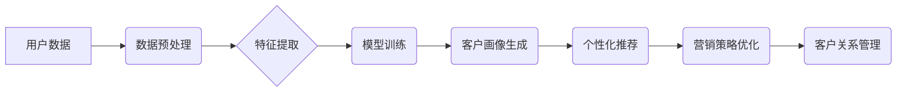

                 

## AI驱动的电商智能客户洞察系统

> 关键词：电商智能洞察、人工智能、机器学习、客户画像、推荐系统、数据分析、个性化营销

## 1. 背景介绍

在当今数据爆炸的时代，电商平台拥有海量用户数据，这些数据蕴藏着丰富的客户洞察信息。传统的客户洞察方法往往依赖于人工分析，效率低下且难以捕捉到细微的客户行为模式。而人工智能技术的兴起为电商智能客户洞察提供了全新的解决方案。

AI驱动的电商智能客户洞察系统能够通过机器学习算法对用户数据进行深度挖掘，构建精准的客户画像，并预测用户的购买行为、偏好和需求。这使得电商平台能够实现以下目标：

* **精准客户画像:**  构建多维度的客户画像，包括用户 demographics、兴趣爱好、购买历史、浏览行为等，为用户细分提供数据支持。
* **个性化推荐:**  根据用户的画像和行为，推荐个性化的商品和服务，提升用户体验和转化率。
* **精准营销:**  针对不同客户群体的特点，制定精准的营销策略，提高营销效率和ROI。
* **客户关系管理:**  通过对客户行为的分析，及时识别潜在的客户流失风险，并采取措施进行挽留。

## 2. 核心概念与联系

**2.1 核心概念**

* **客户洞察:**  通过分析用户数据，深入了解用户的需求、行为、偏好等，以获取对用户有价值的见解。
* **人工智能 (AI):**  模拟人类智能的计算机系统，能够学习、推理和决策。
* **机器学习 (ML):**  人工智能的一个子领域，通过算法训练模型，使模型能够从数据中学习并进行预测。
* **深度学习 (DL):**  机器学习的一种高级形式，使用多层神经网络模拟人类大脑的学习过程。
* **客户画像:**  基于用户数据构建的描述用户特征和行为模式的模型。

**2.2 架构图**



**2.3 核心联系**

电商智能客户洞察系统通过将人工智能技术与电商平台数据相结合，实现以下核心联系：

* **数据驱动:**  系统依赖于海量用户数据作为训练素材，通过机器学习算法进行分析和挖掘。
* **智能化:**  系统利用人工智能技术自动学习用户行为模式，并进行预测和决策。
* **个性化:**  系统根据用户画像生成个性化的推荐和营销策略，提升用户体验。
* **循环优化:**  系统通过收集用户反馈和行为数据，不断优化模型和策略，实现持续改进。

## 3. 核心算法原理 & 具体操作步骤

**3.1 算法原理概述**

电商智能客户洞察系统通常采用以下核心算法：

* **聚类算法:**  将用户数据按照相似性进行分组，构建不同客户群体的画像。
* **推荐算法:**  根据用户的历史行为和偏好，预测用户可能感兴趣的商品或服务。
* **预测算法:**  预测用户的未来行为，例如购买意愿、流失风险等。

**3.2 算法步骤详解**

以聚类算法为例，其具体操作步骤如下：

1. **数据收集:**  从电商平台收集用户数据，包括 demographics、购买历史、浏览行为、评价等。
2. **数据预处理:**  对收集到的数据进行清洗、转换和特征工程，例如删除缺失值、编码类别变量、提取特征向量等。
3. **模型选择:**  根据数据特点和业务需求选择合适的聚类算法，例如K-means、DBSCAN等。
4. **模型训练:**  使用预处理后的数据训练聚类模型，并确定最佳的聚类数量。
5. **客户画像生成:**  将用户数据按照聚类结果进行分组，并为每个客户群体生成相应的画像，描述其特征和行为模式。

**3.3 算法优缺点**

* **聚类算法:**
    * **优点:**  能够发现数据中的隐含结构，构建不同客户群体的画像。
    * **缺点:**  需要预先确定聚类数量，对初始值敏感，难以处理高维数据。

**3.4 算法应用领域**

* **客户细分:**  根据用户画像，将用户划分为不同的细分市场，制定针对性的营销策略。
* **个性化推荐:**  根据用户的兴趣和偏好，推荐个性化的商品和服务。
* **精准营销:**  针对不同客户群体的特点，制定精准的营销活动，提高营销效率。
* **客户关系管理:**  识别潜在的客户流失风险，并采取措施进行挽留。

## 4. 数学模型和公式 & 详细讲解 & 举例说明

**4.1 数学模型构建**

聚类算法的目标是将数据点划分为若干个簇，使得同一簇中的数据点彼此相似，而不同簇中的数据点彼此差异较大。常用的数学模型包括距离度量和相似度度量。

**4.2 公式推导过程**

* **距离度量:**  常用的距离度量包括欧氏距离、曼哈顿距离、余弦相似度等。

    * **欧氏距离:**  $d(x,y) = \sqrt{\sum_{i=1}^{n}(x_i - y_i)^2}$

    * **曼哈顿距离:**  $d(x,y) = \sum_{i=1}^{n}|x_i - y_i|$

* **相似度度量:**  相似度度量通常是距离度量的反向，表示两个数据点之间的相似程度。

    * **余弦相似度:**  $sim(x,y) = \frac{x \cdot y}{||x|| ||y||}$

**4.3 案例分析与讲解**

假设我们有一组用户数据，包括用户的年龄、收入和购买频率。我们可以使用欧氏距离来计算用户之间的距离，并根据距离进行聚类。

例如，用户A的年龄为25岁，收入为50000元，购买频率为10次/月；用户B的年龄为30岁，收入为60000元，购买频率为8次/月。

使用欧氏距离计算用户A和用户B之间的距离:

$d(A,B) = \sqrt{(25-30)^2 + (50000-60000)^2 + (10-8)^2} = \sqrt{25 + 1000000 + 4} = \sqrt{1000029}$

根据距离的大小，我们可以将用户分组，例如将距离较小的用户归为同一簇。

## 5. 项目实践：代码实例和详细解释说明

**5.1 开发环境搭建**

* **操作系统:**  Linux/macOS/Windows
* **编程语言:**  Python
* **库依赖:**  pandas、scikit-learn、matplotlib等

**5.2 源代码详细实现**

```python
import pandas as pd
from sklearn.cluster import KMeans

# 数据加载
data = pd.read_csv('user_data.csv')

# 数据预处理
# ...

# 模型训练
kmeans = KMeans(n_clusters=5)  # 设置聚类数量为5
kmeans.fit(data)

# 客户画像生成
labels = kmeans.labels_
data['cluster'] = labels
cluster_data = data.groupby('cluster').mean()

# 打印客户画像
print(cluster_data)

# ...
```

**5.3 代码解读与分析**

* **数据加载:**  使用pandas库加载用户数据。
* **数据预处理:**  对数据进行清洗、转换和特征工程。
* **模型训练:**  使用KMeans算法训练聚类模型，并设置聚类数量。
* **客户画像生成:**  根据聚类结果，将用户数据分组，并计算每个群体的平均特征值。
* **打印客户画像:**  输出每个客户群体的平均特征值，形成客户画像。

**5.4 运行结果展示**

运行代码后，将输出每个客户群体的平均特征值，例如年龄、收入、购买频率等。这些特征值可以用来描述每个客户群体的特点，例如“高收入、高购买频率的客户群”，“低收入、低购买频率的客户群”等。

## 6. 实际应用场景

**6.1 客户细分**

电商平台可以根据用户的画像，将用户划分为不同的细分市场，例如年龄、性别、收入、兴趣爱好等。针对不同的细分市场，可以制定不同的营销策略，例如针对年轻用户推广时尚产品，针对高收入用户推广高端产品等。

**6.2 个性化推荐**

电商平台可以根据用户的购买历史、浏览行为和兴趣爱好，推荐个性化的商品和服务。例如，如果用户经常购买运动鞋，那么平台可以推荐用户购买运动服、运动耳机等相关产品。

**6.3 精准营销**

电商平台可以根据用户的画像，精准地推送营销信息，例如针对喜欢旅行的用户推送旅游产品优惠信息，针对喜欢美食的用户推送美食优惠券等。

**6.4 客户关系管理**

电商平台可以根据用户的购买行为和活跃度，识别潜在的客户流失风险，并采取措施进行挽留。例如，如果用户长时间没有购买，平台可以发送优惠券或促销信息，提醒用户购买。

**6.5 未来应用展望**

随着人工智能技术的不断发展，电商智能客户洞察系统将更加智能化、个性化和精准化。未来，该系统可能能够：

* **更深入地理解用户的需求:**  通过分析用户的语言、行为和情感等多方面数据，更深入地理解用户的需求和意图。
* **提供更个性化的服务:**  根据用户的个性化需求，提供更精准的商品推荐、服务建议和营销方案。
* **实现实时互动:**  通过聊天机器人、语音助手等技术，实现与用户的实时互动，提供更便捷的客户服务。

## 7. 工具和资源推荐

**7.1 学习资源推荐**

* **书籍:**  《Python机器学习实战》、《深度学习》
* **在线课程:**  Coursera、edX、Udacity等平台的机器学习和深度学习课程
* **博客和论坛:**  机器学习和深度学习相关的博客和论坛，例如Towards Data Science、Kaggle等

**7.2 开发工具推荐**

* **编程语言:**  Python
* **机器学习库:**  scikit-learn、TensorFlow、PyTorch等
* **数据分析工具:**  pandas、NumPy、matplotlib等

**7.3 相关论文推荐**

* **K-Means聚类算法:**  MacQueen, J. (1967). Some methods for classification and analysis of multivariate observations.
* **推荐系统:**  Resnick, P., Iacovou, N., Suchak, M., Bergstrom, P., & Riedl, J. (1994). GroupLens: An open architecture for collaborative filtering of netnews.
* **深度学习:**  LeCun, Y., Bengio, Y., & Hinton, G. (2015). Deep learning. Nature, 521(7553), 436-444.

## 8. 总结：未来发展趋势与挑战

**8.1 研究成果总结**

电商智能客户洞察系统已经取得了显著的成果，能够帮助电商平台更好地了解用户，提供更个性化的服务，提升营销效率。

**8.2 未来发展趋势**

* **更深层次的客户洞察:**  通过分析用户的语言、行为和情感等多方面数据，更深入地理解用户的需求和意图。
* **更精准的个性化推荐:**  基于用户的实时行为和上下文信息，提供更精准的商品推荐和服务建议。
* **更智能的营销策略:**  通过机器学习算法，自动优化营销策略，提高营销效率和ROI。

**8.3 面临的挑战**

* **数据隐私保护:**  电商平台需要妥善处理用户数据，确保用户隐私安全。
* **算法公平性:**  机器学习算法可能会存在偏见，导致不公平的结果。
* **解释性问题:**  一些深度学习算法的决策过程难以解释，这可能会导致用户对系统的信任度降低。

**8.4 研究展望**

未来，电商智能客户洞察系统将继续朝着更智能化、个性化和精准化的方向发展。研究者需要关注以下几个方面：

* **开发更公平、更透明的机器学习算法。**
* **探索更有效的客户数据隐私保护技术。**
* **研究如何更好地解释机器学习算法的决策过程。**


## 9. 附录：常见问题与解答

**9.1 如何选择合适的聚类算法？**

选择合适的聚类算法需要根据数据的特点和业务需求进行考虑。例如，对于高维数据，可以使用DBSCAN算法；对于数据分布较为均匀的情况，可以使用K-means算法。

**9.2 如何确定最佳的聚类数量？**

可以使用肘部法、Silhouette分析等方法来确定最佳的聚类数量。

**9.3 如何评估聚类结果的质量？**

可以使用聚类指标，例如Silhouette系数、Dunn指数等来评估聚类结果的质量。

**9.4 如何将聚类结果应用到实际业务中？**

聚类结果可以用于客户细分、个性化推荐、精准营销等多个业务场景。

**9.5 如何保证客户数据的隐私安全？**

电商平台需要采取以下措施来保证客户数据的隐私安全：

* **数据加密:**  对用户数据进行加密，防止未经授权的访问。
* **数据匿名化:**  对用户数据进行匿名化处理，去除个人识别信息。
* **数据访问控制:**  对用户数据进行严格的访问控制，只允许授权人员访问。


作者：禅与计算机程序设计艺术 / Zen and the Art of Computer Programming 
<end_of_turn>

