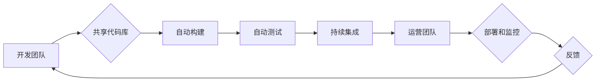

                 

## DevOps 文化：理解开发和运营的结合

> 关键词：DevOps, 持续集成, 持续交付, 敏捷开发, 协作文化, 自动化, 监控

### 1. 背景介绍

在当今快速迭代的软件开发环境中，传统的开发和运营模式已经难以满足业务需求。开发团队专注于快速构建新功能，而运营团队则负责部署和维护系统稳定性。这种分隔的模式导致了沟通障碍、流程冗长、交付周期长等问题，最终影响了软件产品的质量和时间到市场。

DevOps 文化应运而生，旨在打破开发和运营之间的壁垒，实现开发和运营团队的紧密协作。它强调自动化、持续集成、持续交付、监控和反馈等理念，旨在提高软件开发和交付效率，并最终提升产品质量和用户体验。

### 2. 核心概念与联系

DevOps 文化的核心概念包括：

* **持续集成 (Continuous Integration):** 开发人员频繁地将代码提交到共享代码库，并自动进行构建和测试，确保代码质量和稳定性。
* **持续交付 (Continuous Delivery):** 将构建好的软件自动部署到测试环境和生产环境，实现快速交付和迭代。
* **自动化:** 通过自动化工具和脚本，简化和加速软件开发和交付流程，减少人为错误和重复工作。
* **监控和反馈:** 实时监控软件运行状态，收集用户反馈，并及时进行调整和优化。
* **协作文化:** 鼓励开发和运营团队之间的沟通和协作，共同承担软件开发和交付的责任。

DevOps 文化的实现需要开发和运营团队的紧密协作，以及一系列工具和流程的支撑。



### 3. 核心算法原理 & 具体操作步骤

DevOps 文化的核心算法原理是基于敏捷开发理念，强调迭代开发、快速反馈和持续改进。

#### 3.1 算法原理概述

DevOps 算法的核心在于将软件开发和交付流程拆解成多个小的迭代周期，每个周期都包含开发、测试、部署和反馈等环节。通过持续集成和持续交付，开发团队可以快速地将新功能交付给用户，并根据用户反馈进行迭代改进。

#### 3.2 算法步骤详解

1. **需求收集和分析:** 开发团队与产品经理和用户进行沟通，收集软件需求和功能需求。
2. **设计和开发:** 开发团队根据需求进行软件设计和开发，并将代码提交到共享代码库。
3. **自动构建和测试:** 代码提交到共享代码库后，自动触发构建和测试流程。构建工具将代码编译成可执行文件，测试工具则对代码进行自动化测试，确保代码质量和稳定性。
4. **持续集成:** 通过持续集成平台，将构建好的软件代码合并到主分支，并进行代码审查和合并。
5. **持续交付:** 将构建好的软件代码自动部署到测试环境和生产环境，实现快速交付和迭代。
6. **监控和反馈:** 实时监控软件运行状态，收集用户反馈，并根据反馈进行调整和优化。

#### 3.3 算法优缺点

**优点:**

* **提高开发效率:** 自动化流程和持续集成可以加速软件开发和交付速度。
* **提升软件质量:** 自动化测试和持续集成可以确保代码质量和稳定性。
* **缩短交付周期:** 持续交付可以将新功能快速交付给用户。
* **增强团队协作:** DevOps 文化强调开发和运营团队的紧密协作，可以提高团队效率和沟通效率。

**缺点:**

* **需要投入时间和资源:** 建立 DevOps 文化需要投入时间和资源进行工具和流程的搭建和培训。
* **需要改变组织文化:** DevOps 文化需要打破传统的开发和运营模式，需要组织文化和人员观念的转变。
* **需要技术支持:** DevOps 需要使用一系列自动化工具和技术，需要具备相应的技术能力。

#### 3.4 算法应用领域

DevOps 文化适用于各种软件开发项目，包括：

* Web 应用开发
* 移动应用开发
* 云计算平台开发
* 数据分析平台开发
* 互联网金融平台开发

### 4. 数学模型和公式 & 详细讲解 & 举例说明

DevOps 文化可以利用数学模型和公式来量化和优化软件开发和交付流程。例如，可以使用以下公式来计算软件交付周期：

$$
T_{delivery} = T_{development} + T_{testing} + T_{deployment}
$$

其中：

* $T_{delivery}$: 软件交付周期
* $T_{development}$: 开发周期
* $T_{testing}$: 测试周期
* $T_{deployment}$: 部署周期

通过分析和优化每个环节的时间，可以缩短软件交付周期。

#### 4.1 数学模型构建

DevOps 文化的数学模型可以基于以下几个方面构建：

* **软件开发流程:** 可以使用流程图和状态机模型来描述软件开发流程，并利用数学公式来量化每个环节的时间和资源消耗。
* **代码质量:** 可以使用代码覆盖率、缺陷密度等指标来量化代码质量，并利用统计模型来预测代码缺陷的发生概率。
* **软件交付效率:** 可以使用交付周期、部署频率等指标来量化软件交付效率，并利用回归分析来研究影响软件交付效率的因素。

#### 4.2 公式推导过程

DevOps 文化的数学模型可以利用各种数学工具和方法进行推导，例如：

* **概率论和统计学:** 用于分析代码缺陷的发生概率、软件交付周期等随机事件。
* **线性规划和整数规划:** 用于优化软件开发和交付资源分配。
* **机器学习:** 用于预测软件缺陷、优化软件交付流程等。

#### 4.3 案例分析与讲解

例如，可以使用机器学习模型来预测软件缺陷的发生概率，并根据预测结果进行代码审查和测试，从而提高软件质量。

### 5. 项目实践：代码实例和详细解释说明

#### 5.1 开发环境搭建

DevOps 文化的实践需要搭建相应的开发环境，包括：

* **版本控制系统:** Git 是常用的版本控制系统，用于管理代码版本和历史记录。
* **持续集成平台:** Jenkins、Travis CI 等平台可以自动构建、测试和部署代码。
* **容器化平台:** Docker、Kubernetes 等平台可以打包和部署应用程序，并实现容器化部署。
* **监控和日志系统:** Prometheus、Grafana 等工具可以监控软件运行状态和收集日志信息。

#### 5.2 源代码详细实现

以下是一个简单的代码示例，演示了如何使用 Git 和 Jenkins 进行持续集成：

**代码文件:**

```python
def hello_world():
    print("Hello, world!")

hello_world()
```

**Jenkins 配置:**

1. 创建一个新的 Jenkins 项目。
2. 设置源代码管理为 Git，并指定代码仓库地址。
3. 设置构建步骤，包括编译代码和运行测试。
4. 设置部署步骤，将构建好的软件部署到测试环境。

#### 5.3 代码解读与分析

代码示例是一个简单的 Python 程序，定义了一个函数 `hello_world()`，该函数打印 "Hello, world!" 到控制台。

Jenkins 配置示例演示了如何使用 Jenkins 进行持续集成，包括自动构建、测试和部署代码。

#### 5.4 运行结果展示

当代码提交到 Git 仓库后，Jenkins 会自动触发构建和测试流程。如果构建和测试成功，Jenkins 会将构建好的软件部署到测试环境。

### 6. 实际应用场景

DevOps 文化在各个行业都有广泛的应用场景，例如：

* **互联网公司:** 互联网公司需要快速迭代和交付新功能，DevOps 文化可以帮助他们提高开发效率和软件质量。
* **金融机构:** 金融机构需要确保软件系统的稳定性和安全性，DevOps 文化可以帮助他们实现自动化部署和监控，降低风险。
* **制造业:** 制造业需要将软件与生产线进行集成，DevOps 文化可以帮助他们实现工业互联网的应用。

#### 6.4 未来应用展望

DevOps 文化的未来发展趋势包括：

* **更深入的自动化:** 利用人工智能和机器学习技术，实现更深入的自动化，例如自动代码生成、自动测试用例设计等。
* **更强大的云原生支持:** DevOps 文化将更加紧密地与云原生技术结合，实现更灵活、更弹性的软件开发和交付。
* **更注重安全和合规性:** DevOps 文化将更加注重软件安全和合规性，例如使用安全扫描工具、进行安全测试等。

### 7. 工具和资源推荐

#### 7.1 学习资源推荐

* **书籍:**
    * The Phoenix Project: A Novel About IT, DevOps, and Helping Your Business Win
    * DevOps Handbook: How to Create World-Class Agility, Reliability, and Security in Technology Organizations
* **网站:**
    * DevOps.com
    * The DevOps Institute
    * Atlassian DevOps

#### 7.2 开发工具推荐

* **版本控制系统:** Git
* **持续集成平台:** Jenkins, Travis CI, CircleCI
* **容器化平台:** Docker, Kubernetes
* **监控和日志系统:** Prometheus, Grafana, ELK Stack

#### 7.3 相关论文推荐

* The DevOps Handbook: How to Create World-Class Agility, Reliability, and Security in Technology Organizations
* Accelerate: The Science of Lean Software and DevOps: Building and Scaling High Performing Technology Organizations

### 8. 总结：未来发展趋势与挑战

#### 8.1 研究成果总结

DevOps 文化已经取得了显著的成果，帮助企业提高软件开发效率、提升软件质量、缩短交付周期。

#### 8.2 未来发展趋势

DevOps 文化的未来发展趋势包括更深入的自动化、更强大的云原生支持、更注重安全和合规性。

#### 8.3 面临的挑战

DevOps 文化的实施面临着一些挑战，例如组织文化转变、技术人才短缺、安全和合规性等问题。

#### 8.4 研究展望

未来研究方向包括：

* 如何更好地将人工智能和机器学习技术应用于 DevOps 文化。
* 如何更好地解决 DevOps 文化实施中的安全和合规性问题。
* 如何将 DevOps 文化应用于更多行业和领域。

### 9. 附录：常见问题与解答

**常见问题:**

* DevOps 文化的实施需要投入多少时间和资源？
* DevOps 文化的实施需要哪些技术技能？
* DevOps 文化的实施会带来哪些风险？

**解答:**

* DevOps 文化的实施时间和资源投入取决于企业的规模、项目复杂度等因素。一般来说，需要投入数周到数月的時間和一定的人力资源。
* DevOps 文化的实施需要具备软件开发、运维、自动化、云计算等方面的技术技能。
* DevOps 文化的实施可能会带来一些风险，例如安全风险、合规性风险、组织文化冲突等。需要做好风险评估和控制措施。


作者：禅与计算机程序设计艺术 / Zen and the Art of Computer Programming 
<end_of_turn>

