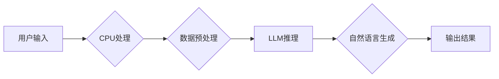

                 

## LLM与CPU：相似性与差异性分析

> 关键词：大型语言模型 (LLM)、中央处理器 (CPU)、人工智能 (AI)、深度学习、神经网络、计算模型、架构、性能比较

## 1. 背景介绍

近年来，人工智能（AI）领域取得了飞速发展，其中大型语言模型（LLM）作为一种强大的AI技术，在自然语言处理、文本生成、机器翻译等领域展现出令人瞩目的应用潜力。与此同时，中央处理器（CPU）作为计算机的核心部件，长期以来一直是计算任务的执行引擎。 

尽管LLM和CPU在功能和工作机制上存在显著差异，但它们都扮演着至关重要的角色，共同推动着人工智能和计算技术的进步。 为了更好地理解LLM和CPU之间的关系，本文将从核心概念、算法原理、数学模型、项目实践以及实际应用场景等多个方面进行深入分析，并探讨它们之间的相似性和差异性。

## 2. 核心概念与联系

### 2.1  LLM概述

大型语言模型（LLM）是一种基于深度学习的强大人工智能模型，其核心是训练一个庞大的神经网络，使其能够理解和生成人类语言。LLM通过学习海量文本数据，掌握语言的语法、语义和上下文关系，从而实现各种自然语言处理任务，例如：

* 文本生成：创作故事、诗歌、文章等。
* 机器翻译：将一种语言翻译成另一种语言。
* 问答系统：回答用户提出的问题。
* 对话机器人：与用户进行自然流畅的对话。

### 2.2  CPU概述

中央处理器（CPU）是计算机系统中执行计算任务的核心部件，负责执行程序指令，处理数据和控制其他硬件设备。CPU的工作原理基于冯·诺伊曼体系结构，其主要功能包括：

* **数据处理:** 对数据进行算术运算、逻辑运算和位操作。
* **指令执行:** 读取、解码和执行计算机程序的指令。
* **数据存储:** 从内存中读取数据，并将结果写入内存。
* **控制硬件:** 控制其他硬件设备，例如内存、硬盘和显示器。

### 2.3  LLM与CPU的联系

尽管LLM和CPU在功能和工作机制上存在显著差异，但它们在实现人工智能和计算任务方面相互关联。

* **LLM依赖于CPU的计算能力:** LLM的训练和推理过程都需要大量的计算资源，而CPU作为计算机的计算引擎，为LLM提供必要的计算能力。
* **CPU加速LLM的推理:** 为了提高LLM的推理速度，一些研究人员开发了专门的硬件加速器，例如GPU和TPU，这些加速器可以显著提升LLM的推理效率。
* **CPU与LLM协同工作:** 在实际应用场景中，CPU和LLM通常协同工作，例如，CPU负责处理用户输入和数据预处理，而LLM负责进行自然语言理解和生成。

**Mermaid 流程图：LLM与CPU的联系**



## 3. 核心算法原理 & 具体操作步骤

### 3.1  算法原理概述

LLM的核心算法是基于深度学习的Transformer模型，其主要特点是：

* **自注意力机制:** Transformer模型通过自注意力机制，能够捕捉文本序列中单词之间的长距离依赖关系，从而更好地理解上下文信息。
* **多头注意力:** Transformer模型使用多头注意力机制，可以从不同的角度关注文本序列，从而获得更丰富的语义表示。
* **编码器-解码器结构:** Transformer模型采用编码器-解码器结构，编码器负责将输入文本序列编码成语义表示，解码器则根据编码结果生成输出文本序列。

### 3.2  算法步骤详解

LLM的训练过程可以概括为以下步骤：

1. **数据预处理:** 将原始文本数据进行清洗、分词、标记等预处理操作，使其能够被模型理解。
2. **模型构建:** 根据Transformer模型的架构，构建一个包含多个编码器和解码器层的网络模型。
3. **参数初始化:** 为模型中的参数进行随机初始化。
4. **前向传播:** 将预处理后的文本数据输入到模型中，计算模型的输出结果。
5. **损失函数计算:** 计算模型输出结果与真实标签之间的差异，即损失函数值。
6. **反向传播:** 利用梯度下降算法，根据损失函数值调整模型参数，使其朝着最小化损失函数的方向更新。
7. **模型评估:** 在训练集之外的数据上评估模型的性能，例如准确率、困惑度等。
8. **模型保存:** 将训练好的模型保存下来，以便后续使用。

### 3.3  算法优缺点

**优点:**

* **强大的文本理解能力:** LLM能够理解复杂的语言结构和上下文关系，从而实现更准确的文本理解。
* **灵活的应用场景:** LLM可以应用于各种自然语言处理任务，例如文本生成、机器翻译、问答系统等。
* **持续的改进:** 随着训练数据的增加和模型架构的改进，LLM的性能不断提升。

**缺点:**

* **训练成本高:** LLM的训练需要大量的计算资源和时间，成本较高。
* **数据依赖性强:** LLM的性能取决于训练数据的质量和数量，如果训练数据不足或质量低，模型的性能会受到影响。
* **可解释性差:** LLM的决策过程较为复杂，难以解释其背后的逻辑，这可能会导致模型的应用受到限制。

### 3.4  算法应用领域

LLM在以下领域具有广泛的应用前景：

* **自然语言处理:** 文本分类、情感分析、文本摘要、机器翻译等。
* **对话系统:** 创建更自然、更智能的聊天机器人和虚拟助手。
* **内容创作:** 自动生成文章、故事、诗歌等创意内容。
* **教育:** 提供个性化学习辅导、自动批改作业等。
* **医疗保健:** 辅助医生诊断疾病、分析病历等。

## 4. 数学模型和公式 & 详细讲解 & 举例说明

### 4.1  数学模型构建

LLM的核心数学模型是基于Transformer架构，其主要包含以下几个关键模块：

* **嵌入层:** 将单词映射到低维向量空间，以便模型能够处理文本数据。
* **多头注意力层:** 捕捉文本序列中单词之间的关系，并学习每个单词在句子中的重要性。
* **前馈神经网络层:** 对每个单词的嵌入向量进行非线性变换，提取更深层的语义信息。
* **位置编码层:** 为每个单词添加位置信息，以便模型能够理解单词在句子中的顺序。
* **解码器:** 根据编码器的输出结果生成目标文本序列。

### 4.2  公式推导过程

Transformer模型的训练过程基于最大似然估计，其目标是最大化模型在训练数据上的似然概率。

**似然概率公式:**

$$P(y|x) = \prod_{i=1}^{T} P(y_i|y_{<i}, x)$$

其中：

* $x$ 是输入文本序列。
* $y$ 是目标文本序列。
* $y_i$ 是目标序列中的第 $i$ 个单词。
* $y_{<i}$ 是目标序列中第 $i$ 个单词之前的单词。

**损失函数:**

$$Loss = - \log P(y|x)$$

### 4.3  案例分析与讲解

例如，在机器翻译任务中，输入文本序列 $x$ 是源语言文本，目标文本序列 $y$ 是目标语言文本。Transformer模型通过学习源语言文本和目标语言文本之间的对应关系，从而实现文本翻译。

## 5. 项目实践：代码实例和详细解释说明

### 5.1  开发环境搭建

LLM的开发环境通常需要包含以下软件：

* Python编程语言
* 深度学习框架，例如TensorFlow或PyTorch
* GPU加速器

### 5.2  源代码详细实现

由于LLM的代码实现较为复杂，本文仅提供一个简单的LLM代码示例，用于演示其基本结构。

```python
import tensorflow as tf

# 定义一个简单的Transformer模型
class SimpleTransformer(tf.keras.Model):
    def __init__(self, vocab_size, embedding_dim, num_heads, num_layers):
        super(SimpleTransformer, self).__init__()
        self.embedding = tf.keras.layers.Embedding(vocab_size, embedding_dim)
        self.transformer_layers = tf.keras.layers.StackedRNNCells([
            tf.keras.layers.MultiHeadAttention(num_heads=num_heads, key_dim=embedding_dim)
            for _ in range(num_layers)
        ])

    def call(self, inputs):
        embedded = self.embedding(inputs)
        output = self.transformer_layers(embedded)
        return output

# 实例化模型
model = SimpleTransformer(vocab_size=10000, embedding_dim=128, num_heads=8, num_layers=6)

# 训练模型
# ...
```

### 5.3  代码解读与分析

该代码示例定义了一个简单的Transformer模型，其主要包含以下部分：

* **嵌入层:** 将单词映射到低维向量空间。
* **Transformer层:** 捕捉文本序列中单词之间的关系。
* **模型实例化:** 创建一个模型实例。

### 5.4  运行结果展示

训练完成后，模型可以用于预测目标文本序列。

## 6. 实际应用场景

### 6.1  文本生成

LLM可以用于生成各种类型的文本，例如：

* **故事:** 根据给定的主题或场景，自动生成故事。
* **诗歌:** 根据给定的韵律和主题，自动生成诗歌。
* **文章:** 根据给定的关键词和主题，自动生成新闻报道、博客文章等。

### 6.2  机器翻译

LLM可以用于将一种语言翻译成另一种语言，例如：

* **英语-中文翻译:** 将英文文本翻译成中文文本。
* **法语-西班牙语翻译:** 将法语文本翻译成西班牙语文本。

### 6.3  问答系统

LLM可以用于构建问答系统，例如：

* **知识问答系统:** 回答用户提出的关于特定领域的知识问题。
* **对话式问答系统:** 与用户进行自然流畅的对话，并回答用户的提问。

### 6.4  未来应用展望

LLM在未来将有更广泛的应用场景，例如：

* **个性化教育:** 提供个性化的学习辅导和教学内容。
* **医疗诊断辅助:** 辅助医生诊断疾病和制定治疗方案。
* **法律文本分析:** 分析法律文本，并提供法律建议。

## 7. 工具和资源推荐

### 7.1  学习资源推荐

* **书籍:**
    * 《深度学习》 by Ian Goodfellow, Yoshua Bengio, and Aaron Courville
    * 《自然语言处理》 by Dan Jurafsky and James H. Martin
* **在线课程:**
    * Coursera: Natural Language Processing Specialization
    * edX: Deep Learning Specialization

### 7.2  开发工具推荐

* **TensorFlow:** 开源深度学习框架，支持GPU加速。
* **PyTorch:** 开源深度学习框架，灵活易用。
* **Hugging Face Transformers:** 提供预训练的LLM模型和工具。

### 7.3  相关论文推荐

* **Attention Is All You Need:** https://arxiv.org/abs/1706.03762
* **BERT: Pre-training of Deep Bidirectional Transformers for Language Understanding:** https://arxiv.org/abs/1810.04805
* **GPT-3: Language Models are Few-Shot Learners:** https://arxiv.org/abs/2005.14165

## 8. 总结：未来发展趋势与挑战

### 8.1  研究成果总结

近年来，LLM在自然语言处理领域取得了显著的进展，其强大的文本理解和生成能力为人工智能的应用带来了新的可能性。

### 8.2  未来发展趋势

LLM的未来发展趋势包括：

* **模型规模的进一步扩大:** 随着计算资源的不断提升，LLM的规模将继续扩大，从而获得更强大的能力。
* **多模态学习:** LLM将与其他模态数据，例如图像和音频，进行融合，实现更全面的理解和生成。
* **可解释性增强:** 研究人员将致力于提高LLM的可解释性，使其决策过程更加透明和可理解。

### 8.3  面临的挑战

LLM也面临着一些挑战，例如：

* **训练成本高:** 训练大型LLM模型需要大量的计算资源和时间，成本较高。
* **数据偏见:** LLM的训练数据可能存在偏见，导致模型输出结果存在偏差。
* **安全风险:** LLM可能被用于生成虚假信息或进行恶意攻击，需要加强安全防护。

### 8.4  研究展望

未来，LLM的研究将继续深入，探索其更广泛的应用场景，并解决其面临的挑战，推动人工智能技术的进步。

## 9. 附录：常见问题与解答

### 9.1  LLM与传统机器学习模型有什么区别？

LLM是基于深度学习的模型，其核心是训练一个庞大的神经网络，而传统机器学习模型通常是基于规则或特征工程的。LLM能够学习更复杂的模式和关系，从而实现更强大的文本理解和生成能力。

### 9.2  如何训练一个LLM模型？

训练一个LLM模型需要大量的计算资源、时间和数据。一般步骤包括：

1. 数据预处理: 将原始文本数据进行清洗、分词、标记等预处理操作。
2. 模型构建: 根据Transformer架构构建一个LLM模型。
3. 参数初始化: 为模型中的参数进行随机初始化。
4. 前向传播: 将预处理后的文本数据输入到模型中，计算模型的输出结果。
5. 损失函数计算: 计算模型输出结果与真实标签之间的差异，即损失函数值。
6. 反向传播: 利用梯度下降算法，根据损失函数值调整模型参数，使其朝着最小化损失函数的方向更新。
7. 模型评估: 在训练集之外的数据上评估模型的性能，例如准确率、困惑度等。
8. 模型保存: 将训练好的模型保存下来，以便后续使用。


作者：禅与计算机程序设计艺术 / Zen and the Art of Computer Programming<end_of_turn>

