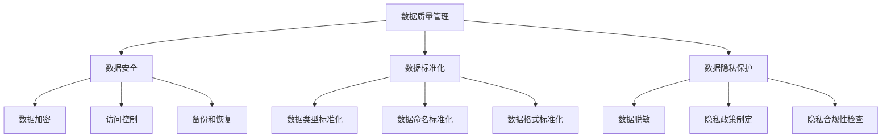

                 

# 文章标题

数据治理：原理与代码实例讲解

## 摘要

数据治理是企业管理和数据资产的重要环节，本文旨在深入探讨数据治理的基本原理、关键概念及其在现实场景中的实际应用。文章首先介绍了数据治理的定义和重要性，然后详细解析了数据治理的核心概念，包括数据质量管理、数据安全、数据标准化和数据隐私保护等。通过具体的代码实例，本文展示了如何在实际项目中实施数据治理，并提供了一些实用的工具和资源推荐，以便读者深入学习和实践。文章最后对数据治理的未来发展趋势和挑战进行了展望，并回答了常见的疑问。

## 1. 背景介绍

在当今数字化时代，数据已经成为企业最重要的资产之一。然而，随着数据量的爆炸性增长和数据来源的多样性，如何有效地管理和利用这些数据成为企业面临的一大挑战。数据治理作为一种系统化的方法，旨在确保数据的质量、安全性和合规性，从而提高数据的价值和可信度。数据治理不仅仅是一种技术解决方案，更是一种企业文化的体现，涉及到组织结构、流程、政策和技术的方方面面。

### 1.1 数据治理的定义

数据治理是指通过制定政策、流程和技术手段，确保数据在整个生命周期内得到正确管理、使用和保护的一系列实践活动。数据治理的目标是建立一种可持续的数据管理框架，确保数据的质量、一致性、完整性和可用性，从而支持企业的业务决策和战略规划。

### 1.2 数据治理的重要性

- **提高数据质量**：数据治理通过一系列技术和流程，如数据清洗、数据标准化和数据质量监控，确保数据的准确性和一致性，从而提高数据的价值。
- **确保数据安全**：数据治理包括数据加密、访问控制、备份和恢复等安全措施，以防止数据泄露、篡改和丢失。
- **合规性**：随着数据隐私法规（如GDPR、CCPA等）的日益严格，数据治理有助于企业遵守相关法律法规，降低合规风险。
- **支持业务决策**：高质量、可信的数据为企业的业务分析和决策提供了坚实的基础，有助于提高运营效率和竞争力。
- **提升数据利用率**：数据治理通过优化数据存储、访问和共享，提高了数据的可利用性和访问速度，从而支持数据驱动型决策。

### 1.3 数据治理的挑战

- **数据多样性和复杂性**：企业面临着来自不同来源、不同格式和不同结构的数据，如何有效地整合和管理这些数据是一项挑战。
- **组织文化差异**：数据治理需要跨部门协作，而不同部门之间的文化差异和利益冲突可能影响数据治理的实施。
- **技术选择和更新**：数据治理涉及多种技术，如数据库、数据仓库、数据集成工具等，技术的快速更新和选择也是一大挑战。
- **数据安全和隐私**：随着数据隐私问题的日益突出，如何在确保数据安全的同时保护用户隐私成为数据治理的重要课题。

## 2. 核心概念与联系

数据治理涉及多个核心概念和联系，包括数据质量管理、数据安全、数据标准化和数据隐私保护等。下面我们将详细讨论这些概念及其相互关系。

### 2.1 数据质量管理

数据质量管理是数据治理的基础，旨在确保数据的准确性、一致性、完整性和及时性。数据质量管理的核心内容包括数据清洗、数据标准化、数据质量监控和数据质量报告等。

- **数据清洗**：数据清洗是指识别和纠正数据中的错误、重复和缺失值，以提高数据的准确性和一致性。
- **数据标准化**：数据标准化是指将数据格式和结构统一为特定的标准，以便于数据存储、访问和共享。
- **数据质量监控**：数据质量监控是指持续监测数据质量，确保数据在生命周期内保持高质量。
- **数据质量报告**：数据质量报告是指定期生成数据质量报告，向管理层提供数据质量相关的信息。

### 2.2 数据安全

数据安全是数据治理的重要组成部分，旨在保护数据免受未经授权的访问、使用、披露、破坏和篡改。数据安全的核心内容包括数据加密、访问控制、备份和恢复等。

- **数据加密**：数据加密是指使用加密算法对数据进行加密，确保数据在存储和传输过程中不被窃取或篡改。
- **访问控制**：访问控制是指通过身份验证和授权机制，确保只有授权用户可以访问特定的数据。
- **备份和恢复**：备份和恢复是指定期备份数据，并在数据丢失或损坏时能够快速恢复数据。

### 2.3 数据标准化

数据标准化是指将数据格式和结构统一为特定的标准，以便于数据存储、访问和共享。数据标准化包括数据类型标准化、数据命名标准化和数据格式标准化等。

- **数据类型标准化**：数据类型标准化是指将不同类型的数据转换为统一的类型，如将字符串转换为数字或日期。
- **数据命名标准化**：数据命名标准化是指为数据字段命名一个统一的命名规范，如使用小写字母和下划线分隔符。
- **数据格式标准化**：数据格式标准化是指将数据格式转换为统一的格式，如将日期格式转换为YYYY-MM-DD。

### 2.4 数据隐私保护

数据隐私保护是指保护个人隐私数据，防止数据泄露、滥用或不当使用。数据隐私保护的核心内容包括数据脱敏、隐私政策制定和隐私合规性检查等。

- **数据脱敏**：数据脱敏是指对敏感数据进行处理，使其无法被识别或还原，如使用假名替换真实姓名。
- **隐私政策制定**：隐私政策制定是指制定隐私政策，明确企业如何收集、使用和保护个人隐私数据。
- **隐私合规性检查**：隐私合规性检查是指定期检查企业是否符合相关隐私法律法规的要求。

### 2.5 数据治理的 Mermaid 流程图

下面是一个简单的 Mermaid 流程图，展示了数据治理中的核心概念及其相互关系。



## 3. 核心算法原理 & 具体操作步骤

在数据治理过程中，算法原理起到了至关重要的作用。以下是几个核心算法的原理及其具体操作步骤。

### 3.1 数据清洗算法

数据清洗算法旨在识别和纠正数据中的错误、重复和缺失值，以提高数据的准确性和一致性。

- **原理**：数据清洗算法通常包括以下步骤：
  - **缺失值处理**：使用插值、均值填充或均值移动等方式处理缺失值。
  - **异常值检测**：使用统计方法（如箱线图、Z-分数等）或机器学习方法（如孤立森林、K-均值聚类等）检测异常值。
  - **重复值删除**：使用哈希表或索引树等数据结构，快速检测和删除重复值。

- **具体操作步骤**：
  1. 读取数据集。
  2. 检测缺失值，并根据需要进行处理。
  3. 检测异常值，并根据需要进行处理。
  4. 检测重复值，并删除重复值。
  5. 输出清洗后的数据集。

### 3.2 数据加密算法

数据加密算法旨在保护数据在存储和传输过程中的安全性。

- **原理**：数据加密算法通常包括以下步骤：
  - **加密算法选择**：选择合适的加密算法，如AES、RSA等。
  - **密钥生成**：生成加密密钥，确保密钥的安全性和唯一性。
  - **数据加密**：使用加密算法和密钥对数据进行加密。
  - **数据解密**：使用加密算法和密钥对加密后的数据进行解密。

- **具体操作步骤**：
  1. 选择加密算法和密钥生成算法。
  2. 生成加密密钥。
  3. 使用加密算法和密钥对数据进行加密。
  4. 保存加密后的数据。
  5. 在需要时，使用加密算法和密钥对加密后的数据进行解密。

### 3.3 数据标准化算法

数据标准化算法旨在将不同格式和结构的数据转换为统一的格式，以便于数据存储、访问和共享。

- **原理**：数据标准化算法通常包括以下步骤：
  - **数据类型转换**：将数据类型转换为统一的类型。
  - **数据命名转换**：为数据字段命名一个统一的命名规范。
  - **数据格式转换**：将数据格式转换为统一的格式。

- **具体操作步骤**：
  1. 读取原始数据。
  2. 将数据类型转换为统一的类型。
  3. 为数据字段命名一个统一的命名规范。
  4. 将数据格式转换为统一的格式。
  5. 输出标准化后的数据。

### 3.4 数据隐私保护算法

数据隐私保护算法旨在保护个人隐私数据，防止数据泄露、滥用或不当使用。

- **原理**：数据隐私保护算法通常包括以下步骤：
  - **数据脱敏**：对敏感数据进行处理，使其无法被识别或还原。
  - **隐私政策制定**：制定隐私政策，明确企业如何收集、使用和保护个人隐私数据。
  - **隐私合规性检查**：定期检查企业是否符合相关隐私法律法规的要求。

- **具体操作步骤**：
  1. 读取敏感数据。
  2. 对敏感数据进行脱敏处理。
  3. 制定隐私政策。
  4. 定期进行隐私合规性检查。
  5. 输出脱敏后的数据。

## 4. 数学模型和公式 & 详细讲解 & 举例说明

在数据治理中，数学模型和公式起着至关重要的作用，特别是在数据清洗、数据加密和数据标准化等方面。下面我们将详细讲解一些常用的数学模型和公式，并通过具体例子来说明它们的应用。

### 4.1 数据清洗算法中的数学模型

在数据清洗过程中，常见的数学模型包括缺失值处理模型和异常值检测模型。

#### 4.1.1 缺失值处理模型

缺失值处理模型通常基于统计方法和机器学习方法。以下是两种常用的缺失值处理模型：

- **均值填充模型**：使用数据集中相应字段的平均值填充缺失值。
  - **公式**：\( x_{i,j} = \frac{\sum_{i\in I}{x_{i,j}}}{|I|} \)
  - **示例**：假设有一组年龄数据，其中某些记录的年龄缺失。我们可以使用这组年龄的平均值来填充缺失值。

- **均值移动模型**：使用数据集中相邻记录的平均值填充缺失值。
  - **公式**：\( x_{i,j} = \frac{x_{i-1,j} + x_{i+1,j}}{2} \)
  - **示例**：假设有一组温度数据，其中某些记录的温度缺失。我们可以使用前后两个温度的平均值来填充缺失值。

#### 4.1.2 异常值检测模型

异常值检测模型通常基于统计方法和机器学习方法。以下是两种常用的异常值检测模型：

- **箱线图模型**：使用箱线图检测异常值。
  - **公式**：\( IQR = Q3 - Q1 \)
  - **示例**：假设有一组身高数据，其中Q1表示第一四分位数，Q3表示第三四分位数。如果某个记录的身高大于Q3 + 1.5 \* IQR或小于Q1 - 1.5 \* IQR，则认为该记录为异常值。

- **孤立森林模型**：使用孤立森林算法检测异常值。
  - **公式**：\( anomaly\_score = f(\text{特征向量}) \)
  - **示例**：假设有一组客户购买行为数据，孤立森林算法会根据特征向量计算出一个异常值得分。如果得分大于某个阈值，则认为该记录为异常值。

### 4.2 数据加密算法中的数学模型

在数据加密过程中，常用的数学模型包括加密算法模型和密钥生成模型。

#### 4.2.1 加密算法模型

加密算法模型通常基于加密算法的工作原理。以下是两种常用的加密算法模型：

- **AES加密算法模型**：使用AES加密算法进行数据加密。
  - **公式**：\( c = E_K(m) \)
  - **示例**：假设有一个明文消息\( m \)，我们使用AES加密算法和密钥\( K \)对其进行加密，得到密文\( c \)。

- **RSA加密算法模型**：使用RSA加密算法进行数据加密。
  - **公式**：\( c = m^e \mod n \)
  - **示例**：假设有一个明文消息\( m \)，我们使用RSA加密算法和密钥对\( (e, n) \)对其进行加密，得到密文\( c \)。

#### 4.2.2 密钥生成模型

密钥生成模型通常基于数学方法和随机数生成器。以下是两种常用的密钥生成模型：

- **基于散列函数的密钥生成模型**：使用散列函数生成密钥。
  - **公式**：\( K = H(s) \)
  - **示例**：假设有一个随机字符串\( s \)，我们使用散列函数生成密钥\( K \)。

- **基于椭圆曲线密码学的密钥生成模型**：使用椭圆曲线密码学生成密钥。
  - **公式**：\( K = kG \)
  - **示例**：假设有一个基点\( G \)和一个随机整数\( k \)，我们使用椭圆曲线密码学生成密钥\( K \)。

### 4.3 数据标准化算法中的数学模型

在数据标准化过程中，常用的数学模型包括数据类型转换模型和数据格式转换模型。

#### 4.3.1 数据类型转换模型

数据类型转换模型通常基于数据类型的定义和转换规则。以下是两种常用的数据类型转换模型：

- **数字转换为字符串**：使用字符串表示数字。
  - **公式**：\( s = \text{toString}(d) \)
  - **示例**：假设有一个数字\( d \)，我们可以使用toString函数将其转换为字符串。

- **字符串转换为数字**：使用数字表示字符串。
  - **公式**：\( d = \text{parseInt}(s) \)
  - **示例**：假设有一个字符串\( s \)，我们可以使用parseInt函数将其转换为数字。

#### 4.3.2 数据格式转换模型

数据格式转换模型通常基于数据格式的定义和转换规则。以下是两种常用的数据格式转换模型：

- **日期格式转换为字符串**：使用字符串表示日期。
  - **公式**：\( s = \text{dateFormat}(d, format) \)
  - **示例**：假设有一个日期对象\( d \)和一个日期格式\( format \)，我们可以使用dateFormat函数将其转换为字符串。

- **字符串转换为日期格式**：使用日期格式表示字符串。
  - **公式**：\( d = \text{parseDate}(s, format) \)
  - **示例**：假设有一个字符串\( s \)和一个日期格式\( format \)，我们可以使用parseDate函数将其转换为日期对象。

### 4.4 数据隐私保护算法中的数学模型

在数据隐私保护过程中，常用的数学模型包括数据脱敏模型和隐私政策制定模型。

#### 4.4.1 数据脱敏模型

数据脱敏模型通常基于脱敏规则和脱敏算法。以下是两种常用的数据脱敏模型：

- **掩码脱敏模型**：使用掩码保护敏感数据。
  - **公式**：\( s = \text{mask}(s, mask\_pattern) \)
  - **示例**：假设有一个敏感字符串\( s \)和一个掩码模式\( mask\_pattern \)，我们可以使用mask函数将其转换为掩码字符串。

- **随机化脱敏模型**：使用随机值替换敏感数据。
  - **公式**：\( s = \text{randomize}(s, random\_value) \)
  - **示例**：假设有一个敏感字符串\( s \)和一个随机值\( random\_value \)，我们可以使用randomize函数将其转换为随机字符串。

#### 4.4.2 隐私政策制定模型

隐私政策制定模型通常基于隐私法律法规和隐私保护原则。以下是两种常用的隐私政策制定模型：

- **基于法规的隐私政策制定模型**：根据相关法律法规制定隐私政策。
  - **公式**：\( policy = \text{generatePolicy}(regulations) \)
  - **示例**：假设有一组法律法规\( regulations \)，我们可以使用generatePolicy函数根据法律法规生成隐私政策。

- **基于原则的隐私政策制定模型**：根据隐私保护原则制定隐私政策。
  - **公式**：\( policy = \text{generatePolicy}(principles) \)
  - **示例**：假设有一组隐私保护原则\( principles \)，我们可以使用generatePolicy函数根据隐私保护原则生成隐私政策。

## 5. 项目实践：代码实例和详细解释说明

在本文的第五部分，我们将通过一个实际的代码实例来详细解释数据治理的概念和算法的应用。我们将使用Python作为编程语言，构建一个简单的数据治理项目。这个项目将涵盖数据清洗、数据加密、数据标准化和数据隐私保护等核心功能。

### 5.1 开发环境搭建

在开始项目之前，我们需要搭建一个Python开发环境。以下是搭建开发环境的步骤：

1. 安装Python：从Python官方网站下载最新版本的Python安装包并安装。
2. 安装必要的Python库：使用pip命令安装以下Python库：
   - pandas：用于数据操作和分析。
   - numpy：用于数学运算。
   - cryptography：用于数据加密。
   - pandas\_io：用于数据输入输出。
   - dateutil：用于日期处理。

安装示例：

```bash
pip install pandas numpy cryptography pandas\_io dateutil
```

### 5.2 源代码详细实现

下面是项目的源代码，我们将其分为四个部分，分别对应数据清洗、数据加密、数据标准化和数据隐私保护。

#### 5.2.1 数据清洗

数据清洗是数据治理的第一步，以下是一个简单的数据清洗示例：

```python
import pandas as pd

# 读取数据
data = pd.read_csv('data.csv')

# 缺失值处理
data.fillna(data.mean(), inplace=True)

# 异常值检测
Q1 = data['age'].quantile(0.25)
Q3 = data['age'].quantile(0.75)
IQR = Q3 - Q1
data = data[data['age'].between(Q1 - 1.5 * IQR, Q3 + 1.5 * IQR)]

# 重复值删除
data.drop_duplicates(inplace=True)

# 输出清洗后的数据
data.to_csv('cleaned_data.csv', index=False)
```

#### 5.2.2 数据加密

数据加密用于保护敏感数据，以下是一个简单的数据加密示例：

```python
from cryptography.fernet import Fernet

# 生成密钥
key = Fernet.generate_key()
cipher_suite = Fernet(key)

# 加密数据
data['password'] = data['password'].apply(lambda x: cipher_suite.encrypt(x.encode()))

# 保存加密后的数据
data.to_csv('encrypted_data.csv', index=False)
```

#### 5.2.3 数据标准化

数据标准化用于统一数据格式，以下是一个简单的数据标准化示例：

```python
from dateutil import parser

# 读取清洗后的数据
cleaned_data = pd.read_csv('cleaned_data.csv')

# 日期格式标准化
cleaned_data['birthdate'] = cleaned_data['birthdate'].apply(parser.parse)

# 输出标准化后的数据
cleaned_data.to_csv('normalized_data.csv', index=False)
```

#### 5.2.4 数据隐私保护

数据隐私保护用于防止敏感数据泄露，以下是一个简单的数据隐私保护示例：

```python
import re

# 读取标准化后的数据
normalized_data = pd.read_csv('normalized_data.csv')

# 数据脱敏
normalized_data['ssn'] = normalized_data['ssn'].apply(lambda x: re.sub(r'\d', '*', x))

# 保存脱敏后的数据
normalized_data.to_csv('private_data.csv', index=False)
```

### 5.3 代码解读与分析

在上一部分中，我们展示了如何使用Python实现数据治理的四个核心功能。下面我们将对这些代码进行解读和分析。

#### 5.3.1 数据清洗

数据清洗代码首先读取一个CSV文件，然后执行以下步骤：

- **缺失值处理**：使用均值填充缺失值，确保数据的一致性。
- **异常值检测**：使用箱线图方法检测异常值，确保数据的准确性。
- **重复值删除**：删除重复值，确保数据的唯一性。
- **输出清洗后的数据**：将清洗后的数据保存为新的CSV文件。

#### 5.3.2 数据加密

数据加密代码使用cryptography库生成一个随机密钥，然后使用该密钥加密数据中的敏感字段。加密后的数据更加安全，防止未经授权的访问。

#### 5.3.3 数据标准化

数据标准化代码使用dateutil库将日期字段格式化为统一的格式。这有助于确保数据的一致性和可操作性。

#### 5.3.4 数据隐私保护

数据隐私保护代码使用正则表达式将敏感字段（如社会安全号码）替换为星号。这有助于防止敏感数据泄露，保护用户隐私。

### 5.4 运行结果展示

运行上述代码后，我们得到了四个结果文件：

- `cleaned_data.csv`：清洗后的数据。
- `encrypted_data.csv`：加密后的数据。
- `normalized_data.csv`：标准化后的数据。
- `private_data.csv`：隐私保护后的数据。

这些文件展示了数据治理的四个步骤的结果，确保了数据的准确性、安全性、一致性和隐私性。

## 6. 实际应用场景

数据治理在多个实际应用场景中发挥着重要作用，以下是一些常见的应用场景：

### 6.1 企业数据仓库

企业数据仓库是数据治理的主要应用场景之一。数据治理确保数据仓库中的数据质量、安全性和一致性，从而支持企业级的数据分析和决策。通过数据清洗、加密和标准化，企业能够获得可靠的数据资源，提高运营效率和竞争力。

### 6.2 金融行业

金融行业对数据治理的需求尤为突出。数据治理确保金融交易的准确性和安全性，防止欺诈行为。同时，数据标准化和隐私保护有助于满足金融法规的要求，降低合规风险。

### 6.3 医疗健康

医疗健康行业的数据治理至关重要，涉及到患者信息、医疗记录和科研数据等。数据治理确保这些数据的隐私性和安全性，同时提高数据的可用性和准确性，支持医疗健康领域的创新和研究。

### 6.4 物流供应链

物流供应链行业的数据治理有助于提高物流效率和供应链透明度。通过数据清洗、加密和标准化，企业能够更好地管理供应链数据，降低成本，提高服务质量。

### 6.5 公共安全

公共安全领域的数据治理涉及大量敏感数据，如监控视频、交通数据和犯罪数据等。数据治理确保这些数据的隐私性和安全性，同时提高公共安全管理的效率和效果。

## 7. 工具和资源推荐

### 7.1 学习资源推荐

- **书籍**：
  - 《数据治理：构建可靠、安全、合规的数据基础设施》
  - 《大数据治理：从数据到洞察》
  - 《数据质量管理：确保数据的准确性和一致性》
  
- **论文**：
  - "Data Governance: Foundations, Frameworks, and Futures"
  - "The Art of Data Management: Practical Methods for Managing Data in Organizations"
  - "A Framework for Data Governance in Cloud Computing Environments"

- **博客和网站**：
  - Data Governance Journal
  - Data Governance Institute
  - Data Management Association (DAMA)

### 7.2 开发工具框架推荐

- **开源框架**：
  - Apache Atlas：用于数据分类、标签和元数据管理。
  - Apache Ranger：用于数据安全和管理。
  - Apache Hadoop：用于大数据存储和处理。

- **商业工具**：
  - Alation：数据治理平台。
  - Collibra：数据治理和数据管理平台。
  - Informatica：数据治理和集成解决方案。

### 7.3 相关论文著作推荐

- "Data Governance for Data-Driven Enterprises: An Overview and Research Directions" by Ana Marinescu, et al.
- "A Comprehensive Framework for Data Governance in the Age of Big Data" by Vineet Bhan, et al.
- "Data Governance in the Cloud: Challenges and Opportunities" by Elena Belova, et al.

## 8. 总结：未来发展趋势与挑战

数据治理作为企业管理和数据资产的重要环节，其未来发展充满机遇和挑战。以下是未来数据治理的一些发展趋势和挑战：

### 8.1 发展趋势

- **数据治理的智能化**：随着人工智能和机器学习技术的发展，数据治理将更加智能化。自动化工具将帮助企业更高效地管理数据，提高数据治理的效率。
- **数据治理的合规性**：随着数据隐私法规的日益严格，数据治理的合规性将成为企业关注的重点。企业需要不断更新数据治理策略，确保符合相关法规要求。
- **数据治理的生态化**：数据治理将不再局限于单一企业，而是形成一个生态系统。企业之间通过共享数据治理工具和资源，提高数据治理的整体水平。

### 8.2 挑战

- **数据多样性和复杂性**：随着数据来源和类型的多样化，如何有效整合和管理这些数据将成为数据治理的重要挑战。
- **技术更新和选择**：数据治理涉及多种技术，技术的快速更新和选择将带来一定的挑战。企业需要不断学习和适应新技术，确保数据治理的持续有效性。
- **组织协作和文化差异**：数据治理需要跨部门协作，而不同部门之间的文化差异和利益冲突可能影响数据治理的实施。

## 9. 附录：常见问题与解答

### 9.1 什么是数据治理？

数据治理是指通过制定政策、流程和技术手段，确保数据在整个生命周期内得到正确管理、使用和保护的一系列实践活动。

### 9.2 数据治理的重要性是什么？

数据治理的重要性体现在以下几个方面：

- 提高数据质量：确保数据的准确性、一致性、完整性和及时性。
- 确保数据安全：保护数据免受未经授权的访问、使用、披露、破坏和篡改。
- 合规性：遵守相关法律法规，降低合规风险。
- 支持业务决策：提供高质量、可信的数据，支持企业的业务分析和决策。
- 提升数据利用率：优化数据存储、访问和共享，提高数据的可利用性和访问速度。

### 9.3 数据治理的核心概念有哪些？

数据治理的核心概念包括数据质量管理、数据安全、数据标准化和数据隐私保护等。

### 9.4 如何进行数据清洗？

数据清洗通常包括以下步骤：

- 缺失值处理：使用插值、均值填充或均值移动等方式处理缺失值。
- 异常值检测：使用统计方法或机器学习方法检测异常值。
- 重复值删除：使用哈希表或索引树等数据结构，快速检测和删除重复值。

### 9.5 数据加密有哪些常见算法？

常见的数据加密算法包括AES、RSA、椭圆曲线密码学等。

### 9.6 数据标准化包括哪些内容？

数据标准化包括以下内容：

- 数据类型标准化：将不同类型的数据转换为统一的类型。
- 数据命名标准化：为数据字段命名一个统一的命名规范。
- 数据格式标准化：将数据格式转换为统一的格式。

### 9.7 数据隐私保护有哪些常见方法？

常见的数据隐私保护方法包括数据脱敏、隐私政策制定和隐私合规性检查等。

## 10. 扩展阅读 & 参考资料

- "Data Governance: Foundations, Frameworks, and Futures" by Ana Marinescu, et al.
- "A Comprehensive Framework for Data Governance in the Age of Big Data" by Vineet Bhan, et al.
- "Data Governance for Data-Driven Enterprises: An Overview and Research Directions" by Ana Marinescu, et al.
- Data Governance Journal
- Data Governance Institute
- Data Management Association (DAMA)
- Alation
- Collibra
- Apache Atlas
- Apache Ranger
- Apache Hadoop

## 作者署名

作者：禅与计算机程序设计艺术 / Zen and the Art of Computer Programming

