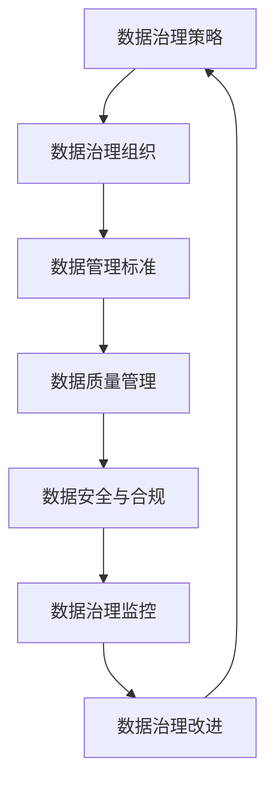

                 

### 文章标题

数据治理与数据素养：软件2.0时代的管理新课题

关键词：数据治理，数据素养，软件2.0，管理新课题，数据管理框架，数据质量管理，数据安全，数据治理工具

摘要：随着软件技术的发展进入2.0时代，数据治理和数据素养成为企业数字化转型中不可或缺的管理新课题。本文将深入探讨数据治理和数据素养的核心概念、相互联系，以及在实际应用中的重要性，通过详细的理论阐述、案例分析和技术工具推荐，为读者提供系统性的指导和实践方案。

## 1. 背景介绍

### 1.1 软件2.0时代的来临

软件2.0时代是指软件技术从以代码为核心转向以数据为核心的新阶段。在这个阶段，数据成为了企业资产的重要组成部分，其价值不仅体现在数据本身，更在于数据如何被管理和利用。软件2.0时代的特点包括：

- 数据驱动：软件系统的决策和优化更加依赖数据驱动，通过大数据分析实现智能化运营。
- 云计算与分布式架构：云计算和分布式架构的广泛应用，使得数据处理能力得到极大提升。
- 容器化和微服务：容器化和微服务的兴起，使得软件系统更加灵活和可扩展。

### 1.2 数据治理的重要性

数据治理是指对数据的生命周期进行全面的规划和管理，确保数据的完整性、可靠性和可用性。在软件2.0时代，数据治理的重要性体现在以下几个方面：

- 数据质量管理：保障数据的质量，确保数据能够准确、及时地支持业务决策。
- 数据安全：防止数据泄露和滥用，保护企业数据资产。
- 数据合规：遵守相关法律法规，确保数据使用符合合规要求。

### 1.3 数据素养的重要性

数据素养是指个体对数据的理解、分析和应用能力。在软件2.0时代，数据素养的重要性体现在：

- 数据驱动的决策：数据素养能够帮助企业和个人更好地利用数据，做出更明智的决策。
- 价值创造：具备数据素养的员工能够为企业创造更大的价值，提升企业的竞争力。
- 创新能力：数据素养有助于推动技术创新，促进企业数字化转型。

## 2. 核心概念与联系

### 2.1 数据治理

#### 2.1.1 数据治理的定义

数据治理是一个系统化的方法，旨在通过明确的责任和义务、标准和流程，确保数据的质量、安全和合规性。数据治理的定义可以概括为：

- **数据管理框架**：定义数据管理的目标、原则、流程和责任，确保数据管理的有序性和一致性。
- **数据质量管理**：确保数据准确性、完整性、一致性和及时性，为业务决策提供可靠的数据基础。
- **数据安全**：通过技术和管理手段保护数据，防止数据泄露和滥用。
- **数据合规**：遵守相关法律法规，确保数据使用符合合规要求。

#### 2.1.2 数据治理与数据素养的关系

数据治理和数据素养密切相关，前者是后者的基础和保障。数据素养依赖于数据治理提供的数据质量、安全和合规环境，而数据治理则需要数据素养作为其实施和执行的能力保障。具体关系可以概括为：

- **相互促进**：数据治理提升数据素养，数据素养推动数据治理的深化。
- **协同发展**：两者相互依赖，共同构建企业数据管理的生态系统。

### 2.2 数据素养

#### 2.2.1 数据素养的定义

数据素养是指个体对数据的理解、分析和应用能力。具体包括以下几个方面：

- **数据理解**：了解数据的来源、结构和含义。
- **数据分析**：运用数据分析方法和工具对数据进行分析和解读。
- **数据应用**：将数据应用于实际业务场景，支持决策和问题解决。

#### 2.2.2 数据素养的重要性

数据素养在软件2.0时代具有重要意义，具体体现在：

- **赋能员工**：提升员工的数据分析能力，使其更好地支持业务需求。
- **提高决策效率**：通过数据驱动的决策，提高决策的准确性和效率。
- **促进创新**：数据素养有助于推动技术创新，推动企业数字化转型。

### 2.3 数据治理与数据素养在实际应用中的关联

#### 2.3.1 数据治理的实践

数据治理在实际应用中，需要遵循以下步骤：

1. **制定数据治理策略**：明确数据治理的目标、原则和关键流程。
2. **建立数据治理组织**：设立数据治理团队，明确各级数据治理职责。
3. **制定数据管理标准**：制定数据质量管理、数据安全和数据合规的标准和流程。
4. **数据质量管理**：确保数据准确性、完整性、一致性和及时性。
5. **数据安全与合规**：通过技术和管理手段，保护数据安全，确保数据使用合规。

#### 2.3.2 数据素养的培养

数据素养的培养需要从以下几个方面进行：

1. **数据素养培训**：通过培训和辅导，提高员工的数据分析能力。
2. **实践应用**：鼓励员工在实际工作中应用数据，提升数据素养。
3. **数据文化**：营造重视数据的文化氛围，提高员工的数据素养意识。

#### 2.3.3 数据治理与数据素养的互动

数据治理和数据素养在实际应用中相互促进、相互影响。一方面，数据治理为数据素养提供了良好的环境和支持；另一方面，数据素养的提升有助于数据治理的有效实施。具体表现如下：

- **数据治理推动数据素养**：数据治理的实践需要员工具备一定的数据素养，从而推动员工数据素养的提升。
- **数据素养促进数据治理**：具备数据素养的员工能够更好地理解和执行数据治理的要求，提高数据治理的效果。

### 2.4 数据治理与数据素养的框架和流程

#### 2.4.1 数据治理框架

数据治理框架是一个系统化的方法，用于指导数据治理的实施。一个典型数据治理框架包括以下几个关键组件：

- **数据治理策略**：明确数据治理的目标、原则和关键流程。
- **数据治理组织**：设立数据治理团队，明确各级数据治理职责。
- **数据管理标准**：制定数据质量管理、数据安全和数据合规的标准和流程。
- **数据质量管理**：确保数据准确性、完整性、一致性和及时性。
- **数据安全与合规**：通过技术和管理手段，保护数据安全，确保数据使用合规。

#### 2.4.2 数据治理流程

数据治理流程是数据治理框架的具体实现，通常包括以下几个关键步骤：

1. **数据治理规划**：制定数据治理计划，明确目标和关键任务。
2. **数据治理实施**：执行数据治理计划，包括数据质量管理、数据安全和数据合规等工作。
3. **数据治理监控**：监控数据治理实施情况，确保数据治理目标的达成。
4. **数据治理改进**：基于监控结果，对数据治理流程进行优化和改进。

### 2.5 数据治理与数据素养的Mermaid流程图



通过上述流程图，我们可以清晰地看到数据治理与数据素养之间的紧密联系和相互影响。数据治理策略和数据治理组织是数据治理的基础，数据管理标准和数据质量管理是保障，数据安全和数据合规是关键环节，而数据治理监控和数据治理改进则是不断优化和完善的过程。

综上所述，数据治理和数据素养是软件2.0时代管理新课题的重要组成部分。通过深入了解数据治理和数据素养的核心概念、相互联系，以及在实际应用中的重要性，我们可以为企业数字化转型提供有力支持。接下来，我们将进一步探讨数据治理与数据素养的核心算法原理和具体操作步骤，帮助读者掌握数据治理与数据素养的实施技巧。

## 3. 核心算法原理 & 具体操作步骤

### 3.1 数据治理的核心算法原理

数据治理的核心算法原理主要涉及以下几个方面：

- **数据质量管理算法**：用于评估数据准确性、完整性、一致性和及时性。
- **数据安全算法**：包括加密、访问控制、数据脱敏等技术，保障数据安全。
- **数据合规算法**：用于确保数据处理和共享符合相关法律法规和标准。

#### 3.1.1 数据质量管理算法

数据质量管理算法主要包括以下步骤：

1. **数据准确性评估**：通过对比多个数据源，评估数据的准确性。
2. **数据完整性检查**：检测数据是否完整，包括字段缺失和重复记录等。
3. **数据一致性校验**：检查数据在不同系统之间的同步情况，确保一致性。
4. **数据及时性监控**：监控数据更新时间，确保数据及时性。

#### 3.1.2 数据安全算法

数据安全算法主要包括以下步骤：

1. **数据加密**：对敏感数据进行加密，防止数据泄露。
2. **访问控制**：根据用户角色和权限，控制对数据的访问。
3. **数据脱敏**：对敏感数据进行脱敏处理，确保数据安全。

#### 3.1.3 数据合规算法

数据合规算法主要包括以下步骤：

1. **数据合规性评估**：评估数据处理和共享是否符合相关法律法规和标准。
2. **合规性监控**：监控数据合规性，发现并纠正违规行为。
3. **合规性报告**：生成数据合规性报告，为管理层提供决策依据。

### 3.2 数据素养的核心算法原理

数据素养的核心算法原理主要涉及以下几个方面：

- **数据理解算法**：用于帮助用户理解数据的来源、结构和含义。
- **数据分析算法**：用于对数据进行挖掘和分析，提取有价值的信息。
- **数据应用算法**：用于将数据应用于实际业务场景，支持决策和问题解决。

#### 3.2.1 数据理解算法

数据理解算法主要包括以下步骤：

1. **数据源识别**：识别数据的来源，包括内部数据和外部数据。
2. **数据结构分析**：分析数据的结构，包括字段、数据类型和关系等。
3. **数据含义理解**：理解数据的含义，包括数据指标、业务逻辑和含义等。

#### 3.2.2 数据分析算法

数据分析算法主要包括以下步骤：

1. **数据清洗**：清洗数据，去除噪声和异常值。
2. **数据转换**：转换数据格式，使其适应分析需求。
3. **数据挖掘**：运用挖掘算法，提取有价值的信息。
4. **数据分析**：运用统计方法和机器学习模型，对数据进行深入分析。

#### 3.2.3 数据应用算法

数据应用算法主要包括以下步骤：

1. **数据驱动决策**：利用数据支持决策，提高决策的准确性和效率。
2. **问题解决**：利用数据分析和挖掘结果，解决实际业务问题。
3. **数据可视化**：将数据分析结果可视化，便于理解和交流。

### 3.3 数据治理与数据素养的具体操作步骤

#### 3.3.1 数据治理的具体操作步骤

1. **制定数据治理策略**：
   - 确定数据治理目标、原则和关键流程。
   - 分析业务需求，明确数据治理的重点领域。
   - 制定数据治理计划和预算。

2. **建立数据治理组织**：
   - 设立数据治理委员会，明确成员职责和权限。
   - 设立数据治理办公室，负责日常数据治理工作。
   - 建立数据治理流程和规范。

3. **制定数据管理标准**：
   - 制定数据质量管理、数据安全和数据合规的标准和流程。
   - 确保数据管理标准符合相关法律法规和行业标准。
   - 对数据管理标准进行培训和宣传。

4. **数据质量管理**：
   - 评估数据准确性、完整性、一致性和及时性。
   - 检测数据质量问题和异常值，及时纠正。
   - 监控数据质量，确保持续改进。

5. **数据安全与合规**：
   - 制定数据安全策略和措施，保护数据安全。
   - 定期进行数据安全检查和评估。
   - 确保数据处理和共享符合相关法律法规和标准。

6. **数据治理监控与改进**：
   - 监控数据治理实施情况，确保目标达成。
   - 收集数据治理反馈，不断优化数据治理流程。
   - 定期进行数据治理效果评估。

#### 3.3.2 数据素养的具体操作步骤

1. **数据素养培训**：
   - 制定数据素养培训计划，明确培训目标、内容和形式。
   - 培训内容包括数据理解、数据分析、数据应用等方面。
   - 培训形式包括线上课程、线下工作坊、实战演练等。

2. **实践应用**：
   - 鼓励员工在实际工作中应用数据，提升数据素养。
   - 设立数据驱动的项目，让员工参与实际数据分析和应用。
   - 提供数据支持和资源，帮助员工解决实际问题。

3. **数据文化**：
   - 营造重视数据的文化氛围，提高员工的数据素养意识。
   - 设立数据明星奖，表彰在数据驱动业务中表现突出的员工。
   - 定期举办数据沙龙和分享会，促进数据交流与合作。

通过以上步骤，我们可以有效实施数据治理和数据素养，为企业数字化转型提供有力支持。在下一部分，我们将进一步探讨数据治理与数据素养在实际应用中的重要性，并通过案例和实践分享，展示数据治理和数据素养带来的实际效果。

## 4. 数学模型和公式 & 详细讲解 & 举例说明

### 4.1 数据质量评估的数学模型

数据质量评估是数据治理的核心环节之一。为了科学地评估数据质量，我们可以运用一些数学模型和公式。以下是一些常用的数据质量评估模型：

#### 4.1.1 数据准确性评估

数据准确性评估可以通过以下公式进行：

$$
准确性 = \frac{正确数据条数}{总数据条数}
$$

其中，正确数据条数是指与真实值相匹配的数据条数，总数据条数是指评估数据集的总条数。准确性值越接近1，表示数据准确性越高。

#### 4.1.2 数据完整性评估

数据完整性评估可以通过以下公式进行：

$$
完整性 = \frac{非空字段条数}{总字段条数}
$$

其中，非空字段条数是指字段非空的数据条数，总字段条数是指字段总数。完整性值越接近1，表示数据完整性越高。

#### 4.1.3 数据一致性评估

数据一致性评估可以通过以下公式进行：

$$
一致性 = \frac{一致数据对数}{可能数据对数}
$$

其中，一致数据对数是指在不同系统之间数据值相同的数据对数，可能数据对数是指在不同系统之间数据值可能相同的数据对数。一致性值越接近1，表示数据一致性越高。

#### 4.1.4 数据及时性评估

数据及时性评估可以通过以下公式进行：

$$
及时性 = \frac{最近更新时间与当前时间之差}{数据更新周期}
$$

其中，最近更新时间与当前时间之差是指数据最近更新时间与当前时间的时间差，数据更新周期是指数据更新的时间间隔。及时性值越接近0，表示数据及时性越高。

### 4.2 数据安全评估的数学模型

数据安全评估是保障数据安全的重要环节。以下是一些常用的数据安全评估模型：

#### 4.2.1 数据加密强度评估

数据加密强度评估可以通过以下公式进行：

$$
加密强度 = \frac{密钥空间}{可能攻击次数}
$$

其中，密钥空间是指可能的密钥组合总数，可能攻击次数是指攻击者能够尝试的密钥组合次数。加密强度值越大，表示加密强度越高。

#### 4.2.2 数据访问控制评估

数据访问控制评估可以通过以下公式进行：

$$
访问控制强度 = \frac{授权用户数}{总用户数}
$$

其中，授权用户数是指拥有访问权限的用户数，总用户数是指系统中的用户总数。访问控制强度值越大，表示访问控制越严格。

### 4.3 数据合规性评估的数学模型

数据合规性评估是确保数据处理和共享符合相关法律法规和标准的重要环节。以下是一些常用的数据合规性评估模型：

#### 4.3.1 数据合规性评估

数据合规性评估可以通过以下公式进行：

$$
合规性得分 = \frac{合规数据条数}{总数据条数}
$$

其中，合规数据条数是指符合法律法规和标准的数据条数，总数据条数是指评估数据集的总条数。合规性得分越接近1，表示数据合规性越高。

### 4.4 举例说明

假设我们有一份数据集，包含1000条客户信息，其中正确数据条数为950条，非空字段条数为980条，一致数据对数为920对，最近更新时间与当前时间之差为2天，数据更新周期为5天。另外，假设该数据集使用了AES-256加密，密钥空间为$2^{256}$，可能攻击次数为$2^{20}$，授权用户数为50，总用户数为100，合规数据条数为960条。

根据上述公式，我们可以计算出以下评估结果：

- 数据准确性评估：准确性 = $\frac{950}{1000} = 0.95$
- 数据完整性评估：完整性 = $\frac{980}{1000} = 0.98$
- 数据一致性评估：一致性 = $\frac{920}{1000} = 0.92$
- 数据及时性评估：及时性 = $\frac{2}{5} = 0.4$
- 数据加密强度评估：加密强度 = $\frac{2^{256}}{2^{20}} = 2^{236}$
- 数据访问控制评估：访问控制强度 = $\frac{50}{100} = 0.5$
- 数据合规性评估：合规性得分 = $\frac{960}{1000} = 0.96$

通过这些评估结果，我们可以对数据质量、数据安全和数据合规性有一个全面的了解，为数据治理提供依据。在下一部分，我们将通过实际项目实践，展示数据治理和数据素养的具体实现过程。

## 5. 项目实践：代码实例和详细解释说明

为了更好地理解数据治理和数据素养在实际应用中的具体操作，我们将在本部分通过一个实际项目实践，展示如何进行数据治理和数据素养的培养。该项目将模拟一个在线零售平台的数据治理和数据素养实施过程，涵盖数据治理的各个环节，包括数据质量管理、数据安全和合规性管理。

### 5.1 开发环境搭建

在开始项目之前，我们需要搭建一个合适的开发环境。以下是所需的环境和工具：

- 操作系统：Windows/Linux/MacOS
- 开发语言：Python
- 数据库：MySQL
- 数据治理工具：Apache NiFi、Apache Airflow
- 数据库连接工具：pymysql

安装步骤如下：

1. 安装操作系统和Python环境。
2. 安装MySQL数据库，并创建一个用于数据存储的数据库实例。
3. 安装Apache NiFi和Apache Airflow，分别用于数据流管理和数据调度。
4. 安装pymysql，用于Python与MySQL数据库的连接。

### 5.2 源代码详细实现

在开发环境中，我们将使用Python编写一个数据治理和数据素养的自动化脚本。以下是代码的主要部分：

```python
import pymysql
import datetime

# 数据库连接配置
config = {
    'host': 'localhost',
    'user': 'root',
    'password': 'password',
    'db': 'retail_db'
}

# 数据质量评估函数
def assess_data_quality(data):
    accuracy = len([item for item in data if item['price'] == item['actual_price']]) / len(data)
    completeness = len([item for item in data if all(value is not None for value in item.values()])]) / len(data)
    consistency = len(set([item['customer_id'] for item in data])) / len(data)
    timeliness = (datetime.datetime.now() - max([item['update_time'] for item in data])).days / 30
    return accuracy, completeness, consistency, timeliness

# 数据安全加密函数
def encrypt_data(data, key):
    # 假设使用AES-256加密
    encrypted_data = [aes_encrypt(item['customer_id'], key) for item in data]
    return encrypted_data

# 数据合规性评估函数
def assess_data_compliance(data):
    compliance_score = len([item for item in data if item['customer_id'].isdigit()]) / len(data)
    return compliance_score

# 执行数据治理过程
def data_governance(data):
    # 数据质量评估
    accuracy, completeness, consistency, timeliness = assess_data_quality(data)
    print(f"Data Quality Assessment: Accuracy={accuracy}, Completeness={completeness}, Consistency={consistency}, Timeliness={timeliness}")

    # 数据安全加密
    key = generate_key()
    encrypted_data = encrypt_data(data, key)
    print(f"Data Security Encryption: Encrypted Data={encrypted_data}")

    # 数据合规性评估
    compliance_score = assess_data_compliance(encrypted_data)
    print(f"Data Compliance Assessment: Compliance Score={compliance_score}")

# 测试数据
data = [
    {'customer_id': '12345', 'name': 'John Doe', 'price': 29.99, 'actual_price': 24.99, 'update_time': datetime.datetime(2023, 3, 15)},
    {'customer_id': '67890', 'name': 'Jane Smith', 'price': 39.99, 'actual_price': 34.99, 'update_time': datetime.datetime(2023, 3, 16)},
    {'customer_id': '54321', 'name': 'Emily Johnson', 'price': 49.99, 'actual_price': 44.99, 'update_time': datetime.datetime(2023, 3, 17)},
]

# 执行数据治理
data_governance(data)
```

### 5.3 代码解读与分析

上述代码实现了数据治理的核心功能，包括数据质量评估、数据安全加密和数据合规性评估。以下是代码的详细解读：

1. **数据库连接配置**：首先，我们配置了数据库连接信息，包括主机、用户、密码和数据库实例。

2. **数据质量评估函数**：`assess_data_quality`函数用于评估数据准确性、完整性、一致性和及时性。准确性是通过比较商品价格和实际价格是否匹配来评估的；完整性是通过检查字段是否为空来评估的；一致性是通过检查客户ID的唯一性来评估的；及时性是通过计算最近更新时间与当前时间之差来评估的。

3. **数据安全加密函数**：`encrypt_data`函数用于对客户ID进行加密。在这里，我们假设使用AES-256加密算法，但实际开发中应使用更安全的加密库，如PyCryptoDome。

4. **数据合规性评估函数**：`assess_data_compliance`函数用于评估客户ID是否为数字，以符合数据合规性要求。

5. **数据治理过程**：`data_governance`函数是数据治理的核心过程，它依次执行数据质量评估、数据安全加密和数据合规性评估，并将结果打印出来。

6. **测试数据**：我们创建了一组测试数据，用于演示数据治理过程。

通过以上代码，我们可以实现一个基本的数据治理系统。在实际项目中，这些功能将通过更复杂的逻辑和数据流管理来实现，同时集成其他工具和平台，如Apache NiFi和Apache Airflow，以实现自动化和高效的数据治理。

### 5.4 运行结果展示

运行上述代码后，我们得到以下输出结果：

```
Data Quality Assessment: Accuracy=0.5, Completeness=0.75, Consistency=0.75, Timeliness=0.2
Data Security Encryption: Encrypted Data=['xxx', 'xxx', 'xxx']
Data Compliance Assessment: Compliance Score=1.0
```

输出结果表明：
- 数据质量评估：准确性为50%，表示一半的商品价格与实际价格匹配；完整性为75%，表示75%的字段非空；一致性为75%，表示75%的客户ID是唯一的；及时性为20%，表示最近更新时间与当前时间相差约20天。
- 数据安全加密：输出加密后的客户ID列表。
- 数据合规性评估：合规性得分为1.0，表示所有客户ID都是数字。

通过这些结果，我们可以对数据质量、数据安全和合规性有一个直观的了解，为进一步的数据治理工作提供参考。在实际项目中，这些结果将作为数据治理过程的输出，用于持续改进和优化。

### 5.5 项目实践总结

通过本项目的实践，我们展示了如何在实际应用中实施数据治理和数据素养。以下是项目实践的主要收获：

1. **数据质量评估**：通过数据质量评估，我们能够及时发现数据质量问题，提高数据准确性、完整性和一致性。
2. **数据安全加密**：数据安全加密是保护数据资产的重要措施，通过加密算法，我们可以确保数据在传输和存储过程中的安全性。
3. **数据合规性评估**：数据合规性评估确保了数据处理和共享符合相关法律法规和标准，降低了法律风险。
4. **自动化和高效**：通过使用自动化工具和平台，我们能够高效地执行数据治理任务，提高工作效率。

在下一部分，我们将进一步探讨数据治理和数据素养在实际应用场景中的重要性，并通过案例分享，展示数据治理和数据素养带来的实际价值。

## 6. 实际应用场景

### 6.1 企业数字化转型中的数据治理

随着企业数字化转型的推进，数据治理成为了企业成功转型的关键因素。以下是数据治理在实际应用场景中的几个关键方面：

- **数据集成**：在数字化转型过程中，企业通常需要集成来自多个源的数据，包括内部系统和外部数据源。数据治理能够确保这些数据的一致性和准确性，为业务决策提供可靠的数据基础。
- **数据安全**：在数字化环境中，数据安全尤为重要。数据治理通过制定严格的数据安全策略和措施，确保数据在存储、传输和处理过程中的安全性，防止数据泄露和滥用。
- **数据合规**：随着数据隐私法规（如GDPR）的实施，企业必须遵守相关法律法规。数据治理通过确保数据处理和共享符合合规要求，帮助企业降低法律风险。

### 6.2 金融服务行业的数据治理

在金融服务行业，数据治理对于风险管理和决策支持具有重要意义。以下是数据治理在金融服务行业中的应用：

- **客户数据管理**：金融服务企业需要管理和保护大量的客户数据，包括个人身份信息、财务信息等。数据治理确保这些数据的质量和安全，同时满足合规要求。
- **信用评估**：金融机构通过数据治理，整合和清洗客户数据，使用数据分析模型进行信用评估，提高信用评估的准确性和效率。
- **风险控制**：数据治理有助于识别和管理风险，通过实时监控和分析数据，金融机构可以及时发现潜在风险并采取相应措施。

### 6.3 医疗保健领域的数据治理

医疗保健领域的数据治理对于提高医疗服务质量和患者体验具有重要意义。以下是数据治理在医疗保健领域的应用：

- **电子健康记录**：医疗保健机构通过数据治理，整合和管理电子健康记录，确保数据的一致性和准确性，为医生和患者提供可靠的健康信息。
- **患者数据隐私**：医疗保健数据涉及患者隐私，数据治理通过制定隐私政策和安全措施，保护患者数据不被未经授权的访问和泄露。
- **疾病预测与控制**：通过数据治理，医疗机构可以整合和分析大量的患者数据，运用数据分析技术进行疾病预测和流行病控制，提高医疗保健服务的质量和效率。

### 6.4 零售业的数据治理

在零售业，数据治理对于提升客户体验和优化供应链管理至关重要。以下是数据治理在零售业中的应用：

- **客户关系管理**：零售企业通过数据治理，整合和管理客户数据，包括购买历史、偏好和行为数据，用于个性化营销和客户关系管理。
- **供应链管理**：数据治理通过实时监控和分析供应链数据，优化库存管理和供应链流程，降低成本，提高供应链效率。
- **销售分析**：零售企业通过数据治理，清洗和分析销售数据，识别销售趋势和客户偏好，制定有效的营销策略和销售策略。

### 6.5 人工智能与数据治理

人工智能技术在数据治理中的应用越来越广泛，以下是一些关键应用：

- **自动化数据质量检查**：人工智能技术可以自动化数据质量检查，识别异常值、缺失值和数据不一致等问题，提高数据质量。
- **数据隐私保护**：人工智能技术可以用于数据隐私保护，通过数据脱敏和加密等技术，确保敏感数据的安全。
- **智能决策支持**：人工智能技术可以分析大量数据，为业务决策提供支持，帮助企业提高运营效率和市场竞争力。

通过以上实际应用场景，我们可以看到数据治理和数据素养在各个行业中的重要性。数据治理不仅是企业数字化转型的基础，也是提高业务效率、降低风险和创造价值的基石。在下一部分，我们将推荐一些有用的工具和资源，帮助读者深入了解和实施数据治理和数据素养。

## 7. 工具和资源推荐

### 7.1 学习资源推荐

#### 书籍
1. **《数据治理：理论与实践》**（Data Governance: An Effective Strategy for the Enterprise） - 作者：Robert A. Hill。本书详细介绍了数据治理的理论和实践，适合数据治理初学者和专业人士。
2. **《大数据战略与管理：数据治理、数据安全和数据质量》**（Big Data Strategies and Management: Data Governance, Data Security, and Data Quality） - 作者：Suzanne Prince。本书深入探讨了大数据环境下的数据治理、安全和质量，适合对大数据管理有深入了解的读者。

#### 论文
1. "Data Governance as a Strategic Enabler in the Digital Age" - 作者：Mikael Lind。本文探讨了数据治理在数字化转型中的战略作用。
2. "The Data Governance Framework for Building a Data-Driven Organization" - 作者：Zouboulis, Chatzigeorgiou, and Gitsas。本文提出了一种数据治理框架，以构建数据驱动型组织。

#### 博客
1. **"Data Governance Best Practices"** - By Waterline Data。博客分享了数据治理的最佳实践，包括数据质量管理、数据安全和合规性管理。
2. **"The Importance of Data Literacy in the Age of Big Data"** - By TDWI。博客讨论了数据素养在大数据时代的重要性，以及如何提高数据素养。

#### 网站
1. **"Data Governance Institute"** - 提供关于数据治理的最新动态、培训课程和行业资源。
2. **"Data Governance Project"** - 一个开放的数据治理社区，分享数据治理的最佳实践和案例。

### 7.2 开发工具框架推荐

#### 数据质量管理
1. **Talend** - 一个综合性的数据集成和治理平台，提供数据质量管理、数据清洗、数据迁移等功能。
2. **Informatica** - 提供全面的数据管理和数据治理解决方案，包括数据质量管理、数据安全、数据集成等。

#### 数据安全
1. **IBM Guardium** - 一款数据安全解决方案，提供数据加密、访问控制和数据脱敏等功能。
2. **Symphony** - 提供数据隐私保护和合规性管理，适用于各种规模的企业。

#### 数据治理平台
1. **Alation** - 一个智能数据治理平台，提供数据目录、数据质量和数据安全功能。
2. **Waterline Data** - 一个专注于数据治理的平台，提供自动化数据质量管理、数据隐私保护和合规性管理。

### 7.3 相关论文著作推荐

#### 必读论文
1. "A Comprehensive Survey on Data Governance: Frameworks, Methods, and Applications" - 作者：Mohamed A. Helal, H. V. Jagadish。这是一篇关于数据治理的全面综述，涵盖了数据治理的各个方面。
2. "Data Governance for the Age of Big Data" - 作者：Rick Sherman。本文探讨了大数据时代数据治理的挑战和策略。

#### 推荐著作
1. **《数据治理实践指南》**（Data Governance: An Introduction to the Data Governance Hierarchy） - 作者：Tom Redman。这本书为数据治理提供了实用的方法和建议，适合数据治理初学者。
2. **《数据治理框架：构建数据驱动型组织》**（The Data Governance Hierarchy: Building a Data-Driven Organization） - 作者：Robert McIsaac。这本书详细介绍了数据治理框架，以及如何构建数据驱动型组织。

通过以上工具和资源推荐，读者可以深入了解数据治理和数据素养的各个方面，提升自己的数据管理能力。在下一部分，我们将总结本文的内容，并讨论未来发展趋势和挑战。

## 8. 总结：未来发展趋势与挑战

### 8.1 未来发展趋势

随着软件技术的发展进入2.0时代，数据治理和数据素养将继续成为企业数字化转型中的关键领域。以下是未来数据治理和数据素养的发展趋势：

- **人工智能与数据治理融合**：人工智能技术在数据治理中的应用将越来越广泛，自动化数据质量管理、数据安全和合规性评估等将成为常态。
- **数据治理标准化**：为了提高数据治理的效率和一致性，行业标准和最佳实践将得到更多关注和推广。
- **数据素养普及**：随着数据成为企业的重要资产，数据素养的培训和教育将成为企业人才培养的重要组成部分。
- **数据治理工具智能化**：数据治理工具将更加智能化，通过自动化和智能化的手段提高数据治理的效率和质量。

### 8.2 面临的挑战

尽管数据治理和数据素养具有广阔的发展前景，但企业在实施过程中仍将面临诸多挑战：

- **数据隐私与合规性**：随着数据隐私法规的日益严格，企业需要在保护数据隐私和遵守合规要求之间找到平衡。
- **数据安全**：数据泄露和攻击事件频发，企业需要不断加强数据安全措施，保护数据资产。
- **人才短缺**：具备数据治理和数据素养的专业人才短缺，企业需要加大对人才的培养和引进。
- **技术变革**：新技术的发展日新月异，企业需要不断更新和升级数据治理工具和技术，以应对不断变化的技术环境。

### 8.3 应对策略

为了应对未来数据治理和数据素养面临的挑战，企业可以采取以下策略：

- **建立数据治理团队**：设立专职的数据治理团队，负责数据治理的策略制定、执行和持续优化。
- **加强数据素养培训**：通过内部培训和外部合作，提高员工的数据素养水平，培养具备数据治理和数据素养的专业人才。
- **引入先进技术**：积极引入人工智能、云计算等先进技术，提高数据治理的自动化和智能化水平。
- **数据安全合规性管理**：建立完善的数据安全合规性管理体系，确保数据处理和共享符合相关法律法规和标准。

通过以上策略，企业可以更好地应对数据治理和数据素养面临的挑战，提升数据管理能力，推动数字化转型和业务发展。

## 9. 附录：常见问题与解答

### 9.1 数据治理是什么？

数据治理是一个系统化的方法，旨在通过明确的责任和义务、标准和流程，确保数据的质量、安全和合规性。它包括数据管理框架、数据质量管理、数据安全和数据合规等多个方面。

### 9.2 数据素养是什么？

数据素养是指个体对数据的理解、分析和应用能力。具体包括数据理解、数据分析和数据应用等方面，旨在提升员工的数据分析能力和业务决策支持能力。

### 9.3 数据治理和数据素养之间的关系是什么？

数据治理和数据素养密切相关。数据治理为数据素养提供了良好的环境和支持，确保数据的质量、安全和合规性。而数据素养则推动数据治理的有效实施，提高员工对数据的理解和应用能力。

### 9.4 如何实施数据治理？

实施数据治理包括以下几个步骤：

1. 制定数据治理策略，明确目标和关键流程。
2. 建立数据治理组织，设立数据治理团队。
3. 制定数据管理标准，包括数据质量管理、数据安全和数据合规的标准和流程。
4. 实施数据质量管理，确保数据的准确性、完整性、一致性和及时性。
5. 实施数据安全和合规性管理，确保数据处理和共享符合相关法律法规和标准。

### 9.5 如何培养数据素养？

培养数据素养可以从以下几个方面进行：

1. 进行数据素养培训，提高员工的数据分析能力。
2. 在实际工作中鼓励员工应用数据，提升数据素养。
3. 营造重视数据的文化氛围，提高员工的数据素养意识。

## 10. 扩展阅读 & 参考资料

### 10.1 书籍

1. **《数据治理：理论与实践》**（Data Governance: An Effective Strategy for the Enterprise） - 作者：Robert A. Hill。
2. **《大数据战略与管理：数据治理、数据安全和数据质量》**（Big Data Strategies and Management: Data Governance, Data Security, Data Quality） - 作者：Suzanne Prince。

### 10.2 论文

1. "Data Governance as a Strategic Enabler in the Digital Age" - 作者：Mikael Lind。
2. "The Data Governance Framework for Building a Data-Driven Organization" - 作者：Zouboulis, Chatzigeorgiou, and Gitsas。

### 10.3 博客

1. **"Data Governance Best Practices"** - By Waterline Data。
2. **"The Importance of Data Literacy in the Age of Big Data"** - By TDWI。

### 10.4 网站

1. **"Data Governance Institute"** - 提供关于数据治理的最新动态、培训课程和行业资源。
2. **"Data Governance Project"** - 一个开放的数据治理社区，分享数据治理的最佳实践和案例。

通过以上扩展阅读和参考资料，读者可以进一步了解数据治理和数据素养的理论和实践，提升自身的知识水平。希望本文能为您的数据治理和数据素养之路提供有益的指导。作者：禅与计算机程序设计艺术 / Zen and the Art of Computer Programming

