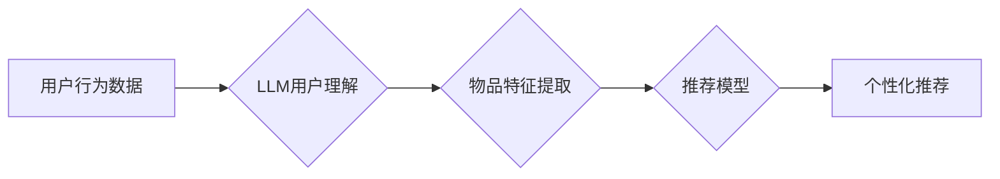

                 

## LLM在推荐系统中的能力评估

> 关键词：大型语言模型 (LLM)、推荐系统、个性化推荐、内容生成、用户理解、能力评估、性能指标

## 1. 背景介绍

推荐系统作为信息过滤和个性化内容呈现的关键技术，在电商、社交媒体、视频平台等领域发挥着越来越重要的作用。传统的推荐系统主要依赖于协同过滤、内容过滤和基于知识图谱的方法，但这些方法在面对海量数据和复杂用户行为时，存在一定的局限性。

近年来，大型语言模型 (LLM) 的快速发展为推荐系统带来了新的机遇。LLM 拥有强大的文本理解和生成能力，能够更好地理解用户需求和内容语义，从而提供更精准、个性化的推荐。

## 2. 核心概念与联系

### 2.1  推荐系统概述

推荐系统旨在根据用户的历史行为、偏好和上下文信息，预测用户对特定物品的兴趣，并推荐最相关的物品。

### 2.2  大型语言模型 (LLM)

LLM 是指训练规模庞大、参数数量众多的深度学习模型，能够理解和生成人类语言。例如，GPT-3、BERT、LaMDA 等都是著名的 LLM。

### 2.3  LLM 在推荐系统中的应用

LLM 可以应用于推荐系统的多个环节，例如：

* **用户理解:** LLM 可以分析用户的文本评论、搜索历史、浏览记录等，挖掘用户的兴趣偏好和需求。
* **内容理解:** LLM 可以理解物品的描述、标签、评论等文本信息，提取物品的特征和语义。
* **推荐生成:** LLM 可以根据用户和物品的理解结果，生成个性化的推荐列表。
* **推荐解释:** LLM 可以解释推荐结果背后的逻辑，帮助用户理解推荐的原因。

**Mermaid 流程图**



## 3. 核心算法原理 & 具体操作步骤

### 3.1  算法原理概述

LLM 在推荐系统中的核心算法原理是基于 Transformer 架构的深度学习模型。Transformer 模型通过自注意力机制，能够捕捉文本序列中的长距离依赖关系，从而更好地理解用户和物品的语义信息。

### 3.2  算法步骤详解

1. **数据预处理:** 收集用户行为数据、物品信息数据，并进行清洗、格式化等预处理操作。
2. **特征提取:** 使用 LLM 对用户行为数据和物品信息数据进行编码，提取用户的兴趣偏好和物品的语义特征。
3. **模型训练:** 使用 Transformer 模型训练，将提取的特征作为输入，预测用户对物品的兴趣评分。
4. **推荐生成:** 根据训练好的模型，对新的用户进行预测，生成个性化的推荐列表。

### 3.3  算法优缺点

**优点:**

* 能够更好地理解用户需求和内容语义。
* 能够捕捉文本序列中的长距离依赖关系。
* 能够生成更精准、个性化的推荐。

**缺点:**

* 训练成本高，需要大量的计算资源和数据。
* 模型解释性较差，难以理解推荐结果背后的逻辑。

### 3.4  算法应用领域

LLM 在推荐系统中的应用领域广泛，包括：

* **电商推荐:** 推荐商品、优惠券、促销活动等。
* **内容推荐:** 推荐新闻、视频、音乐、书籍等。
* **社交媒体推荐:** 推荐好友、群组、话题等。
* **个性化教育:** 推荐学习资源、课程、辅导等。

## 4. 数学模型和公式 & 详细讲解 & 举例说明

### 4.1  数学模型构建

LLM 在推荐系统中的数学模型通常基于 Transformer 架构，其核心是自注意力机制。

**自注意力机制**

自注意力机制能够捕捉文本序列中的长距离依赖关系，并赋予每个词语不同的权重，从而更好地理解上下文信息。

**公式:**

$$
Attention(Q, K, V) = softmax(\frac{QK^T}{\sqrt{d_k}})V
$$

其中：

* $Q$：查询矩阵
* $K$：键矩阵
* $V$：值矩阵
* $d_k$：键向量的维度
* $softmax$：softmax 函数

### 4.2  公式推导过程

自注意力机制的公式推导过程如下：

1. 计算查询矩阵 $Q$ 与键矩阵 $K$ 的点积，并进行归一化处理。
2. 应用 softmax 函数，将点积结果转换为概率分布。
3. 将概率分布与值矩阵 $V$ 进行加权求和，得到最终的注意力输出。

### 4.3  案例分析与讲解

假设我们有一个句子 "我爱吃苹果"，其词向量表示为：

* 我： [0.1, 0.2, 0.3]
* 爱： [0.4, 0.5, 0.6]
* 吃： [0.7, 0.8, 0.9]
* 苹果： [1.0, 1.1, 1.2]

使用自注意力机制，我们可以计算出每个词语对其他词语的注意力权重，例如，"爱" 对 "苹果" 的注意力权重可能较高，因为它们在语义上相关。

## 5. 项目实践：代码实例和详细解释说明

### 5.1  开发环境搭建

* Python 3.7+
* PyTorch 或 TensorFlow
* CUDA 和 cuDNN (可选)

### 5.2  源代码详细实现

```python
import torch
import torch.nn as nn

class Transformer(nn.Module):
    def __init__(self, input_size, hidden_size, num_layers, num_heads):
        super(Transformer, self).__init__()
        self.encoder = nn.TransformerEncoder(nn.TransformerEncoderLayer(d_model=hidden_size, nhead=num_heads), num_layers)
        self.linear = nn.Linear(hidden_size, 1)

    def forward(self, x):
        x = self.encoder(x)
        x = self.linear(x[:, 0, :])  # 取第一个词的输出
        return x
```

### 5.3  代码解读与分析

* `Transformer` 类定义了一个 Transformer 模型。
* `__init__` 方法初始化模型参数，包括输入尺寸、隐藏尺寸、层数和注意力头数。
* `forward` 方法定义模型的正向传播过程，首先使用 Transformer 编码器对输入进行编码，然后使用线性层将编码后的结果映射到输出维度。

### 5.4  运行结果展示

训练好的模型可以用于预测用户对物品的兴趣评分，并生成个性化的推荐列表。

## 6. 实际应用场景

### 6.1  电商推荐

LLM 可以用于推荐商品、优惠券、促销活动等，提高用户购物体验和转化率。例如，亚马逊使用 LLM 分析用户的浏览历史和购买记录，推荐个性化的商品。

### 6.2  内容推荐

LLM 可以用于推荐新闻、视频、音乐、书籍等，帮助用户发现感兴趣的内容。例如，Netflix 使用 LLM 分析用户的观看历史和评分，推荐个性化的影视作品。

### 6.3  社交媒体推荐

LLM 可以用于推荐好友、群组、话题等，增强用户社交互动和社区粘性。例如，Facebook 使用 LLM 分析用户的兴趣爱好和社交关系，推荐新的好友和群组。

### 6.4  未来应用展望

LLM 在推荐系统领域的应用前景广阔，未来可能在以下方面得到进一步发展：

* **更精准的个性化推荐:** LLM 可以更好地理解用户的复杂需求和偏好，提供更精准的个性化推荐。
* **更丰富的推荐内容:** LLM 可以生成更丰富的推荐内容，例如，推荐个性化的文章、视频、音乐等。
* **更智能的推荐解释:** LLM 可以解释推荐结果背后的逻辑，帮助用户理解推荐的原因。
* **跨模态推荐:** LLM 可以融合文本、图像、音频等多模态信息，提供更全面的推荐。

## 7. 工具和资源推荐

### 7.1  学习资源推荐

* **书籍:**
    * Deep Learning by Ian Goodfellow, Yoshua Bengio, and Aaron Courville
    * Natural Language Processing with PyTorch by Jason Brownlee
* **在线课程:**
    * Stanford CS224N: Natural Language Processing with Deep Learning
    * fast.ai: Practical Deep Learning for Coders

### 7.2  开发工具推荐

* **PyTorch:** 开源深度学习框架，支持 GPU 加速。
* **TensorFlow:** 谷歌开源深度学习框架，支持多种平台和部署方式。
* **Hugging Face Transformers:** 提供预训练的 Transformer 模型和工具。

### 7.3  相关论文推荐

* Attention Is All You Need (Vaswani et al., 2017)
* BERT: Pre-training of Deep Bidirectional Transformers for Language Understanding (Devlin et al., 2018)
* GPT-3: Language Models are Few-Shot Learners (Brown et al., 2020)

## 8. 总结：未来发展趋势与挑战

### 8.1  研究成果总结

LLM 在推荐系统领域的应用取得了显著进展，能够提供更精准、个性化的推荐，并提升用户体验。

### 8.2  未来发展趋势

LLM 在推荐系统领域的未来发展趋势包括：

* **模型规模和能力的提升:** 随着计算资源的不断发展，LLM 的规模和能力将进一步提升，能够更好地理解用户需求和内容语义。
* **多模态融合:** LLM 将与其他模态信息融合，例如图像、音频、视频等，提供更全面的推荐。
* **解释性和可解释性:** 研究如何提高 LLM 推荐结果的解释性和可解释性，帮助用户理解推荐的原因。

### 8.3  面临的挑战

LLM 在推荐系统领域的应用也面临一些挑战：

* **数据隐私和安全:** LLM 需要大量用户数据进行训练，如何保护用户隐私和数据安全是一个重要问题。
* **模型偏见和公平性:** LLM 可能存在模型偏见，导致推荐结果不公平，需要进行针对性的缓解措施。
* **模型部署和效率:** LLM 模型通常规模庞大，部署和推理效率是一个挑战。

### 8.4  研究展望

未来研究方向包括：

* 开发更安全、更公平、更可解释的 LLM 模型。
* 研究 LLM 在不同场景下的应用，例如，个性化教育、医疗保健等。
* 探索 LLM 与其他人工智能技术的融合，例如，强化学习、知识图谱等。

## 9. 附录：常见问题与解答

* **Q: LLM 在推荐系统中的应用有哪些优势？**

* **A:** LLM 能够更好地理解用户需求和内容语义，提供更精准、个性化的推荐。

* **Q: LLM 在推荐系统中的应用有哪些挑战？**

* **A:** 数据隐私和安全、模型偏见和公平性、模型部署和效率都是 LLM 在推荐系统中的应用面临的挑战。

* **Q: 如何评估 LLM 在推荐系统中的性能？**

* **A:** 常用的性能指标包括准确率、召回率、NDCG 等。

* **Q: 如何选择合适的 LLM 模型？**

* **A:** 需要根据具体的应用场景和数据特点选择合适的 LLM 模型。

作者：禅与计算机程序设计艺术 / Zen and the Art of Computer Programming


<end_of_turn>

